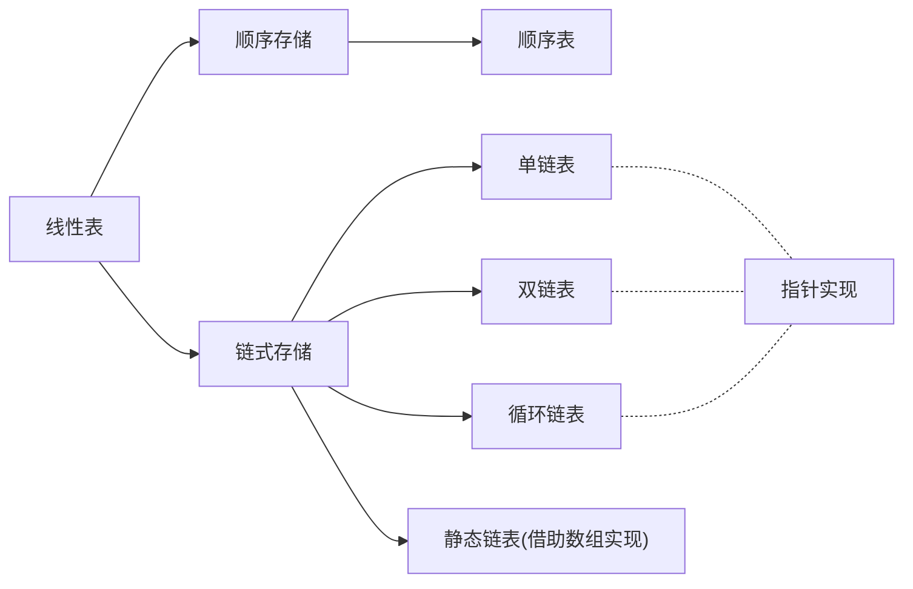

# 第 2 章 线性表

## Intro

**【考纲内容】**

1. 线性表的基本概念
2. 线性表的实现
   顺序存储；链式存储
3. 线性表的应用

**【知识框架】**



**【复习提示】**

- 线性表是算法题命题的重点。
- 这类算法题实现起来比较容易且代码量较少，但是要求具有最优的性能（时间复杂度、空间复杂度），才能获得满分。
- 因此，应牢固掌握线性表的各种基本操作（基于两种存储结构），在平时的学习中多注重培养动手能力。
- 另外，需要提醒的是，算法最重要的是思想！考场上的时间紧迫，在试卷上不一定要求代码具有实际的可执行性，因此应尽力表达出算法的思想和步骤，而不必过于拘泥每个细节。注意算法题只能用C/C++语言实现。


## 一、线性表的定义和基本操作

### 0x00 线性表的定义

线性表是具有相同数据类型的 n（n ≥ 0）个数据元素的有限序列，其中 n 为表长，当 n = 0 时线性表是一个空表。若用 L 命名线性表，则其一般表示为
$$
L=(a_1,a_2,\dots a_i,a_{i+1},\dots,a_n)
$$
式中，a 是唯一的“第一个”数据元素，又称**表头元素**；
a~n~ 是唯一的“最后一个”数据元素，又称**表尾元素**。
除第一个元素外，每个元素有且仅有一个直接前驱。除最后一个元素外，每个元素有且仅有一个直接后继（“直接前驱”和“前驱”、“直接后继”和“后继”通常被视作同义词）以上就是线性表的逻辑特性，这种线性有序的逻辑结构正是线性表名字的由来。

由此，我们得出线性表的特点如下。

- 表中元素的个数有限。
- 表中元素具有逻辑上的顺序性，表中元素有其先后次序。
- 表中元素都是数据元素，每个元素都是单个元素。
- 表中元素的数据类型都相同，这意味着每个元素占有相同大小的存储空间。
- 表中元素具有抽象性，即仅讨论元素间的逻辑关系，而不考虑元素究竟表示什么内容。

> 注意：线性表是一种逻辑结构，表示元素之间一对一的相邻关系。顺序表和链表是指**存储结构**，两者属于不同层面的概念，因此不要将其混淆。


### 0x01 线性表的基本操作

一个数据结构的基本操作是指其最核心、最基本的操作。其他较复杂的操作可通过调用其基本操作来实现。线性表的主要操作如下。

- `InitList(&L)`：初始化表。构造一个空的线性表。
- `Length(L)`：求表长。返回线性表 L 的长度，即 L 中数据元素的个数。
- `LocateElem(L, e)`：按值查找操作。在表 L 中查找具有给定关键字值的元素。
- `GetElem(L, i)`：按位查找操作。获取表 L 中第 i 个位置的元素的值。
- `ListInsert(&L, i, e)`：插入操作。在表 L 中的第 i 个位置上插入指定元素 e。
- `ListDelete(&L, i, &e)`：删除操作。删除表 L 中第 i 个位置的元素，并用 e 返回删除元素的值。
- `PrintList(L)`：输出操作。按前后顺序输出线性表L的所有元素值。
- `Empty(L)`：判空操作。若 L 为空表，则返回 `true`，否则返回 `false`。
- `DestroyList(&L)`：销毁操作。销毁线性表，并释放线性表 L 所占用的内存空间。

> 注意：
>
> 1. 基本操作的实现取决于采用哪种存储结构，存储结构不同，算法的实现也不同。
> 2. 符号 `&` 表示 C++ 中的引用

## 二、线性表的顺序表示

### 0x00 选择题错题整理

10. 若长度为 n 的非空线性表采用顺序存储结构，在表的第 i 个位置插入一个数据元素，则i的合法值应该是（）
    A. $1\le i\le n$    B. $1\le i\le n+1$    C. $0\le i\le n-1$    D. $0\le i\le n$
    我的答案：A    正确答案：B

    > 笑点解析：线性表元素的序号是从 1 开始，而在第 n+1个位置插入相当于在表尾追加，令人忍俊不禁

11. 顺序表的插入算法中，当 n 个空间已满时，可再申请增加分配 m 个空间，若申请失败，则说明系统没有（）可分配的存储空间。
    A. m 个    B. m 个连续    C. n+m 个    D. n+m 个连续
    我的答案：B    正确答案：D

    > 笑点解析：顺序存储需要连续的存储空间，在申请时需申请 n+m 个连续的存储空间，然后将线性表原来的 n 个元素复制到新申请的 n+m 个连续的存储空间的前 n 个单元，令人忍俊不禁

### 0x01 顺序表的定义

可以将顺序表直接理解成以下数据结构：

```c
typedef struct {
    ElemType *data; // 指向运行时分配的一个数组
    int length;
}SqList;
```

或者这样的数据结构：

```c
#define MaxSize 50
typedef struct {
    ElemType data[MaxSize];
    int length;
}SqList;
```


顺序表的特点：

- 顺序表最主要的特点是**随机访问**，即通过首地址和元素序号可在时间 O(1) 内找到指定的元素。
- 顺序表的**存储密度高**，每个结点只存储数据元素。
- 顺序表逻辑上相邻的元素物理上也相邻，所以插入和删除操作需要移动大量元素。

### 0x02 顺序表基本操作的实现

#### 1. 插入操作

参考代码：

```c
bool ListInsert(SqList &L, int i, ElemType e) {
    if(i < 1 || i > L.length + 1)
        return false;
    if(L.length >= MaxSize)
        return false;
    for(int j = L.length; j >= i; j++)
        L.data[j] = L.data[j - 1];
    L.data[i - 1] = e;
    L.length++;
    return true;
}
```

这是书中给出的代码，笑点解析：

- 顺序表定义的各元素下标是从 1 开始计算的，在最开始判定 i 的取值是否合法时，是将 i 作为顺序表的下标处理的
- 然而，C 语言的数组各元素的下标是从 0 开始计算的，因此在插入 e 时，`L.data` 的下表是 i - 1，令人忍俊不禁
- 在这里，元素插入完毕后，`L.length` 的值也发生了变化，也就是说顺序表的“长度”与为数组分配的内存空间大小没有必然关系，而根据代码的意思来看，`L.length` 的值就是逻辑上 `L` 中存储的数据元素的数量，而 `L.data` 数组的前 `L.length` 个元素一定都是有效的数据元素，这非常符合顺序表的定义，令人忍俊不禁

由此我们可以得知，插入元素的平均情况时间复杂度是 $O(n)$，最好情况就是往末尾插入元素，时间复杂度是 $O(1)$

#### 2. 删除操作

参考代码：

```c
bool ListDelete(SqList &L, int i, ElemType &e) {
    if(i < 1 || i > L.length)
        return false;
    e = L.data[i - 1];
    for(int j = i; j < L.length; j++)
        L.data[j - 1] = L.data[j];
    L.length--;
    return true;
}
```

由此我们可以得知，删除元素的平均情况时间复杂度是 $O(n)$，最好情况就是删除末尾的元素，时间复杂度是 $O(1)$

#### 3. 按值查找

参考代码：

```c
int LocateElem(SqList L, ElemType e) {
    for(int i = 0; i < L.length; i++) 
        if(L.data[i] == e)
            return i + 1;
    return 0;
}
```


## 三、线性表的链式表示

顺序表的存储位置可以用一个简单直观的公式表示，它可以随机存取表中的任意一个元素，但插入和删除操作需要移动大量元素。
链式存储线性表时，不需要使用地址连续的存储单元，即不要求逻辑上相邻的元素在物理位置上也相邻，它通过“链”建立起元素之间的逻辑关系，因此插入和删除操作不需要移动元素，而只需修改指针，但也会失去顺序表可随机存取的优点。


### 0x00 单链表的定义

线性表的链式存储又称**单链表**，它是指通过一组任意的存储单元来存储线性表中的数据元素。为了建立数据元素之间的线性关系，对每个链表结点，除存放元素自身的信息外，还需要存放一个指向其后继的指针。单链表结点结构如下图所示，其中 `data` 为数据域，存放数据元素；`next`为指针域，存放其后继结点的地址。


单链表中结点类型的描述如下：

```c++
typedef struct LNode {   //定义单链表结点类型
    ElemType data;       //数据域
    struct LNode *next;  //指针域
}LNode, *LinkList;
```

利用单链表可以解决顺序表需要大量连续存储单元的缺点，但单链表附加指针域，也存在浪费存储空间的缺点。由于单链表的元素离散地分布在存储空间中，所以单链表是**非随机存取**的存储结构，即不能直接找到表中某个特定的结点。查找某个特定的结点时，需要从表头开始遍历，依次查找。

通常用**头指针**来标识一个单链表，如单链表 `L`，头指针为 `NULL` 时表示一个空表。此外，为了操作上的方便，在单链表第一个结点之前附加一个结点，称为**头结点**。头结点的数据域可以不设任何信息，也可以记录表长等信息。头结点的指针域指向线性表的第一个元素结点，如下图所示。


**头结点和头指针的区分**：不管带不带头结点，头指针都始终指向链表的第一个结点，而头结点是带头结点的链表中的第一个结点，结点内通常不存储信息。

引入头结点后，可以带来**两个优点**：

1. 由于第一个数据结点的位置被存放在头结点的指针域中，因此在链表的第一个位置上的操作和在表的其他位置上的操作一致，无须进行特殊处理。
2. 无论链表是否为空，其头指针都是指向头结点的非空指针（空表中头结点的指针域为空），因此空表和非空表的处理也就得到了统一。


### 0x01 单链表上基本操作的实现

#### 1. 采用头插法建立单链表

该方法从一个空表开始，生成新结点，并将读取到的数据存放到新结点的数据域中，然后将新结点插入到当前链表的表头，即头结点之后，如下图所示。


头插法建立单链表的算法如下：

```c++
LinkList List_HeadInsert(LinkLst &L) {      // 逆向建立单链表
    LNode *s; 
    int x;
    L = (LinkList)malloc(sizeof(LNode));    // 创建头结点
    L->next = NULL;                         // 初始为空链表
    scanf("%d", &x);                        // 输入结点的值
    while(x != 9999) {                      // 输入9999表示结束
        s = (LNode *)malloc(sizeof(LNode));
        s->data = x;
        s->next = L->next;
        L->next = s;                        //将新结点插入表中，L为头指针
        scanf("%d", &x)
    }
    return L;
}
```

采用头插法建立单链表时，读入数据的顺序与生成的链表中的元素的顺序是相反的。每个结点插入的时间为 $O(1)$，设单链表长为 $n$，则总时间复杂度为 $O(n)$。

#### 2. 采用尾插法建立单链表

头插法建立单链表的算法虽然简单，但生成的链表中结点的次序和输入数据的顺序不一致。若希望两者次序一致，则可采用尾插法。该方法将新结点插入到当前链表的表尾，为此必须增加一个尾指针 $r$，使其始终指向当前链表的尾结点，如下图所示。


尾插法建立单链表的算法如下：

```c++
LinkList List_TailInsert(LinkList &L){ // 正向建立单链表
    int x;                             // 设元素类型为整型
    L = (LinkList)malloc(sizeof(LNode));
    LNode *s, *r = L;                   // r为表尾指针
    scanf("d", &x);                     // 输入结点的值
    while(x != 9999){                   // 输入9999表示结束
        s = (LNode *)malloc(sizeof(LNode));
        s->data = x;
        r->next = s;
        r = s;                          // r指向新的表尾结点
        scanf("d", &x);
    }
    r->next = NULL;                     // 尾结点指针置空
    return L;
}
```

因为附设了一个指向表尾结点的指针，故时间复杂度和头插法的相同。

#### 3. 按序号查找结点

在单链表中从第一个结点出发，顺指针 `next` 域逐个往下搜索，直到找到第 `i` 个结点为止，否则返回最后一个结点指针域 `NULL`。

按序号查找结点值的算法如下：

```c++
LNode *GetElem(LinkList L, int i) {
    if(i < 1)
        return NULL;            // 若i无效，则返回NULL
    int j = 1;                  // 计数，初始为1
    LNode *p = L->next;         // 第1个结点指针赋给P
    while(p != NULL && j < i) { // 从第1个结点开始找，查找第i个结点
        p = p->next;
        j++;
    }
    return p;                   // 返回第i个结点的指针，若i大于表长，则返回NULL
}
```

按序号查找操作的时间复杂度为 $O(n)$。


#### 4. 按值查找表结点

从单链表的第一个结点开始，由前往后依次比较表中各结点数据域的值，若某结点数据域的值等于给定值 `e`，则返回该结点的指针；若整个单链表中没有这样的结点，则返回 `NULL`。

按值查找表结点的算法如下

```c++
LNode *LocateElem(LinkList L, ElemType e) {
    LNode *p = L->next;
    while(p != NULL && p->data != e) // 从第1个结点开始查找data域为e的结点
        p = p->next;
    return p;                        // 找到后返回该结点指针，否则返回NULL
}
```

按值查找操作的时间复杂度为 `O(n)`


#### 5. 插入结点操作

插入结点操作将值为×的新结点插入到单链表的第 `i` 个位置上。先检查插入位置的合法性，然后找到待插入位置的前驱结点，即第 `i - 1` 个结点，再在其后插入新结点。

算法首先调用按序号查找算法 `GetElem(L, i - 1)`，查找第 `i - 1` 个结点。假设返回的第 `i - 1` 个结点为 `*p` ，然后令新结点`*s` 的指针域指向 `*p` 的后继结点，再令结点 `*p` 的指针域指向新插入的结点 `*s` 。其操作过程如下图所示。


实现插入结点的代码片段如下：

```c++
p = GetElem(L, i - 1);
s->next = p->next;
p->next = s;
```

算法中，语句 2 和 3 的顺序不能颠倒，
否则，先执行 `p->next = s` 后，指向其原后继的指针就不存在，
再执行 `s->next = p->next` 时，相当于执行了 `s->next = s`，显然是错误的。
本算法主要的时间开销在于查找第 `i - 1` 个元素，时间复杂度为 $O(n)$。若在给定的结点后面插入新结点，则时间复杂度仅为 $O(1)$。

**扩展：对某一结点进行前插操作。**

**前插操作**是指在某结点的前面插入一个新结点，后插操作的定义刚好与之相反。在单链表插入算法中，通常都采用后插操作。

以上面的算法为例，首先调用函数 `GetElem()` 找到第 `i - 1` 个结点，即插入结点的前驱结点后，再对其执行后插操作。由此可知，对结点的前插操作均可转化为后插操作，前提是从单链表的头结点开始顺序查找到其前驱结点，时间复杂度为 $O(n)$。

此外，可采用另一种方式将其转化为后插操作来实现，设待插入结点为 `*s`，将 `*s` 插入到 `*p` 的前面。我们仍然将 `*s` 插入到 `*p` 的后面，然后将 `p->data`与 `s->data` 交换，这样既满足了逻辑关系，又能使得时间复杂度为 $O(1)$。

```c++
// 将*s结点插入到*p之前的主要代码片段
s->next = p->next;    // 修改指针域，不能颠倒
p->next = s;
temp = p->data;       // 交换数据域部分
p->data = s->data;
s->data = temp;
```


#### 6. 删除结点操作

删除结点操作是将单链表的第 `i` 个结点删除。先检查删除位置的合法性，后查找表中第 `i - 1` 个结点，即被删结点的前驱结点，再将其删除。其操作过程如下图所示。


假设结点 `*p` 为找到的被删结点的前驱结点，为实现这一操作后的逻辑关系的变化，仅需修改 `*p` 的指针域，即将 `*p` 的指针域 `next` 指向 `*g` 的下一结点。

实现删除结点的代码片段如下：

```c++
p = GetElem(L, i - 1);// 查找删除位置的前驱结点
q = p->next;          // 令q指向被删除结点
p->next = q->next;    // 将*q结点从链中“断开”
free(g);              // 释放结点的存储空间
```

和插入算法一样，该算法的主要时间也耗费在查找操作上，时间复杂度为 $O(n)$ 。

**扩展：删除结点`*p`**

要删除某个给定结点 `*p`，通常的做法是先从链表的头结点开始顺序找到其前驱结点，然后执行删除操作，算法的时间复杂度为 $O(n)$。

其实，删除结点 `*p` 的操作可用删除 `*p` 的后继结点操作来实现，实质就是将其后继结点的值赋予其自身，然后删除后继结点，也能使得时间复杂度为 $O(1)$。

实现上述操作的代码片段如下：

```c++
q = p->next;             // 令g指向*p的后继结点
p->data = p->next->data; // 用后继结点的数据域覆盖
p->next = g->next;       // 将*g结点从链中“断开”
free(g);                 // 释放后继结点的存储空间
```


#### 7. 求表长操作

求表长操作就是计算单链表中数据结点（不含头结点）的个数，需要从第一个结点开始顺序依次访问表中的每个结点，为此需要设置一个计数器变量，每访问一个结点，计数器加1，直到访问到空结点为止。算法的时间复杂度为 $O(n)$。

需要注意的是，因为单链表的长度是不包括头结点的，因此不带头结点和带头结点的单链表在求表长操作上会略有不同。对不带头结点的单链表，当表为空时，要单独处理


### 0x02 双链表

单链表结点中只有一个指向其后继的指针，使得单链表只能从头结点依次顺序地向后遍历。要访问某个结点的前驱结点（插入、删除操作时），只能从头开始遍历，访问后继结点的时间复杂度为 $O(1)$，访问前驱结点的时间复杂度为 $O(n)$。

为了克服单链表的上述缺点，引入了双链表，双链表结点中有两个指针 `prior` 和 `next`，分别指向其前驱结点和后继结点，如图所示。


双链表中结点类型的描述如下：

```c++
typedef struct DNode {          // 定义双链表结点类型
    ElemType data;              // 数据域
    struct DNode *prior, *next; // 前驱和后继指针
}DNode, *DLinklist;
```

双链表在单链表的结点中增加了一个指向其前驱的 `prior` 指针，因此双链表中的按值查找和按位查找的操作与单链表的相同。但双链表在插入和删除操作的实现上，与单链表有着较大的不同。这是因为“链”变化时也需要对 `prior` 指针做出修改，其关键是保证在修改的过程中不断链。此外，双链表可以很方便地找到其前驱结点，因此，插入、删除操作的时间复杂度仅为 $O(1)$。

#### 1. 双链表的插入操作

在双链表中 `p` 所指的结点之后插入结点 `*s`，其指针的变化过程如图所示。


插入操作的代码片段如下：

```c++
s->next = p->next;
p->next->prior = s;
s->prior = p;
p->next = s;
```


#### 2. 双链表的删除操作

删除双链表中结点 `*p` 的后继结点 `*q`，其指针的变化过程如图所示。


```c++
q->next->prior = q->prior;
q->prior->next = q->next;
free(q);
```


### 0x03 循环链表

#### 1. 循环单链表

循环单链表和单链表的区别在于，表中最后一个结点的指针不是 `NULL`，而改为指向头结点，从而整个链表形成一个环，如图所示。

在循环单链表中，表尾结点 `*r` 的 `next` 域指向 `L`，故表中没有指针域为 `NULL` 的结点，因此，循环单链表的判空条件不是头结点的指针是否为空，而是它是否等于头指针。


循环单链表的插入、删除算法与单链表的几乎一样，所不同的是若操作是在表尾进行，则执行的操作不同，以让单链表继续保持循环的性质。当然，正是因为循环单链表是一个“环”，因此在任何一个位置上的插入和删除操作都是等价的，无须判断是否是表尾。

其原因是，若设的是头指针，对在表尾插入元素需要 $O(n)$  的时间复杂度，而若设的是尾指针 `r`，`r->next` 即为头指针，对在表头或表尾插入元素都只需要 $O(1)$ 的时间复杂度。


#### 2. 循环双链表

由循环单链表的定义不难推出循环双链表。不同的是在循环双链表中，头结点的 `prior` 指针还要指向表尾结点，如图所示。


在循环双链表 `L` 中，某结点 `*p` 为尾结点时，`p->next==L`；当循环双链表为空表时，其头结点的 `prior` 域和 `next` 域都等于 `L`。


### 0x04 静态链表

静态链表借助数组来描述线性表的链式存储结构，结点也有数据域data和指针域next，与前面所讲的链表中的指针不同的是，这里的指针是结点的相对地址（数组下标），又称游标。和顺序表一样，静态链表也要预先分配一块连续的内存空间。

静态链表和单链表的对应关系如图所示。


静态链表结构类型的描述如下：

```c++
#define MaxSize 50 // 静态链表的最大长度
typedef struct {   // 静态链表结构类型的定义
    ElemType data; // 存储数据元素
    int next;      // 下一个元素的数组下标
} SLinkList[MaxSize];
```

静态链表以 `next == -1` 作为其结束的标志。静态链表的插入、删除操作与动态链表的相同，只需要修改指针，而不需要移动元素。总体来说，静态链表没有单链表使用起来方便，但在一些不支持指针的高级语言（如Basic）中，这是一种非常巧妙的设计方法。

