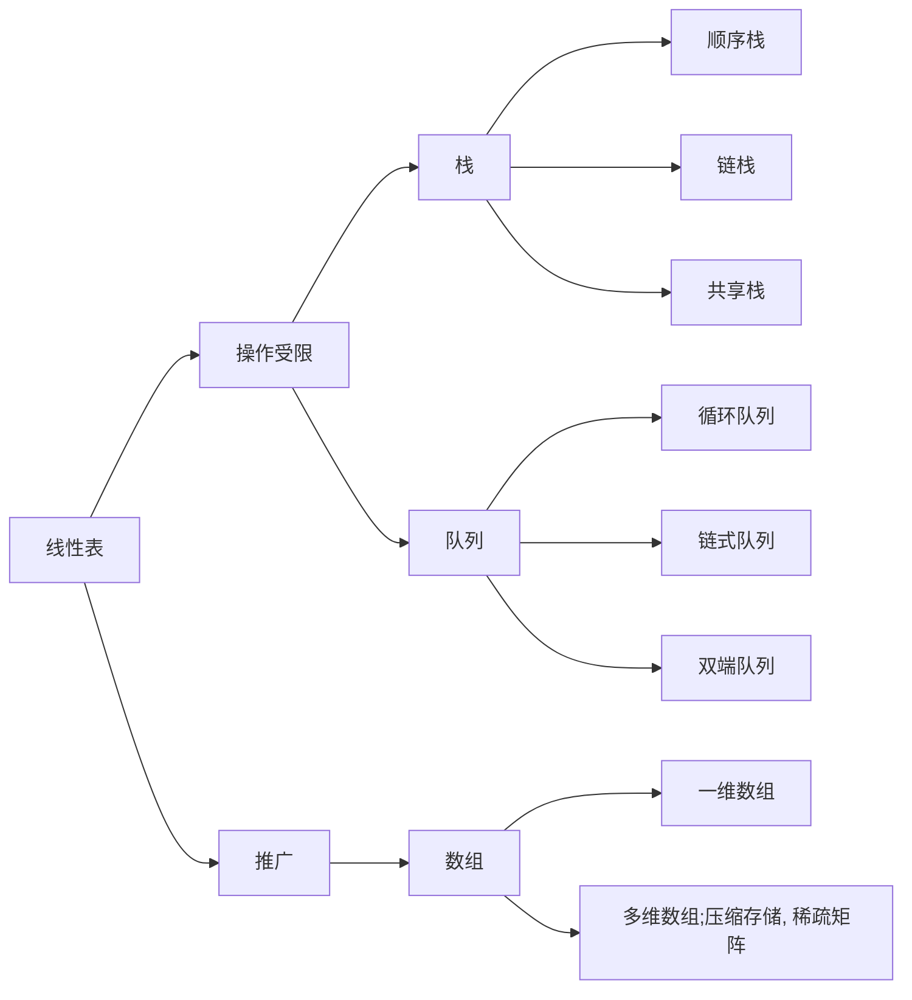

# 第 3 章 栈、队列和数组

## Intro

**【考纲内容】**

（一）栈和队列的基本概念
（二）栈和队列的顺序存储结构
（三）栈和队列的链式存储结构看视频讲解
（四）多维数组的存储
（五）特殊矩阵的压缩存储
（六）栈、队列和数组的应用

**【知识框架】**



**【复习提示】**

本章通常以**选择题**的形式考查，题目不算难，但命题的形式比较灵活，其中栈（出入栈的过程、出栈序列的合法性）和队列的操作及其特征是重点。
由于它们均是线性表的应用和推广，因此也容易出现在**算法设计题**中。
此外，栈和队列的顺序存储、链式存储及其特点、双端队列的特点、栈和队列的常见应用，以及数组和特殊矩阵的压缩存储都是读者必须掌握的内容。


## 一、栈

### 0x00 栈的基本概念

#### 1. 栈的定义

栈（Stack）是只允许在一端进行插入或删除操作的线性表。首先栈是一种线性表，但限定这种线性表只能在某一端进行插入和删除操作，如图3.1所示。


- **栈顶（Top）**。线性表允许进行插入删除的那一端
- **栈底（Bottom）**。固定的，不允许进行插入和删除的另一端
- **空栈**。不含任何元素的空表。

假设某个栈 $S=(a_1,a_2,a_3,a_4,a_5)$，如图 3.1 所示，则 $a_1$ 为栈底元素，$a_5$ 为栈顶元素。由于栈只能在栈顶进行插入和删除操作，进栈次序依次为 $a_1,a_2,a_3,a_4,a_5$，而出栈次序为 $a_5,a_4,a_3,a_2,a_1$。由此可见，栈的操作特性可以明显地概括为**后进先出**（Last In First Out，LIFO）。

> 注意：我们每接触到一种新的数据结构类型，都应该分别从其**逻辑结构**、**存储结构**和**对数据的运算**三个方面着手，以加深对定义的理解。

栈的数学性质：$n$ 个不同元素进栈，出栈元素不同排列的个数为 $\frac1{n+1}C^n_{2n}$。上述公式称为卡特兰（Catalan）数，可采用数学归纳法证明，有兴趣的读者可以参考组合数学教材。


#### 2. 栈的基本操作

各种辅导书中给出的基本操作的名称不尽相同，但所表达的意思大致是一样的。这里我们以严蔚敏编写的教材为准给出栈的基本操作，希望读者能熟记下面的基本操作。

- `InitStack(&S)`：初始化一个空栈 S。
- `StackEmpty(S)`：判断一个栈是否为空，若栈 `S` 为空则返回 `true`，否则返回 `false`。
- `Push(&S, x)`：进栈，若栈 `S` 未满，则将 `x` 加入使之成为新栈顶。
- `Pop(&S, &x)`：出栈，若栈 `S` 非空，则弹出栈顶元素，并用 `x` 返回。
- `GetTop(S, &x)`：读栈顶元素，若栈 `S` 非空，则用 `x` 返回栈顶元素。
- `DestroyStack(&S)`：销毁栈，并释放栈 `S` 占用的存储空间

在解答算法题时，若题干未做出限制，则可直接使用这些基本的操作函数。


### 0x01 栈的顺序存储结构

栈是一种操作受限的线性表，类似于线性表，它也有对应的两种存储方式。

#### 1. 顺序栈的实现

采用顺序存储的栈称为顺序栈，它利用一组地址连续的存储单元存放自栈底到栈顶的数据元素，同时附设一个指针（top）指示当前栈顶元素的位置。

栈的顺序存储类型可描述为

```c++
#define MaxSize 50          // 定义栈中元素的最大个数
typedef struct {
    Elemtype data[MaxSize]; // 存放栈中元素
    int top;                // 栈顶指针
} SqStack;
```

- 栈顶指针：`S.top`，初始时设置 `S.top=-1`；栈顶元素：`S.data[S.top]`

- 进栈操作：栈不满时，栈顶指针先加 1，再送值到栈顶元素。

- 出栈操作：栈非空时，先取栈顶元素值，再将栈顶指针减 1。

- 栈空条件：`S.top == -1`；栈满条件：`S.top == MaxSize - 1`；栈长：`S.top + 1`。

由于顺序栈的入栈操作受数组上界的约束，当对栈的最大使用空间估计不足时，有可能发生栈上溢，此时应及时向用户报告消息，以便及时处理，避免出错。

> 注意：栈和队列的判空、判满条件，会因实际给的条件不同而变化，上面提到的方法以及下面的代码实现只是在栈顶指针设定的条件下的相应方法，而其他情况则需具体问题具体分析。


#### 2. 顺序栈的基本运算

栈操作的示意图如图 3.2 所示，图 3.2(a) 是空栈，图 3.2(c) 是 A、B、C、D、E 共 5 个元素依次入栈后的结果，图 3.2(d) 是在图 3.2(c) 之后 E、D、C 的相继出栈，此时栈中还有 2 个元素，或许最近出栈的元素 C、D、E 仍在原先的单元存储着，但 `top` 指针已经指向了新的栈顶，元素 C、D、E 已不在栈中


下面是顺序栈上常用的基本运算的实现。

1. 初始化
   ```c++
   void InitStack(SqStack &S) {
       S.top = -1;
   }
   ```

2. 判栈空
   ```c++
   bool stackEmpty(SqStack S) {
       return S.top == -1;
   }
   ```

3. 进栈
   ```c++
   bool Push(SqStack &S, ElemType x) {
       if(S.top == MaxSize - 1)
           return false;
       S.data[++S.top] = x;
       return true;
   }
   ```

4. 出栈
   ```c++
   bool Pop(SqStack &S, ElemType &x) {
       if(S.top == -1)
           return false;
       x = S.data[S.top--];
       return true;
   }
   ```

5. 读栈顶元素
   ```c++
   bool GetTop(SqStack S, ElemType &x) {
       if(S.top == -1)
           return false;
       x = S.data[S.top];
       return true;
   }
   ```


#### 3. 共享栈

利用栈底位置相对不变的特性，可让两个顺序栈共享一个一维数组空间，将两个栈的栈底分别设置在共享空间的两端，两个栈顶向共享空间的中间延伸，如图所示。


两个栈的栈顶指针都指向栈顶元素，`top0 = -1`时 0 号栈为空，`top1 = MaxSize` 时 1 号栈为空；仅当两个栈顶指针相邻（`top1 - top0 = 1`）时，判断为栈满。当 0 号栈进栈时 top0 先加 1 再赋值，1 号栈进栈时 top1 先减 1 再赋值；出栈时则刚好相反。

共享栈是为了更有效地利用存储空间，两个栈的空间相互调节，只有在整个存储空间被占满时才发生上溢。其存取数据的时间复杂度均为 $O(1)$，所以对存取效率没有什么影响。


### 0x02 栈的链式存储结构

采用链式存储的栈称为**链栈**，链栈的优点是便于多个栈共享存储空间和提高其效率，且不存在栈满上溢的情况。通常采用单链表实现，并规定所有操作都是在单链表的表头进行的。这里规定链栈没有头结点，`Lhead` 指向栈顶元素，如图3.4所示。


栈的链式存储类型可描述为

```c++
typedef struct Linknode {
    ElemType data;
    struct Linknode *next;
}*LiStack;
```

采用链式存储，便于结点的插入与删除。链栈的操作与链表类似，入栈和出栈的操作都在链表的表头进行。需要注意的是，对于带头结点和不带头结点的链栈，具体的实现会有所不同。


##  二、 队列

### 0x00 队列的基本概念

#### 1. 队列的定义

队列（Queue）简称队，也是一种操作受限的线性表，只允许在表的一端进行插入，而在表的另一端进行删除。向队列中插入元素称为**入队**或**进队**；删除元素称为**出队**或**离队**。这和我们日常生活中的排队是一致的，最早排队的也是最早离队的，其操队头队尾作的特性是先进先出（First In First Out，FIFO），如图所示。


- **队头（Front）**。允许删除的一端，又称队首。

- **队尾（Rear）**。允许插入的一端。空队列。不含任何元素的空表。
- **空队列**：不含任何元素的空表


#### 2. 队列常见的基本操作

- ``InitQueue(&Q)`：初始化队列，构造一个空队列 Q。
- `QueueEmpty(Q)`：判队列空，若队列 Q 为空返回 true，否则返回 false。
- `EnQueue(&Q, x)`：入队，若队列 Q 未满，将 x 加入，使之成为新的队尾。
- `DeQueue(&Q, &x)`：出队，若队列 Q 非空，删除队头元素，并用 x 返回。
- `GetHead(Q, &x)`：读队头元素，若队列 Q 非空，则将队头元素赋值给 x。

需要注意的是，栈和队列是操作受限的线性表，因此不是任何对线性表的操作都可以作为栈和队列的操作。比如，不可以随便读取栈或队列中间的某个数据。


### 0x01 队列的顺序存储结构

#### 1. 队列的顺序存储

队列的顺序实现是指分配一块连续的存储单元存放队列中的元素，并附设两个指针：队头指针 front 指向队头元素，队尾指针 rear 指向队尾元素的下一个位置（不同教材对 front 和 rear 的定义可能不同，例如，可以让 rear 指向队尾元素、front 指向队头元素。对于不同的定义，出队入队的操作是不同的，本节后面有一些相关的习题，读者可以结合习题思考）。

队列的顺序存储类型可描述为

```c++
#define MaxSize 50           //定义队列中元素的最大个数
typedef struct {
    iElemType data[MaxSize]; //存放队列元素
    int front, rear;         //队头指针和队尾指针
}SqQueue;
```

- 初始时：`Q.front=Q.rear=0`。
- 进队操作：队不满时，先送值到队尾元素，再将队尾指针加 1
- 出队操作：队不空时，先取队头元素值，再将队头指针加 1

图 3.6(a)所示为队列的初始状态，有 `Q.front == Q.rear == 0` 成立，该条件可以作为队列判空的条件。但能否用 `Q.rear == MaxSize` 作为队列满的条件呢？显然不能，图 3.6(d)中，队列中仅有一个元素，但仍满足该条件。这时入队出现“上溢出”，但这种溢出并不是真正的溢出，在 data 数组中依然存在可以存放元素的空位置，所以是一种“假溢出”。


#### 2. 循环队列

前面指出了顺序队列的缺点，这里引出循环队列的概念。将顺序队列臆造为一个环状的空间，即把存储队列元素的表从逻辑上视为一个环，称为循环队列。当队首指针 `Q.front = MaxSize - 1` 后，再前进一个位置就自动到 0，这可以利用除法取余运算（%）来实现。

- 初始时：`Q.front = Q.rear = 0`
- 队首指针进 1: `Q.front = (Q.front + 1) % MaxSize`
- 队尾指针进 1: `Q.rear = (Q.rear+1) % MaxSize`
- 队列长度：`(Q.rear + MaxSize - Q.front) % MaxSize`

出队入队时：指针都按顺时针方向进 1（如图 3.7 所示）。

那么，循环队列队空和队满的判断条件是什么呢？显然，队空的条件是 `Q.front == Q.rear`。若入队元素的速度快于出队元素的速度，则队尾指针很快就会赶上队首指针，如图 3.7(d1) 所示，此时可以看出队满时也有`Q.front == Q.rear`。循环队列出入队示意图如图 3.7 所示。


为了区分是队空还是队满的情况，有三种处理方式：

1. 牺牲一个单元来区分队空和队满，入队时少用一个队列单元，这是一种较为普遍的做法，约定以“队头指针在队尾指针的下一位置作为队满的标志”，如图 3.7(d2) 所示
   队满条件：`(Q.rear + 1) % MaxSize == Q.front`
   队空条件：`Q.front == Q.rear`。
   队列中元素的个数：`(Q.rear - Q.front + MaxSize) % MaxSize`
2. 类型中增设表示元素个数的数据成员。
   这样，队空的条件为 `Q.size == 0`
   队满的条件为 `Q.size == MaxSize`。
   这两种情况都有 `Q.front == Q.rear`
3. 类型中增设 `tag` 数据成员，以区分是队满还是队空。`tag` 等于 0 时，若因删除导致 `Q.front == Q.rear`，则为队空；tag 等于 1 时，若因插入导致 `Q.front == Q.rear`，则为队满。


#### 3. 循环队列的操作

##### (1) 初始化

```c++
void InitQueue(SqQueue &Q) {
    Q.rear = Q.front = 0; // 初始化队首、队尾指针
}
```

##### (2) 判队空

```c++
bool isEmpty(SqQueue Q) {
    return Q.rear == Q.front        
}
```

##### (3) 入队

```c++
bool EnQueue(SgQueue &Q, ElemType x) {
    if((Q.rear + 1) % MaxSize == Q.front) return false; // 队满则报错
    Q.data[Q.rear] = x;
    Q.rear = (Q.rear + 1) % MaxSize;                    // 队尾指针加 1 取模
    rturn true;
}
```

##### (4) 出队

```c++
bool DeQueue(SqQueue &Q, ElemType &x) {
    if(Q.rear = Q.front) return false; // 队空则报错
    x = Q.data[Q.front];
    Q.front = (Q.front + 1) % MaxSize; // 队头指针加 1 取模
    return true;
}
```

> 总结：
>
> - 队空首尾相等
> - 队满尾部循环加一等于队首
> - 入队队尾循环加一，所以“标准”的循环队列，队尾指针指向队尾后一个元素
> - 出队队首循环加一，所以“标准”的循环队列，队首指针指向队首元素
> - `(Q.rear - Q.front + MaxSize) % MaxSize`

### 0x02 队列的链式存储结构

#### 1. 队列的链式

存储队列的链式表示称为链队列，它实际上是一个同时带有队头指针和队尾指针的单链表。头指针指向队头结点，尾指针指向队尾结点，即单链表的最后一个结点（注意与顺序存储的不同）。队列的链式存储如图 3.8 所示。


队列的链式存储类型可描述为 

```c++
typedef struct LinkNode {  // 链式队列结点
    ElemType data;
    struct LinkNode *next;
}LinkNode;
typedef struct {           // 链式队列
    LinkNode *front, *rear;// 队列的队头和队尾指针
}*LinkQueue;
```

当 `Q.front == NULL` 且 `Q.rear == NULL` 时，链式队列为空。

出队时，首先判断队是否为空，若不空，则取出队头元素，将其从链表中摘除，并让 `Q.front` 指向下一个结点（若该结点为最后一个结点，则置 `Q.front` 和 `Q.rear` 都为 NULL）。入队时，建立一个新结点，将新结点插入到链表的尾部，并让 `Q.rear` 指向这个新插入的结点（若原队列为空队，则令`Q.front` 也指向该结点）

不难看出，不带头结点的链式队列在操作上往往比较麻烦，因此通常将链式队列设计成一个带头结点的单链表，这样插入和删除操作就统一了，如图 3.9 所示。

用单链表表示的链式队列特别适合于数据元素变动比较大的情形，而且不存在队列满且产生溢出的问题。另外，假如程序中要使用多个队列，与多个栈的情形一样，最好使用链式队列，这样就不会出现存储分配不合理和“溢出”的问题。


#### 2. 链式队列的基本操作

##### (1) 初始化

```c++
void InitQueue(LinkQueue &Q) {
    Q.front = Q.rear = (LinkNode*)malloc(sizeof(LinkNode));
    Q.front->next = NULL;
}
```

##### (2) 判队空

```c++
bool IsEmpty(LinkQueue Q) {
    return Q.front == Q.rear;
}
```

##### (3) 入队

```c++
void EnQueue(LinkQueue &Q, ElemType x) {
    LinkNode *s = (LinkNode *)malloc(sizeof(LinkNode));
    s->data = x;
    s->next = NULL;
    Q.rear->next = s;
    Q.rear = s;
}
```

##### (4) 出队

```c++
bool DeQueue(LinkQueue &Q, ELemType &x) {
    if(Q.front == Q.rear) return false;
    LinkNode *p = Q.front->next;
    x = p->data;
    Q.front->next = p->next;
    if(Q.rear == p) Q.rear = Q.front;
    free(p);
    return true;
}
```


### 0x03 双端队列

双端队列是指允许两端都可以进行入队和出队操作的队列，如图 3.10 所示。其元素的逻辑结构仍是线性结构。将队列的两端分别称为前端和后端，两端都可以入队和出队。


在双端队列进队时，前端进的元素排列在队列中后端进的元素的前面，后端进的元素排列在队列中前端进的元素的后面。在双端队列出队时，无论是前端还是后端出队，先出的元素排列在后出的元素的前面。

输出受限的双端队列：允许在一端进行插入和删除，但在另一端只允许插入的双端队列称为**输出受限的双端队列**，如图 3.11 所示。


输入受限的双端队列：允许在一端进行插入和删除，但在另一端只允许删除的双端队列称为**输入受限的双端队列**，如图 3.12 所示。若限定双端队列从某个端点插入的元素只能从该端点删除，则该双端队列就蜕变为两个栈底相邻接的栈


## 三、栈和队列的应用

要熟练掌握栈和队列，必须学习栈和队列的应用，把握其中的规律，然后举一反三。接下来将简单介绍栈和队列的一些常见应用。

### 0x00 栈在括号匹配中的应用

假设表达式中允许包含两种括号：圆括号和方括号，其嵌套的顺序任意，考虑下列括号序列：
$$
\begin{matrix}
[&(&[&]&[&]&)&]\\
1&2&3&4&5&6&7&8
\end{matrix}
$$
分析如下：

1. 计算机接收第 1 个括号 `[` 后，期待与之匹配的第 8 个括号 `]` 出现
2. 获得了第 2 个括号 `(` 此时第 1 个括号 `[` 暂时放在一边，而急迫期待与之匹配的第 7 个括号 `)` 出现
3. 获得了第 3 个括号 `[` 此时第 2 个括号 `(` 暂时放在一边，而急迫期待与之匹配的第 4 个括号 `]` 出现。第 3 个括号的期待得到满足，消解之后，第 2 个括号的期待匹配文成为当前最急迫的任务
4. 以此类推，可见该处理过程与栈的思想吻合。

算法的思想如下：

1. 初始设置一个空栈，顺序读入括号
2. 若是右括号，则或使置于栈顶的最急迫期待得以消解，或是不合法的情况（括号序列不匹配，退出程序）
3. 若是左括号，则作为一个新的更急迫的期待压入栈中，自然使原有的在栈中的所有未消解的期待的急迫性降了一级。算法结束时，栈为空，否则括号序列不匹配。


### 0x01 栈在表达式求值中的应用

表达式求值是程序设计语言编译中一个最基本的问题，它的实现是栈应用的一个典型范例。中缀表达式不仅依赖运算符的优先级，而且还要处理括号。后缀表达式的运算符在操作数后面，在后缀表达式中已考虑了运算符的优先级，没有括号，只有操作数和运算符。中缀表达式 `A + B * (C - D) - E / F` 所对应的后缀表达式为 `ABCD-*+EF/-`。

中缀表达式转化为后缀表达式的过程，见 3.3.6 节中习题 11 的解析，这里不再赘述。

读者也可将后缀表达式与原运算式对应的表达式树（用来表示算术表达式的二元树，见下图）的后序遍历进行比较，可以发现它们有异曲同工之妙。


通过后缀表示计算表达式值的过程为：顺序扫描表达式的每一项，然后根据它的类型做如下相应操作：若该项是操作数，则将其压入栈中；若该项是操作符`<op>`，则连续从栈中退出两个操作数 Y 和 X，形成运算指令 ` X<op>Y`，并将计算结果重新压入栈中。当表达式的所有项都扫描并处理完后，栈顶存放的就是最后的计算结果。

例如，后缀表达式 `ABCD-*+EF/-` 求值的过程需要 12 步，见下表。

|  步  | 扫描项 | 项类型 | 动作                                              | 栈中内容  |
| :--: | :----: | :----: | ------------------------------------------------- | :-------: |
|  1   |        |        | 置空栈                                            |    空     |
|  2   |   A    | 操作数 | 进栈                                              |     A     |
|  3   |   B    | 操作数 | 进栈                                              |    A B    |
|  4   |   C    | 操作数 | 进栈                                              |   A B C   |
|  5   |   D    | 操作数 | 进栈                                              |  A B C D  |
|  6   |   -    | 操作符 | D、C 退栈，计算 C - D，结果 R~1~ 进栈             | A B R~1~  |
|  7   |   *    | 操作符 | R~1~、B 退栈，计算 B * R~1~，结果 R~2~ 进栈       |  A R~2~   |
|  8   |   +    | 操作符 | R~2~、A 退栈，计算 A + R~2~，结果 R~3~ 进栈       |   R~3~    |
|  9   |   E    | 操作数 | 进栈                                              |  R~3~ E   |
|  10  |   F    | 操作数 | 进栈                                              | R~3~ E F  |
|  11  |   /    | 操作符 | F、E退栈，计算 E / F,结果 R~4~ 进栈               | R~3~ R~4~ |
|  12  |   -    | 操作符 | R~4~、R~3~ 退栈，计算 R~3~ - R~4~，结果 R~5~ 进栈 |   R~5~    |


### 0x02 栈在递归中的应用

递归是一种重要的程序设计方法。简单地说，若在一个函数、过程或数据结构的定义中又应用了它自身，则这个函数、过程或数据结构称为**是递归定义**的，简称**递归**。

它通常把一个大型的复杂问题层层转化为一个与原问题相似的规模较小的问题来求解，递归策略只需少量的代码就可以描述出解题过程所需要的多次重复计算，大大减少了程序的代码量。但在通常情况下，它的效率并不是太高。

以斐波那契数列为例，其定义为
$$
\mathrm{Fib}(n)=
\begin{cases}
\mathrm{Fib}(n-1)+\mathrm{Fib}(n-1),&n>1\\
1,&n=1\\
0,&n=0
\end{cases}
$$
这就是递归的一个典型例子，用程序实现时如下

```c++
int Fib(int n) {
    if(n == 0) return 0;
    if(n == 1) return 1;
    return Fib(n - 1) + Fib(n - 2);
}
```

必须注意递归模型不能是循环定义的，其必须满足下面的两个条件：

- 递归表达式（递归体）
- 边界条件（递归出口）

递归的精髓在于能否将原始问题转换为属性相同但规模较小的问题。在递归调用的过程中，系统为每一层的返回点、局部变量、传入实参等开辟了递归工作栈来进行数据存储，递归次数过多容易造成栈溢出等。而其效率不高的原因是递归调用过程中包含很多重复的计算。

可以将递归算法转换为非递归算法，通常需要借助栈来实现这种转换。


### 0x03 队列在层次遍历中的应用

在信息处理中有一大类问题需要逐层或逐行处理。这类问题的解决方法往往是在处理当前层或当前行时就对下一层或下一行做预处理，把处理顺序安排好，等到当前层或当前行处理完毕，就可以处理下一层或下一行。使用队列是为了保存下一步的处理顺序。下面用二叉树（见图 3.17）层次遍历的例子，说明队列的应用


该过程的简单描述如下

1. 根结点入队
2. 若队空（所有结点都已处理完毕），则结束遍历；否则重复 3 操作
3. 队列中第一个结点出队，并访问之。若其有左孩子，则将左孩子入队；若其有右孩子，则将右孩子入队，返回 2。

层次遍历二叉树的过程序

| 序   | 说明        | 队内 | 队外      |
| ---- | ----------- | ---- | --------- |
| 1    | A 入        | A    |           |
| 2    | A 出，BC 入 | BC   | A         |
| 3    | B 出，D 入  | CD   | AB        |
| 4    | C 出，EF 入 | DEF  | ABC       |
| 5    | D 出，G 入  | EFG  | ABCD      |
| 6    | E 出，HI 入 | FGHI | ABCDE     |
| 7    | F 出        | GHI  | ABCDEF    |
| 8    | GHI 出      |      | ABCDEFGHI |


### 0x04 队列在计算机系统中的应用

队列在计算机系统中的应用非常广泛，以下仅从两个方面来简述队列在计算机系统中的作用：第一个方面是解决主机与外部设备之间速度不匹配的问题，第二个方面是解决由多用户引起的资源竞争问题。

对于第一个方面，仅以主机和打印机之间速度不匹配的问题为例做简要说明。主机输出数据给打印机打印，输出数据的速度比打印数据的速度要快得多，由于速度不匹配，若直接把输出的数据送给打印机打印显然是不行的。解决的方法是设置一个打印数据缓冲区，主机把要打印输出的数据依次写入这个缓冲区，写满后就暂停输出，转去做其他的事情。打印机就从缓冲区中按照先进先出的原则依次取出数据并打印，打印完后再向主机发出请求。主机接到请求后再向缓冲区写入打印数据。这样做既保证了打印数据的正确，又使主机提高了效率。由此可见，打印数据缓冲区中所存储的数据就是一个队列。

对于第二个方面，CPU 资源的竞争就是一个典型的例子。在一个带有多终端的计算机系统上，有多个用户需要 CPU 各自运行自己的程序，它们分别通过各自的终端向操作系统提出占用 CPU 的请求。操作系统通常按照每个请求在时间上的先后顺序，把它们排成一个队列，每次把 CPU 分配给队首请求的用户使用。当相应的程序运行结束或用完规定的时间间隔后，令其出队，再把 CPU 分配给新的队首请求的用户使用。这样既能满足每个用户的请求，又使 CPU 能够正常运行。


## 四、数组和特殊矩阵

矩阵在计算机图形学、工程计算中占有举足轻重的地位。在数据结构中考虑的是如何用最小的内存空间来存储同样的一组数据。所以，我们不研究矩阵及其运算等，而把精力放在如何将矩阵更有效地存储在内存中，并能方便地提取矩阵中的元素。

### 0x00 数组的定义

数组是由 n（n ≥ 1）个相同类型的数据元素构成的有限序列，每个数据元素称为一个数组元素，每个元素在 n 个线性关系中的序号称为该元素的下标，下标的取值范围称为数组的**维界**。

**数组与线性表的关系**：数组是线性表的推广。一维数组可视为一个线性表；二维数组可视为其元素也是定长线性表的线性表，以此类推。数组一旦被定义，其维数和维界就不再改变。因此，除结构的初始化和销毁外，数组只会有存取元素和修改元素的操作。

### 0x01 数组的存储结构

大多数计算机语言都提供了数组数据类型，逻辑意义上的数组可采用计算机语言中的数组数据类型进行存储，一个数组的所有元素在内存中占用一段连续的存储空间。

以一维数组 `A[0...n-1]` 为例，其存储结构关系式为
$$
\mathrm{LOC}(a_i)=\mathrm{LOC}(a_0)+i\times L(0\le i<n)
$$
其中，L 是每个数组元素所占的存储单元。

对于多维数组，有两种映射方法：按行优先和按列优先。以二维数组为例，按行优先存储的基本思想是：先行后列，先存储行号较小的元素，行号相等先存储列号较小的元素。设二维数组的行下标与列下标的范围分别为 `[0, h1]` 与 `[0, h2]`，则存储结构关系式为
$$
\mathrm{LOC}(a_{i,j})=\mathrm{LOC}(a_{0,0})+[i\times(h_2+1)+j]\times L
$$
例如，对于数组 A~23~，它按行优先方式在内存中的存储形式如图所示。


当以列优先方式存储时，得出存储结构关系式为
$$
\mathrm{LOC}(a_{i,j})=\mathrm{LOC}(a_{0,0})+[i\times(h_2+1)+j]\times L
$$
 例如，对于数组 A~23~，它按列优先方式在内存中的存储形式如图所示。


### 0x02 特殊矩阵的压缩存储

压缩存储：指为多个值相同的元素只分配一个存储空间，对零元素不分配存储空间。其目的是节省存储空间。
特殊矩阵：指具有许多相同矩阵元素或零元素，并且这些相同矩阵元素或零元素的分布有定规律性的矩阵。常见的特殊矩阵有对称矩阵、上（下）三角矩阵、对角矩阵等。
特殊矩阵的压缩存储方法：找出特殊矩阵中值相同的矩阵元素的分布规律，把那些呈现规律性分布的、值相同的多个矩阵元素压缩存储到一个存储空间中。

#### 1. 对称矩阵

若对一个 n 阶矩阵 A 中的任意一个元素 $a_{i,j}$ 都有 $a_{i,j} = a_{j,i}(1\le i,j\le n)$，则称其为对称矩阵。其中的元素可以划分为 3 个部分，即上三角区、主对角线和下三角区，如图所示。


对于 n 阶对称矩阵，上三角区的所有元素和下三角区的对应元素相同，若仍采用二维数组存放，则会浪费几乎一半的空间，为此将 n 阶对称矩阵 A 存放在一维数组 `B[n(n + 1) / 2]`中，即元素 $a_{i,j}$ 存放在 $b_k$ 中。比如只存放下三角部分（含主对角）的元素。

在数组 B 中，位于元素 $a_{i,j}(i\ge j)$ 前面的元素个数为

- 第 1 行：1 个元素（$a_{1,1}$）
- 第 2 行：2 个元素（$a_{2,1},a_{2,2}$）
- 第 i-1 行：i-1 个元素（$a_{i-1,1},a_{i-1,2},\cdots,a_{i-1,i-1}$）
- 第 i 行：j-1 个元素（$a_{i,1},a_{i,2},\cdots,a_{i,j-1}$）。

因此，元素 $a_{i,j}$ 在数组 B 中的下标 $k=1+2+\cdots(i-1)+j-1=i(i-1)/2+j-1$（数组下标从 0 开始）。因此，元素下标之间的对应关系如下：
$$
k=\begin{cases}
\frac{i(i-1)}2+j-1,&i\ge j\\
\frac{j(j-1)}2+i-1,&i<j
\end{cases}
$$

> 注意：二维数组 `A[n][n]` 和 `A[0..n-1][0...n-1]` 的写法是等价的。如果数组写为 `A[1...n][1...n]`，则说明指定了从下标 1 开始存储元素。二维数组元素写为 `a[i][j]`，注意数组元素下标 i 和 j 通常是从 0 开始的。矩阵元素通常写为 a~i,j~, 或 a~(i)(j)~，注意行号 i 和列号 j 是从 1 开始的。


#### 2. 三角矩阵

下三角矩阵 [见图 3.22(a)] 中，上三角区的所有元素均为同一常量。其存储思想与对称矩阵类似，不同之处在于存储完下三角区和主对角线上的元素之后，紧接着存储对角线上方的常量一次，故可以将 n 阶下三角矩阵 A 压缩存储在 `B[n * (n + 1) / 2 + 1]`中。


元素下标之间的对应关系为
$$
k=\begin{cases}
\frac{i(i-1)}2+j-1,&i\ge j\\
\frac{n(n+1)}2,&i<j
\end{cases}
$$
下三角矩阵在内存中的压缩存储形式如图 3.21 所示


上三角矩阵[见图 3.22(b)] 中，下三角区的所有元素均为同一常量。只需存储主对角线、上三角区上的元素和下三角区的常量一次，可将其压缩存储在 
`B[n * (n + 1) / 2 + 1]` 中。


在数组 B 中，位于元素 $a_{i,j}(i\le j)$ 前面的元素个数为

- 第 1 行：n 个元素
- 第 2 行：n - 1 个元素
- 第 i - 1 行：n - i + 2 个元素
- 第 i 行：j - i 个元素

因此，元素 a~i,j~ 在数组 B 中的下标 $k=n+(n-1)+\cdots+(n-i+2)+(j-i+1)-1=(i-1)(2n-i+2)/2+(j-i)$。因此，元素下标之间的对应关系如下：
$$
k=\begin{cases}
\frac{(i-1)(2n-i+2)}2+(j-i),&i\le j\\
\frac{n(n+1)}2,&i>j
\end{cases}
$$
上三角矩阵在内存中的压缩存储形式如图所示


以上推导均假设数组的下标从 0 开始，若题设有具体要求，则应该灵活应对。


#### 3. 三对角矩阵

对角矩阵也称**带状矩阵**。对于 n 阶矩阵 A 中的任意一个元素 $a_{i,j}$，当 $|i-j|>1$ 时，有 $a_{i,j}=0(1\le1,j\le n)$，则称为**三对角矩阵**，如图 3.24 所示。在三对角矩阵中，所有非零元素都集中在以主对角线为中心的 3 条对角线的区域，其他区域的元素都为零。


三对角矩阵 A 也可以采用压缩存储，将 3 条对角线上的元素按行优先方式存放在一维数组 B 中，且 $a_{1,1}$ 存放于 `B[0]` 中，其存储形式如图 3.25 所示。

由此可以计算矩阵 A 中 3 条对角线上的元素 $a_{i,j}(1\le i,j\le n,|i-j|\le 1)$ 在一维数组 B 中存放的下标为 $k=2i+j-3$。


反之，若已知三对角线矩阵中某元素 $a_{i,j}$ 存放于一维数组 B 的第 k 个位置，则可得 $i=\lfloor(k+1)/3+1\rfloor,j=k-2i+3$。
例如，当 $k=0$ 时，$i=\lfloor(0+1)/3+1\rfloor=1,j=0-2\times 1+3=1$，存放的是 $a_{1,1}$
当 $k=2$ 时，$i=\lfloor(2+1)/3+1\rfloor=2,j=2-2\times2+3=1$，存放的是 $a_{2,1}$


### 0x03 稀疏矩阵

矩阵中非零元素的个数 t，相对矩阵元素的个数 s 来说非常少，即 s >> t 的矩阵称为**稀疏矩阵**。例如，一个矩阵的阶为 100×100，该矩阵中只有少于 100 个非零元素。

若采用常规的方法存储稀疏矩阵，则相当浪费存储空间，因此仅存储非零元素。但通常非零元素的分布没有规律，所以仅存储非零元素的值是不够的，还要存储它所在的行和列。因此，将非零元素及其相应的行和列构成一个三元组（行标，列标，值），如图 3.26 所示。然后按照某种规律存储这些三元组。稀疏矩阵压缩存储后便失去了随机存取特性。


稀疏矩阵的三元组既可以采用数组存储，也可以采用十字链表法存储。

