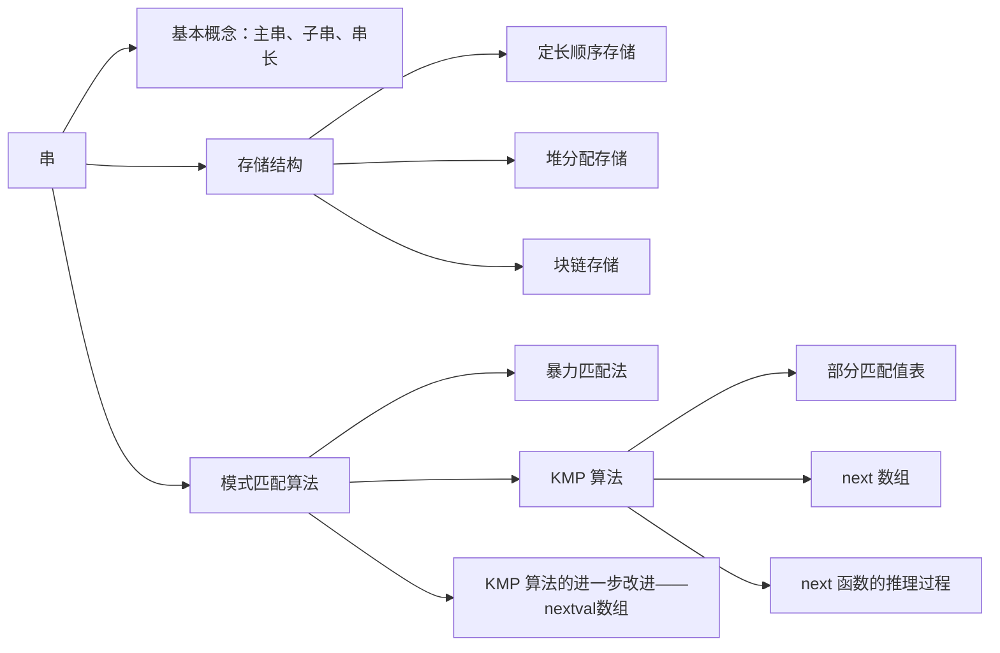

# 第 4 章 串

## Intro

**【考纲内容】**

字符串模式匹配

**【知识框架】**



**【复习提示】**

本章是统考大纲第 6 章内容，采纳读者建议单独作为一章，大纲**只要求掌握字符串模式匹配**
重点掌握 KMP 匹配算法的原理及 next 数组的推理过程，手工求 next 数组可以先计算出部分匹配值表然后变形，或根据公式来求解。
了解 nextval 数组的求解方法。


## *一、串的定义和实现

字符串简称**串**，计算机上非数值处理的对象基本都是字符串数据。我们常见的信息检索系统（如搜索引擎）、文本编辑程序（如 Word）、问答系统、自然语言翻译系统等，都是以字符串数据作为处理对象的。本章详细介绍字符串的存储结构及相应的操作。

### 0x00 串的定义

串（string）是由零个或多个字符组成的有限序列。一般记为 $S='a_1a_2\cdots a_n'(n\ge0)$

其中，S 是串名，单引号括起来的字符序列是串的值；$a_i$ 可以是字母、数字或其他字符；串中字符的个数 n 称为串的长度。n = 0 时的串称为**空串**（用 Ø 表示）

串中任意多个连续的字符组成的子序列称为该串的**子串**，包含子串的串称为**主串**。某个字符在串中的序号称为该字符在串中的**位置**。子串在主串中的位置以子串的第一个字符在主串中的位置来表示。当两个串的长度相等且每个对应位置的字符都相等时，称这两个串是相等的。

例如，有串 `A = 'China Beijing', B = 'Beijing', C = 'China'`，则它们的长度分别为 13，7 和 5。B 和 C 是 A 的子串，B 在 A 中的位置是 7，C 在 A 中的位置是 1。

需要注意的是，由一个或多个空格（空格是特殊字符）组成的串称为**空格串**（注意，空格串不是空串），其长度为串中空格字符的个数。

串的逻辑结构和线性表极为相似，区别仅在于串的数据对象限定为字符集。在基本操作上，串和线性表有很大差别。线性表的基本操作主要以单个元素作为操作对象，如查找、插入或删除某个元素等；而串的基本操作通常以子串作为操作对象，如查找、插入或删除一个子串等。


### 0x01 串的存储结构

#### 1. 定长顺序存储表示

类似于线性表的顺序存储结构，用一组地址连续的存储单元存储串值的字符序列。在串的定长顺序存储结构中，为每个串变量分配一个固定长度的存储区，即定长数组。

```c++
#define MAXLEN 255   // 预定义最大串长为 255
typedef struct {
    char ch[MAXLEN]; // 每个分量存储一个字符
    int length;      // 串的实际长度
}SString;
```

串的实际长度只能小于或等于 `MAXLEN`，超过预定义长度的串值会被舍去，称为**截断**。串长有两种表示方法：一是如上述定义描述的那样，用一个额外的变量 `len `来存放串的长度；二是在串值后面加一个不计入串长的结束标记字符 `'\x00'`，此时的串长为隐含值

在一些串的操作（如插入、联接等）中，若串值序列的长度超过上界 `MAXLEN`，约定用“截断”法处理，要克服这种弊端，只能不限定串长的最大长度，即采用动态分配的方式。

#### 2. 堆分配存储表示

堆分配存储表示仍然以一组地址连续的存储单元存放串值的字符序列，但它们的存储空间是在程序执行过程中动态分配得到的。

```c++
typedef struct {
    char *ch;   // 按串长分配存储区，ch 指向串的基地址
    int length; // 串的长度
}
```

在 C 语言中，存在一个称之为“堆”的自由存储区，并用 `malloc()` 和 `free()` 函数来完成动态存储管理。利用 `malloc()` 为每个新产生的串分配一块实际串长所需的存储空间，若分配成功，则返回一个指向起始地址的指针，作为串的基地址，这个串由 `ch` 指针来指示；若分配失败，则返回 `NULL`。已分配的空间可用 `free()` 释放掉。

上述两种存储表示通常为高级程序设计语言所采用。块链存储表示仅做简单介绍。

#### 3. 块链存储表示

类似于线性表的链式存储结构，也可采用链表方式存储串值。由于串的特殊性（每个元素只有一个字符），在具体实现时，每个结点既可以存放一个字符，也可以存放多个字符。每个结点称为**块**，整个链表称为**块链结构**。图 4.1(a) 是结点大小为 4（即每个结点存放 4 个字符）的链表，最后一个结点占不满时通常用“#”补上；图 4.1(b) 是结点大小为 1 的链表。


### 0x02 串的基本操作

- `StrAssign(&T, chars)`：赋值操作。把串 `T` 赋值为 `chars`
- `StrCopy(&T, S)`：复制操作。由串 `S` 复制得到串 `T`。
- `StrEmpty(S)`：判空操作。若 `S` 为空串，则返回 `TRUE`，否则返回 `FALSE`。
- `StrCompare(S, T)`：比较操作。若 `S > T`，则返回值 `>0`；若 `S = T`，则返回值 `=0`；若 `S < T`，则返回值 `<0`。
- `StrLength(S)`：求串长。返回串 `S` 的元素个数。
- `SubString(&Sub, S, pos, len)`：求子串。用 `Sub` 返回串 `S` 的第 `pos` 个字符起长度为 `len` 的子串。
- `Concat(&T, S1, S2)`：串联接。用 `T` 返回由 `S1` 和 `S2` 联接而成的新串。
- `Index(S, T)`：定位操作。若主串 `S` 中存在与串 `T` 值相同的子串，则返回它在主串 `S` 中第一次出现的位置；否则函数值为 `0`。
- `ClearString(&S)`：清空操作。将 `S` 清为空串。
- `DestroyString(&S)`：销毁串。将串 `S` 销毁。

不同的高级语言对串的基本操作集可以有不同的定义方法。在上述定义的操作中，串赋值 `StrAssign`、串比较 `StrCompare`、求串长 `StrLength`、串联接 `Concat` 及求子串 `SubString` 五种操作构成串类型的最小操作子集，即这些操作不可能利用其他串操作来实现；反之，其他串操作（除串清除 `ClearString` 和串销毁 `DestroyString` 外）均可在该最小操作子集上实现。


## 二、 串的模式匹配

### 0x00 简单的模式匹配算法

子串的定位操作通常称为串的**模式匹配**，它求的是子串（常称**模式串**）在主串中的位置。这里采用定长顺序存储结构，给出一种不依赖于其他串操作的暴力匹配算法。

```c++
int Index(SString S, SString T) {
    int i = 1, j = 1;
    while(i <= S.length && j <= T.length) {
        if(S.ch[i] == T.ch[i]); {
            i++; j++;             // 继续比较后继字符
        }else {
            i = i - j + 2; j = 1; // 指针后退重新开始匹配
        }
    }
    if(j > T.length) return i - T.length;
    else return 0;
}
```

在上述算法中，使用计数指针 `i` 和 `j` 分别指示主串 `S` 和模式串 `T` 中当前待比较的字符位置。算法思想如下：

从主串 `S` 的第一个字符起，与模式 `T` 的第一个字符比较。若相等，则继续逐个比较后续字符；否则从主串的下一个字符起，重新和模式的字符比较。以此类推，直至模式 `T` 中的每个字符依次和主串 `S` 中的一个连续的字符序列相等，则称匹配成功，函数值为与模式 `T` 中第一个字符相等的字符在主串 `S` 中的序号；否则称匹配不成功，函数值为零。

以下是模式 `T='abcac'` 和主串 `S` 的匹配过程，每次匹配失败后，都把模式 `T` 后移一位。

 

简单模式匹配算法的最坏时间复杂度为 $O(nm)$，其中 $n$ 和 $m$ 分别为主串和模式串的长度。例如，当模式串为 `'0000001'`，而主串为 `'00000000000000000000000000000000000000000000000001'` 时，由于模式中前 6 个字符均为 `'0'`，主串中前 45 个字符也都为 `'0'`，每趟匹配都是比较到模式的最后一个字符时才发现不等，因此指针 `i` 需要回溯 39 次，总比较次数为 $40\times7=280$


### 0x01 串的模式匹配算法一 KMP 算法

图 4.2 的匹配过程，在第三趟匹配中，当 `i = 7, j = 5` 时，发现 `j = 6` 字符与主串不等，因此重新从 `i = 4,j = 1` 开始比较。
然而，经过仔细观察会发现，`i = 4, j = 1`、`i = 5, j = 1`、`i = 6, j = 1` 这三次比较都是不必进行的。
因为从第三趟部分匹配的结果可知，主串中第 4、5 和 6 个字符分别是 `'b', 'c', 'a'`（即模式中第 2、3 和 4 个字符）。
由于模式中第一个字符是 `'a'`，因此无需再与这三个字符进行比较。
只需将模式向右滑动 3 个字符的位置，继续进行 `i = 7, j = 2` 时的比较即可。

在暴力匹配中，每趟匹配失败都是模式后移一位再从头开始比较。而某趟己匹配相等的字符序列是模式的某个前缀，这种频繁的重复比较相当于模式串在不断地进行自我比较，这就是其低效率的根源。因此，可以从分析模式本身的结构着手，如果已匹配相等的前缀序列中有某个后缀正好是模式的前缀，那么就可以将模式向后滑动到与这些相等字符对齐的位置，主串 `i` 指针无须回溯，并从该位置开始继续比较。而模式向后滑动位数的计算仅与模式本身的结构有关，与主串无关


#### 1. 字符串的前缀、后缀和部分匹配值

要了解子串的结构，首先要弄清楚几个概念：前缀、后缀和部分匹配值。前缀指除最后一个字符以外，字符串的所有头部子串；后缀指除第一个字符外，字符串的所有尾部子串；部分匹配值则为字符串的前缀和后缀的最长相等前后缀长度。下面以 `'ababa'` 为例进行说明：

- `'a'` 的前缀和后缀都为空集，最长相等前后缀长度为 0
- `'ab'` 的前缀为 {a}，后缀为 {b}，{a} ∩ {b} = Ø，最长相等前后缀长度为 0
- `'aba'` 的前缀为 {a, ab}，后缀为{a, ba}，{a, ab} ∩ {a, ba} = {a}，最长相等前后缀长度为 1
- `'abab'` 的前缀 {a, ab, aba} ∩ 后缀 {b, ab, bab} = {ab}，最长相等前后缀长度为 2
- `'ababa'`，的前缀 {a, ab, aba, abab} ∩ 后缀 {a, ba, aba, baba} = {a, aba}，公共元素有两个，最长相等前后缀长度为 3。

故字符串 `'ababa'` 的部分匹配值为 00123。

这个部分匹配值有什么作用呢？

回到最初的问题，主串为 a b a b c a b c a c b a b，子串为 a b c a c

利用上述方法容易写出子串 `'abcac'`，的部分匹配值为 00010，将部分匹配值写成数组形式，就得到了部分匹配值（Partial Match，PM）的表。

| 编号 |  1   |  2   |  3   |  4   |  5   |
| :--: | :--: | :--: | :--: | :--: | :--: |
|  S   |  a   |  b   |  c   |  a   |  c   |
|  PM  |  0   |  0   |  0   |  1   |  0   |

下面用 PM 表来进行字符串匹配：

 

第一趟匹配过程：
发现 c 与 a 不匹配，前面的 2 个字符 `'ab'`，是匹配的，查表可知，最后一个匹配字符 b 对应的部分匹配值为 0，因此按照下面的公式算出子串需要向后移动的位数：$移动位数=已匹配的字符数-对应的部分匹配值$

因为 $2-0=2$，所以将子串向后移动 2 位，如下进行第二趟匹配：

 

第二趟匹配过程：
发现 c 与 b 不匹配，前面 4 个字符 `'abca'` 是匹配的，最后一个匹配字符 a 对应的部分匹配值为 1，$4-1=3$，将子串向后移动 3 位，如下进行第三趟匹配：

 

第三趟匹配过程：
子串全部比较完成，匹配成功。整个匹配过程中，主串始终没有回退，故 KMP 算法可以在 O(n+m)的时间数量级上完成串的模式匹配操作，大大提高了匹配效率。

某趟发生失配时，如果对应的部分匹配值为 0，那么表示已匹配相等序列中没有相等的前后缀，此时移动的位数最大，直接将子串首字符后移到主串当前位置进行下一趟比较；如果已匹配相等序列中存在最大相等前后缀（可理解为首尾重合），那么将子串向右滑动到和该相等前后缀对齐（这部分字符下一趟显然不需要比较），然后从主串当前位置进行下一趟比较。


#### 2. KMP 算法的原理是什么？

我们刚刚学会了怎样计算字符串的部分匹配值、怎样利用子串的部分匹配值快速地进行字符串匹配操作，但公式“ $移动位数=已匹配的字符数－对应的部分匹配值$”的意义是什么呢？

如图 4.3 所示，当 c 与 b 不匹配时，已匹配 `'abca'` 的前缀 a 和后缀 a 为最长公共元素。已知前缀 a 与 b、c 均不同，与后缀 a 相同，故无须比较，直接将子串移动 “$已匹配的字符数 - 对应的部分匹配值$”，用子串前缀后面的元素与主串匹配失败的元素开始比较即可，如图 4.4 所示。


**对算法的改进方法**：
已知：$右移位数=已匹配的字符数－对应的部分匹配值$。
写成：`Move = (j - 1) - PM[j - 1]`
使用部分匹配值时，每当匹配失败，就去找它前一个元素的部分匹配值，这样使用起来有些不方便，所以将 PM 表右移一位，这样哪个元素匹配失败，直接看它自己的部分匹配值即可。
将上例中字符串 `"abcac"` 的 PM 表右移一位，就得到了 `next` 数组

| 编号 |  1   |  2   |  3   |  4   |  5   |
| :--: | :--: | :--: | :--: | :--: | :--: |
|  S   |  a   |  b   |  c   |  a   |  c   |
| next |  -1  |  0   |  0   |  0   |  1   |

注意到：

1. 第一个元素右移以后空缺的用 -1 来填充，因为若是第一个元素匹配失败，则需要将子串向右移动一位，而不需要计算子串移动的位数。
2. 最后一个元素在右移的过程中溢出，因为原来的子串中，最后一个元素的部分匹配值是其下一个元素使用的，但显然已没有下一个元素，故可以舍去。

这样，上式就改写为 `Move = (j - 1) - next[j]`
相当于将子串的比较指针 `j` 回退到 `j = j - Move = j - ((j - 1) - next[j]) = next[j] + 1`
有时为了使公式更加简洁、计算简单，将 `next` 数组整体 +1
因此，上述子串的 `next` 数组也可以写成

| 编号 |  1   |  2   |  3   |  4   |  5   |
| :--: | :--: | :--: | :--: | :--: | :--: |
|  S   |  a   |  b   |  c   |  a   |  c   |
| next |  0   |  1   |  1   |  1   |  2   |

最终得到子串指针变化公式 `j = next[j]`。在实际匹配过程中，子串在内存里是不会移动的，而是指针在变化，画图举例只是为了让问题描述得更为形象。<u>`next[j]` 的含义是：在子串的第 `j` 个字符与主串发生失配时，则跳到子串的 `next[j]` 位置重新与主串当前位置进行比较</u>。

如何推理 `next` 数组的一般公式？设主串为 's~1~s~2~...s~n~'，模式串为 'p~1~p~2~...p~m~'，当主串中第 `i` 个字符与模式串中第 `j` 个字符失配时，子串应向右滑动多远，然后与模式中的哪个字符比较？

假设此时应与模式中第 k（k<j）个字符继续比较，则模式中前 k - 1 个字符的子串必须满足下列条件，且不可能存在 k' > k 满足下列条件：
'p~1~p~2~...p~k-1~' = 'p~j-k+1~p~j-k+2~...p~j-1~'

若存在满足如上条件的子串，则发生失配时，仅需将模式向右滑动至模式中第 k 个字符和主串第 i 个字符对齐，此时模式中前 k - 1 个字符的子串必定与主串中第 i 个字符之前长度为 k - 1 的子串相等，由此，只需从模式第 k 个字符与主串第 i 个字符继续比较即可，如图 4.5 所示。


当模式串已匹配相等序列中不存在满足上述条件的子串时（可以看成 k = 1），显然应该将模式串右移 j-1 位，让主串第 i 个字符和模式第一个字符进行比较，此时右移位数最大。
当模式串第一个字符（j = 1）与主串第 i 个字符发生失配时，规定 `next[1] = 0` (可理解为将主串第 i 个字符和模式串第一个字符的前面空位置对齐，也即模式串右移一位)。将模式串右移一位，从主串的下一个位置（i + 1）和模式串的第一个字符继续比较。
通过上述分析可以得出 `next` 函数的公式：
$$
\mathrm{next[j]}=
\begin{cases}
0,&j=1\\
\max\{k|1<k<j且p_1Lp_{k-1}=p_{j-k+1}Lp_{j-1}\},&当此集合不空时\\
1,&其他情况
\end{cases}
$$
上述公式不难理解，实际做题求 `next` 值时，用之前的方法也很好求，如果想用代码来实现，难度将较大，我们来尝试推理求解的科学步骤。

首先由公式可知 `next[1] = 0` 

设 `next[j] = k`，此时 k 应满足的条件在上文中已描述。此时 `next[j + 1] = ?` 可能有两种情况：

1. 若 p~k~ = p~j~，则表明在模式串中
         'p~1~...p~k-1~p~k~' = 'p~j-k+1~...p~j-1~p~j~'
   并且不可能存在 k' > k 满足上述条件，此时 `next[j + 1] = k + 1`，即
         `next[j + 1] = next[j] + 1`
2. 若 p~k~ ≠ P~j~，则表明在模式串中 'p~1~...p~k-1~p~k~' ≠ 'p~j-k+1~...p~j-1~p~j~'

此时可以把求 next 函数值的问题视为一个模式匹配的问题。用前缀 p~1~...p~k~ 去跟后缀 p~j-k+1~...p~j~ 匹配，则当 p~k~ ≠ P~j~ 时应将 p~1~...p~k~ 向右滑动至以第 `next[k]` 个字符与 p~j~ 比较，如果 P~next[k]~与 p~j~ 还是不匹配，那么需要寻找长度更短的相等前后缀，下一步继续用 p~next[next[k]]~ 与 p~j~ 比较，以此类推，直到找到某个更小的
k' = next[next···[k]]（1 < k' < k < j），满足条件 'p~1~...p~k'~' = 'p~j-k'+1~...p~j~' 则 `next[j + 1] = k' + 1`

也可能不存在任何 k' 满足上述条件，即不存在长度更短的相等前缀后缀，令 `next[j + 1] = 1`。

理解起来有一点费劲？下面举一个简单的例子。

图 4.6 的模式串中已求得 6 个字符的 `next` 值，现求 `next[7]`，因为 `next[6] = 3`，又 p~6~ ≠ p~3~，则需比较 p~6~ 和 p~1~（因 `next[3] = 1`)，由于 p~6~ ≠ p~1~，而 next[1] = 0，所以 next[7]=1；求 next[8]，因 p~7~ = p~1~，则 next[8] = next[7] + 1 = 2；求 next[9]，因 p~8~ = p~2~，则 next[9] = 3


通过上述分析写出求 next 值的程序如下：

```c++
void get_next(SString T, int next[]) {
    int i, j = 0;
    next[1] = 0;
    while(i < T.length) {
        if(j == 0 || T.ch[i] == T.ch[j]) {
            i++; j++;
            next[i] = j;  // 若 Pi = Pj, 则 next[j + 1] = next[j] + 1
        }else
            j = next[j];  // 否则令 j = next[j]，循环继续
    }
}
```

计算机执行起来效率很高，但对于我们手工计算来说会很难。因此，当我们需要手工计算时，还是用最初的方法。
与 `next` 数组的求解相比，KMP 的匹配算法相对要简单很多，它在形式上与简单的模式匹配算法很相似。不同之处仅在于当匹配过程产生失配时，指针 i 不变，指针 j 退回到 next[j] 的位置并重新进行比较，并且当指针 j 为 0 时，指针 i 和 j 同时加 1。即若主串的第 i 个位置和模式串的第一个字符不等，则应从主串的第 i+1 个位置开始匹配。具体代码如下：

```c++
int Index_KMP(SString S, SString T, int next[]) {
    int i = 1, j = 1;
    while(i <= S.length && j <= T.length) {
        if(j == 0 || S.ch[i] == T.ch[i]) {
            i++; j++;       // 继续比较后继字符
        }else
            j = next[j];    // 模式串向右移动
    }
    if(j > T.length)
        return i - T.length;// 匹配成功
    return 0;
}
```

尽管普通模式匹配的时间复杂度是 $O(mn)$，KMP 算法的时间复杂度是 $O(m+n)$，但在一般情况下，普通模式匹配的实际执行时间近似为 $O(m+n)$，因此至今仍被采用。KMP 算法仅在主串与子串有很多“部分匹配”时才显得比普通算法快得多，其主要优点是主串不回溯。


### 0x02 KMP 算法的进一步优化

前面定义的 next 数组在某些情况下尚有缺陷，还可以进一步优化。如图 4.7 所示，模式 `'aaaab'`，在和主串 `'aaabaaaab'` 进行匹配时：


当 i = 4、j = 4 时，s~4~ 跟 p~4~（b≠a）失配，如果用之前的 next 数组还需要进行 s~4~ 与 p~3~、s~4~ 与 p~2~、s~4~ 与 p~1~ 这 3 次比较。
事实上，因为 P~next[4]=3~ = P~4~ = a、P~next[3]=2~ = p~3~ = a、P~next[2]=1~ = P~2~ = a,显然后面 3 次用一个和 p~4~ 相同的字符跟 s~4~ 比较毫无意义，必然失配。那么问题出在哪里呢？

问题在于不应该出现 p~j~ = P~next[j]~。理由是：当 p~j~ ≠ s~j~ 时，下次匹配必然是 P~next[j]~ 跟 s~j~ 比较，如果 p~j~ = P~next[j]~，那么相当于拿一个和 p~j~ 相等的字符跟 s~j~ 比较，这必然导致继续失配，这样的比较毫无意义。那么如果出现了 P~j~=P~next[j]~ 应该如何处理呢？ 

如果出现了，则需要再次递归，将 next[j] 修正为 next[next[j]] ，直至两者不相等为止，更新后的数组命名为 nextval。计算 next 数组修正值的算法如下，此时匹配算法不变。

```c++
void get_nextval(SString T, int nextval[]) {
    int i = 1, j = 0;
    nextval[1] = 0;
    while(i < T.length) {
        if(j == 0 || T.ch[i] == T.ch[j]) {
            i++; j++;
            if(T.ch[i] != T.ch[j])
                nextval[i] = j;
            else
                nextval[i] = nextval[j];
        }else
            j = nextval[j];
    }
}
```
