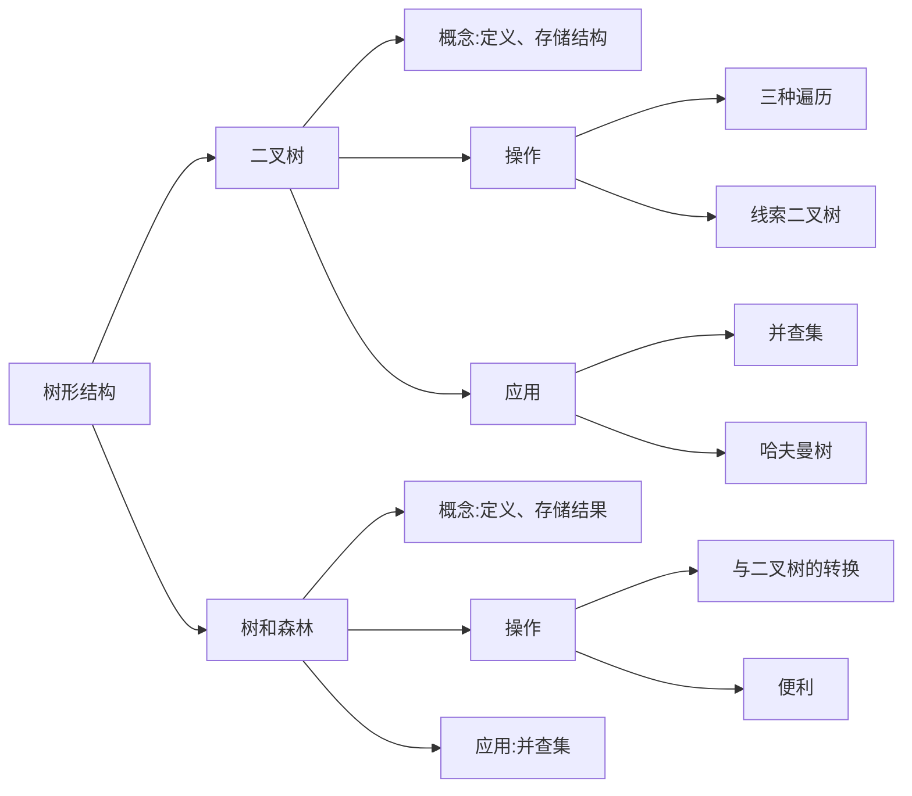

# 第 5 章 树与二叉树

## Intro

**【考纲内容】**

1. 树的基本概念
2. 二叉树
   二叉树的定义及其主要特征；二叉树的顺序存储结构和链式存储结构
   二叉树的遍历；线索二叉树的基本概念和构造看视频讲解
3. 树、森林
   树的存储结构；森林与二叉树的转换；树和森林的遍历
4. 树与二叉树的应用
   哈夫曼（Huffman）树和哈夫曼编码；并查集及其应用

**【知识框架】**



**【复习提示】**

本章内容多以选择题的形式考查，但也会出涉及**树遍历相关的算法题**。树和二叉树的性质、遍历操作、转换、存储结构和操作特性等，满二叉树、完全二叉树、线索二叉树、哈夫曼树的定义和性质，都是选择题必然会涉及的内容。


## 一、树的基本概念

### 0x00 树的定义

树是 $n(n\ge0)$ 个结点的有限集。当 $n=0$ 时，称为**空树**。在任意一棵非空树中应满足：

1. 有且仅有一个特定的称为根的结点
2. 当 $n>1$ 时，其余结点可分为 $m(m>0)$ 个互不相交的有限集 $T_1,T_2,\dots,T_m$，其中每个集合本身又是一棵树，并且称为根的**子树**

显然，树的定义是递归的，即在树的定义中又用到了其自身，树是一种递归的数据结构。树作为一种逻辑结构，同时也是一种分层结构，具有以下两个特点：

1. 树的根结点没有前驱，除根结点外的所有结点有且只有一个前驱
2. 树中所有结点都可以有零个或多个后继

树适合于表示具有层次结构的数据。树中的某个结点（除根结点外）最多只和上一层的一个结点（即其父结点）有直接关系，根结点没有直接上层结点，因此在 n 个结点的树中有 $n-1$ 条边。 而树中每个结点与其下一层的零个或多个结点（即其子女节点）都有直接关系。


### 0x01 基本术语

下面结合图 5.1 中的树来说明一些基本术语和概念。


1. 考虑结点 K。根 A 到结点 K 的唯一路径上的任意结点，称为结点 K 的**祖先**。如结点 B 是结点 K 的祖先，而结点 K 是结点 B 的**子孙**。
   路径上最接近结点 K 的结点 E 称为 K 的**双亲**，而 K 为结点 E 的**孩子**。根 A 是树中唯一没有双亲的结点。
   有相同双亲的结点称为**兄弟**，如结点 K 和结点 L 有相同的双亲 E，即 K 和 L 为兄弟

2. 树中一个结点的孩子个数称为该**结点的度**，树中结点的最大度数称为**树的度**。如结点 B 的度为 2，结点 D 的度为 3，树的度为 3

3. 度大于 0 的结点称为**分支结点**（又称**非终端结点**）；度为 0（没有子女结点）的结点称为**叶结点**（又称**终端结点**）。在分支结点中，每个结点的分支数就是该结点的度

4. 结点的深度、高度和层次。
   结点的层次从树根开始定义，根结点为第 1 层，它的子结点为第 2 层，以此类推。双亲在同一层的结点互为**堂兄弟**，图 5.1 中结点 G 与 E，F，H，I，J 互为堂兄弟。
   **结点的深度**是从根结点开始自顶向下逐层累加的。
   **结点的高度**是从叶结点开始自底向上逐层累加的。
   **树的高度**（或**深度**）是树中结点的最大层数。图 5.1 中树的高度为 4

5. 有序树和无序树。树中结点的各子树从左到右是有次序的，不能互换，称该树为**有序树**，否则称为**无序树**。假设图 5.1 为有序树，若将子结点位置互换，则变成一棵不同的树

6. 路径和路径长度。树中两个结点之间的**路径**是由这两个结点之间所经过的结点序列构成的，而路径长度是路径上所经过的边的个数。

   > 注意：由于树中的分支是有向的，即从双亲指向孩子，所以树中的路径是从上向下的，同一双亲的两个孩子之间不存在路径。

7. 森林。森林是 $m(m\ge0)$ 棵互不相交的树的集合。森林的概念与树的概念十分相近，因为只要把树的根结点删去就成了森林。反之，只要给 m 棵独立的树加上一个结点，并把这 m 棵树作为该结点的子树，则森林就变成了树。

> 注意：上述概念无须刻意记忆，根据实例理解即可。考研时不大可能直接考查概念，而都是结合具体的题目考查。做题时，遇到不熟悉的概念可以翻书，练习得多自然就记住了。

### 0x02 树的性质

树具有如下最基本的性质：

1. 树中的结点数等于所有结点的度数之和加 1
2. 度为 m 的树中第 i 层上至多有 $m^{i-1}$ 个结点（$i\ge1$）
3. 高度为 h 的 m 叉树至多有 $(m^h-1)/(m-1)$ 个结点
4. 具有 n 个结点的 m 叉树的最小高度为 $\lceil\log_m(n(m-1)+1)\rceil$

## 二、二叉树的概念

### 0x00 二叉树的定义及其主要特性

#### 1. 二叉树的定义

二叉树是一种特殊的树形结构，其特点是每个结点至多只有两棵子树（即二叉树中不存在度大于 2 的结点），并且二叉树的子树有左右之分，其次序不能任意颠倒。与树相似，二叉树也以递归的形式定义。二叉树是 $n(n\ge0)$ 个结点的有限集合

1. 或者为空二叉树，即 n = 0
2. 或者由一个根结点和两个互不相交的被称为根的左子树和右子树组成。左子树和右子树又分别是一棵二叉树。

二叉树是有序树，若将其左、右子树颠倒，则成为另一棵不同的二叉树。即使树中结点只有一棵子树，也要区分它是左子树还是右子树。二叉树的 5 种基本形态如图 5.2 所示。


二叉树与度为 2 的有序树的区别：

1. 度为 2 的树至少有 3 个结点，而二叉树可以为空
2. 度为 2 的有序树的孩子的左右次序是相对于另一孩子而言的，若某个结点只有一个孩子，则这个孩子就无须区分其左右次序，而二叉树无论其孩子数是否为 2,均需确定其左右次序，即二叉树的结点次序不是相对于另一结点而言的，而是确定的。


#### 2. 几个特殊的二叉树 

1. **满二叉树**。一棵高度为 h，且含有 $2^h-1$ 个结点的二叉树称为**满二叉树**，即树中的每层都含有最多的结点，如图所示。满二叉树的叶结点都集中在二叉树的最下一层，并且除叶结点之外的每个结点度数均为 2。
   

   可以对满二叉树按层序编号：约定编号从根结点（根结点编号为 1）起，自上而下，自左向右。这样，每个结点对应一个编号，对于编号为 i 的结点，若有双亲，则其双亲为 $\lfloor i/2\rfloor$，若有左孩子，则左孩子为 $2i$；若有右孩子，则右孩子为 $2i+1$。

2. **完全二叉树**。高度为 h、有 n 个结点的二叉树，当且仅当其每个结点都与高度为 h 的满二叉树中编号为 1～n 的结点一一对应时，称为完全二叉树，如图所示。**完全二叉树就是对应相同高度的满二叉树缺失最下层最右边的一些连续叶结点。**
   

   其特点如下：

   1. 若 $i\le\lfloor n/2\rfloor$ 则结点 $i$ 为分支结点，否则为叶结点
   2. 叶结点只可能在层次最大的两层上出现。对于最大层次中的叶结点，都依次排列在该层最左边的位置上
   3. 若有度为 1 的结点，则只可能有一个，且该结点只有左孩子而无右孩子（重要特征）
   4. 按层序编号后，一旦出现某结点（编号为 $i$）为叶结点或只有左孩子，则编号大于 $i$ 的结点均为叶结点
   5. 若 n 为奇数，则每个分支结点都有左孩子和右孩子
      若 n 为偶数，则编号最大的分支结点（编号为 n/2）只有左孩子，没有右孩子，其余分支结点左、右孩子都有

3. **二叉排序树**。左子树上所有结点的关键字均小于根结点的关键字；右子树上的所有结点的关键字均大于根结点的关键字；左子树和右子树又各是一棵二叉排序树。

4. **平衡二叉树**。树上任意一个结点的左子树和右子树的深度之差不超过 1。

#### 3. 二叉树的性质

1. 非空二叉树上的叶结点数等于度为 2 的结点数加 1，即 $n_0=n_2+1$。

   > 证明：设度为 0,1 和 2 的结点个数分别为 $n_0,n_1,n_2$，结点总数 $n=n_0+n_1+n_2$。再看二叉树中的分支数，除根结点外，其余结点都有一个分支进入，设 B 为分支总数，则 $n=B+1$。由于这些分支是由度为 1 或 2 的结点射出的，所以又有 $B=n+2n_2$。于是得 $n_0+n_1+n_2=n_1+2n_2+1$，则 $n_0=n_2+1$。
   >
   > 注意：该性质经常在选择题中用到，希望考生牢记并灵活应用。拓展到任意一棵树，若结点数量为 n，则边的数量为 $n-1$

2. 非空二叉树上第 $k$ 层上至多有 $2^{k-1}$ 个结点（$k\ge 1$）
   第 1 层至多有 $2^{1-1}=1$ 个结点（根），第 2 层至多有 $2^{2-1}=2$ 个结点，以此类推，可以证明其为一个公比为 2 的等比数列 $2^{k-1}$

3. 高度为 $h$ 的二叉树至多有 $2^h-1$ 个结点（$h\ge1$)。
   该性质利用性质 2 求前 $h$ 项的和，即等比数列求和的结果

4. 对完全二叉树按从上到下、从左到右的顺序依次编号 $1,2,\cdots,n$ 则有以下关系：

   1. 当 $i>1$ 时，结点 $i$ 的双亲的编号为 $\lfloor i/2\rfloor$，即
      当 $i$ 为偶数时，其双亲的编号为 $i/2$，它是双亲的左孩子
      当 $i$ 为奇数时，其双亲的编号为 $(i-1)/2$，它是双亲的右孩子
   2. 当 $2i\le n$ 时，结点 $i$ 的左孩子编号为 $2i$，否则无左孩子
   3. 当 $2i+1\le n$ 时，结点 $i$ 的右孩子编号为 $2i+1$，否则无右孩子
   4. 结点 $i$ 所在层次（深度）为 $\lfloor\log2i\rfloor+1$

5. 具有 n 个（n>0）结点的完全二叉树的高度为 $\lceil\log2(n+1)\rceil$ 或者 $\lfloor\log_2n\rfloor+1$。
   设高度为 h，根据性质 3 和完全二叉树的定义有 
   $2^{h-1}-1<n\le 2^h-1$ 或 $2^{h-1}\le n<2^h$ 
   得 $2^{h-1}<n+1\le 2^h$，即 $h-1<\log_2(n+ 1)\le h$
   因为 $h$ 为正整数，所以 $h=\lceil\log_2(n+1)\rceil$  或者得 $h-1\le \log_2n<h$，所以 $\lfloor\log_2n\rfloor+1$。

### 0x01 二叉树的存储结构

#### 1. 顺序存储结构

二叉树的顺序存储是指用一组地址连续的存储单元依次自上而下、自左至右存储完全二叉树上的结点元素，即将完全二叉树上编号为 i 的结点元素存储在一维数组下标为 $i-1$ 的分量中。

依据二叉树的性质，完全二叉树和满二叉树采用顺序存储比较合适，树中结点的序号可以唯一地反映结点之间的逻辑关系，这样既能最大可能地节省存储空间，又能利用数组元素的下标值确定结点在二叉树中的位置，以及结点之间的关系。

但对于一般的二叉树，为了让数组下标能反映二叉树中结点之间的逻辑关系，只能添加一些并不存在的空结点，让其每个结点与完全二叉树上的结点相对照，再存储到一维数组的相应分量中。然而，在最坏情况下，一个高度为 h 且只有 h 个结点的单支树却需要占据近 $2^h-1$ 个存储单元。二叉树的顺序存储结构如图 5.4 所示，其中 0 表示并不存在的空结点。


> 注意：这种存储结构建议从数组下标 1 开始存储树中的结点，若从数组下标 0 开始存储，则不满足性质 4 的描述（比如结点 A 存储在 0 下标位置上时，无法根据性质 4 来计算出其孩子结点在数组中的位置），这是考生在书写程序时容易忽略的。

### 2. 链式存储结构

由于顺序存储的空间利用率较低，因此二叉树一般都采用链式存储结构，用链表结点来存储二叉树中的每个结点。在二叉树中，结点结构通常包括若干数据域和若干指针域，二叉链表至少包含 3 个域：数据域 `data`、左指针域 `lchild` 和右指针域 `rchild`，如图所示。


下图所示为常用的二叉链表的存储结构。而实际上在不同的应用中，还可以增加某些指针域，如增加指向父结点的指针后，变为三叉链表的存储结构。


二叉树的链式存储结构描述如下：

```c++
typedef struct BiTNode {
    ElemType data;                   // 数据域 
    struct BiTNode *lchild, *rchild; // 左、右孩子指针
}BiTNode*BiTree
```

 使用不同的存储结构时，实现二叉树操作的算法也会不同，因此要根据实际应用场合（二叉树的形态和需要进行的运算）来选择合适的存储结构。

容易验证，在含有 n 个结点的二叉链表中，含有 n+1 个空链域（重要结论，经常出现在选择题中）。在下一节中，我们将利用这些空链域来组成另一种链表结构一一线索链表。


## 三、二叉树的遍历和线索二叉树

### 0x00 二叉树的遍历

**二叉树的遍历**是指按某条搜索路径访问树中每个结点，使得每个结点均被访问一次，而且仅被访问一次。由于二叉树是一种非线性结构，每个结点都可能有两棵子树，因而需要寻找一种规律，以便使二叉树上的结点能排列在一个线性队列上，进而便于遍历。

由二叉树的递归定义可知，遍历一棵二叉树便要决定对根结点 N、左子树 L 和右子树 R 的访问顺序。按照先遍历左子树再遍历右子树的原则，常见的遍历次序有先序（NLR）、中序（LNR）和后序（LRN）三种遍历算法，其中“序”指的是根结点在何时被访问。

#### 1. 先序遍历

先序遍历（PreOrder）的操作过程如下。
若二叉树为空，则什么也不做；否则，

1. 访问根结点
2. 先序遍历左子树
3. 先序遍历右子树。

对应的递归算法如下：

```c++
void PreOrder(BiTree T) {
    if(T != NULL) {
        visit(T);            // 访问根结点
        PreOrder(T->lchild); // 递归遍历左子树
        PreOrder(T->rchild); // 递归遍历右子树
    }
}
```

对于图 5.4 所示的二叉树，先序遍历所得到的结点序列为 124635。


#### 2. 中序遍历

中序遍历（InOrder）的操作过程如下。
若二叉树为空，则什么也不做；否则，

1. 中序遍历左子树
2. 访问根结点
3. 中序遍历右子树。

对应的递归算法如下：

```c++
void InOrder(BiTree T) {
    if(T != NULL) {
        InOrder(T->lchild);
        visit(T);
        InOrder(T->rchild);
    }
}
```

对于图 5.4 所示的二叉树，中序遍历所得到的结点序列为 264135


#### 3. 后序遍历

后序遍历（PostOrder）的操作过程如下
若二叉树为空，则什么也不做；否则，

1. 后序遍历左子树
2. 后序遍历右子树
3. 访问根结点。

对应的递归算法如下：

```c++
void PostOrder(BiTree T) {
    if(T != NULL) {
        PostOrder(T->lchild);
        PostOrder(T->rchild);
        visit(T);
    }
}
```

对于图 5.4 所示的二叉树，后序遍历所得到的结点序列为 642531。


三种遍历算法中，递归遍历左、右子树的顺序都是固定的，只是访问根结点的顺序不同。不管采用哪种遍历算法，每个结点都访问一次且仅访问一次，故时间复杂度都是 $O(n)$。在递归遍历中，递归工作栈的栈深恰好为树的深度，所以在最坏情况下，二叉树是有 n 个结点且深度为 n 的单支树，遍历算法的空间复杂度为 $O(n)$。

> 注意：以上三种遍历方式及算法描述是简单易懂的，读者需要将它们作为模板来记忆，考研中的很多题目都是基于这三个模板延伸出来的。


#### 4. 递归算法和非递归算法的转换

在上节介绍的三种遍历算法中，暂时抹去和递归无关的 `visit()` 语句，则 3 个遍历算法完全相同，因此，从递归执行过程的角度看先序、中序和后序遍历也是完全相同的。

图 5.7 用带箭头的虚线表示了这三种遍历算法的递归执行过程。其中，向下的箭头表示更深一层的递归调用，向上的箭头表示从递归调用退出返回；虚线旁的三角形、圆形和方形内的字符分别表示在先序、中序和后序遍历的过程中访问根结点时输出的信息。例如，由于中序遍历中访问结点是在遍历左子树之后、遍历右子树之前进行的，则带圆形的字符标在向左递归返回和向右递归调用之间。由此，只要沿虚线从 1 出发到 2 结束，将沿途所见的三角形（或圆形或方形）内的字符记下，便得到遍历二叉树的先序（或中序或后序）序列。例如，在图 5.7 中，沿虚线游走可以分别得到先序序列为 ABDEC、中序序列为 DBEAC、后序序列为 DEBCA。


借助栈的思路，我们来分析中序遍历的访问过程：

1. 沿着根的左孩子，依次入栈，直到左孩子为空，说明已找到可以输出的结点，此时栈内元素依次为 ABD。
2. 栈顶元素出栈并访问：若其右孩子为空，继续执行 2：若其右孩子不空，将右子树转执行 1。

栈顶 D 出栈并访问，它是中序序列的第一个结点；D 右孩子为空，栈顶 B 出栈并访问；B 右孩子不空，将其右孩子 E 入栈，E 左孩子为空，栈顶 E 出栈并访问；E 右孩子为空，栈顶 A 出栈并访问；A 右孩子不空，将其右孩子 C 入栈，C 左孩子为空，栈顶 C 出栈并访问。由此得到中序序列 DBEAC。读者可根据上述分析画出遍历过程的出入栈示意图。

根据分析可以写出中序遍历的非递归算法如下：

```c++
void InOrder2(BiTree T) {
    Stack S = InitStack();   // 初始化栈 S
    BiTree p = T;            // p 是遍历指针
    while(p || !IsEmpty(S)) {// 栈不空或 p 不空时循环
        if(p) {              // 一路向左
            Push(S, p);      // 当前结点入栈
            p = p->lchild;   // 左孩子不空，一直向左走
        }else {              // 出栈，并转向出栈结点的右子树
            Pop(S, p);       // 栈顶元素出栈
            visit(p);        // 访问出栈结点
            p = p->rchild;   // 向右子树走，p 赋值为当前结点的右孩子
        }                    // 返回 while 循环继续进入 if-else 语句
    }
}
```

先序遍历和中序遍历的基本思想是类似的，只需把访问结点操作放在入栈操作的前面，读者可以参考中序遍历的过程说明自行模拟出入栈示意图。先序遍历的非递归算法如下：

```c++
void InOrder2(BiTree T) {
    Stack S = InitStack();   // 初始化栈 S
    BiTree p = T;            // p 是遍历指针
    while(p || !IsEmpty(S)) {// 栈不空或 p 不空时循环
        if(p) {              // 一路向左
            visit(p);
            Push(S, p);      // 当前结点入栈
            p = p->lchild;   // 左孩子不空，一直向左走
        }else {              // 出栈，并转向出栈结点的右子树
            Pop(S, p);       // 栈顶元素出栈
            p = p->rchild;   // 向右子树走，p 赋值为当前结点的右孩子
        }                    // 返回 while 循环继续进入 if-else 语句
    }
}
```

后序遍历的非递归实现是三种遍历方法中最难的。因为在后序遍历中，要保证左孩子和右孩子都已被访问并且左孩子在右孩子前访问才能访问根结点，这就为流程的控制带来了难题。

后序非递归遍历算法的思路分析：从根结点开始，将其入栈，然后沿其左子树一直往下搜索，直到搜索到没有左孩子的结点，但是此时不能出栈并访问，因为如果其有右子树，还需按相同的规则对其右子树进行处理。直至上述操作进行不下去，若栈顶元素想要出栈被访问，要么右子树为空，要么右子树刚被访问完（此时左子树早已访问完），这样就保证了正确的访问顺序。

按后序非递归算法遍历图 5.7（a）中的二叉树，当访问到 E 时，A，B，D 都已入过栈，对于后序非递归遍历，当一个结点的左右子树都被访问后才会出栈，图中 D 已出栈，此时栈内还有 A 和 B，这是 E 的全部祖先。实际上，访问一个结点 p 时，栈中结点恰好是 p 结点的所有祖先，从栈底到栈顶结点再加上 p 结点，刚好构成从根结点到 p 结点的一条路径。在很多算法设计中都可以利用这一思路来求解，如求根到某结点的路径、求两个结点的最近公共祖先等。


#### 5. 层次遍历


上图所示为二叉树的层次遍历，即按照箭头所指方向，按照 1，2，3，4 的层次顺序，对二叉树中的各个结点进行访问。

要进行层次遍历，需要借助一个队列。首先将二叉树根结点入队，然后出队，访问出队结点，若它有左子树，则将左子树根结点入队；若它有右子树，则将右子树根结点入队。完成入队后出队，访问出队结点……如此反复，直至队列为空。

二叉树的层次遍历算法如下： 

```c++
void LevelOrder(BiTree T) {
    InitQueue(Q);                 // 初始化辅助队列
    BiTree p;
    EnQueue(Q, T);                // 将根结点入队
    while(!IsEmpty(Q)) {          // 队列不空则循环
        DeQueue(Q, p);            // 队头结点出队
        visit(p);
        if(p->lchild != NULL)
            EnQueue(Q, p->lchild);// 左子树不空，则左子树根结点入队
        if(p->rchild != NULL)
            EnQueue(Q, p->rchild);// 右子树不空，则右子树根结点入队
    }
}
```

上述二叉树层次遍历的算法，读者在复习过程中应将其作为一个模板，在熟练掌握其执行过程的基础上来记忆，并达到熟练手写的程度。这样才能将层次遍历模板应用于各种题目之中。

> 注意：遍历是二叉树各种操作的基础，可以在遍历的过程中对结点进行各种操作。例如，对于一棵已知树求结点的双亲、求结点的孩子结点、求二叉树的深度、求二叉树的叶结点个数、判断两棵二叉树是否相同等。所有这些操作都建立在二叉树遍历的基础上，因此必须掌握二叉树的各种遍历过程，并能灵活运用以解决各种问题

#### 6. 由遍历序列构造二叉树

由二叉树的先序序列和中序序列可以唯一地确定一棵二叉树。
在先序遍历序列中，第一个结点一定是二叉树的根结点；而在中序遍历中，根结点必然将中序序列分割成两个子序列，前一个子序列是根结点的左子树的中序序列，后一个子序列是根结点的右子树的中序序列。根据这两个子序列，在先序序列中找到对应的左子序列和右子序列。在先序序列中，左子序列的第一个结点是左子树的根结点，右子序列的第一个结点是右子树的根结点。如此递归地进行下去，便能唯一地确定这棵二叉树。

同理，由二叉树的后序序列和中序序列也可以唯一地确定一棵二叉树。
因为后序序列的最后一个结点就如同先序序列的第一个结点，可以将中序序列分割成两个子序列，然后采用类似的方法递归地进行划分，进而得到一棵二叉树。

由二叉树的层序序列和中序序列也可以唯一地确定一棵二叉树，实现方法留给读者思考。需要注意的是，若只知道二叉树的先序序列和后序序列，则无法唯一确定一棵二叉树。

例如，求先序序列（ABCDEFGHI）和中序序列（BCAEDGHFI）所确定的二叉树。首先，由先序序列可知 A 为二叉树的根结点。中序序列中 A 之前的 BC 为左子树的中序序列，EDGHFI 为右子树的中序序列。然后，由先序序列可知 B 是左子树的根结点，D 是右子树的根结点。以此类推，就能将剩下的结点继续分解下去，最后得到的二叉树如图 5.9(c) 所示。


### 0x01 线索二叉树

####  1. 线索二叉树的基本概念

遍历二叉树是以一定的规则将二叉树中的结点排列成一个线性序列，从而得到几种遍历序列，使得该序列中的每个结点（第一个和最后一个结点除外）都有一个直接前驱和直接后继。

传统的二叉链表存储仅能体现一种父子关系，不能直接得到结点在遍历中的前驱或后继。前面提到，在含 n 个结点的二叉树中，有 n+1 个空指针。这是因为每个叶结点都有 2 个空指针，每个度为 1 的结点都有 1 个空指针，空指针总数为 $2n_0+n_1$，又 $n_0=n_2+1$，所以空指针总数为 $n_0+n_1+n_2+1=n+1$。由此设想能否利用这些空指针来存放指向其前驱或后继的指针？这样就可以像遍历单链表那样方便地遍历二叉树。引入线索二叉树正是为了加快查找结点前驱和后继的速度。

规定：若无左子树，令 lchild 指向其前驱结点；若无右子树，令 rchild 指向其后继结点。如图 5.10 所示，还需增加两个标志域标识指针域，以指向左（右）孩子或前驱（后继）。


其中，标志域的含义如下：
$$
\mathrm{ltag}=
\begin{cases}
0,&\mathrm{lchild} 域指示结点的左孩子\\
1,&\mathrm{lchild} 域指示结点的前驱
\end{cases}\\
\mathrm{rtag}=
\begin{cases}
0,&\mathrm{rchild} 域指示结点的右孩子\\
1,&\mathrm{rchild} 域指示结点的前驱
\end{cases}
$$


线索二叉树的存储结构描述如下：

```c++
typedef struct ThreadNodel {
    ElemType data;                      // 数据元素
    struct ThreadNode *lchild, *rchild; // 左、右孩子指针
    int ltag,rtag;                      // 左、右线索标志
}ThreadNode, *ThreadTree;
```

以这种结点结构构成的二叉链表作为二叉树的存储结构，称为线索链表，其中指向结点前驱和后继的指针称为线索。加上线索的二叉树称为线索二叉树。

#### 2. 中序线索二叉树的构造

二叉树的**线索化**是将二叉链表中的空指针改为指向前驱或后继的线索。而前驱或后继的信息只有在遍历时才能得到，因此线索化的实质就是遍历一次二叉树。
以中序线索二叉树的建立为例。附设指针 pre 指向刚刚访问过的结点，指针 p 指向正在访问的结点，即 pre 指向 p 的前驱。在中序遍历的过程中，检查 p 的左指针是否为空，若为空就将它指向 pre；检查 pre 的右指针是否为空，若为空就将它指向 p，如图 5.11 所示。


通过中序遍历对二叉树线索化的递归算法如下：

```c++
void InThread(ThreadTree &p, ThreadTree &pre) {
    if(p != NULL) {
        InThread(p->lchild, pre); // 递归，线索化左子树
        if(p->lchild == NULL) {   // 左子树为空，建立前驱线索
            p->lchild = pre;
            p->ltag   = 1;
        }
        if(pre != NULL && pre->rchild == NULL) {
            pre->rchild = p;      // 建立前驱结点的后继线索
            pre->rtag   = 1;
        }
        pre = p;                  // 标记当前结点成为刚刚访问过的结点
        InThread(p->rchild, pre); // 递归，线索化右子树
    }
}
```

通过中序遍历建立中序线索二叉树的主过程算法如下：

```c++
void CreateInThread(ThreadTree T) {
    ThreadTree pre = NULL;
    if(T != NULL) {        // 非空二叉树，线索化
        InThread(T, pre);  // 线索化二叉树
        pre->rchild = NULL;// 处理遍历的最后一个结点
        pre->rtag   = 1;
    }
}
```

为了方便，可以在二叉树的线索链表上也添加一个头结点，令其 lchild 域的指针指向二叉树的根结点，其 rchild 域的指针指向中序遍历时访问的最后一个结点；令二叉树中序序列中的第一个结点的 lchild 域指针和最后一个结点的 rchild 域指针均指向头结点。这好比为二叉树建立了一个双向线索链表，方便从前往后或从后往前对线索二叉树进行遍历，如图 5.12 所示。


#### 3. 中序线索二叉树的遍历

中序线索二叉树的结点中隐含了线索二叉树的前驱和后继信息。在对其进行遍历时，只要先找到序列中的第一个结点，然后依次找结点的后继，直至其后继为空。在中序线索二叉树中找结点后继的规律是：若其右标志为“1”，则右链为线索，指示其后继，否则遍历右子树中第一个访问的结点（右子树中最左下的结点）为其后继。不含头结点的线索二叉树的遍历算法如下。

1. 求中序线索二叉树中中序序列下的第一个结点
   ```c++
   ThreadNode *Firstnode(ThreadNode *p) {
       while(p->ltag == 0)
           p = p->lchild; // 最左下结点(不一定是叶结点)
       return p;
   }
   ```

2. 求中序线索二叉树中结点 p 在中序序列下的后继：
   ```c++
   ThreadNode *Nextnode(ThreadNode *p) {
       if(p->rtag == 0)
           return Firstnode(p->rchild);
       else
           return p->rchild; // rtag==1 直接返回后继线索
   }
   ```

   请自行分析并完成求中序线索二叉树的最后一个结点和结点 p 前驱的运算

   > 将函数1中的 ltag 和 Ichild 换成 rtag 和 rchild ,即为求中序线索二叉树的最后一个结点。将函数2中的 rtag 和 rchild  换成 Itag 和 lchild ,此外调用函数改为求中序线索二叉树的最后一个结点，即为求中序线索二叉树中结点 p 的前驱。

3. 利用上面两个算法，可以写出不含头结点的中序线索二叉树的中序遍历的算法：
   ```c++
   void Inorder(ThreadNode *T) {
       for(ThreadNode *p = Firstnode(T); p != NULL; p = Nextnode(p))
           visit(p);
   }
   ```

   

#### 4. 先序线索二叉树和后序线索二叉树

上面给出了建立中序线索二叉树的代码，建立先序线索二叉树和建立后序线索二叉树的代码类似，只需变动线索化改造的代码段与调用线索化左右子树递归函数的位置。

以图 5.13(a)的二叉树为例给出手动求先序线索二叉树的过程：先序序列为 ABCDF，然后依次判断每个结点的左右链域，如果为空则将其改造为线索。结点 A，B 均有左右孩子；结点 C 无左孩子，将左链域指向前驱 B，无右孩子，将右链域指向后继 D；结点 D 无左孩子，将左链域指向前驱 C，无右孩子，将右链域指向后继 F；结点 F 无左孩子，将左链域指向前驱 D，无右孩子，也无后继，故置空，得到的先序线索二叉树如图 5.13(b) 所示。求后序线索二叉树的过程：后序序列为 CDBFA，结点 C 无左孩子，也无前驱故置空，无右孩子，将右链域指向后继 D；结点 D 无左孩子，将左链域指向前驱 C，无右孩子，将右链域指向后继 B；结点 F 无左孩子，将左链域指向前驱 B，无右孩子，将右链域指向后继 A，得到的后序线索二叉树如图 5.13(c) 所示。


如何在先序线索二叉树中找结点的后继？如果有左孩子，则左孩子就是其后继；如果无左孩子但有右孩子，则右孩子就是其后继；如果为叶结点，则右链域直接指示了结点的后继。

在后序线索二叉树中找结点的后继较为复杂，可分三种情况：

1. 若结点 x 是二叉树的根，则其后继为空
2. 若结点 x 是其双亲的右孩子，或是其双亲的左孩子且其双亲没有右子树，则其后继即为双亲
3. 若结点 x 是其双亲的左孩子，且其双亲有右子树，则其后继为双亲的右子树上按后序遍历列出的第一个结点。

图 5.13(c) 中找结点 B 的后继无法通过链域找到，可见在后序线索二叉树上找后继时需知道结点双亲，即需采用带标志域的三叉链表作为存储结构。


## 四、树、森林

### 0x00 树的存储结构

树的存储方式有多种，既可采用顺序存储结构，又可采用链式存储结构，但无论采用何种存储方式，都要求能唯一地反映树中各结点之间的逻辑关系，这里介绍 3 种常用的存储结构。

#### 1. 双亲表示法

这种存储结构采用一组连续空间来存储每个结点，同时在每个结点中增设一个伪指针，指示其双亲结点在数组中的位置。如图 5.14 所示，根结点下标为 0，其伪指针域为 -1。


双亲表示法的存储结构描述如下：

```c++
#define MAX_TREE_SIZE 100          // 树中最多结点数
typedef struct {                   // 树的结点定义
    ElemType data;                 // 数据元素
    int parent;                    // 双亲位置域
}PTNode;
typedef struct {                   // 树的类型定义
    PTNode nodes[MAX_TREE_SIZE];   // 双亲表示
    int n;                         // 结点数
}PTree;
```

该存储结构利用了每个结点（根结点除外）只有唯一双亲的性质，可以很快地得到每个结点的双亲结点，但求结点的孩子时则需要遍历整个结构。

> 注意：区别树的顺序存储结构与二叉树的顺序存储结构。在树的顺序存储结构中，数组下标代表结点的编号，下标中所存的内容指示了结点之间的关系。而在二叉树的顺序存储结构中，数组下标既代表了结点的编号，又指示了二叉树中各结点之间的关系。当然，二叉树属于树，因此二叉树都可以用树的存储结构来存储，但树却
>
> 不都能用二叉树的存储结构来存储。


#### 2. 孩子表示法

孩子表示法是将每个结点的孩子结点都用单链表链接起来形成一个线性结构，此时 n 个结点就有 n 个孩子链表（叶结点的孩子链表为空表），如图 5.15（a）所示。这种存储结构寻找子女的操作非常直接，而寻找双亲的操作需要遍历 n 个结点中孩子链表指针域所指向的 n 个孩子链表。


#### 3. 孩子兄弟表示法

孩子兄弟表示法又称**二叉树表示法**，即以二叉链表作为树的存储结构。孩子兄弟表示法使每个结点包括三部分内容：结点值、指向结点第一个孩子结点的指针，以及指向结点下一个兄弟结点的指针（沿此域可以找到结点的所有兄弟结点），如图 5.15(b)所示。

孩子兄弟表示法的存储结构描述如下

```c++
typedef struct CSNode {
    ElemType data; // 数据域
    struct CSNode *firstchild, *nextsibling; // 第一个孩子和右兄弟指针
}CSNode, *CSTree;
```

这种存储表示法比较灵活，其最大的优点是可以方便地实现树转换为二叉树的操作，易于查找结点的孩子等，但缺点是从当前结点查找其双亲结点比较麻烦。若为每个结点增设一个 parent 域指向其父结点，则查找结点的父结点也很方便。


### 0x01 树、森林与二叉树的转换

由于二叉树和树都可以用二叉链表作为存储结构，因此以二叉链表作为媒介可以导出树与二叉树的一个对应关系，即给定一棵树，可以找到唯一的一棵二叉树与之对应。从物理结构上看，它们的二叉链表是相同的，只是解释不同而已。

树转换为二叉树的规则：每个结点左指针指向它的第一个孩子，右指针指向它在树中的相邻右兄弟，这个规则又称“左孩子右兄弟”。由于根结点没有兄弟，所以对应的二叉树没有右子树，如图 5.16 所示。


树转换成二叉树的画法：

1. 在兄弟结点之间加一连线
2. 对每个结点，只保留它与第一个孩子的连线，而与其他孩子的连线全部抹掉
3. 以树根为轴心，顺时针旋转 45°

将森林转换为二叉树的规则与树类似。先将森林中的每棵树转换为二叉树，由于任意一棵和树对应的二叉树的右子树必空，若把森林中第二棵树根视为第一棵树根的右兄弟，即将第二棵树对应的二叉树当作第一棵二叉树根的右子树，将第三棵树对应的二叉树当作第二棵二叉树根的右子树····以此类推，就可以将森林转换为二叉树。

森林转换成二叉树的画法：

1. 将森林中的每棵树转换成相应的二叉树
2. 每棵树的根也可视为兄弟关系，在每棵树的根之间加一根连线
3. 以第一棵树的根为轴心顺时针旋转 45°

二叉树转换为森林的规则：若二叉树非空，则二叉树的根及其左子树为第一棵树的二叉树形式，故将根的右链断开。二叉树根的右子树又可视为一个由除第一棵树外的森林转换后的二叉树，应用同样的方法，直到最后只剩一棵没有右子树的二叉树为止，最后再将每棵二叉树依次转换成树，就得到了森林，如图 5.17 所示。二叉树转换为树或森林是唯一的。


### 0x02 树和森林的遍历

树的遍历是指用某种方式访问树中的每个结点，且仅访问一次。主要有两种方式：

1. 先根遍历。若树非空，先访问根结点，再依次遍历根结点的每棵子树，遍历子树时仍遵循先根后子树的规则。其遍历序列与这棵树相应二叉树的先序序列相同
2. 后根遍历。若树非空，先依次遍历根结点的每棵子树，再访问根结点，遍历子树时仍遵循先子树后根的规则。其遍历序列与这棵树相应二叉树的中序序列相同。

图 5.16 的树的先根遍历序列为 ABEFCDG，后根遍历序列为 EFBCGDA
另外，树也有层次遍历，与二叉树的层次遍历思想基本相同，即按层序依次访问各结点。按照森林和树相互递归的定义，可得到森林的两种遍历方法。

1. 先序遍历森林。若森林为非空，则按如下规则进行遍历：
   - 访问森林中第一棵树的根结点
   - 先序遍历第一棵树中根结点的子树森林
   - 先序遍历除去第一棵树之后剩余的树构成的森林
2. 中序遍历森林。森林为非空时，按如下规则进行遍历：
   - 中序遍历森林中第一棵树的根结点的子树森林
   - 访问第一棵树的根结点
   - 中序遍历除去第一棵树之后剩余的树构成的森林。

图 5.17 的森林的先序遍历序列为 ABCDEFGHI，中序遍历序列为 BCDAFEHIG。
当森林转换成二叉树时，其第一棵树的子树森林转换成左子树，剩余树的森林转换成右子树，可知森林的先序和中序遍历即为其对应二叉树的先序和中序遍历。

树和森林的遍历与二叉树的遍历关系：

|    树    |   森林   |  二叉树  |
| :------: | :------: | :------: |
| 先根遍历 | 先序遍历 | 先序遍历 |
| 后根遍历 | 中序遍历 | 中序遍历 |

> 注意：部分教材也将森林的中序遍历称为后序遍历，称树森林二叉树中序遍历是相对其二叉树而言的，称后序遍历是因为根确实是最后才访问的，如遇到这两种称谓，那么都可以理解为同一种遍历方法。


## 五、树与二叉树的应用

### 0x00 哈夫曼树和哈夫曼编码

#### 1. 哈夫曼树的定义

在许多应用中，树中结点常常被赋予一个表示某种意义的数值，称为该结点的**权**。从树的根到任意结点的路径长度（经过的边数）与该结点上权值的乘积，称为该结点的**带权路径长度**。树中所有叶结点的带权路径长度之和称为该树的**带权路径长度**，记为
$$
\mathrm{WPL}=\sum_{i=1}^nw_il_i
$$
式中，$w_i$ 是第 $i$ 个叶结点所带的权值，$l_i$ 是该叶结点到根结点的路径长度。在含有 n 个带权叶结点的二叉树中，其中带权路径长度（WPL）最小的二叉树称为**哈夫曼树**，也称**最优二叉树**。例如，图 5.18 中的 3 棵二叉树都有 4 个叶结点 a，b，c，d，分别带权 7，5，2，4，它们的带权路径长度分别为


(a) WPL=7×2+5×2+2×2+4×2=36
(b) WPL=4×2+7×3+5×3+2×1=46
(c) WPL=7×1+5×2+2×3+4×3=35。

其中，图 5.18(c) 树的 WPL 最小。可以验证，它恰好为哈夫曼树。


#### 2. 哈夫曼树的构造

给定 n 个权值分别为 $w_1,w_2,\dots, w_n$ 的结点，构造哈夫曼树的算法描述如下：

1. 将这 n 个结点分别作为 n 棵仅含一个结点的二叉树，构成森林 F
2. 构造一个新结点，从 F 中选取两棵根结点权值最小的树作为新结点的左、右子树，并且将新结点的权值置为左、右子树上根结点的权值之和
3. 从 F 中删除刚才选出的两棵树，同时将新得到的树加入 F 中
4. 重复步骤 2 和 3，直至 F 中只剩下一棵树为止。

从上述构造过程中可以看出哈夫曼树具有如下特点：

1. 每个初始结点最终都成为叶结点，且权值越小的结点到根结点的路径长度越大
2. 构造过程中共新建了 n-1 个结点（双分支结点），因此哈夫曼树的结点总数为 2n-1
3. 每次构造都选择 2 棵树作为新结点的孩子，因此哈夫曼树中不存在度为 1 的结点。

例如，权值 {7, 5, 2, 4} 的哈夫曼树的构造过程如下图所示。


#### 3. 哈夫曼编码

在数据通信中，若对每个字符用相等长度的二进制位表示，称这种编码方式为**固定长度编码**。若允许对不同字符用不等长的二进制位表示，则这种编码方式称为**可变长度编码**。可变长度编码比固定长度编码要好得多，其特点是对频率高的字符赋以短编码，而对频率较低的字符则赋以较长一些的编码，从而可以使字符的平均编码长度减短，起到压缩数据的效果。哈夫曼编码是一种被广泛应用而且非常有效的数据压缩编码。

若没有一个编码是另一个编码的前缀，则称这样的编码为前缀编码。举例：设计字符 A, B, C 对应的编码 0，101 和 100 是前缀编码。对前缀编码的解码很简单，因为没有一个编码是其他编码的前缀。所以识别出第一个编码，将它翻译为原码，再对余下的编码文件重复同样的解码操作。例如，码串 00101100 可被唯一地翻译为 0,0,101 和 100。另举反例：如果再将字符 D 的编码设计为 00，此时 0 是 00 的前缀，那么这样的码串的前两位就无法唯一翻译。

由哈夫曼树得到哈夫曼编码是很自然的过程。首先，将每个出现的字符当作一个独立的结点，其权值为它出现的频度（或次数），构造出对应的哈夫曼树。显然，所有字符结点都出现在叶结点中。我们可将字符的编码解释为从根至该字符的路径上边标记的序列，其中边标记为 0 表示“转向左孩子”，标记为 1 表示“转向右孩子”。图 5.20 所示为一个由哈夫曼树构造哈夫曼编码的示例，矩形方块表示字符及其出现的次数。


这棵哈夫曼树的 WPL 为
$$
\mathrm{WPL}=1\times45+3\times(13+12+16)+4\times(5+9)=224
$$
此处的 WPL 可视为最终编码得到二进制编码的长度，共 224 位。若采用 3 位固定长度编码，则得到的二进制编码长度为 300 位，因此哈夫曼编码共压缩了 25%的数据。利用哈夫曼树可以设计出总长度最短的二进制前缀编码。

> 注意：0 和 1 究竟是表示左子树还是右子树没有明确规定。左、右孩子结点的顺序是任意的，所以构造出的哈夫曼树并不唯一，但各哈夫曼树的带权路径长度 WPL 相同且为最优。此外，如有若干权值相同的结点，则构造出的哈夫曼树更可能不同，但 WPL 必然相同且是最优的。


### 0x01 并查集

并查集是一种简单的集合表示，它支持以下 3 种操作：

1. `Initial(S)`：将集合 S 中的每个元素都初始化为只有一个单元素的子集合
2. `Union(S, Root1, Root2）`：把集合 s 中的子集合 Root2 并入子集合 Root1。要求 Root1 和 Root2 互不相交，否则不执行合并
3. `Find(, x)`：查找集合 S 中单元素 x 所在的子集合，并返回该子集合的根结点。

通常用树（森林）的双亲表示作为并查集的存储结构，每个子集合以一棵树表示。所有表示子集合的树，构成表示全集合的森林，存放在双亲表示数组内。通常用数组元素的下标代表元素名，用根结点的下标代表子集合名，根结点的双亲结点为负数。

例如，若设有一个全集合为 $S=\{0,1,2,3,4,5,6,7,8,9\}$ 初始化时每个元素自成一个单元素子集合，每个子集合的数组值为-1，如图 5.21 所示。


经过一段时间的计算，这些子集合合并为 3 个更大的子集合 $S_1=\{0,6,7,8\}，S_2=\{1,4,9\}，S_3=\{2,3,5\}$ 此时并查集的树形表示和存储结构如图 5.22 所示。


为了得到两个子集合的并，只需将其中一个子集合根结点的双亲指针指向另一个集合的根结点。因此，$S_1\cup S_2$ 可以具有如图 5.23 所示的表示。


在采用树的双亲指针数组表示作为并查集的存储表示时，集合元素的编号从 O 到 SIZE-1。其中 SIZE 是最大元素的个数。下面是并查集主要运算的实现。

并查集的结构定义如下：

```c++
#define SIZE 100
int UFSets[SIZE]; //集合元素数组(双亲指针数组)
```

并查集的初始化操作（S 即为并查集）

```c++
void Initial(int S[]) {
    for(int i = 0; i < SIZE; i++) // 每个自成单元素集合
        S[i] = -1;
}
```

Find 操作（函数在并查集 S 中查找并返回包含元素 x 的树的根）：

```c++
int Find(int S[], int x) {
    while(S[x] >= 0) // 循环寻找×的根
        x = S[x];
    return x;        // 根的 S[]小于 0
}
```

判断两个元素是否属于同一集合，只需分别找到它们的根结点，比较根结点是否相同即可。

Union 操作（函数求两个不相交子集合的并集）：

```c++
void Union(int S[], int Root1, int Root2) {
    if(Root1 == Root2) return; // 要求 Root1 与 Root2 是不同的集合
    S[Root2] = Root1;          // 将根 Root2 连接到另一根 Root1 下面
}
```

如果将两个元素所在的集合合并为一个集合，那么就需要先找到两个元素的根结点。
