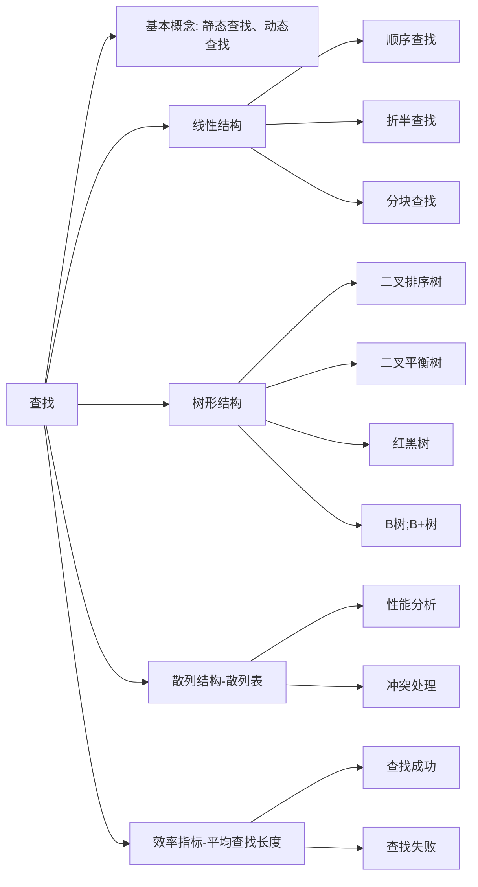

# 第 7 章 查找

## Intro

**【考纲内容】**

1. 查找的基本概念
2. 顺序查找法
3. 分块查找法
4. 折半查找法
5. 树型查找
   二叉搜索树；平衡二叉树：红黑树
6. B 树及其基本操作、B+树的基本概念
7. 散列（Hash）表（
8. 查找算法的分析及应用


**【知识框架】**



**【复习提示】**

本章是考研命题的重点。
对于折半查找，应掌握折半查找的过程、构造判定树、分析平均查找长度等
对于二叉排序树、二叉平衡树和红黑树，要了解它们的概念、性质和相关操作等
B 树和 B+树是本章的难点。对于 B 树，考研大纲要求掌握插入、删除和查找的操作过程；
对于 B+树，仅要求了解其基本概念和性质。
对于散列查找，应掌握散列表的构造、冲突处理方法（各种方法的处理过程）、查找成功和查找失败的平均查找长度、散列查找的特征和性能分析。


## 一、查找的基本概念

1. **查找**。在数据集合中寻找满足某种条件的数据元素的过程称为查找。查找的结果一般分为两种：一是**查找成功**，即在数据集合中找到了满足条件的数据元素；二是**查找失败**

2. **查找表（查找结构）**。用于查找的数据集合称为**查找表**，它由同一类型的数据元素（或记录）组成，可以是一个数组或链表等数据类型。对查找表经常进行的操作一般有 4 种：

   1. 查询某个特定的数据元素是否在查找表中
   2. 检索满足条件的某个特定的数据元素的各种属性
   3. 在查找表中插入一个数据元素
   4. 从查找表中删除某个数据元素

3. **静态查找表**。若一个查找表的操作只涉及上述操作 1 和 2，则无须动态地修改查找表，此类查找表称为**静态查找表**。
   与此对应，需要动态地插入或删除的查找表称为**动态查找表**。
   适合静态查找表的查找方法有顺序查找、折半查找、散列查找等
   适合动态查找表的查找方法有二叉排序树的查找、散列查找等

4. **关键字**。数据元素中唯一标识该元素的某个数据项的值，使用基于关键字的查找，查找结果应该是唯一的。
   例如，在由一个学生元素构成的数据集合中，学生元素中“学号”这一数据项的值唯一地标识一名学生

5. **平均查找长度**。在查找过程中，一次查找的长度是指需要比较的关键字次数，而平均查找长度则是所有查找过程中进行关键字的比较次数的平均值，其数学定义为
   $$
   \mathrm{ASL}=\sum_{i=1}^nP_iC_i
   $$
   式中，n 是查找表的长度；
   $P_i$ 是查找第 i 个数据元素的概率，一般认为每个数据元素的查找概率相等，即 $P_i=1/n$
   $C_i$ 是找到第 i 个数据元素所需进行的比较次数。
   平均查找长度是衡量查找算法效率的最主要的指标。


## 二、顺序查找和折半查找

### 0x00 顺序查找

**顺序查找**又称**线性查找**，它对顺序表和链表都是适用的。
对于顺序表，可通过数组下标递增来顺序扫描每个元素
对于链表，可通过指针 next 来依次扫描每个元素。
顺序查找通常分为对一般的无序线性表的顺序查找和对按关键字有序的线性表的顺序查找。下面分别进行讨论。

#### 1. 一般线性表的顺序查找

作为一种最直观的查找方法，其基本思想是从线性表的一端开始，逐个检查关键字是否满足给定的条件。若查找到某个元素的关键字满足给定条件，则查找成功，返回该元素在线性表中的位置；若已经查找到表的另一端，但还没有查找到符合给定条件的元素，则返回查找失败的信息。下面给出其算法，主要是为了说明其中引入的“哨兵”的作用。

```c++
typedef struct {      // 查找表的数据结构
    ElemType *elem;   // 元素存储空间基址，建表时按实际长度分配，0 号单元留空
    int TableLen;     // 表的长度
}SSTable;
int Search_Seq(SSTable ST, ElemType key) {
    ST.elem[0] = key; // “哨兵”
    int i;
    for(i = ST.TableLen; ST.elem[i] != key; i--); // 从后往前找
    return i;         // 若表中不存在关键字为 key 的元素，将查找到 i 为 0 时退出 for 循环
}
```

上述算法中，将 `ST.elem[0]` 称为哨兵，引入它的目的是使得 `Search_Seq` 内的循环不必判断数组是否会越界。算法从尾部开始查找，若找到 `ST.elem[i] == key `则返回 i 值，查找成功。否则一定在查找到 `ST.elem[0］== key` 时跳出循环，此时返回的是 0，查找失败。在程序中引入“哨兵”并不是这个算法独有的，引入“哨兵”可以避免很多不必要的判断语句，从而提高程序效率。

对于有 n 个元素的表，给定值 key 与表中第 i 个元素相等，即定位第 i 个元素时，需进行 $n-i+1$ 次关键字的比较，即 $C_i=n-i+1$。查找成功时，顺序查找的平均长度为 
$$
\mathrm{ASL}_{成功}=\sum_{i=1}^nP_i(n-i+1)
$$
当每个元素的查找概率相等，即 $P_i=1/n$ 时，有
$$
\mathrm{ASL}_{成功}=\frac{n+1}2
$$
查找不成功时，与表中各关键字的比较次数显然是 $n+1$ 次，即 $\mathrm{ASL}_{不成功}=n+1$

通常，查找表中记录的查找概率并不相等。若能预先得知每个记录的查找概率，则应先对记录的查找概率进行排序，使表中记录按查找概率由大至小重新排列。

综上所述，顺序查找的缺点是当 n 较大时，平均查找长度较大，效率低；优点是对数据元素的存储没有要求，顺序存储或链式存储皆可。对表中记录的有序性也没有要求，无论记录是否按关键字有序，均可应用。同时还需注意，对线性的链表只能进行顺序查找。


#### 2. 有序表的顺序查找

若在查找之前就已经知道表是关键字有序的，则查找失败时可以不用再比较到表的另一端就能返回查找失败的信息，从而降低顺序查找失败的平均查找长度。

假设表 L 是按关键字从小到大排列的，查找的顺序是从前往后，待查找元素的关键字为 key，当查找到第 i 个元素时，发现第 i 个元素对应的关键字小于 key，但第 i+1 个元素对应的关键字大于 key，这时就可返回查找失败的信息，因为第 i 个元素之后的元素的关键字均大于 key，所以表中不存在关键字为 key 的元素

可以用如图 7.1 所示的判定树来描述有序线性表的查找过程。树中的圆形结点表示有序线性表中存在的元素；树中的矩形结点称为失败结点（若有 n 个结点，则相应地有 n+1 个查找失败结点），它描述的是那些不在表中的数据值的集合。若查找到**失败结点**，则说明查找不成功。


在有序线性表的顺序查找中，查找成功的平均查找长度和一般线性表的顺序查找一样。查找失败时，查找指针一定走到了某个失败结点。这些失败结点是我们虚构的空结点，实际上是不存在的，所以到达失败结点时所查找的长度等于它上面的一个圆形结点的所在层数。查找不成功的平均查找长度在相等查找概率的情形下为
$$
\mathrm{ASL}_{不成功}=\sum_{j=1}^nq_j(l_j-1)=\frac{1+2+\cdots+n+n}{n+1}=\frac n2+\frac n{n+1}
$$
式中，$q_j$ 是到达第 j 个失败结点的概率，在相等查找概率的情形下，它为 $1/(n+1)$
$l_j$是第 j 个失败结点所在的层数。当 n=6 时，$\mathrm{ASL}_{不成功}=6/2+6/7=3.86$，比一般的顺序查找算法好一些。

注意，有序线性表的顺序查找和后面的折半查找的思想是不一样的，且有序线性表的顺序查找中的线性表可以是链式存储结构。


### 0x01 折半查找

**折半查找**又称**二分查找**，它仅适用于有序的顺序表。

折半查找的基本思想：首先将给定值 key 与表中中间位置的元素比较，若相等，则查找成功，返回该元素的存储位置；若不等，则所需查找的元素只能在中间元素以外的前半部分或后半部分（例如，在查找表升序排列时，若给定值 key 大于中间元素，则所查找的元素只可能在后半部分）。然后在缩小的范围内继续进行同样的查找，如此重复，直到找到为止，或确定表中没有所需要查找的元素，则查找不成功，返回查找失败的信息。算法如下：

```c++
int Binary_Search(SSTable L, ElemType key) {
    int low = 0, high = L.TableLen - 1, mid;
    while(low <= high) {
        mid = (low + high) / 2;    // 取中间位置 
        if(L.elem[mid] == key)
            return mid;            // 查找成功则返回所在位置
        else if(L.elem[mid] > key)
            high = mid - 1;        // 从前半部分继续查找
        else
            low = mid + 1;         // 从后半部分继续查找
    }
    return -1;                     // 查找失败，返回-1
}
```

例如，已知 11 个元素的有序表 $\{7,10,13,16,19,29,32,33,37,41,43\}$，要查找值为 11 的元素，指针 `low` 和 `high` 分别指向表的下界和上界，`mid` 则指向表的中间位置 $\lfloor(low+high)/2\rfloor$。以下说明查找的过程：


第一次查找，将中间位置元素与 key 值比较。因为 11 < 29，说明待查元素若存在，则必在范围 [low, mid - 1] 内，令指针 high 指向位置 mid - 1, high = mid - 1 = 5，重新求得 mid = (1 + 5) / 2 = 3，第二次的查找范围为 [1, 5]


第二次查找，同样将中间位置元素与 key 值比较。因为 11 < 13，说明待查元素若存在，则必在范围 [low, mid - 1] 内,令指针 high 指向位置 mid - 1, high = mid - 1 = 2，重新求得 mid = (1 + 2) / 2 = 1,第三次的查找范围为 [1, 2]


第三次查找，将中间位置元素与 key 值比较。因为 11 > 7，说明待查元素若存在，则必在范围 [mid + 1, high] 内。令 low = mid + 1 = 2，mid = (2 + 2) / 2 = 2，第四次的查找范围为 [2, 2］


第四次查找，此时子表只含有一个元素，且 10 ≠ 11，故表中不存在待查元素。

折半查找的过程可用图 7.2 所示的二叉树来描述，称为**判定树**。树中每个圆形结点表示一个记录，结点中的值为该记录的关键字值；树中最下面的叶结点都是方形的，它表示查找不成功的情况。从判定树可以看出，查找成功时的查找长度为从根结点到目的结点的路径上的结点数，而查找不成功时的查找长度为从根结点到对应失败结点的父结点的路径上的结点数；每个结点值均大于其左子结点值，且均小于其右子结点值。若有序序列有 n 个元素，则对应的判定树有 n 个圆形的非叶结点和 n+1 个方形的叶结点。显然，判定树是一棵平衡二叉树。


由上述分析可知，用折半查找法查找到给定值的比较次数最多不会超过树的高度。在等概率查找时，查找成功的平均查找长度为
$$
\mathrm{ASL}=\frac1n\sum_{i=1}^n l_i=\frac1n(1\times1+2\times2+\cdots +h\times2^{h-1})=\frac{n+1}n\log_2(n+1)-1\approx\log_2(n+1)-1
$$
式中，h 是树的高度，并且元素个数为 n 时树高 $h=\lceil\log_2(n+1)\rceil$。所以，折半查找的时间复杂度为 $O(\log_2n)$，平均情况下比顺序查找的效率高。

在图 7.2 所示的判定树中，在等概率情况下，
查找成功（圆形结点）的 $\mathrm{ASL}=(1\times1+2\times2+3\times4+4\times 4)/11=3$，
查找不成功（方形结点）的 $\mathrm{ASL}=(3\times 4+4\times 8)/12=11/3$

因为折半查找需要方便地定位查找区域，所以它要求线性表必须具有随机存取的特性。因此，该查找法仅适合于顺序存储结构，不适合于链式存储结构，且要求元素按关键字有序排列。


### 0x02 分块查找

分块查找又称**索引顺序查找**，它吸取了顺序查找和折半查找各自的优点，既有动态结构，又适于快速查找。

分块查找的基本思想：将查找表分为若干子块。块内的元素可以无序，但块间的元素是有序的，即第一个块中的最大关键字小于第二个块中的所有记录的关键字，第二个块中的最大关键字小于第三个块中的所有记录的关键字，以此类推。再建立一个索引表，索引表中的每个元素含有各块的最大关键字和各块中的第一个元素的地址，索引表按关键字有序排列。

分块查找的过程分为两步：第一步是在索引表中确定待查记录所在的块，可以顺序查找或折半查找索引表；第二步是在块内顺序查找

例如，关键码集合为 $\{88,24,72,61,21,6,32,11,8,31,22,83,78,54\}$，按照关键码值 $24,54,78,88$，分为 4 个块和索引表，如图 7.3 所示。


分块查找的平均查找长度为索引查找和块内查找的平均长度之和。设索引查找和块内查找的平均查找长度分别为 $L_I,L_S$，则分块查找的平均查找长度为
$$
\mathrm{ASL}=L_I+L_S
$$
将长度为 n 的查找表均匀地分为 b 块，每块有 s 个记录，在等概率情况下，若在块内和索引表中均采用顺序查找，则平均查找长度为
$$
\mathrm{ASL}=L_I+L_S=\frac{b+1}2+\frac{s+1}2=\frac{s^2+2s+n}{2s}
$$
此时，若 $s=\sqrt n$，则平均查找长度取最小值 $\sqrt n+1$


## 三、树型查找

### 0x00 二叉排序树（BST）

构造一棵二叉排序树的目的并不是为了排序，而是为了提高查找、插入和删除关键字的速度，二叉排序树这种非线性结构也有利于插入和删除的实现。

#### 1. 二叉排序树的定义

二叉排序树（也称二叉查找树）或者是一棵空树，或者是具有下列特性的二叉树：

1. 若左子树非空，则左子树上所有结点的值均小于根结点的值
2. 若右子树非空，则右子树上所有结点的值均大于根结点的值
3. 左、右子树也分别是一棵二叉排序树。

根据二叉排序树的定义，左子树结点值 < 根结点值 < 右子树结点值，因此对二叉排序树进行中序遍历，可以得到一个递增的有序序列。例如，图 7.4 所示二叉排序树的中序遍历序列为 123468。


#### 2. 二叉排序树的查找

二叉排序树的查找是从根结点开始，沿某个分支逐层向下比较的过程。若二叉排序树非空，先将给定值与根结点的关键字比较，若相等，则查找成功；若不等，如果小于根结点的关键字，则在根结点的左子树上查找，否则在根结点的右子树上查找。这显然是一个递归的过程。

二叉排序树的非递归查找算法：

```c++
BSTNode *BST_Search(BiTree T, ElemType key) {
    while(T != NULL && key != T->data) { // 若树空或等于根结点值，则结束循环
        if(key < T->data)
            T = T->lchild;               // 小于，则在左子树上查找
        else
            T = T->rchild;               // 大于，则在右子树上查找
    }
    return T;
}
```

例如，在图 7.4 中查找值为 4 的结点。首先 4 与根结点 6 比较。由于 4 小于 6，所以在根结点 6 的左子树中继续查找。由于 4 大于 2，所以在结点 2 的右子树中查找，查找成功。


#### 3. 二叉排序树的插入

二叉排序树作为一种动态树表，其特点是树的结构通常不是一次生成的，而是在查找过程中，当树中不存在关键字值等于给定值的结点时再进行插入的。

插入结点的过程如下：若原二叉排序树为空，则直接插入；否则，若关键字 k 小于根结点值，则插入到左子树，若关键字 k 大于根结点值，则插入到右子树。插入的结点一定是一个新添加的叶结点，且是查找失败时的查找路径上访问的最后一个结点的左孩子或右孩子。如图 7.5 所示在一棵二叉排序树中依次插入结点 28 和结点 58，虚线表示的边是其查找的路径。


二叉排序树插入操作的算法描述如下：

```c++
int BST_Insert(BiTree &T, KeyType k) {
    if(T == NULL) {    // 原树为空，新插入的记录为根结点
        T = (BITree)malloc(sizeof(BSTNode));
        T->data = k;
        T->lchild = T->rchild = NULL;
        return 1;      // 返回 1，插入成功
    }else if(k == T->data)
        return 0;      // 树中存在相同关键字的结点，插入失败
    else if(k < T->data) 
        return BST_Insert(T->lchild, k); // 插入到 T 的左子树
    else
        return BST_Insert(T->rchild, k); // 插入到 T 的右子树 
    
}
```


#### 4. 二叉排序树的构造

从一棵空树出发，依次输入元素，将它们插入二叉排序树中的合适位置。设查找的关键字序列为 $\{45,24,53,45,12,24\}$，则生成的二叉排序树如图 7.6 所示。


构造二叉排序树的算法描述如下：

```c++
void Creat_BST(BiTree &T, KeyType str[], int n) {
    T = NULL;
    for(int i = 0; i < n; i++) 
        BST_Insert(T, str[i]);
}
```


#### 5. 二叉排序树的删除

在二叉排序树中删除一个结点时，不能把以该结点为根的子树上的结点都删除，必须先把被删除结点从存储二叉排序树的链表上摘下，将因删除结点而断开的二叉链表重新链接起来，同时确保二叉排序树的性质不会丢失。删除操作的实现过程按 3 种情况来处理：

1. 若被删除结点 z 是叶结点，则直接删除，不会破坏二叉排序树的性质
2. 若结点 z 只有一棵左子树或右子树，则让 z 的子树成为 z 父结点的子树，替代 z 的位置
3. 若结点 z 有左、右两棵子树，则令 z 的直接后继（或直接前驱）替代 z，然后从二叉排序树中删去这个直接后继（或直接前驱），这样就转换成了第一或第二种情况。

图 7.7 显示了在 3 种情况下分别删除结点 45, 78, 78 的过程。


#### 6. 二叉排序树的查找效率分析

二叉排序树的查找效率，主要取决于树的高度。若二叉排序树的左、右子树的高度之差的绝对值不超过 1（平衡二叉树，下一节），它的平均查找长度为 $O(\log_2n)$。若二叉排序树是一个只有右（左）孩子的单支树（类似于有序的单链表），则其平均查找长度为 $O(n)$。

在最坏情况下，即构造二叉排序树的输入序列是有序的，则会形成一个倾斜的单支树，此时二叉排序树的性能显著变坏，树的高度也增加为元素个数 n，如图 7.8(b) 所示。

在等概率情况下，图 7.8(a) 查找成功的平均查找长度为
$$
\mathrm{ASL}_a=(1+2\times2+3\times4+4\times3)/10=2.9
$$
而图 7.8(b) 查找成功的平均查找长度为
$$
\mathrm{ASL}_b=(1+2+3+4+5+6+7+8+9+10)/10=5.5
$$
从查找过程看，二叉排序树与二分查找相似。就平均时间性能而言，二叉排序树上的查找和二分查找差不多。但二分查找的判定树唯一，而二叉排序树的查找不唯一，相同的关键字其插入顺序不同可能生成不同的二叉排序树，如图 7.8 所示。

就维护表的有序性而言，二叉排序树无须移动结点，只需修改指针即可完成插入和删除操作，平均执行时间为 $O(\log_2n)$。.二分查找的对象是有序顺序表，若有插入和删除结点的操作，所花的代价是 $O(n)$。当有序表是静态查找表时，宜用顺序表作为其存储结构，而采用二分查找实现其找操作；若有序表是动态查找表，则应选择二叉排序树作为其逻辑结构。


### 0x01 平衡二叉树

#### 1. 平衡二叉树的定义

为了避免树的高度增长过快，降低二叉排序树的性能，规定在插入和删除结点时，要保证任意结点的左、右子树高度差的绝对值不超过 1，将这样的二叉树称为**平衡二叉树**（Balanced Binary Tree）或称 **AVL 树**。定义结点左子树与右子树的高度差为该结点的**平衡因子**，则平衡二叉树结点的平衡因子的值只可能是 -1、0 或 1。

因此，平衡二叉树可定义为或者是一棵空树，或者是具有下列性质的二叉树：它的左子树和右子树都是平衡二叉树，且左子树和右子树的高度差的绝对值不超过 1。图 7.9(a) 所示是平衡二叉树，图 7.9(b) 所示是不平衡的二叉树。结点中的值为该结点的平衡因子。


#### 2. 平衡二叉树的插入

二叉排序树保证平衡的基本思想如下：每当在二叉排序树中插入（或删除）一个结点时，首先检查其插入路径上的结点是否因为此次操作而导致了不平衡。若导致了不平衡，则先找到插入路径上离插入结点最近的平衡因子的绝对值大于 1 的结点 A，再对以 A 为根的子树，在保持二叉排序树特性的前提下，调整各结点的位置关系，使之重新达到平衡。

> 注意：每次调整的对象都是最小不平衡子树，即以插入路径上离插入结点最近的平衡因子的绝对值大于 1 的结点作为根的子树。图 7.10 中的虚线框内为最小不平衡子树。
>
> 

平衡二叉树的插入过程的前半部分与二叉排序树相同，但在新结点插入后，若造成查找路径上的某个结点不再平衡，则需要做出相应的调整。可将调整的规律归纳为下列 4 种情况：

1. LL 平衡旋转（右单旋转）。由于在结点 A 的左孩子（L）的左子树（L）上插入了新结点，A 的平衡因子由 1 增至 2，导致以 A 为根的子树失去平衡，需要一次向右的旋转操作。将 A 的左孩子 B 向右上旋转代替 A 成为根结点，将 A 结点向右下旋转成为 B 的右子树的根结点，而 B 的原右子树则作为 A 结点的左子树。
   如图 7.11 所示，结点旁的数值代表结点的平衡因子，而用方块表示相应结点的子树，下方数值代表该子树的高度。
   
2. RR 平衡旋转（左单旋转）。由于在结点 A 的右孩子（R）的右子树（R）上插入了新结点，A 的平衡因子由 -1 减至 -2，导致以 A 为根的子树失去平衡，需要一次向左的旋转操作。将 A 的右孩子 B 向左上旋转代替 A 成为根结点，将 A 结点向左下旋转成为 B 的左子树的根结点，而 B 的原左子树则作为 A 结点的右子树，如图 7.12 所示。
   
3. LR 平衡旋转（先左后右双旋转）。由于在 A 的左孩子（L）的右子树（R）上插入新结点，A 的平衡因子由 1 增至 2，导致以 A 为根的子树失去平衡，需要进行两次旋转操作，先左旋转后右旋转。先将 A 结点的左孩子 B 的右子树的根结点 C 向左上旋转提升到 B 结点的位置，然后把该 C 结点向右上旋转提升到 A 结点的位置，如图 7.13 所示
   
4. RL 平衡旋转（先右后左双旋转）。由于在 A 的右孩子（R）的左子树（L）上插入新结点，A 的平衡因子由-1 减至-2，导致以 A 为根的子树失去平衡，需要进行两次旋转操作，先右旋转后左旋转。先将 A 结点的右孩子 B 的左子树的根结点 C 向右上旋转提升到 B 结点的位置，然后把该 C 结点向左上旋转提升到 A 结点的位置，如图 7.14 所示。
   

> 注意：LR 和 RL 旋转时，新结点究竟是插入 C 的左子树还是插入 C 的右子树不影响旋转过程，而图 7.13 和图 7.14 中以插入 C 的左子树中为例。

以关键字序列 $\{15,3,7,10,9,8\}$ 构造一棵平衡二叉树的过程为例，
图 7.15(d) 插入 7 后导致不平衡，最小不平衡子树的根为 15，插入位置为其左孩子的右子树，故执行 LR 旋转，先左后右双旋转，调整后的结果如图 7.15(e)所示
图 7.15(g) 插入 9 后导致不平衡，最小不平衡子树的根为 15，插入位置为其左孩子的左子树，故执行 LL 旋转，右单旋转，调整后的结果如图 7.15(h)所示
图 7.15(i) 插入 8 后导致不平衡，最小不平衡子树的根为 7，插入位置为其右孩子的左子树，故执行 RL 旋转，先右后左双旋转，调整后的结果如图 7.15(j) 所示。


#### 3. 平衡二叉树的删除

与平衡二叉树的插入操作类似，以删除结点 w 为例来说明平衡二叉树删除操作的步骤：

1. 用二叉排序树的方法对结点 w 执行删除操作
2. 若导致了不平衡，则从结点 w 开始向上回溯，找到第一个不平衡的结点 z（即最小不平衡子树）
   y 为结点 z 的高度最高的孩子结点；x 是结点 y 的高度最高的孩子结点
3. 然后对以 z 为根的子树进行平衡调整，其中 x、y 和 z 可能的位置有 4 种情况：
   - y 是 z 的左孩子，x 是 y 的左孩子（LL，右单旋转）
   - y 是 z 的左孩子，x 是 y 的右孩子（LR，先左后右双旋转）
   - y 是 z 的右孩子，x 是 y 的右孩子（RR，左单旋转）
   - y 是 z 的右孩子，x 是 y 的左孩子（RL，先右后左双旋转）

这四种情况与插入操作的调整方式一样。不同之处在于，插入操作仅需要对以 z 为根的子树进行平衡调整；而删除操作就不一样，先对以 z 为根的子树进行平衡调整，如果调整后子树的高度减 1，则可能需要对 z 的祖先结点进行平衡调整，甚至回溯到根结点（导致树高减 1）

以删除图 7.16(a) 的结点 32 为例，由于 32 为叶结点，直接删除即可，向上回溯找到第一个不平衡结点 44（即 z），z 的高度最高的孩子结点为 78(y)，y 的高度最高的孩子结点为 50(x)，满足 RL 情况，先右后左双旋转，调整后的结果如图 7.16(c) 所示


#### 4. 平衡二叉树的查找

在平衡二叉树上进行查找的过程与二叉排序树的相同。因此，在查找过程中，与给定值进行比较的关键字个数不超过树的深度。假设以 $n_h$ 表示深度为 h 的平衡树中含有的最少结点数。显然，有 $n_0=0,n_1=1,n_2=2$，并且有 $n_h=n_{h-1}+n_{h-2}+1$。可以证明，含有 n 个结点的平衡二叉树的最大深度为 $O(\log_2n)$，因此平衡二叉树的平均查找长度为 $O(\log_2n)$，如图 7.17 所示。


> 注意：该结论可用于求解给定结点数的平衡二叉树的查找所需的最多比较次数（或树的最大高度）。
> 在含有 12 个结点的平衡二叉树中查找某个结点的最多比较次数是多少？


### 0x02 红黑树

#### 1. 红黑树的定义

为了保持 AVL 树的平衡性，插入和删除操作后，非常频繁地调整全树整体拓扑结构，代价较大。为此在 AVL 树的平衡标准上进一步放宽条件，引入了红黑树的结构。

一棵红黑树是满足如下**红黑性质**的二叉排序树：

1. 每个结点或是红色，或是黑色的
2. 根结点是黑色的
3. 叶结点（虚构的外部结点、NULL 结点）都是黑色的
4. 不存在两个相邻的红结点（即红结点的父结点和孩子结点均是黑色的）
5. 对每个结点，从该结点到任意一个叶结点的简单路径上，所含黑结点的数量相同。

与折半查找树和 B 树类似，为了便于对红黑树的实现和理解，引入了 n+1 个外部叶结点，以保证红黑树中每个结点（内部结点）的左、右孩子均非空。图 7.18 所示是一棵红黑树。


从某结点出发（不含该结点）到达一个叶结点的任意一个简单路径上的黑结点总数称为该结点的黑高（记为 bh），黑高的概念是由性质 5 确定的。根结点的黑高称为红黑树的黑高。

**结论 1：从根到叶结点的最长路径不大于最短路径的 2 倍**

由性质 5，当从根到任意一个叶结点的简单路径最短时，这条路径必然全由黑结点构成
由性质 4，当某条路径最长时，这条路径必然是由黑结点和红结点相间构成的，此时红结点和黑结点的数量相同。
图 7.18 中的 6 -- 2 和 6 -- 15 -- 18 -- 20 就是这样的两条路径。

**结论 2：有 n 个内部结点的红黑树的高度 $h\le2\log_2(n+1)$**

证明：由结论 1 可知，从根到叶结点（不含叶结点）的任何一条简单路径上都至少有一半是黑结点，因此，根的黑高至少为 h/2，于是有 $n\ge 2^{h/2}-1$，即可求得结论。

可见，红黑树的“适度平衡”，由 AVL 树的“高度平衡”，降低到“任意一个结点左右子树的高度，相差不超过 2 倍”，也降低了动态操作时调整的频率。对于一棵动态查找树，如果插入和删除操作比较少，查找操作比较多，采用 AVL 树比较合适，否则采用红黑树更合适。但由于维护这种高度平衡所付出的代价比获得的效益大得多，红黑树的实际应用更广泛，C++中的 map 和 set（Java 中的 TreeMap 和 TreeSet）就是用红黑树实现的。


#### 2. 红黑树的插入

红黑树的插入过程和二叉查找树的插入过程基本类似，不同之处在于，在红黑树中插入新结点后需要进行调整（主要通过重新着色或旋转操作进行），以满足红黑树的性质。

**结论 3：新插入红黑树中的结点初始着为红色**

假设新插入的结点初始着为黑色，那么这个结点所在的路径比其他路径多出一个黑结点（几乎每次插入都破坏性质 5），调整起来也比较麻烦。如果插入的结点是红色的，此时所有路径上的黑结点数量不变，仅在出现连续两个红结点时才需要调整，而且这种调整也比较简单。

设结点 z 为新插入的结点。插入过程描述如下：

1. 用二叉查找树插入法插入，并将结点 z 着为红色。若结点 z 的父结点是黑色的，无须做任何调整，此时就是一棵标准的红黑树
2. 如果结点 z 是根结点，将 z 着为黑色（树的黑高增 1)，结束
3. 如果结点 z 不是根结点，并且 z 的父结点 z.p 是红色的，则分为下面三种情况，区别在于 z 的叔结点 y 的颜色不同，因 z.p 是红色的，插入前的树是合法的，根据性质 2 和 4，爷结点 z.p.p 必然存在且为黑色。性质 4 只在 z 和 z.p 之间被破坏了。

**情况 1：z 的叔结点 y 是黑色的，且 z 是一个右孩子**
**情况 2：z 的叔结点 y 是黑色的，且 z 是一个左孩子**

每棵子树 $T_1,T_2,T_3,T_4$ 都有一个黑色根结点，且具有相同的黑高。

情况 1（LR，先左旋，再右旋），即 z 是其爷结点的左孩子的右孩子。先做一次左旋将此情形转变为情况 2（变为情况 2 后再做一次右旋），左旋后 z 和父结点 z.p 交换位置。因为 z 和 z.p 都是红色的，所以左旋操作对结点的黑高和性质 5 都无影响

情况 2（LL，右单旋），即 z 是其爷结点的左孩子的左孩子。做一次右旋，并交换 z 的原父结点和原爷结点的颜色，就可以保持性质 5，也不会改变树的黑高。这样，红黑树中也不再有连续两个红结点，结束。情况 1 和情况 2 的调整方式如图 7.19 所示。


若父结点 z.p 是爷结点 z.p.p 的右孩子，则还有两种对称的情况：RL （先右旋，再左旋）和 RR（左单旋），这里不再赘述。红黑树的调整方法和 AVL 树的调整方法有异曲同工之妙。

**情况 3：如果 z 的叔结点  y 是红色**

情况 3（z 是左孩子或右孩子无影响），z 的父结点 z.p 和叔结点 y 都是红色的，因为爷结点 z.p.p 是黑色的，将 z.p 和 y 都着为黑色，将 z.p.p 着为红色，以在局部保持性质 4和 5。然后，把 z.p.p 作为新结点 z 来重复循环，指针 z 在树中上移两层。调整方式如图 7.20 所示。
若父结点 z.p 是爷结点 z.p.p 的右孩子，也还有两种对称的情况，不再赘述。
只要满足情况 3 的条件，就会不断循环，每次循环指针 z 都会上移两层，直到满足 2（表示 z 上移到根结点）或情况 1 或情况 2 的条件。
可能的疑问：虽然插入的初始位置一定是红黑树的某个叶结点，但因为在情况 3 中，结点 z 存在不断上升的可能，所以对于三种情况，结点 z 都有存在子树的可能。


以图 7.21(a) 中的红黑树为例（虚线表示插入后的状态），先后插入 5、4 和 12 的过程如图 7.21 所示。插入 5，为情况 3，将 5 的父结点 3 和叔结点 10 着为黑色，将 5 的爷结点变为红色，此时因为 7 已是根，故又重着为黑色，树的黑高加 1，结束。插入 4，为情况 1 的对称情况（RL），此时特别注意虚构黑色空结点的存在，先对 5 做右旋；转变为情况 2 的对称情况（RR），交换 3 和 4 的颜色，再对 3 做左旋，结束。插入 12，父结点是黑色的，无须任何调整，结束。


#### 3. 红黑树的删除*

红黑树的插入操作容易导致连续的两个红结点，破坏性质 4。
而删除操作容易造成子树黑高的变化（删除黑结点会导致根结点到叶结点间的黑结点数量减少），破坏性质 5。

删除过程也是先执行二叉查找树的删除方法。若待删结点有两个孩子，不能直接删除，而要找到该结点的中序后继（或前驱）填补，即右子树中最小的结点，然后转换为删除该后继结点。由于后继结点至多只有一个孩子，这样就转换为待删结点是终端结点或仅有一个孩子的情况。

最终，删除一个结点有以下两种情况：

- 待删结点只有右子树或左子树
- 待删结点没有孩子

1. 如果待删结点只有右子树或左子树，则只有两种情况，如图 7.22 所示。
   

   只有这两种情况存在。子树只有一个结点，且必然是红色，否则会破坏性质 5

2. 如果待删结点没有孩子，若该结点是红色的，直接删除，无须做任何调整

3. 如果待删结点没有孩子，并且该结点是黑色的。假设待删结点为 y，x 是用来替换 y 的结点（注意，当 y 是终端结点时，x 是黑色的 NULL 结点）。删除 y 后将导致先前包含 y 的任何路径上的黑结点数量减 1，因此 y 的任何祖先都不再满足性质 5，简单的修正办法就是将替换 y 的结点 x 视为还有额外一重黑色，定义为双黑结点。也就是说，如果将任何包含结点 x 的路径上的黑结点数量加 1，在此假设下，性质 5 得到满足，但破坏了性质 1。于是，删除操作的任务就转化为将双黑结点恢复为普通结点。

分为以下四种情况，区别在于 x 的兄弟结点 w 及 w 的孩子结点的颜色不同。

**情况 1：x 的兄弟结点 w 是红色的**

情况 1，w 必须有黑色左右孩子和父结点。交换 w 和父结点 x.p 的颜色，然后对 x.p 做一次左旋，而不会破坏红黑树的任何规则。现在，x 的新兄弟结点是旋转之前 w 的某个孩子结点，其颜色为黑色，这样，就将情况 1 转换为情况 2、3 或 4 处理。调整方式如图 7.23 所示。


**情况 2：x 的兄弟结点 w 是黑色的，且 w 的右孩子是红色的**
**情况 3：x 的兄弟结点 w 是黑色的，w 的左孩子是红色的，w 的右孩子是黑色的**

情况 2（RR，左单旋），即这个红结点是其爷结点的右孩子的右孩子。交换 w 和父结点 x.p 的颜色，把 w 的右孩子着为黑色，并对 x 的父结点 x.p 做一次左旋，将 x 变为单重黑色，此时不再破坏红黑树的任何性质，结束。调整方式如图 7.24 所示。


情况 3（RL，先右旋，再左旋），即这个红结点是其爷结点的右孩子的左孩子。交换 w 和其左孩子的颜色，然后对 w 做一次右旋，而不破坏红黑树的任何性质。现在，x 的新兄弟结点 w 的右孩子是红色的，这样就将情况 3 转换为了情况 2。调整方式如图 7.25 所示


**情况 4：x 的兄弟结点 w 是黑色的，且 w 的两个孩子结点都是黑色的**

情况 4 中，因 w 也是黑色的，故可从 x 和 w 上去掉一重黑色，使得 x 只有一重黑色而 w 变为红色。为了补偿从 x 和 w 中去掉的一重黑色，把 x 的父结点 x.p 额外着一层黑色，以保持局部的黑高不变。通过将 x.p 作为新结点 x 来循环，x 上升一层。如果是通过情况 1 进入情况 4 的，因为原来的 x.p 是红色的，将新结点 x 变为黑色，终止循环，结束。调整方式如图 7.26 所示。


若 x 是父结点 x.p 的右孩子，则还有四种对称的情况，处理方式类似，不再赘述。

归纳总结：在情况 4 中，因 x 的兄弟结点 w 及左右孩子都是黑色，可以从 x 和 w 中各提取一重黑色（以让x变为普通黑结点），不会破坏性质 4，并把调整任务向上"推”给它们的父结点 x.p。在情况 1、2 和 3 中，因为 x 的兄弟结点 w 或 w 左右孩子中有红结点，所以只能在 x.p 子树内用调整和重新着色的方式，且不能改变 x 原根结点的颜色（否则向上可能破坏性质 4）。情况 1 虽然可能会转换为情况 4，但因为新 x 的父结点 x.p 是红色的，所以执行一次情况 4 就会结束。情况 1、2 和 3 在各执行常数次的颜色改变和至多 3 次旋转后便终止，情况 4 是可能重复执行的唯一情况，每执行一次指针 x 上升一层，至多 $O(\log_2n)$ 次

以图 7.27(a) 中的红黑树为例（虚线表示删除前的状态），依次删除 5 和 15 的过程如图 7.27 所示。删除 5，用虚构的黑色 NULL 结点替换，视为双黑 NULL 结点，为情况 1，交换兄弟结点 12 和父结点 8 的颜色，对 8 做一次左旋；转变为情况 4，从双黑 NULL 结点和 10 中各提取一重黑色（提取后，双黑 NULL 结点变为普通 NULL 结点，图中省略，10 变为红色），因原父结点 8 是红色，故将 8 变为黑色，结束。删除 15，为情况 3 的对称情况（LR），交换 8 和 10 的颜色，对 8 做左旋；转变为情况 2 的对称情况（LL），交换 10 和 12 的颜色（两者颜色一样，无变化），将 10 的左孩子 8 着为黑色，对 12 做右旋，结束。


## 四、B 树和 B+树

考研大纲对 B 树和 B+树的要求各不相同，重点在于考查 B 树，不仅要求理解 B 树的基本特点，还要求掌握 B 树的建立、插入和删除操作，而对 B+树则只考查基本概念。

### 0x00 B 树及其基本操作

所谓 m 阶 B 树是所有结点的平衡因子均等于 **0 的 m 路平衡查找树**
一棵 m 阶 B 树或为空树，或为满足如下特性的 m 叉树：

1. 树中每个结点至多有 m 棵子树，即至多含有 m-1 个关键字
2. 若根结点不是叶结点，则至少有两棵子树
3. 除根结点外的所有非叶结点至少有 $\lceil m/2\rceil$ 棵子树，即至少含有 $\lceil m/2\rceil$ 个关键字
4. 所有非叶结点的结构如下：
   
   其中，$K_i(i=1,2,\dots,n)$ 为结点的**关键字**，且满足 $K_1<K_2<\cdots <K_n$，$P_i(i=0,1,\dots, n)$ 为指向子树根结点的指针，且指针 $P_{i-1}$ 所指子树中所有结点的关键字均小于 $K_i$，$P_i$ 所指子树中所有结点的关键字均大于 $K_i$，$n(\lceil m/2\rceil-1\le n\le m-1)$ 为结点中关键字的个数。
5. 所有的叶结点都出现在同一层次上，并且不带信息（可以视为外部结点或类似于折半查找判定树的查找失败结点，实际上这些结点不存在，指向这些结点的指针为空)。

图 7.28 所示为一棵 5 阶 B 树，可以借助该实例来分析上述性质：


1. 结点的孩子个数等于该结点中关键字个数加 1
2. 如果根结点没有关键字就没有子树，此时 B 树为空；如果根结点有关键字，则其子树个数必然大于或等于 2，因为子树个数等于关键字个数加 1
3. 除根结点外的所有非叶结点至少有 $\lceil m/2\rceil=\lceil 5/2\rceil=3$ 棵子树（即至少有 $\lceil m/2\rceil-1=\lceil 5/2\rceil-1=2$ 个关键字）
   至多有 5 棵子树（即至多有 4 个关键字）
4. 结点中的关键字从左到右递增有序，关键字两侧均有指向子树的指针，左侧指针所指子树的所有关键字均小于该关键字，右侧指针所指子树的所有关键字均大于该关键字。或者看成下层结点的关键字总是落在由上层结点的关键字所划分的区间内，如第二层最左结点的关键字划分成了 3 个区间：$(-\infty,5),(5,11),(11,+\infty)$，该结点中的 3 个指针所指子树的关键字均分别落在这 3 个区间内
5. 所有叶结点均在第 4 层，代表查找失败的位置


#### 1. B 树的高度（磁盘存取次数）

由下一节将得知，B 树中的大部分操作所需的磁盘存取次数与 B 树的高度成正比。
下面来分析 B 树在不同情况下的高度。当然，首先应该明确 B 树的高度不包括最后的不带任何信息的叶结点所处的那一层（有些书对 B 树的高度的定义中，包含最后的那一层）

若 $n\ge 1$，则对任意一棵包含 n 个关键字、高度为 h、阶数为 m 的 B 树：

1. 因为 B 树中每个结点最多有 m 棵子树，m - 1 个关键字，所以在一棵高度为 h 的 m 阶 B 树中关键字的个数应满足 $n\le (m-1)(1+m+m^2+\dots+m^{h-1})=m^h-1$，因此有 $h\ge\log_m(n+1)$
2. 若让每个结点中的关键字个数达到最少，则容纳同样多关键字的 B 树的高度达到最大。第一层至少有 1 个结点;第二层至少有 2 个结点；除根结点外的每个非叶结点至少有 $\lceil m/2\rceil$ 棵子树，则第三层至少有 $2\lceil m/2\rceil$ 个结点第 h + 1 层至少有 $2(\lceil m/2\rceil)^{h-1}$ 个结点，注意到第 h + 1 层是不包含任何信息的叶结点。对于关键字个数为 n 的 B 树，叶结点即查找不成功的结点为 n+1，由此有 $n+1\ge 2(\lceil m/2\rceil)^{h-1}$，即 $h\le\log_{\lceil m/2\rceil}((n+1)/2)+1$。

例如，假设一棵 3 阶 B 树共有 8 个关键字，则其高度范围为 $2\le h\le 3.17$。


#### 2. B 树的查找

在 B 树上进行查找与二叉查找树很相似，只是每个结点都是多个关键字的有序表，在每个结点上所做的不是两路分支决定，而是根据该结点的子树所做的多路分支决定。B 树的查找包含两个基本操作：

1. 在 B 树中找结点
2. 在结点内找关键字

由于 B 树常存储在磁盘上，因此前一个查找操作是在磁盘上进行的，而后一个查找操作是在内存中进行的，即在找到目标结点后，先将结点信息读入内存，然后在结点内采用顺序查找法或折半查找法。

在 B 树上查找到某个结点后，先在有序表中进行查找，若找到则查找成功，否则按照对应的指针信息到所指的子树中去查找（例如，在图 7.28 中查找关键字 42，首先从根结点开始，根结点只有一个关键字，且 42 > 22，若存在，必在关键字 22 的右边子树上，右孩子结点有两个关键字，而 36 < 42 < 45，则若存在，必在 36 和 45 中间的子树上，在该子结点中查到关键字 42，查找成功）。查找到叶结点时（对应指针为空），则说明树中没有对应的关键字，查找失败。


#### 3. B 树的插入

与二叉查找树的插入操作相比，B 树的插入操作要复杂得多。在 B 树中查找到插入的位置后， 并不能简单地将其添加到**终端结点**（最底层的非叶结点）中，因为此时可能会导致整棵树不再满足 B 树定义中的要求。将关键字 key 插入 B 树的过程如下：

1. **定位**。利用前述的 B 树查找算法，找出插入该关键字的最底层中的某个非叶结点（在 B 树中查找 key 时，会找到表示查找失败的叶结点，这样就确定了最底层非叶结点的插入位置。注意：插入位置一定是最底层中的某个非叶结点）
2. **插入**。在 B 树中，每个非失败结点的关键字个数都在区间 $[\lceil m/2\rceil-1,m-1]$ 内。插入后的结点关键字个数小于 m，可以直接插入；插入后检查被插入结点内关键字的个数，当插入后的结点关键字个数大于 m - 1 时，必须对结点进行分裂。

分裂的方法是：取一个新结点，在插入 key 后的原结点，从中间位置（$\lceil m/2\rceil$）将其中的关键字分为两部分，左部分包含的关键字放在原结点中，右部分包含的关键字放到新结点中，中间位置（$\lceil m/2\rceil$）的结点插入原结点的父结点。若此时导致其父结点的关键字个数也超过了上限，则继续进行这种分裂操作，直至这个过程传到根结点为止，进而导致 B 树高度增 1。

对于 m = 3 的 B 树，所有结点中最多有 m - 1 = 2 个关键字，若某结点中已有两个关键字，则结点已满，如图 7.29(a) 所示。插入一个关键字 60 后，结点内的关键字个数超过了 m-1，如图 7.29(b) 所示，此时必须进行结点分裂，分裂的结果如图 7.29(c) 所示。


#### 4. B 树的删除

 B 树中的删除操作与插入操作类似，但要稍微复杂一些，即要使得删除后的结点中的关键字个数 $\ge \lceil m/2\rceil-1$，因此将涉及结点的“合并”问题。

当被删关键字 k 不在终端结点（最底层的非叶结点）中时，可以用 k 的前驱（或后继）k' 来替代 k，然后在相应的结点中删除 k，关键字 k'必定落在某个终端结点中，则转换成了被删关键字在终端结点中的情形。在图 7.30 的 4 阶 B 树中，删除关键字 80，用其前驱 78 替代，然后在终端结点中删除 78。因此只需讨论删除终端结点中的关键字的情形。


当被删关键字在终端结点中时，有下列三种情况：

1. 直接删除关键字。若被删关键字所在结点的关键字个数 $\ge \lceil m/2\rceil$，表明删除该关键字后仍满足 B 树的定义，则直接删去该关键字
2. 兄弟够借。若被删关键字所在结点删除前的关键字个数 $=\lceil m/2\rceil-1$，且与该结点相邻的右（或左）兄弟结点的关键字个数 $\ge \lceil m/2\rceil$，则需要调整该结点、右（或左）兄弟结点及其双亲结点（父子换位法），以达到新的平衡。在图 7.31(a) 中删除 4 阶 B 树的关键字 65，右兄弟关键字个数 $\lceil m/2\rceil=2$，将 71 取代原 65 的位置，将 74 调整到 71 的位置
   
3. 兄弟不够借。若被删关键字所在结点删除前的关键字个数 $= \lceil m/2\rceil-1$，且此时与该结点相邻的左、右兄弟结点的关键字个数均 $=\lceil m/2\rceil=1$，则将关键字删除后与左（或右）兄弟结点及双亲结点中的关键字进行合并。在图 7.31(b) 中删除 4 阶 B 树的关键字 5，它及其右兄弟结点的关键字个数 $=\ge \lceil m/2\rceil-1=1$，故在 5 删除后将 60 合并到 65 结点中。

在合并过程中，双亲结点中的关键字个数会减 1。若其双亲结点是根结点且关键字个数减少至 0（根结点关键字个数为 1 时，有 2 棵子树），则直接将根结点删除，合并后的新结点成为根；若双亲结点不是根结点，且关键字个数减少到 $\lceil m/2\rceil-2$，则又要与它自己的兄弟结点进行调整或合并操作，并重复上述步骤，直至符合 B 树的要求为止。


### 0x01 B+树的基本概念

 B+树是应数据库所需而出现的一种 B 树的变形树
一棵 m 阶的 B+树需满足下列条件：

1. 每个分支结点最多有 m 棵子树（孩子结点）
2. 非叶根结点至少有两棵子树，其他每个分支结点至少有 $\lceil m/2\rceil$ 棵子树
3. 结点的子树个数与关键字个数相等
4. 所有叶结点包含全部关键字及指向相应记录的指针，叶结点中将关键字按大小顺序排列，并且相邻叶结点按大小顺序相互链接起来
5. 所有分支结点（可视为索引的索引）中仅包含它的各个子结点（即下一级的索引块）中关键字的最大值及指向其子结点的指针。

m 阶的 B+树与 m 阶的 B 树的主要差异如下：

1. 在 B+树中，具有 n 个关键字的结点只含有 n 棵子树，即每个关键字对应一棵子树。而
   在 B 树中，具有 n 个关键字的结点含有 n + 1 棵子树
2. 在 B+树中，每个结点（非根内部结点）的关键字个数 n 的范围是 $\lceil m/2\rceil\le n\le m$（而根结点：$1\le n\le m$）。而
   在 B 树中，每个结点（非根内部结点）的关键字个数 n 的范围是 $\lceil m/2\rceil-1\le n\le m-1$（根结点：$1\le n\le m-1$)
3. 在 B+树中，叶结点包含了全部关键字，非叶结点中出现的关键字也会出现在叶结点中。而
   在 B 树中，最外层的终端结点包含的关键字和其他结点包含的关键字是不重复的
4. 在 B+树中，叶结点包含信息，所有非叶结点仅起索引作用，非叶结点中的每个索引项只含有对应子树的最大关键字和指向该子树的指针，不含有该关键字对应记录的存储地址。

图 7.32 所示为一棵 4 阶 B+树。可以看出，分支结点的某个关键字是其子树中最大关键字的副本。通常在 B+树中有两个头指针：一个指向根结点，另一个指向关键字最小的叶结点。因此，可以对 B+树进行两种查找运算：一种是从最小关键字开始的顺序查找，另一种是从根结点开始的多路查找。


B+树的查找、插入和删除操作和 B 树的基本类似。只是在查找过程中，非叶结点上的关键字值等于给定值时并不终止，而是继续向下查找，直到叶结点上的该关键字为止。所以，在 B+树中查找时，无论查找成功与否，每次查找都是一条从根结点到叶结点的路径。


## 五、散列表

### 0x00 散列表的基本概念

在前面介绍的线性表和树表的查找中，记录在表中的位置与记录的关键字之间不存在确定关系，因此，在这些表中查找记录时需进行一系列的关键字比较。这类查找方法建立在“比较”的基础上，查找的效率取决于比较的次数。

**散列函数**：一个把查找表中的关键字映射成该关键字对应的地址的函数，记为 Hash(key)=Addr（这里的地址可以是数组下标、索引或内存地址等）
散列函数可能会把两个或两个以上的不同关键字映射到同一地址，称这种情况为**冲突**，这些发生碰撞的不同关键字称为**同义词**。一方面，设计得好的散列函数应尽量减少这样的冲突；另一方面，由于这样的冲突总是不可避免的，所以还要设计好处理冲突的方法。

**散列表**：根据关键字而直接进行访问的数据结构。也就是说，散列表建立了关键字和存储地址之间的一种直接映射关系。
理想情况下，对散列表进行查找的时间复杂度为 $O(1)$，即与表中元素的个数无关。下面分别介绍常用的散列函数和处理冲突的方法。

### 0x01 散列函数的构造方法

在构造散列函数时，必须注意以下几点：

1. 散列函数的定义域必须包含全部需要存储的关键字，而值域的范围则依赖于散列表的大小或地址范围
2. 散列函数计算出来的地址应该能等概率、均匀地分布在整个地址空间中，从而减少冲突的发生
3. 散列函数应尽量简单，能够在较短的时间内计算出任意一个关键字对应的散列地址。下面介绍常用的散列函数

#### 1. 直接定址法

直接取关键字的某个线性函数值为散列地址，散列函数为
$$
H(\mathrm{key})=\mathrm{key}或H(\mathrm{key})=a\times \mathrm{key}+b
$$


式中，a 和 b 是常数。这种方法计算最简单，且不会产生冲突。它适合关键字的分布基本连续的情况，若关键字分布不连续，空位较多，则会造成存储空间的浪费。

#### 2. 除留余数法

这是一种最简单、最常用的方法，假定散列表表长为 m，取一个不大于 m 但最接近或等于 m 的质数 p，利用以下公式把关键字转换成散列地址。散列函数为
$$
H(\mathrm{key})=\mathrm{key}\% p
$$
除留余数法的关键是选好 p，使得每个关键字通过该函数转换后等概率地映射到散列空间上的任意一个地址，从而尽可能减少冲突的可能性。

#### 3. 数字分析法

设关键字是 r 进制数（如十进制数），而 r 个数码在各位上出现的频率不一定相同，可能在某些位上分布均匀一些，每种数码出现的机会均等；而在某些位上分布不均匀，只有某几种数码经常出现，此时应选取数码分布较为均匀的若干位作为散列地址。这种方法适合于已知的关键字集合，若更换了关键字，则需要重新构造新的散列函数。

#### 4. 平方取中法

顾名思义，这种方法取关键字的平方值的中间几位作为散列地址。具体取多少位要视实际情况而定。这种方法得到的散列地址与关键字的每位都有关系，因此使得散列地址分布比较均匀，适用于关键字的每位取值都不够均匀或均小于散列地址所需的位数。

在不同的情况下，不同的散列函数具有不同的性能，因此不能笼统地说哪种散列函数最好。在实际选择中，采用何种构造散列函数的方法取决于关键字集合的情况，但目标是尽量降低产生冲突的可能性。


### 0x02 处理冲突的方法

应该注意到，任何设计出来的散列函数都不可能绝对地避免冲突。为此，必须考虑在发生冲突时应该如何处理，即为产生冲突的关键字寻找下一个“空”的 Hash 地址。用 $H_i$ 表示处理冲突中第 i 次探测得到的散列地址，假设得到的另一个散列地址 $H_1$ 仍然发生冲突，只得继续求下一个地址 $H_2$，以此类推，直到 $H_k$ 不发生冲突为止，则 $H_k$ 为关键字在表中的地址。

#### 1. 开放定址法

所谓开放定址法，是指可存放新表项的空闲地址既向它的同义词表项开放，又向它的非同义词表项开放。其数学递推公式为
$$
H_i=(H(\mathrm{key})+d_i)\%m
$$
式中，H(key)为散列函数；$i=0,1,2,\dots, k$，m 表示散列表表长；$d_i$ 为增量序列。

取定某一增量序列后，对应的处理方法就是确定的。通常有以下 4 种取法：

1. **线性探测法**。当 $d=0,1,2,\dots,m-1$ 时，称为线性探测法。这种方法的特点是：冲突发生时，顺序查看表中下一个单元（探测到表尾地址 m - 1 时，下一个探测地址是表首地址 0），直到找出一个空闲单元（当表未填满时一定能找到一个空闲单元）或查遍全表。线性探测法可能使第 i 个散列地址的同义词存入第 i + 1 个散列地址，这样本应存入第 i + 1 个散列地址的元素就争夺第 i + 2 个散列地址的元素的地址······从而造成大量元素在相邻的散列地址上<u>“聚集”（或堆积）起来</u>，大大降低了查找效率

2. **平方探测法**。当 $d_i=0^2,1^2,-1^2,2^2,-2^2,\dots,k^2,-k^2$ 时，称为平方探测法，其中 $k\le m/2$，散列表长度 m 必须是一个可以表示成 4k + 3 的素数，又称**二次探测法**。
   平方探测法是一种处理冲突的较好方法，可以避免出现"堆积”问题，它的缺点是不能探测到散列表上的所有单元，但至少能探测到一半单元

3. **双散列法**。当 $d_i=\mathrm{Hash}_2(\mathrm{key})$ 时，称为**双散列法**。需要使用两个散列函数，当通过第一个散列函数 $H(\mathrm{key})$ 得到的地址发生冲突时，则利用第二个散列函数 $\mathrm{Hash}_2(\mathrm{key})$ 计算该关键字的地址增量。它的具体散列函数形式如下：
   $$
   H_i=(H(\mathrm{key})+i\times\mathrm{Hash}_2(\mathrm{key}))\%m
   $$
   初始探测位置 $H_0=H(\mathrm{key})\% m$，i 是冲突的次数，初始为 0。在双散列法中，最多经过 m-1 次探测就会遍历表中所有位置，回到 $H_0$ 位置

4. **伪随机序列法**。当 $d_i$ = 伪随机数序列时，称为伪随机序列法。

> 注意：在开放定址的情形下，不能随便物理删除表中的已有元素，因为若删除元素，则会截断其他具有相同散列地址的元素的查找地址。因此，要删除一个元素时，可给它做一个删除标记，进行逻辑删除。但这样做的副作用是：执行多次删除后，表面上看起来散列表很满，实际上有许多位置未利用，因此需要定期维护散列表，要把删除标记的元素物理删除。

#### 2. 拉链法（链接法，chaining）

显然，对于不同的关键字可能会通过散列函数映射到同一地址，为了避免非同义词发生冲突，可以把所有的同义词存储在一个线性链表中，这个线性链表由其散列地址唯一标识。假设散列地址为 i 的同义词链表的头指针存放在散列表的第 i 个单元中，因而查找、插入和删除操作主要在同义词链中进行。拉链法适用于经常进行插入和删除的情况。

例如，关键字序列为 $\{19,14,23,01,68,20,84,27,55,11,10,79\}$，散列函数 `H(key) = key % 13`，用拉链法处理冲突，建立的表如图 7.33 所示


### 0x03 散列查找及性能分析

散列表的查找过程与构造散列表的过程基本一致。对于一个给定的关键字 key，根据散列函数可以计算出其散列地址，执行步骤如下：

初始化：`Addr=Hash(key)`

1. 检测查找表中地址为 Addr 的位置上是否有记录，
   若无记录，返回查找失败
   若有记录，比较它与 key 的值，若相等，则返回查找成功标志，否则执行步骤 2
2. 用给定的处理冲突方法计算“下一个散列地址”，并把 Addr 置为此地址，转入步骤 1

例如，关键字序列 $\{19, 14, 23, 01, 68, 20, 84, 27, 55, 11, 10, 79\}$ 按散列函数 `H(key) = key % 13` 和线性探测处理冲突构造所得的散列表 L 如图 7.34 所示。


给定值 84 的查找过程为：首先求得散列地址 `H(84) = 6`，因 `L[6]`不空且 `L[6] ≠ 84`，则找第一次冲突处理后的地址 `H1 = (6 + 1) % 16 = 7`，而 `L[7]` 不空且` L[7] ≠ 84`，则找第二次冲突处理后的地址 `H2 = (6 + 2) % 16 = 8`，`L[8]` 不空且 `L[8] = 84`，查找成功，返回记录在表中的序号 8。

给定值 38 的查找过程为：先求散列地址 `H(38) = 12`，`L[12]` 不空且 `L[12] ≠ 38`，则找下一地址 `H1 = (12 + 1) % 16 = 13`，由于 `L[13]` 是空记录，故表中不存在关键字为 38 的记录。

查找各关键字的比较次数如图 7.35 所示。


平均查找长度 ASL 为
$$
\mathrm{ASL}=(1\times6+2+3\times3+4+9)/12=2.5
$$
对同一组关键字，设定相同的散列函数，则不同的处理冲突的方法得到的散列表不同，它们的平均查找长度也不同，本例与上节采用拉链法的平均查找长度不同。

从散列表的查找过程可见：

1. 虽然散列表在关键字与记录的存储位置之间建立了直接映像，但由于“冲突”的产生，使得散列表的查找过程仍然是一个给定值和关键字进行比较的过程。因此，仍需要以平均查找长度作为衡量散列表的查找效率的度量
2. 散列表的查找效率取决于三个因素：散列函数、处理冲突的方法和装填因子。

**装填因子**。散列表的装填因子一般记为 $\alpha$，定义为一个表的装满程度，即
$$
\alpha=\frac{表中记录数n}{散列表长度m}
$$
散列表的平均查找长度依赖于散列表的装填因子 $\alpha$，而不直接依赖于 n 或 m。直观地看，$\alpha$ 越大，表示装填的记录越“满”，发生冲突的可能性越大，反之发生冲突的可能性越小。

考生应能在给出散列表的长度、元素个数及散列函数和解决冲突的方法后，在求出散列表的基础上计算出查找成功时的平均查找长度和查找不成功的平均查找长度。

