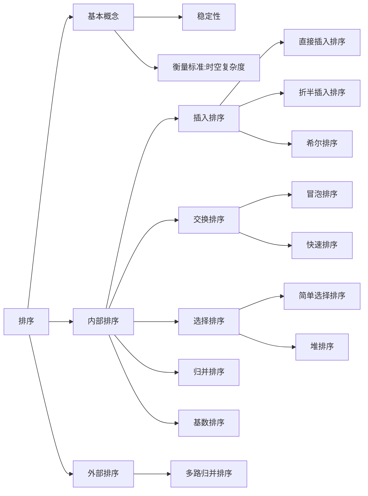

# 第 8 章 排序

## Intro

**【考纲内容】**

1. 排序的基本概念
2. 插入排序
   直接插入排序；折半插入排序；希尔排序（shell sort）
3. 交换排序
   冒泡排序（bubble sort）；快速排序
4. 选择排序
   简单选择排序；堆排序
5. 二路归并排序（merge sort）
6. 基数排序
7. 外部排序
8. 排序算法的分析和应用

**【知识框架】**




**【复习提示】**

堆排序、快速排序和归并排序是本章的重难点。读者应深入掌握
各种排序算法的思想、排序过程（能动手模拟）和特征（初态的影响、复杂度、稳定性、适用性等），通常以选择题的形式考查不同算法之间的对比。
此外，对于一些常用排序算法的关键代码，要达到熟练编写的程度；看到某特定序列，读者应具有选择最优排序算法（根据排序算法特征）的能力。


## 一、排序的基本概念

### 0x00 排序的定义

**排序**，就是重新排列表中的元素，使表中的元素满足按关键字有序的过程。为了查找方便，通常希望计算机中的表是按关键字有序的。排序的确切定义如下：

- **输入**：n 个记录 $R_1,R_2,\dots,R_n$，对应的关键字为 $k_1,k_2,\dots,k_n$
- **输出**：输入序列的一个重排 $R_1',R_2',\dots,R_n'$，使得 $k_1'\le k_2'\le\dots\le k_n'$（其中 “$\le$” 可以换成其他的比较大小的符号）

**算法的稳定性**。若待排序表中有两个元素 $R_i$ 和 $R_j$，其对应的关键字相同即 $k_i=k_j$，且在排序前 $R_i$ 在 $R_j$ 的前面，若使用某一排序算法排序后，$R_i$ 仍然在 $R_j$ 的前面，则称这个排序算法是稳定的，否则称排序算法是不稳定的。需要注意的是，算法是否具有稳定性并不能衡量一个算法的优劣，它主要是对算法的性质进行描述。如果待排序表中的关键字不允许重复，则排序结果是唯一的，那么选择排序算法时的稳定与否就无关紧要。

> 注意：对于不稳定的排序算法，只需举出一组关键字的实例，说明它的不稳定性即可

在排序过程中，根据数据元素是否完全在内存中，可将排序算法分为两类：

1. **内部排序**，是指在排序期间元素全部存放在内存中的排序
2. **外部排序**，是指在排序期间元素无法全部同时存放在内存中，必须在排序的过程中根据要求不断地在内、外存之间移动的排序。

一般情况下，内部排序算法在执行过程中都要进行两种操作：比较和移动。通过比较两个关键字的大小，确定对应元素的前后关系，然后通过移动元素以达到有序。当然，并非所有的内部排序算法都要基于比较操作，事实上，基数排序就不基于比较。

每种排序算法都有各自的优缺点，适合在不同的环境下使用，就其全面性能而言，很难提出一种被认为是最好的算法。
通常可以将排序算法分为**插入排序**、**交换排序**、**选择排序**、**归并排序**和**基数排序**五大类，之后会分别进行详细介绍。
内部排序算法的性能取决于算法的**时间复杂度**和**空间复杂度**，而时间复杂度一般是由比较和移动的次数决定的。

> 注意：大多数的内部排序算法只适用于顺序存储的线性表。


## 二、插入排序

插入排序是一种简单直观的排序方法，其基本思想是每次将一个待排序的记录按其关键字大小插入前面已排好序的子序列，直到全部记录插入完成。由插入排序的思想可以引申出三个重要的排序算法：直接插入排序、折半插入排序和希尔排序。

### 0x00 直接插入排序

根据上面的插入排序思想，不难得出一种最简单也最直观的直接插入排序算法。假设在排序过程中，待排序表 `L[1...n]` 在某次排序过程中的某一时刻状态如下：


要将元素 `L(i)` 插入已有序的子序列 `L[1...i - 1]`，需要执行以下操作（为避免混淆，下面用 `L[]` 表示-个表，而用 `L()` 表示一个元素）：

1. 查找出 `L(i)` 在 `L[1...i - 1]` 中的插入位置 `k`
2. 将 `L[k...i - 1]` 中的所有元素依次后移一个位置
3. 将 `L(i)` 复制到 `L(k)`。

为了实现对 `L[1...n]` 的排序，可以将 `L(2) ~ L(n)` 依次插入前面已排好序的子序列，初始 `L[1]` 可以视为是一个已排好序的子序列。上述操作执行 n - 1 次就能得到一个有序的表。插入排序在实现上通常采用就地排序（空间复杂度为 $O(1)$），因而在从后向前的比较过程中，需要反复把已排序元素逐步向后挪位，为新元素提供插入空间。

下面是直接插入排序的代码，其中再次用到了我们前面提到的“哨兵”（作用相同）:

```c++
void InsertSort(ElemType A[], int len) { // A[0] 是"哨兵", A[1] ~ A[len] 才是数组的真正内容
    int i, j;
    for(i = 2; i <= len; i++) {    // 依次将 A[2] ~ A[n] 插入前面已排序序列
        if(A[i] < A[i - 1]) {      // 若 A[i] 关键码小于其前驱，将 A[i] 插入有序表
            A[0] = A[i];           // 复制为哨兵，A[0] 不存放元素
            for(j = i - 1; A[0] < A[j]; j--) // 从后往前查找待插入位置
                A[j + 1] = A[j];   // 向后挪位
            A[j + 1] = A[0];       // 复制到插入位置
        }
    }
}
```

假定初始序列为 $49,38,65,97,76,13,27,\overline{49}$，初始时 49 可以视为一个已排好序的子序列，按照上述算法进行直接插入排序的过程如图 8.1 所示，括号内是已排好序的子序列。


直接插入排序算法的性能分析如下：

- 空间效率：仅使用了常数个辅助单元，因而空间复杂度为 $O(1)$

- 时间效率：在排序过程中，向有序子表中逐个地插入元素的操作进行了 n-1 趟，每趟操作都分为比较关键字和移动元素，而比较次数和移动次数取决于待排序表的初始状态。

  - 在最好情况下，表中元素已经有序，此时每插入一个元素，都只需比较一次而不用移动元素，因而时间复杂度为 $O(n)$
  - 在最坏情况下，表中元素顺序刚好与排序结果中的元素顺序相反(逆序)，总的比较次数达到最大，总的移动次数也达到最大，总的时间复杂度为 $O(n^2)$
  - 平均情况下，考虑待排序表中元素是随机的，此时可以取上述最好与最坏情况的平均值作为平均情况下的时间复杂度，总的比较次数与总的移动次数均约为 $n^2/4$。

  因此，直接插入排序算法的时间复杂度为 $O(n^2)$。

- 稳定性：由于每次插入元素时总是从后向前先比较再移动，所以不会出现相同元素相对位置发生变化的情况，即直接插入排序是一个稳定的排序方法

- 适用性：直接插入排序算法适用于顺序存储和链式存储的线性表。为链式存储时，可以从前往后查找指定元素的位置。


### 0x01 折半插入排序

从直接插入排序算法中，不难看出每趟插入的过程中都进行了两项工作：

1. 从前面的有序子表中查找出待插入元素应该被插入的位置
2. 给插入位置腾出空间，将待插入元素复制到表中的插入位置。

注意到在该算法中，总是边比较边移动元素。下面将比较和移动操作分离，即先折半查找出元素的待插入位置，然后统一地移动待插入位置之后的所有元素。当排序表为顺序表时，可以对直接插入排序算法做如下改进：由于是顺序存储的线性表，所以查找有序子表时可以用折半查找来实现。确定待插入位置后，就可统一地向后移动元素。算法代码如下：

```c++
void InsertSort(ElemType A[], int len) {
    int i, j, low, high, mid;
    for(i = 2; i <= n; i++) {          // 依次将 A[2]~A[n］插入前面的已排序序列
        A[0] = A[i];                   // 将 A[i] 暂存到 A[0]
        low = 1; high = i - 1;         // 设置折半查找的范围
        while(low <= high) {           // 折半查找(默认递增有序)
            mid = (low + high) / 2;    // 取中间点
            if(A[mid] > A[0])
                high = mid - 1;        // 查找左半子表
            else
                low = mid + 1;         // 查找右半子表
        }
        for(j = i - 1; j >= high + 1; j--)
            A[j + 1] = A[j];           // 统一后移元素，空出插入位置
        A[high + 1] = A[0];            // 插入操作
    }
}
```

从上述算法中，不难看出折半插入排序仅减少了比较元素的次数，约为 $O(n\log n)$，该比较次数与待排序表的初始状态无关，仅取决于表中的元素个数 n；而元素的移动次数并未改变，它依赖于待排序表的初始状态。因此，折半插入排序的时间复杂度仍为 $O(n^2)$，但对于数据量不很大的排序表，折半插入排序往往能表现出很好的性能。折半插入排序是一种稳定的排序方法。


### 0x02 希尔排序

从前面的分析可知，直接插入排序算法的时间复杂度为 $O(n^2)$，但若待排序列为“正序”时，其时间效率可提高至 $O(n)$，由此可见它更适用于基本有序的排序表和数据量不大的排序表。希尔排序正是基于这两点分析对直接插入排序进行改进而得来的，又称**缩小增量排序**。

希尔排序的基本思想是：先将待排序表分割成若干形如 $L[i,i+d,i+2d,\cdots,i+kd]$  的特殊子表，即把相隔某个“增量”的记录组成一个子表，对各个子表分别进行直接插入排序，当整个表中的元素已呈“基本有序”时，再对全体记录进行一次直接插入排序。

希尔排序的过程如下：先取一个小于 n 的步长 $d_1$，把表中的全部记录分成 $d_1$ 组，所有距离为 $d_1$ 的倍数的记录放在同一组，在各组内进行直接插入排序；然后取第二个步长 $d_2<d_1$，重复上述过程，直到所取到的 $d=1$，即所有记录已放在同一组中，再进行直接插入排序，由于此时已经

具有较好的局部有序性，故可以很快得到最终结果。到目前为止，尚未求得一个最好的增量序列。仍以 8.2.1 节的关键字为例，假定第一趟取增量 $d_1=5$，将该序列分成 5 个子序列，即图中第 2 行至第 6 行，分别对各子序列进行直接插入排序，结果如第 7 行所示；假定第二趟取增量 $d_2=3$，分别对 3 个子序列进行直接插入排序，结果如第 11 行所示；最后对整个序列进行一趟直接插入排序，整个排序过程如图 8.2 所示。


希尔排序算法的代码如下：

```c++
void ShellSort(ElemType A[], int len) {
    // A[0] 只是暂存单元，不是哨兵，当 j <=0 时，插入位置已到
    int dk, i, j;
    for(dk = n / 2; dk >= 1; dk = dk / 2) { // 增量变化（无统一规定）
        for(i = dk + 1; i <= n; i++) {
            if(A[i] < A[i - dk]) {          // 需将 A[i] 插入有序增量子表
                A[0] = A[i];                // 暂存在 A[0]
                for(j = i - dk; j > 0 && A[0] < A[j]; j -= dk)
                    A[j + dk] = A[j];       // 记录后移，查找插入的位置
                A[j + dk] = A[0];           // 插入
            }
        }
    }
}
```

希尔排序算法的性能分析如下：

- 空间效率：仅使用了常数个辅助单元，因而空间复杂度为 $O(1)$
- 时间效率：由于希尔排序的时间复杂度依赖于增量序列的函数，这涉及数学上尚未解决的难题，所以其时间复杂度分析比较困难。
  当 n 在某个特定范围时，希尔排序的时间复杂度约为 $O(n^{1.3})$
  在最坏情况下希尔排序的时间复杂度为 $O(n^2)$
- 稳定性：当相同关键字的记录被划分到不同的子表时，可能会改变它们之间的相对次序，因此希尔排序是一种不稳定的排序方法。例如，图 8.2 中 $49$ 与 $\overline{49}$ 的相对次序已发生了变化。
- 适用性：希尔排序算法仅适用于线性表为顺序存储的情况。


## 三、交换排序

所谓交换，是指根据序列中两个元素关键字的比较结果来对换这两个记录在序列中的位置。基于交换的排序算法很多，本书主要介绍冒泡排序和快速排序，其中冒泡排序算法比较简单，一般不会单独考查，通常会重点考查快速排序算法的相关内容。

### 0x00 冒泡排序

冒泡排序的基本思想是：从后往前（或从前往后）两两比较相邻元素的值，若为逆序（即 `A[i - 1] > A[i]`），则交换它们，直到序列比较完。我们称它为第一趟冒泡，结果是将最小的元素交换到待排序列的第一个位置（或将最大的元素交换到待排序列的最后一个位置），关键字最小的元素如气泡一般逐渐往上"漂浮”直至“水面”（或关键字最大的元素如石头一般下沉至水底）。下一趟冒泡时，前一趟确定的最小元素不再参与比较，每趟冒泡的结果是把序列中的最小元素（或最大元素）放到了序列的最终位置……这样最多做 n - 1 趟冒泡就能把所有元素排好序。

图 8.3 所示为冒泡排序的过程，
第一趟冒泡时：
$27<\overline{49}$，不交换
$13<27$，不交换
$76>13$，交换
$97>13$，交换
$65>13$，交换
$38>13$，交换
$49>13$，交换
通过第一趟冒泡后，最小元素已交换到第一个位置，也是它的最终位置。第二趟冒泡时对剩余子序列采用同样方法进行排序，以此类推，到第五趟结束后没有发生交换，说明表已有序，冒泡排序结束。


冒泡排序算法的代码如下：

```c++
void BubbleSort(ElemType A[], int len) {
    int tmp;
    for(int i = 0; i < len - 1; i++) {
        bool flag = false;                // 表示本趟冒泡是否发生交换的标志
        for(int j = n - 1; j > i; j--) {  // 一趟冒泡过程
            if(A[j - 1] > A[j]) {         // 若为逆序
                tmp = A[j - 1];           // 交换
                A[j - 1] = A[j];
                A[j] = tmp;
                flag = true;
            }
        }
        if(flag == false)
            return;                       // 本趟遍历后没有发生交换，说明表已经有序
    }
}
```

冒泡排序的性能分析如下：

- 空间效率：仅使用了常数个辅助单元，因而空间复杂度为 $O(1)$

- 时间效率：
  当初始序列有序时，显然第一趟冒泡后 flag 依然为 false（本趟没有元素交换），从而直接跳出循环，比较次数为 n - 1，移动次数为 0，从而最好情况下的时间复杂度为 $O(n)$
  当初始序列为逆序时，需要进行 n - 1 趟排序，第 i 趟排序要进行 n - i 次关键字的比较，而且每次比较后都必须移动元素 3 次来交换元素位置。这种情况下，
  $$
  比较次数=\sum_{i=1}^n(n-i)=\frac{n(n-1)}2,移动次数=\sum_{i=1}^{n-1}3(n-1)=\frac{3n(n-1)}2
  $$
  从而，最坏情况下的时间复杂度为 $O(n^2)$，平均时间复杂度为 $O(n^2)$

- 稳定性：由于 i > j 且 `A[i] == A[j]`时，不会发生交换，因此冒泡排序是一种稳定的排序方法。

> 注意：冒泡排序中所产生的有序子序列一定是全局有序的（不同于直接插入排序），也就是说，有序子序列中的所有元素的关键字一定小于（或大于）无序子序列中所有元素的关键字，这样每趟排序都会将一个元素放置到其最终的位置上。


### 0x01 快速排序

快速排序的基本思想是基于分治法的：在待排序表 `L[1...n]` 中任取一个元素 `pivot` 作为枢轴（或称基准，通常取首元素），通过一趟排序将待排序表划分为独立的两部分 `L[1...k - 1]`和 `L[k + 1...n]`，使得 `L[1..k - 1]` 中的所有元素小于 `pivot`，`L[k + 1...n]` 中的所有元素大于或等于 `pivot`，则 `pivot` \放在了其最终位置 `L(k)` 上，这个过程称为**一次划分**。然后分别递归地对两个子表重复上述过程，直至每部分内只有一个元素或空为止，即所有元素放在了其最终位置上。

一趟快速排序的过程是一个交替搜索和交换的过程，下面通过实例来介绍，附设两个指针 i 和 j，初值分别为 low 和 high，取第一个元素 49 为枢轴赋值到变量 **pivot**。

指针 `j` 从 `high` 往前搜索找到第一个小于枢轴的元素 27，将 27 交换到 `i` 所指位置

 

指针 `i` 从 `low` 往后搜索找到第一个大于枢轴的元素 65，将 65 交换到 `j` 所指位置

 

指针 `j` 继续往前搜索找到小于枢轴的元素 13，将 13 交换到 `i` 所指位置

 

指针 `i` 继续往后搜索找到大于枢轴的元素 97，将 97 交换到 `j` 所指位置

 

指针 `j` 继续往前搜索小于枢轴的元素，直至 `i == j`

 

此时，指针 `i(==j)`之前的元素均小于 49，指针 i 之后的元素均大于或等于 49，将 49 放在 i 所指位置即其最终位置，经过一趟划分，将原序列分割成了前后两个子序列

 

按照同样的方法对各子序列进行快速排序，若待排序列中只有一个元素，显然已有序

 

对算法的最好理解方式是手动地模拟一遍这些算法。

假设划分算法已知，记为 `Partition()`，返回的是上述的 `k`，注意到 `L(k)` 已放在其最终位置，因此可以先对表进行划分，而后对两个表调用同样的排序操作。因此可以递归地调用快速排序算法进行排序，具体的程序结构如下：

```c++
void QuickSort(ElemType A[], int low, int high) {
    if(low < high) { // 递归跳出的条件
        // Partition() 就是划分操作，将表 A[low...high] 划分为满足上述条件的两个子表
        int pivotpos = Partition(A, low, high); // 划分
        QuickSort(A, low, pivotpos - 1); // 依次对两个子表进行递归排序
        QuckSort(A, pivotpos + 1, high);
    }
}
```

从上面的代码不难看出快速排序算法的关键在于划分操作，同时快速排序算法的性能也主要取决于划分操作的好坏。从快速排序算法提出至今，已有许多不同的划分操作版本，但考研所考查的快速排序的划分操作基本以严蔚敏的教材《数据结构》为主。假设每次总以当前表中第一个元素作为枢轴来对表进行划分，则将表中比枢轴大的元素向右移动，将比枢轴小的元素向左移动，使得一趟 `Partition()` 操作后，表中的元素被枢轴一分为二。代码如下：

```c++
int Partition(ElemType A[], int low, int high) { // 一趟划分
    ELemType pivot = A[low];   // 将当前表中第一个元素设为枢轴，对表进行划分
    while(low < high) {        // 循环跳出条件
        while(low < high && A[high] >= pivot) high--;
        A[low] = A[high];      // 将比枢轴小的元素移动到左端
        while(low < high && A[low] <= pivot) low++;
        A[high] = A[low];      // 将比枢轴大的元素移动到右端
    }
    A[low] = pivot;            // 枢轴元素存放到最终位置
    return low;                // 返回存放枢轴的最终位置
}
```

快速排序算法的性能分析如下：

- **空间效率**：由于快速排序是递归的，需要借助一个递归工作栈来保存每层递归调用的必要信息，**其容量与递归调用的最大深度一致**
  最好情况下为 $O(\log_2n)$
  最坏情况下，因为要进行 n-1 次递归调用，所以栈的深度为 $O(n)$
  平均情况下，栈的深度为 $O(\log_2n)$。
- **时间效率**：快速排序的运行时间与划分是否对称有关，快速排序的最坏情况发生在两个区域分别包含 n - 1 个元素和 0 个元素时，这种最大限度的不对称性若发生在每层递归上，即对应于初始排序表基本有序或基本逆序时，就得到最坏情况下的时间复杂度为 $O(n^2)$
  - 有很多方法可以提高算法的效率：一种方法是尽量选取一个可以将数据中分的枢轴元素，如从序列的头尾及中间选取三个元素，再取这三个元素的中间值作为最终的枢轴元素；或者随机地从当前表中选取枢轴元素，这样做可使得最坏情况在实际排序中几乎不会发生。
  - 在最理想的状态下，即 `Partition()` 可能做到最平衡的划分，得到的两个子问题的大小都不可能大于 n/2，在这种情况下，快速排序的运行速度将大大提升，此时，时间复杂度为 $O(n\log_2n)$。好在快速排序平均情况下的运行时间与其最佳情况下的运行时间很接近，而不是接近其最坏情况下的运行时间。快速排序是所有内部排序算法中平均性能最优的排序算法
- **稳定性**：在划分算法中，若右端区间有两个关键字相同，且均小于基准值的记录，则在交换到左端区间后，它们的相对位置会发生变化，即快速排序是一种不稳定的排序方法。例如，表 L={3, **2**, 2}，经过一趟排序后 L={2, **2**, 3}，最终排序序列也是 L={2, **2**, 3}，显然，2 与 **2** 的相对次序已发生了变化。

> 注意：在快速排序算法中，并不产生有序子序列，但每趟排序后会将上一趟划分的各个无序子表的枢轴（基准）元素放到其最终的位置上。


## 四、选择排序

选择排序的基本思想是：每一趟（如第 $i$ 趟）在后面 $n-i+1(i=1,2,\dots ,n-1)$个待排序元素中选取关键字最小的元素，作为有序子序列的第 $i$ 个元素，直到第 $n-1$ 趟做完，待排序元素只剩下 1 个，就不用再选了。选择排序中的堆排序算法是历年考查的重点。

### 0x00 简单选择排序

根据上面选择排序的思想，可以很直观地得出简单选择排序算法的思想：假设排序表为 `L[l...n]`，第 $i$ 趟排序即从 `L[i...n]` 中选择关键字最小的元素与 `L(i)` 交换，每一趟排序可以确定一个元素的最终位置，这样经过 $n-1$ 趟排序就可使得整个排序表有序。
简单选择排序算法的代码如下：

```c++
void SelectSort(ElemType A[], int n) {
    for(int i = 0; i < n - 1; i++) {       // 一共进行 n - 1 趟
        int min = i;                       // 记录最小元素位置
        for(int j = i + 1; j < n; j++) {   // 在 A[i...n - 1]中选择最小的元素
            if(A[j] < A[min])
                min = j;                   // 更新最小元素位置
            if(min != i)
                swap(A[i], A[min]);        // 封装的 swap() 函数共移动元素 3 次
        }
    }
}
```

简单选择排序算法的性能分析如下：

- 空间效率：仅使用常数个辅助单元，故空间效率为 $O(1)$
- 时间效率：从上述伪码中不难看出，在简单选择排序过程中，元素移动的操作次数很少，不会超过 $3(n-1)$ 次，最好的情况是移动 0 次，此时对应的表已经有序；但元素间比较的次数与序列的初始状态无关，始终是 $n(n-1)/2$ 次，因此时间复杂度始终是 $O(n^2)$
- 稳定性：在第 $i$ 趟找到最小元素后，和第 $i$ 个元素交换，可能会导致第 $i$ 个元素与其含有相同关键字元素的相对位置发生改变。
  例如，表 L = {2, **2**, 1}，经过一趟排序后 L = {1, **2**, 2}，最终排序序列也是 L = {1, **2**, 2}，显然，2 与 **2** 的相对次序已发生变化。因此，简单选择排序是一种不稳定的排序方法


### 0x01 堆排序

堆的定义如下，n 个关键字序列 `L[1...n]` 称为堆，当且仅当该序列满足：

1. **大根堆**：`L(i) >= L(2i) && L(i) >= L(2i + 1)` 
2. **小根堆**：`L(i) <= L(2i) && L(i) <= L(2i + 1)`      $1\le i\le\lfloor n/2\rfloor$

可以将堆视为一棵**完全二叉树**
满足条件 1 的堆称为大根堆（大顶堆），大根堆的最大元素存放在根结点，且其任意一个非根结点的值小于或等于其双亲结点值
满足条件 2 的堆称为小根堆（小顶堆），小根堆的定义刚好相反，根结点是最小元素
下图所示为一个大根堆。


堆排序的思路很简单：首先将存放在 `L[1...n]` 中的 n 个元素建成初始堆，由于堆本身的特点（以大顶堆为例），堆顶元素就是最大值。输出堆顶元素后，通常将堆底元素送入堆顶，此时根结点已不满足大顶堆的性质，堆被破坏，将堆顶元素向下调整使其继续保持大顶堆的性质，再输出堆顶元素。如此重复，直到堆中仅剩一个元素为止。可见堆排序需要解决两个问题：

1. 如何将无序序列构造成初始堆？
2. 输出堆顶元素后，如何将剩余元素调整成新的堆？

堆排序的关键是构造初始堆。n 个结点的完全二叉树，最后一个结点是第 $\lfloor n/2\rfloor$ 个结点的孩子。对第  $\lfloor n/2\rfloor$ 个结点为根的子树筛选（对于大根堆，若根结点的关键字小于左右孩子中关键字较大者，则交换），使该子树成为堆。之后向前依次对各结点 ( $\lfloor n/2\rfloor-1\sim 1$) 为根的子树进行筛选，看该结点值是否大于其左右子结点的值，若不大于，则将左右子结点中的较大值与之交换，交换后可能会破坏下一级的堆，于是继续采用上述方法构造下一级的堆，直到以该结点为根的子树构成堆为止。反复利用上述调整堆的方法建堆，直到根结点。

如图 8.5 所示，
初始时调整 `L(4)` 子树，09 < 32，交换，交换后满足堆的定义
向前继续调整 `L(3)` 子树，78 < 左右孩子的较大者 87，交换，交换后满足堆的定义
向前调整 `L(2)` 子树，17 < 左右孩子的较大者 45，交换后满足堆的定义
向前调整至根结点 `L(1)`，53 < 左右孩子的较大者 87，交换，交换后破坏了 `L(3)` 子树的堆，采用上述方法对 `L(3)` 进行调整，53 < 左右孩子的较大者 78，交换，至此该完全二叉树满足堆的定义。


输出堆顶元素后，将堆的最后一个元素与堆顶元素交换，此时堆的性质被破坏，需要向下进行筛选。
将 09 和左右孩子的较大者 78 交换，交换后破坏了 `L(3)` 子树的堆，继续对 `L(3)` 子树向下筛选，将 09 和左右孩子的较大者 65 交换，交换后得到了新堆，调整过程如图 8.6 所示。


下面是建立大根堆的算法：

```c++
void BuildMaxHeap(ElemType A[], int len) {
    for(int i = len / 2; i > 0; i--)   // 从 i=[n/2]~1，反复调整堆
        HeadAdjust(A, i, len);
}
void HeadAdjust(ElemType A[], int k, int len) {
    // 函数 HeadAdjust 将元素 k 为根的子树进行调整
    A[0] = A[k];                           // A[0] 暂存子树的根结点
    for(int i = 2 * k; i <= len; i *= 2){  // 沿 key 较大的子结点向下筛选
        if(i < len && A[i] < A[i + 1])
            i++;                           // 取 key 较大的子结点的下标
        if(A[0] >= A[i]) break;            // 筛选结束
        else {
            A[k] = A[i];                   // 将 A[i] 调整到双亲结点上
            k = i;                         // 修改 k 值，以便继续向下筛选
        }
    }
    A[k] = A[0];                           // 被筛选结点的值放入最终位置
}
```

调整的时间与树高有关，为 $O(h)$。在建含 n 个元素的堆时，关键字的比较总次数不超过 $4n$，时间复杂度为 $O(n)$，这说明可以在线性时间内将一个无序数组建成一个堆。下面是堆排序算法：

```c++
void HeapSort(ElemType A[], int len) {
    BuildMaxHeap(A, len);          // 初始建堆
    for(int i = len; i > 1; i--) { // n-1 趟的交换和建堆过程
        Swap(A[i], A[1]);          // 输出堆顶元素（和堆底元素交换）
        HeadAdjust(A, 1, i - 1);   // 调整，把剩余的 i - 1 个元素整理成堆
    }
}
```

同时，堆也支持插入操作。对堆进行插入操作时，先将新结点放在堆的末端，再对这个新结点向上执行调整操作。大根堆的插入操作示例如图 8.7 所示。


> 堆排序适合关键字较多的情况。例如，在 1 亿个数中选出前 100 个最大值？首先使用一个大小为 100 的数组，读入前 100 个数，建立小顶堆，而后依次读入余下的数，若小于堆顶则舍弃，否则用该数取代堆顶并重新调整堆，待数据读取完毕，堆中 100 个数即为所求。

堆排序算法的性能分析如下：

- **空间效率**：仅使用了常数个辅助单元，所以空间复杂度为 $O(1)$
- **时间效率**：建堆时间为 $O(n)$，之后有 $n-1$ 次向下调整操作，每次调整的时间复杂度为 $O(h)$，故在最好、最坏和平均情况下，堆排序的时间复杂度为 $O(n\log_2n)$。
- **稳定性**：进行筛选时，有可能把后面相同关键字的元素调整到前面，所以堆排序算法是一种不稳定的排序方法。
  例如，表 L = {1, **2**, 2}，构造初始堆时可能将 **2** 交换到堆顶，此时 L = {**2**, 1, 2}，最终排序序列为 L = {1, 2, **2**}，显然，2 与 **2** 的相对次序已发生变化。


## 五、归并排序和基数排序

### 0x00 归并排序

归并排序与上述基于交换、选择等排序的思想不一样，“归并” 的含义是将两个或两个以上的有序表合并成一个新的有序表。假定待排序表含有 n 个记录，则可将其视为 n 个有序的子表，每个子表的长度为 1，然后两两归并，得到 $\lceil n/2\rceil$ 个长度为 2 或 1 的有序表；继续两两归……·如此重复，直到合并成一个长度为 n 的有序表为止，这种排序方法称为 2 路归并排序。

图 8.8 所示为 2 路归并排序的一个例子，经过三趟归并后合并成了有序序列。


`Merge()` 的功能是将前后相邻的两个有序表归并为一个有序表。设两段有序表 `A[low...mid]`、`A[mid + 1...high]` 存放在同一顺序表中的相邻位置，先将它们复制到辅助数组 B 中。每次从对应B中的两个段取出一个记录进行关键字的比较，将较小者放入 A 中，当数组 B 中有一段的下标超出其对应的表长（即该段的所有元素都已复制到 A 中）时，将另一段中的剩余部分直接复制到 A 中。算法如下：

```c++
ElemType *B = (ElemType *)malloc((n + 1) * sizeof(ELemType)); // 辅助数组 B

void Merge(ElemType A[], int low, int mid, int high) {
    //表 A 的两段 A[low...mid] 和 A[mid + 1...high] 各自有序，将它们合并成一个有序表
    int i, j, k;
    for(k = low; k < high; k++)
        B[k] = A[k];             // 将 A 中所有元素复制到 B 中
    for(i = low, j = mid + 1, k = i; i <= mid && j <= high; k++) {
        if(B[i] <= B[j])         // 比较 B 的左右两段中的元素
            A[k] = B[i++];       // 将较小值复制到 A 中
        else
            A[k] = B[j++];
    }
    while(i <= mid)  A[k++] = B[i++]; // 若第一个表未检测完，复制
    while(j <= high) A[k++] = B[j++]; // 第二个表未检测完，复制
}
```

> 注意：上面的代码中，最后两个 while 循环只有一个会执行。

一趟归并排序的操作是，调用 $\lceil n/2h\rceil$ 次算法 `merge()`，将 `L[1...n]` 中前后相邻且长度为 h 的有序段进行两两归并，得到前后相邻、长度为 2h 的有序段，整个归并排序需要进行 $\lceil\log_2n\rceil$ 趟

递归形式的 2 路归并排序算法是基于分治的，其过程如下。

- **分解**：将含有 n 个元素的待排序表分成各含 n/2 个元素的子表，采用 2 路归并排序算法对两个子表递归地进行排序
- **合并**：合并两个已排序的子表得到排序结果。

```c++
void MergeSort(ElemType A[], int low, int high) {
    if(low < high) {
        int mid = (low + high) / 2;   // 从中间划分两个子序列
        MergeSort(A, low, mid);       // 对左侧子序列进行递归排序
        MergeSort(A, mid + 1, high);  // 对右侧子序列进行递归排序
        Merge(A, low, mid, high);     // 归并
    }
}
```

2 路归并排序算法的性能分析如下：

- **空间效率**：`Merge()` 操作中，辅助空间刚好为 n 个单元，所以算法的空间复杂度为 $O(n)$
- **时间效率**：每趟归并的时间复杂度为 $O(n)$，共需进行 $\lceil\log_2n\rceil$ 趟归并，所以算法的时间复杂度为 $O(n\log_2n)$
- **稳定性**：由于 `Merge()` 操作不会改变相同关键字记录的相对次序，所以 2 路归并排序算法是一种稳定的排序方法。

> 注意：一般而言，对于 N 个元素进行 k 路归并排序时，排序的趟数 m 满足 $k^m=N$；从而 $m=\log_kN$，又考虑到 m 为整数，所以 $m=\lceil\log_kN\rceil$。这和前面的 2 路归并是一致的。


### 0x01 基数排序

基数排序是一种很特别的排序方法，它不基于比较和移动进行排序，而基于关键字各位的大小进行排序。基数排序是一种借助多关键字排序的思想对单逻辑关键字进行排序的方法。

假设长度为 n 的线性表中每个结点 a 的关键字由 d 元组 $(k_j^{d-1},k_j^{d-1},\cdots,k_j^1,k_j^0)$ 组成，满足 $0\le k_j^i\le r-1(0\le j<n,0\le i\le d-1)$。其中 $k_j^{d-1}$ 为最主位关键字，$k_j^0$为最次位关键字。

为实现多关键字排序，通常有两种方法：第一种是**最高位优先（MSD）**法，按关键字位权重递减依次逐层划分成若干更小的子序列，最后将所有子序列依次连接成一个有序序列。第二种是**最低位优先（LSD）**法，按关键字位权重递增依次进行排序，最后形成一个有序序列。

下面描述以 $r$ 为基数的最低位优先基数排序的过程，在排序过程中，使用 $r$ 个队列 $Q_0,Q_1,\cdots, Q_{r-1}$。基数排序的过程如下：

对 $i=0,1,\dots, d-1$，依次做一次“分配”和“收集”（其实是一次稳定的排序过程）

分配：开始时，把 $Q_0,Q_1,\cdots,Q_{r-1}$ 各个队列置成空队列，然后依次考察线性表中的每个结点 $a_j(j=0,1,\cdots, n-1)$，若 $a_j$ 的关键字 $k_j^i=k$，就把 $a_j$ 放进 $Q_k$ 队列中。

收集：把 $Q_0,Q_1,\cdots,Q_{r-1}$ 各个队列中的结点依次首尾相接，得到新的结点序列，从而组成新的线性表。

通常采用链式基数排序，假设对如下 10 个记录进行排序：


每个关键字是 1000 以下的正整数，基数 $r=10$，在排序过程中需要借助 10 个链队列，每个关键字由 3 位子关键字构成 $K^1K^2K^3$，分别代表百位、十位和个位，一共需要进行三趟“分配”和“收集”操作。第一趟分配用最低位子关键字 $K^3$ 进行，将所有最低位子关键字（个位）相等的记录分配到同一个队列，如图 8.9（a)所示，然后进行收集操作，第一趟收集后的结果如图 8.9(b) 所示


第二趟分配用次低位子关键字 $K^2$ 进行，将所有次低位子关键字（十位）相等的记录分配到同一个队列，如图 8.10(a)所示，第二趟收集后的结果如图 8.10(b)所示。


第三趟分配用最高位子关键字 $K^1$ 进行，将所有最高位子关键字（百位）相等的记录分配到同一个队列，如图 8.11(a) 所示，第三趟收集后的结果如图 8.11(b) 所示，至此整个排序结束。


基数排序算法的性能分析如下：

- **空间效率**：一趟排序需要的辅助存储空间为 r（r 个队列：r 个队头指针和 r 个队尾指针），但以后的排序中会重复使用这些队列，所以基数排序的空间复杂度为 $O(r)$
- **时间效率**：基数排序需要进行 d 趟分配和收集，一趟分配需要 $O(n)$，一趟收集需要 $O(r)$，所以基数排序的时间复杂度为 $O(d(n+r))$，它与序列的初始状态无关
- **稳定性**：对于基数排序算法而言，很重要一点就是按位排序时必须是稳定的。因此，这也保证了基数排序的稳定性。


## 六、各种内部排序算法的比较及应用

### 0x00 内部排序算法的比较

前面讨论的排序算法很多，对各种排序算法的比较是考研常考的内容。一般基于三个因素进行对比：时空复杂度、算法的稳定性、算法的过程特征。

**从时间复杂度看**：简单选择排序、直接插入排序和冒泡排序平均情况下的时间复杂度都为 $O(n^2)$，且实现过程也较为简单，但直接插入排序和冒泡排序最好情况下的时间复杂度可以达到 $O(n)$，而简单选择排序则与序列的初始状态无关
希尔排序作为插入排序的拓展，对较大规模的数据都可以达到很高的效率，但目前未得出其精确的渐近时间
堆排序利用了一种称为堆的数据结构，可以在线性时间内完成建堆，且在 $O(n\log_2n)$ 内完成排序过程
快速排序基于分治的思想，虽然最坏情况下的时间复杂度会达到 $O(n^2)$，但快速排序的平均性能可以达到 $O(n\log_2n)$，在实际应用中常常优于其他排序算法
归并排序同样基于分治的思想，但由于其分割子序列与初始序列的排列无关，因此它的最好、最坏和平均时间复杂度均为 $O(n\log_2n)$

**从空间复杂度看**：简单选择排序、插入排序、冒泡排序、希尔排序和堆排序都仅需借助常数个辅助空间。
快速排序需要借助一个递归工作栈，平均大小为 $O(\log_2n)$，当然在最坏情况下可能会增长到 $O(n)$。
2 路归并排序在合并操作中需要借助较多的辅助空间用于元素复制，大小为 $O(n)$，虽然有方法能克服这个缺点，但其代价是算法会很复杂而且时间复杂度会增加。

**从稳定性看**：插入排序、冒泡排序、归并排序和基数排序是稳定的排序方法，
而简单选择排序、快速排序、希尔排序和堆排序都是不稳定的排序方法。
平均时间复杂度为 $O(n\log_2n)$ 的稳定排序算法只有归并排序
对于不稳定的排序方法，只需举出一个不稳定的实例即可。对于排序方法的稳定性，读者应能从算法本身的原理上去理解，而不应拘泥于死记硬背。

**从过程特征看**：采用不同的排序算法，在一次循环或几次循环后的排序结果可能是不同的，考研题中经常出现给出一个待排序的初始序列和已经部分排序的序列，问其采用何种排序算法。这就要对各类排序算法的过程特征十分熟悉，如冒泡排序和堆排序在每趟处理后都能产生当前的最大值或最小值，而快速排序一趟处理至少能确定一个元素的最终位置等。

下表列出了各种排序算法的时空复杂度和稳定性情况，其中空间复杂度仅列举了平均情况的复杂度，由于希尔排序的时间复杂度依赖于增量函数，所以无法准确给出其时间复杂度。

|     算法     |   最好情况    |   平均情况    |   最坏情况    | 平均空间复杂度 | 是否稳定 |
| :----------: | :-----------: | :-----------: | :-----------: | :------------: | :------: |
| 直接插入排序 |    $O(n)$     |   $O(n^2)$    |   $O(n^2)$    |     $O(1)$     |    是    |
|   冒泡排序   |    $O(n)$     |   $O(n^2)$    |   $O(n^2)$    |     $O(1)$     |    是    |
| 简单选择排序 |   $O(n^2)$    |   $O(n^2)$    |   $O(n^2)$    |     $O(1)$     |    否    |
|   希尔排序   |               |               |               |     $O(1)$     |    否    |
|   快速排序   | $O(n \log n)$ | $O(n \log n)$ |   $O(n^2)$    |  $O(\log n)$   |    否    |
|    堆排序    | $O(n \log n)$ | $O(n \log n)$ | $O(n \log n)$ |     $O(1)$     |    否    |
| 2 路归并排序 | $O(n \log n)$ | $O(n \log n)$ | $O(n \log n)$ |     $O(n)$     |    是    |
|   基数排序   |  $O(d(n+r))$  |  $O(d(n+r))$  |  $O(d(n+r))$  |     $O(r)$     |    是    |

### 0x01 内部排序算法的应用

通常情况，对排序算法的比较和应用应考虑以下情况。

1. 选取排序方法需要考虑的因素
   1. 待排序的元素数目 n
   2. 元素本身信息量的大小
   3. 关键字的结构及其分布情况
   4. 稳定性的要求
   5. 语言工具的条件，存储结构及辅助空间的大小等
2. 排序算法小结
   1. 若 n 较小，可采用直接插入排序或简单选择排序。由于直接插入排序所需的记录移动次数较简单选择排序的多，因而当记录本身信息量较大时，用简单选择排序较好
   2. 若文件的初始状态已按关键字基本有序，则选用直接插入或冒泡排序为宜
   3. 若 n 较大，则应采用时间复杂度为 $O(n\log_2n)$ 的排序方法：快速排序、堆排序或归并排序。
      快速排序被认为是目前基于比较的内部排序方法中最好的方法，当待排序的关键字随机分布时，快速排序的平均时间最短。
      堆排序所需的辅助空间少于快速排序，并且不会出现快速排序可能出现的最坏情况，这两种排序都是不稳定的。
      若要求排序稳定且时间复杂度为 $O(n\log_2n)$，则可选用归并排序。
      但本章介绍的从单个记录起进行两两归并的排序算法并不值得提倡，通常可以将它和直接插入排序结合在一起使用。先利用直接插入排序求得较长的有序子文件，然后两两归并。直接插入排序是稳定的，因此改进后的归并排序仍是稳定的
   4. 在基于比较的排序方法中，每次比较两个关键字的大小之后，仅出现两种可能的转移，因此可以用一棵二叉树来描述比较判定过程，由此可以证明：当文件的 n 个关键字随机分布时，任何借助于“比较”的排序算法，至少需要 $O(n\log_2n)$ 的时间
   5. 若 n 很大，记录的关键字位数较少且可以分解时，采用基数排序较好
   6. 当记录本身信息量较大时，为避免耗费大量时间移动记录，可用链表作为存储结构。


## 七、外部排序

外部排序可能会考查相关概念、方法和排序过程，外部排序的算法比较复杂，不会在算法设计上进行考查。本节的主要内容有：

1. 外部排序指待排序文件较大，内存一次放不下，需存放在外存的文件的排序
2. 为减少平衡归并中外存读写次数所采取的方法：增大归并路数和减少归并段个数
3. 利用败者树增大归并路数
4. 利用置换-选择排序增大归并段长度来减少归并段个数
5. 由长度不等的归并段，进行多路平衡归并，需要构造最佳归并树


### 0x00 外部排序的基本概念

前面介绍过的排序方法都是在内存中进行的（称为**内部排序**）。而在许多应用中，经常需要对大文件进行排序，因为文件中的记录很多，无法将整个文件复制进内存中进行排序。因此，需要将待排序的记录存储在外存上，排序时再把数据一部分一部分地调入内存进行排序，在排序过程中需要多次进行内存和外存之间的交换。这种排序方法就称为**外部排序**。


### 0x01 外部排序的方法

文件通常是按块存储在磁盘上的，操作系统也是按块对磁盘上的信息进行读写的。因为磁盘读/写的机械动作所需的时间远远超过内存运算的时间（相比而言可以忽略不计），因此在外部排序过程中的时间代价主要考虑访问磁盘的次数，即 I/O 次数。

外部排序通常采用归并排序法。它包括两个阶段：

1. 根据内存缓冲区大小，将外存上的文件分成若干长度为 $\ell$ 的子文件，依次读入内存并利用内部排序方法对它们进行排序，并将排序后得到的有序子文件重新写回外存，称这些有序子文件为**归并段**或**顺串**
2. 对这些归并段进行逐趟归并，使归并段（有序子文件）逐渐由小到大，直至得到整个有序文件为止。

例如，一个含有 2000 个记录的文件，每个磁盘块可容纳 125 个记录，首先通过 8 次内部排序得到 8 个初始归并段 R1～R8，每个段都含 250 个记录。然后对该文件做如图 8.13 所示的两两归并，直至得到一个有序文件。可以把内存工作区等分为 3 个缓冲区，如图 8.12 所示，其中的两个为输入缓冲区，一个为输出缓冲区。首先，从两个输入归并段 R1 和 R2 中分别读入一个块，放在输入缓冲区 1 和输入缓冲区 2 中。然后，在内存中进行 2 路归并，归并后的对象顺序存放在输出缓冲区中。若输出缓冲区中对象存满，则将其顺序写到输出归并段（R1'）中，再清空输出缓冲区，继续存放归并后的对象。若某个输入缓冲区中的对象取空，则从对应的输入归并段中再读取下一块，继续参加归并。如此继续，直到两个输入归并段中的对象全部读入内存并都归并完成为止。当 R1 和 R2 归并完后，再归并 R3 和 R4、R5 和 R6、最后归并 R7 和 R8，这是一趟归并。再把上趟的结果 R1' 和 R2'、R3'和 R4' 两两归并，这又是一趟归并。最后把 R1"和 R2" 两个归并段归并，结果得到最终的有序文件，一共进行了 3 趟归并。


在外部排序中实现两两归并时，由于不可能将两个有序段及归并结果段同时存放在内存中，因此需要不停地将数据读出、写入磁盘，而这会耗费大量的时间。一般情况下：
`外部排序的总时间 = 内部排序所需的时间 + 外存信息读写的时间 + 内部归并所需的时间`

显然，外存信息读写的时间远大于内部排序和内部归并的时间，因此应着力减少 1/O 次数。由于外存信息的读/写是以“磁盘块”为单位的，可知每一趟归并需进行 16 次“读”和 16 次“写”，3 趟归并加上内部排序时所需进行的读/写，使得总共需进行 32 × 3 + 32 = 128 次读写。

若改用 4 路归并排序，则只需 2 趟归并，外部排序时的总读/写次数便减至 32 × 2 + 32 = 96。因此，增大归并路数，可减少归并趟数，进而减少总的磁盘 I/O 次数，如图 8.14 所示。


一般地，对 r 个初始归并段，做 k 路平衡归并，归并树可用严格 k 叉树（即只有度为 k 与度为 0 的结点的 k 叉树）来表示。第一趟可将 r 个初始归并有序文件段归并为 $\lceil r/k\rceil$ 个归并段，以后每趟归并将 m 个归并段归并成 $\lceil m/k\rceil$ 个归并段，直至最后形成一个大的归并段为止。$树的高度-1=\lceil\log_kr\rceil=归并趟数 S$。可见，只要增大归并路数 k，或减少初始归并段个数 r，都能减少归并趟数 S，进而减少读写磁盘的次数，达到提高外部排序速度的目的。


### 0x02 多路平衡归并与败者树

上节讨论过，增加归并路数 k 能减少归并趟数 S，进而减少 I/O 次数。然而，增加归并路数 k 时，内部归并的时间将增加。做内部归并时，在 k 个元素中选择关键字最小的记录需要比较 k - 1 次。每趟归并 n 个元素需要做 $(n-1)(k-1)$ 次比较，S 趟归并总共需要的比较次数为
$$
S(n-1)(k-1)=\lceil\log_kr\rceil(n-1)(k-1)=\lceil\log_2r\rceil(n-1)(k-1)/\lceil\log_2k\rceil
$$
式中，$(k-1)/\lceil\log_2k\rceil$ 随 k 增长而增长，因此内部归并时间亦随 k 的增长而增长。这将抵消由于增大 k 而减少外存访问次数所得到的效益。因此，不能使用普通的内部归并排序算法。

为了使内部归并不受 k 的增大的影响，引入了**败者树**。败者树是树形选择排序的一种变体，可视为一棵完全二叉树。k 个叶结点分别存放 k 个归并段在归并过程中当前参加比较的记录，内部结点用来记忆左右子树中的"失败者”，而让胜者往上继续进行比较，一直到根结点。若比较两个数，大的为失败者、小的为胜利者，则根结点指向的数为最小数。

如图 8.15(a) 所示，b3 与 b4 比较，b4 是败者，将段号 4 写入父结点 ls[4]。b1 与 b2 比较，

b2 是败者，将段号 2 写入 ls[3]。b3 与 b4 的胜者 b3 与 b0 比较，b0 是败者，将段号 0 写入 ls[2]。最后两个胜者 b3 与 b1 比较，b1 是败者，将段号 1 写入 ls[1]。而将胜者 b3 的段号 3 写入 ls[0]。此时，根结点 ls[0] 所指的段的关键字最小。b3 中的 6 输出后，将下一关键字填入 b3，继续比较。


因为 k 路归并的败者树深度为 $\lceil\log_2k\rceil$，因此 k 个记录中选择最小关键字，最多需要 $\lceil\log_2k\rceil$ 次比较。所以总的比较次数为 
$$
S(n-1)\lceil\log_2k\rceil=\lceil\log_kr\rceil(n-1)\lceil\log_2k\rceil=(n-1)\lceil\log_2r\rceil
$$
可见，使用败者树后，内部归并的比较次数与 k 无关了。因此，只要内存空间允许，增大归并路数 k 将有效地减少归并树的高度，从而减少 I/O 次数，提高外部排序的速度。

值得说明的是，归并路数 k 并不是越大越好。归并路数 k 增大时，相应地需要增加输入缓冲区的个数。若可供使用的内存空间不变，势必要减少每个输入缓冲区的容量，使得内存、外存交换数据的次数增大。当左值过大时，虽然归并趟数会减少，但读写外存的次数仍会增加


### 0x03 置换-选择排序（生成初始归并段）

从 0x01 节的讨论可知，减少初始归并段个数 r 也可以减少归并趟数 S。若总的记录个数为 n，每个归并段的长度为 $\ell$，则归并段的个数 $r=\lceil n/\ell\rceil$。采用内部排序方法得到的各个初始归并段长度都相同（除最后一段外），它依赖于内部排序时可用内存工作区的大小。因此，必须探索新的方法，用来产生更长的初始归并段，这就是本节要介绍的**置换一选择算法**。

设初始待排文件为 FI，初始归并段输出文件为 FO，内存工作区为 WA，FO 和 WA 的初始状态为空，WA 可容纳 w 个记录。置换-选择算法的步骤如下：

1. 从 FI 输入 W 个记录到工作区 WA
2. 从 WA 中选出其中关键字取最小值的记录，记为 MINIMAX 记录
3. 将 MINIMAX 记录输出到 FO 中去
4. 若 FI 不空，则从 FI 输入下一个记录到 WA 中
5. 从 WA 中所有关键字比 MINIMAX 记录的关键字大的记录中选出最小关键字记录，作为新的 MINIMAX 记录
6. 重复 3～5，直至在 WA 中选不出新的 MINIMAX 记录为止，由此得到一个初始归并段，输出一个归并段的结束标志到 FO 中去
7. 重复 2～6，直至 WA 为空。由此得到全部初始归并段。

设待排文件 FI={17, 21, 05, 44, 10, 12, 56, 32, 29}，WA 容量为 3。排序过程如表 8.2 所示。


上述算法，在 WA 中选择 MINIMAX 记录的过程需利用败者树来实现。


### 0x04 最佳归并树

文件经过置换-选择排序后，得到的是长度不等的初始归并段。下面讨论如何组织长度不等的初始归并段的归并顺序，使得 I/O 次数最少？假设由置换-选择得到 9 个初始归并段，其长度（记录数）依次为 9, 30, 12, 18, 3, 17, 2, 6, 24。现做 3 路平衡归并，其归并树如图 8.16 所示。


在图 8.16 中，各叶结点表示一个初始归并段，上面的权值表示该归并段的长度，叶结点到根的路径长度表示其参加归并的趟数，各非叶结点代表归并成的新归并段，根结点表示最终生成的归并段。树的带权路径长度 WPL 为归并过程中的总读记录数，故 I/O 次数=2 x WPL=484。

显然，归并方案不同，所得归并树亦不同，树的带权路径长度（I/O 次数）亦不同。为了优化归并树的 WPL，可以将哈夫曼树的思想推广到 m 叉树的情形，在归并树中，让记录数少的初始归并段最先归并，记录数多的初始归并段最晚归并，就可以建立总的 I/O 次数最少的**最佳归并树**。上述 9 个初始归并段可构造成一棵如图 8.17 所示的归并树，按此树进行归并，仅需对外存进行 446 次读/写，这棵归并树便称为最佳归并树。


图 8.17 中的哈夫曼树是一棵严格 3 叉树，即树中只有度为 3 或 0 的结点。若只有 8 个初始归并段，如上例中少了一个长度为 30 的归并段。若在设计归并方案时，缺额的归并段留在最后，即除最后一次做 2 路归并外，其他各次归并仍是 3 路归并，此归并方案的外存读/写次数为 386。显然，这不是最佳方案。

正确的做法是：若初始归并段不足以构成一棵严格 k 叉树时，需添加长度为 0 的“虚段”，按照哈夫曼树的原则，权为 0 的叶子应离树根最远。因此，最佳归并树应如图 8.18 所示。


如何判定添加虚段的数目？

设度为 0 的结点有$n_0(=0)$ 个，度为 k 的结点有 $n_k$ 个，则对严格 k 叉树有 $n_0=(k-1)n_k+1$，由此可得 $n_k=(n_0-1)/(k-1)$

- 若 $(n_0-1)\%(k-1)=0$，则说明这 $n_0$ 个叶结点（初始归并段）正好可以构造 k 叉归并树。此时，内结点有 $n_k$ 个
- 若 $(n_0-1)\%(k-1)=u\ne0$，则说明对于这 $n_0$ 个叶结点，其中有 u 个多余，不能包含在 k 叉归并树中。为构造包含所有 $n_0$ 个初始归并段的 k 叉归并树，应在原有 $n_k$ 个内结点的基础上再增加 1 个内结点。它在归并树中代替了一个叶结点的位置，被代替的叶结点加上刚才多出的 u 个叶结点，即再加上 $k-u-1$ 个空归并段，就可以建立归并树。

以图 8.18 为例，用 8 个归并段构成 3 叉树，$(n_0-1)\%(k-1)=(8-1)\%(3-1)=1$，说明 7 个归并段刚好可以构成一棵严格 3 叉树（假设把以 5 为根的树视为一个叶子）。为此，将叶子 5 变成一个内结点，再添加 $3-1-1=1$ 个空归并段，就可以构成一棵严格 3 叉树。

