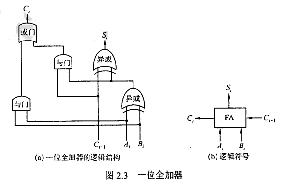

# 第 2 章 数据的表示和运算

## Intro

**【考纲内容】**

1. 数制与编码
   进位计数制及其相互转换；定点数的编码表示
2. 运算方法和运算电路
   基本运算部件：加法器，算法逻辑单元（ALU）
   加/减运算：补码加/减运算器，标志位的生成
   乘/除运算：乘/除法运算的基本原理，乘法运算和除法电路的基本结构
3. 整数的表示和运算
   无符号整数的表示和运算：带符号整数的表示和运算
4. 浮点数的表示和运算
   浮点数的表示：IEEE754 标准；浮点数的加/减运算

**【复习提示】**

本章内容较为繁杂，由于计算机中数的表示和运算方法与人们日常生活中的表示和运算方法不同，因此理解也较为困难。纵观近几年的真题，不难发现 
`unsigned、short、int、long、float、double` 等在C语言中的表示、运算、溢出判断、隐式类型转换、强制类型转换、
IEEE754 浮点数的表示，以及浮点数的运算，
都是考研考查的重点，需要牢固掌握。

## 一、数制与编码

### 0x00 进位计数制及其相互转换

在计算机系统内部，所有的信息都是用二进制进行编码的，这样做的原因有以下几点。

1. 二进制只有两种状态，使用有两个稳定状态的物理器件就可以表示二进制数的每一位，制造成本比较低，例如用高低电平或电荷的正负极性都可以很方便地表示 0 和 1
2. 二进制位 1 和 0 正好与逻辑值“真”和“假”对应，为计算机实现逻辑运算和程序中的逻辑判断提供了便利条件。
3. 二进制的编码和运算规则都很简单，通过逻辑门电路能方便地实现算术运算。

#### 1. 进位计数法

常用的进位计数法有十进制、二进制、八进制、十六进制等。十进制数是日常生活中最常使用的，而计算机中通常使用二进制数、八进制数和十六进制数。
在进位计数法中，每个数位所用到的不同数码的个数称为基数。十进制的基数为10（0～9），每个数位计满10就向高位进位，即“逢十进一”
十进制数101，其个位的1显然与百位的1所表示的数值是不同的。每个数码所表示的数值等于该数码本身乘以一个与它所在数位有关的常数，这个常数称为位权。一个进位数的数值大小就是它的各位数码按权相加。

一个 $r$ 进制数 $(K_nK_{n-1}\cdots K_0K_{-1}\cdots K_{-m})$ 的数值可表示为：
$$
K_nr^n+K_{n-1}r^{n-1}+\cdots+K_0r^0+K_{-1}r^{-1}+\cdots+K_{-m}r^{-m}=\sum_{i=n}^{-m}K_ir^i
$$
式中，$r$ 是基数；$r^i$ 是第 $i$ 位的位权（整数位最低位规定为第0位）；$K_i$ 的取值可以是 $0,1,\cdots,r-1$ 共 $r$ 个数码中的任意一个。

1. **二进制**。计算机中用得最多的是基数为 2 的计数制，即二进制。二进制只有 0 和 1 两种数字符号，计数“逢二进一”。它的任意数位的权为 $2^i$ ，$i$ 为所在位数。
2. **八进制**。八进制作为二进制的一种书写形式，其基数为 8，有 0～7 共 8 个不同的数字符号，计数“逢八进一”。因为 $r=8=2^3$ ，所以只要把二进制中的 3 位数码编为一组就是一位八进制数码，两者之间的转换极为方便。
3. **十六进制**。十六进制也是二进制的一种常用书写形式，其基数为 16，“逢十六进一”。每个数位可取 0～9、A、B、C、D、E、F中的任意一个，其中A、B、C、D、E、F分别表示 10～15。因为 $r=16=2^4$，因此 4 位二进制数码与1位十六进制数码相对应。

#### 2. 不同进制数之间的相互转换(略)

#### 3. 真值和机器数

在日常生活中，通常用正号、负号来分别表示正数（正号可省略）和负数，如 +15、-8 等。这种带“+”或“-”符号的数称为真值。真值是机器数所代表的实际值。

在计算机中，通常将数的符号和数值部分一起编码，将数据的符号数字化，通常用“0”表示“正”，用“1”表示“负”。这种把符号“数字化”的数称为机器数。常用的有**原码**、**补码**和**反码**表示法。如 0,101（这里的逗号 “,” 仅为区分符号位与数值位）表示 +5。

### 0x01 BCD 码

二进制编码的十进制数（Binary-Coded Decimal,BCD）通常采用 4位二进制数来表示一位十进制数中的 0～9 这10个数码。这种编码方法使二进制数和十进制数之间的转换得以快速进行。但 4 位二进制数可以组合出 16 种代码，因此必有 6 种状态为冗余状态。

下面列举几种常用的BCD码。

1. **8421 码（常用）**。它是一种有权码，设其各位的数值为 $b_3,b_2,b_1,b_0$，则权值从高到低依次为 $8,4,2,1$，它表示的十进制数为 $D=8b_3+4b_2+2b_1+1b_0$。 如 $8\to 1000;9\to 1001$。
   若两个 8421 码相加之和小于或等于 $(1001)_2$ 即 $(9)_{10}$，则不需要修正；若相加之和大于或等于 $(1010)_2$ 即 $(10)_{10}$，则要加 6 修正（从 $1010$ 到 $1111$ 这6个为无效码，当运算结果落于这个区间时，需要将运算结果加上 6)，并向高位进位。
   
2. **余 3 码**。这是一种无权码，是在 8421码的基础上加 $(0011)_2$ 形成的，因每个数都多余 “3” 因此称为余 3 码。如 $8\to 1011;9\to 1100$
3. **2421码**。这也是一种有权码，权值由高到低分别为 2，4，2，1，特点是大于或等于 5 的 4 位二进制数中最高位为 1，小于 5 的最高位为 0。如 $5\to1011$ 而非 0101。

### 0x02 定点数的编码表示

根据小数点的位置是否固定，在计算机中有两种数据格式：**定点表示**和**浮点表示**。在现代计算机中，

- 通常用定点补码整数表示整数
- 用定点原码小数表示浮点数的尾数部分
- 用移码表示浮点数的阶码部分

历年统考真题的考点分布也基本落在这个范围内。

#### 1. 机器数的定点表示

定点表示法用来表示定点小数和定点整数。

1. **定点小数**。定点小数是纯小数，约定小数点位置在符号位之后、有效数值部分最高位之前。若数据 $X$ 的形式为 $X=x_0x_1\dots x_n$，（其中 $x_0$ 为符号位，$x_1\sim x_n$，是数值的有效部分，也称尾数，$x_1$ 为最高有效位)，则在计算机中的表示形式如下图所示。 

2. **定点整数**。定点整数是纯整数，约定小数点位置在有效数值部分最低位之后。若数据 $X$ 的形式为 $X=x_0x_1x_2\dots x_n$，（其中 $x_0$ 为符号位，$x_1\sim x_n$ ,是尾数，$x_n$ 为最低有效位），则在计算机中的表示形式如下图所示。

定点数编码表示法主要有以下 4 种：原码、补码、反码和移码。

#### 2. 原码、补码、反码、移码

##### (1) 原码表示法

用机器数的最高位表示数的符号，其余各位表示数的绝对值。原码的定义如下。

- 纯小数的原码定义

$$
[x]_{原}=
\begin{cases}
x,&0\le x\le1\\
1-x=1+|x|,&-1<x\le 0
\end{cases},([x]_{原}是真值,n是整数位数)
$$

例如，若 $x=+0.1101,x2=-0.1101$，字长为 8 位，则其原码表示为 $[x_1]_{原}=0.1101000,[x_2]_{原}=1-(-0.1101)=1.1101000$，其中最高位是符号位。

若字长为 $n+1$，则原码小数的表示范围为 $-(1-2^{-n})\le x\le 1-2^{-n}$（关于原点对称）。

- 纯整数的原码定义（了解）

$$
[x]_{原}=
\begin{cases}
0,x,&0\le x<2^n,\\
2^n-x=2^n+|x|,&-2^n<x\le 0
\end{cases}(x是真值,n是整数位数)
$$

例如，若 $x_1=+1110,x2_=-1110$，字长为 8 位，则其原码表示为 $[x_1]_{原}=0,0001110,[x_2]_{原}=2^7+1110=1,0001110$，其中最高位是符号位。

若字长为 $n+1$，则原码整数的表示范围为 $-(2^n-1)\le x\le 2^n-1$（关于原点对称）。

> 注意：真值零的原码表示有正零和负零两种形式，即 [+0]~原~=00000 和 [-0]~原~=10000

原码表示的优点是与真值的对应关系简单、直观，与真值的转换简单，并且用原码实现乘除运算比较简便。缺点是，0 的表示不唯一，更重要的是原码加减运算比较复杂。

##### (2) 补码表示法

原码加减运算规则比较复杂，对于两个不同符号数的加法（或同符号数的减法），·先要比较两个数的绝对值大小，然后用绝对值大的数减去绝对值小的数，最后还要给结果选择合适的符号。而补码表示法中的加减运算则统一采用加法操作实现。

###### 纯小数的补码定义（了解）

$$
[x]_{补}=
\begin{cases}
x,&0\le x<1\\
2+x=2-|x|,&-1\le x<0
\end{cases}\pmod 2
$$

例如，若 $x_1=+0.1001,x_2=-0.0110$ ，字长为 8 位，则其补码表示为 $[x_1]_{补}=0.1001000,[x_2]_{补}=2^8 - 0.0110= 1.1010000$ 

若字长为 n+1，则补码的表示范围为 $-1\le x\le 1-2^{-n}$（比原码多表示 -1)。

###### 纯整数的补码定义

$$
[x]_{补}=
\begin{cases}
0,x,&x\le x<2^n\\
2^{n+1}+x=2^{n+1}-|x|,&-2^n\le x<0
\end{cases}\pmod{2^{n+1}}
$$

例如,若 $x_1=+1010,x_2=-1101$, 字长为 8 位，则其补码表示为 $[x_1]_{补}=0,0001010,[x_2]_{补}=2^8-0,0001101= 1, 1110011$ 

若字长为 n+1，则补码的表示范围为 $-2^n\le x\le 2^n-1$（比原码多表示 $-2^n$）。

> 注意：零的补码表示是唯一的，即 [+0]~补~ = [-0]~补~=0.0000。 由定义 [-1]~补~= 10.0000- 1.0000 =1.0000，可见，小数补码比原码多表示一个 -1；整数补码比原码多表示一个 -2^n^。

###### 变形补码

变形补码，又称模 4 补码，双符号位的补码小数，其定义为
$$
[x]_{补}=
\begin{cases}
x,&0\le x<1\\
4+x=4-|x|,&-1\le x<0
\end{cases}\pmod 4
$$
模 4 补码双符号位 00 表示正，11 表示负，用在完成算术运算的 ALU 部件中。
将 [x]~补~ 的符号位与数值位一起右移并保持原符号位的值不变，可实现除法功能。

###### 补码与真值之间的转换

对补码而言，正数和负数的转换不同。正数补码的转换方式与原码的相同。

- 真值转换为补码：对于正数，与原码的方式一样
- 对于负数，符号位取 1，其余各位由真值“各位取反，末位加 1”得到。补码转换为真值：若符号位为0，与原码的方式一样。若符号位为1，真值的符号为负，数值部分各位由补码“各位取反，末位加1”得到。

（3）反码表示法（了解）么就可得到负数的反码表示，因此负数反码的定义就是在相应的补码表示中再末位减 1。正数反码的定义和相应的补码（或原码）表示相同。反码表示存在以下几个方面的不足：0 的表示不唯一（即存在正负 0）；表示范围比补码少一个最小负数。反码在计算机中很少使用，通常用作数码变换的中间表示形式。（4）移码表示法移码常用来表示浮点数的阶码。它只能表示整数。移码就是在真值 X 上加上一个常数（偏置值），通常这个常数取 2”，相当于 X 在数轴上向正方向偏移了若干单位，这就是“移码”一词的由来。移码定义为[x]=2"+x（-2"≤x<2"，其中机器字长为 n+ 1)例如，若正数 x=+10101，x2=-10101，字长为 8 位，则其移码表示为[x]=2′+10101=1,0010101; [x2]= 2' + (-10101)= 0, 1101011。移码具有以下特点：（0，u）0..·00I=0-=#[0-]=0+=#[0+]‘—期肇明中①表示负，这与其他机器数的符号位取值正好相反），反之亦然。③移码全 0 时，对应真值的最小值-2"；移码全 1 时，对应真值的最大值 2"-1。④移码保持了数据原有的大小顺序，移码大真值就大，移码小真值就小。原码、补码、反码和移码这 4 种编码表示的总结如下：①·原码、补码、反码的符号位相同，正数的机器码相同。②原码、反码的表示在数轴上对称，二者都存在+0 和-0 两个零。③补码、移码的表示在数轴上不对称，零的表示唯一，它们比原码、反码多表示一个数。④整数的补码、移码的符号位相反，数值位相同。③负数的反码、补码末位相差 1。③原码很容易判断大小。而负数的反码、补码很难直接判断大小，可采用如下规则快速判断：对于负数，数值部分越大，绝对值越小，真值越大（更靠近 0)。

### 0x03 整数的表示

#### 1. 无符号整数的表示

当一个编码的全部二进制位均为数值位而没有符号位时，该编码表示就是无符号整数，也直接称为无符号数。此时，默认数的符号为正。由于无符号整数省略了一位符号位，所以在字长相同的情况下，它能表示的最大数比带符号整数能表示的大。例如，8 位无符号整数，对应的表示范围为 0～2^8^－1，即最大数为 255，而 8 位带符号整数的最大数是 127。

一般在全部是正数运算且不出现负值结果的场合下，使用无符号整数表示。例如，可用无符号整数进行地址运算，或用它来表示指针。

#### 2. 带符号整数的表示

将符号数值化，并将符号位放在有效数字的前面，就组成了带符号整数。虽然前面介绍的原码、补码、反码和移码都可以用来表示带符号整数，但补码表示有其明显的优势：

1. 与原码和反码相比，0 的补码表示唯一
2. 与原码和移码相比，补码运算规则比较简单，且符号位可以和数值位一起参加运算
3. 与原码和反码相比，补码比原码和反码多表示一个最小负数。计算机中的带符号整数都用补码表示，故 n 位带符号整数的表示范围是 $-2^{n-1}\sim 2^{n-1}-1$

## 二、运算方法和运算电路

### 0x00 基本运算部件

在计算机中，运算器由算术逻辑单元（Arithmetic Logic Unit，ALU）、移位器、状态寄存器和通用寄存器组等组成。运算器的基本功能包括加、减、乘、除四则运算，与、或、非、异或等逻辑运算，以及移位、求补等操作。ALU 的核心部件是加法器。

#### 1. 一位全加器

全加器（FA）是最基本的加法单元，有加数 $A_i$、加数 $B_i$ 与低位传来的进位 $C_{i-1}$ 共三个输入，有本位和 $S_i$ 与向高位的进位 $C_i$ 共两个输出。全加器的逻辑表达式如下。

- 和表达式：$S_i=A_i\oplus B_i\oplus C_{i-1}$（$A_i,B_i,C_{i-1}$ 中有奇数个 1 时，$S_i=1$，否则 $S_i=0$）
- 进位表达式：$C_i=A_iB_i+(A_i\oplus B_i)C_{i-1}$

一位全加器对应的逻辑结构如图 2.3(a)所示，其逻辑符号如图 2.3(b)所示。

 

#### 2. 串行进位加法器

把 n 个全加器相连可得到 n 位加法器，称为串行进位加法器，如图 2.4 所示。串行进位又称行波进位，每级进位直接依赖于前一级的进位，即进位信号是逐级形成的。

图 2.4 中的加法器实现了两个 n 位二进制数 $A=A_nA_{n-1}\cdots A_1$ 和 $B=B_nB_{n-1}\cdots B_1$ 逐位相加的功能，得到的二进制和为 $S=S_nS_{n-1}\cdots S_1$，进位输出为 Cn。例如，当 $A=11\cdots11$、$B=00\cdots01$ 时，结果输出为 $S=00\cdots00$ 且 $C_n =1$。由于位数有限，高位自动丢失，所以实际是模 $2^n$ 的加法运算。

在串行进位加法器中，低位运算产生进位所需的时间将影响高位运算的时间。因此，串行进位加法器的最长运算时间主要是由进位信号的传递时间决定的，位数越多延迟时间就越长，而全加器本身的求和延迟只为次要因素，所以加快进位产生和提高传递的速度是关键。

#### 3. 并行进位加法器

令 G;=AB，P;=A;B；，全加器的进位表达式为= 1==) +=式中，当 A;与 B;都为 1 时，C;=1，即有进位信号产生，所以称 AB;为进位产生函数（本地进位），用 G;表示。A;B;=I 且 C-=1 时，C;=1。可视为 A;ΦB;=1，第 i-1 位的进位信号 C;可以通过本位向高位传送。因此称 A;B;为进位传递函数（进位传递条件），用 P;表示。将 G;和 P;代入前面 C～C4 的公式，可得 C, = G, + P,CoC2 = G2 + P2C, = G2 + P2G, + P2PCo+++ +C4 = G4 + P4C3 = G4 + P4G3 + P4P3G2 + P4P3P2G, + P4P3P2PC0 从上述表达式可以看出，C;仅与 A、B;及最低进位 C。有关，相互间的进位没有依赖关系。只要 A～A4、B,～B4 和 C 同时到达，就可几乎同时形成 C～C4，并且同时生成各位的和。实现上述逻辑表达式的电路称为先行进位（也称超前进位）部件，简称 CLA 部件，如图 2.5（a)所示。通过这种进位方式实现的加法器称为全先行进位加法器。因为各个进位是并行产生的，所以是一种并行加法器，如图 2.5(b)所示。CsC:GsGP;G2P, G, P(a)4 位 CLA 部件 4 位 CLA 部件 A, B;A B2A, B,(b)4 位全先行进位加法器图 2.54 位 CLA 部件利 4 位全先行进位加法器这种进位方式是快速的，与位数无关。但随着加法器位数的增加，C;的逻辑表达式会变得越来越长，这会使电路结构变得很复杂。因此，当位数较多时采用全先行进位是不现实的。更多位数的加法器可通过将 CLA 部件或全先行进位加法器串接起来实现。例如，对于 16 位加法器，可以分成 4 组，组内为 4 位先行进位，组间串行进位。为了进一步提高运算速度，也可以采用组内和组间都并行的进位方式。因为两级先行进位加法器组内和组间都采用先行进位方

微信公众号：djky66（顶尖考研祝您上岸）2 章数据的表示和运算 037 式，其延迟和加法器的位数没有关系。所以，通常采用两级或多级先行进位加法器。4.带标志加法器无符号数加法器只能用于两个无符号数相加，不能进行带符号整数的加/减运算。为了能进行带符号整数的加/减运算，还需要在无符号数加法器的基础上增加相应的逻辑门电路，使得加法器不仅能计算和/差，还要能生成相应的标志信息。图 2.6 是带标志加法器的实现电路，(SF)F 加法器 Cout(C,)Am-, Bn-A. B.(a)带标志加法器符号(b)带标志加法器的逻辑电路图 2.6 用全加器实现 n 位带标志加法器的电路在图 2.6 中，溢出标志的逻辑表达式为 OF=C,Cn-1；符号标志就是和的符号，即 SF=Fn-;零标志 ZF=1 当且仅当 F=0；进位/借位标志 CF=CouCn，即当 Cin=0 时，CF 为进位 Cou，当 Cin=1 时，CF 为进位 Cou 取反。值得注意的是，为了加快加法运算的速度，实际电路一定使用多级先行进位方式，图 2.6(b)是为了说明如何从加法运算结果中获得标志信息，因而使用全加器简化了加法器电路。5.算术逻辑单元（ALU)ALU 是一种功能较强的组合逻辑电路，它能进行多种算术运算和逻辑运算。由于加、减、乘、除运算最终都能归结为加法运算，因此 ALU 的核心是带标志加法器，同时也能执行“与”“或”“非”等逻辑运算。ALU 的基本结构如图 2.7 所示，其中 A 和 B 是两个 位操作数输入端，Cin 是进位输入端，ALUop 是操作控制端，用来决定 ALU 所执行的处理功能。例如，ALUop 选择 Add 运算，ALU 就执行加法运算，输出的结果就是 A 加 B 之和。ALUop 的位数决定了操作的种类。例如，当位数为 3 时，ALU 最多只有 8 种操作。法用一个全加器实现，在 ALUop 的控制下，由一个多路选择器（MUX）选择输出 3 种操作结果之一。这里有 3 种操作，所以 ALUop 至少要有两位。2x ALUopCir 一位全加器+Cout Cout 图 2.7ALU 的基本结构图 2.8 一位 ALU 的结构

0382024 计算机组成原理考研复习指导同时，ALU 也可以实现左移或右移的移位操作。注意：MUX 是多路选择开关（多路选择器），它从多个输入信号中选择一个送到输出端。注意：如对电路基础知识不太熟悉，可参阅电路相关教材的基础部分。对此节电路内容亦不必过分深究，目前统考对电路的要求并不高，很少涉及。

### 0x01 定点数的移位运算

 1.算术移位算术移位的对象是有符号数，在移位过程中符号位保持不变。对于正数，由于[x]α=[x]=[x]=真值，因此移位后出现的空位均以 0 添之。对于负数，由于原码、补码、反码的表示形式不同，因此当机器数移表 2.1 不同机器数算术移位后的空位添补规则位时，对其空位的添补规则也不同。码制添补代码对于带符号数，左移一位若不产生溢出，相当于正数原码、补码、反码 0 乘以 2（与十进制的左移一位相当于乘以 10 类似），原码 0 右移一位，若不考虑因移出而舍去的末位尾数，相当左移添 0 于除以 2。负数补码右移添 1 由表 2.1 可以得出如下结论。反码 1①负数的原码数值部分与真值相同，故在移位时只要使符号位不变，其空位均添 0。②负数的反码各位除符号位外与负数的原码正好相反，故移位后所添的代码应与原码相反，即全部添 1。③分析由原码得到补码的过程发现，当对其由低位向高位找到第一个“1”时，在此“1”左边的各位均与对应的反码相同，而在此“1”右边的各位（包括此“1”在内）均与对应的原码相同。故负数的补码左移时，因空位出现在低位，则添补的代码与原码相同，即添 0：右移时因空位出现在高位，则添补的代码应与反码相同，即添 1。三种机器数算术移位后的符号位均不变。对于正数，左移时，高位丢 1，结果出错：右移时最低位丢 1，影响精度。对于负数，负数的原码左移时，高位丢 1，结果出错；右移时，低位丢 1，影响精度。负数的补码左移时，高位丢 0，结果出错；右移时，低位丢 1，影响精度。负数的反码左移时，高位丢 0，结果出错：右移时，低位丢 0，影响精度。2.逻辑移位逻辑移位将操作数视为无符号数。移位规则：逻辑左移时，高位移丢，低位添 0；逻辑右移时，低位移丢，高位添 0。3. 循环移位环），过程如图 2.9 所示。循环移位的主要特点是，移出的数位又被移入数据中，而是否带进位则要看是否将进位标志位加入循环位移。例如，带进位位的循环左移，如图 2.9(d)所示，就是数据位连同进位标志位一起左移，数据的最高位移入进位标志位 CF，而进位位则依次移入数据的最低位。循环移位操作特别适合将数据的低字节数据和高字节数据互换。

第 2 章数据的表示和运算 039 最高位最低位最高位最低位 CFCF(a)不带进位位的循环右移(b)带进位位的循环右移最高位最低位最高位最低位 CFCF(c)不带进位位的循环左移(d)带进位位的循环左移图 2.9 循环移位 

### 0x02 定点数的加减运算

事实上，在机器内部并没有小数点，只是人为约定了小数点的位置，小数点约定在最左边就是定点小数，小数点约定在最右边就是定点整数。因此，在运算过程中，可以不用考虑对应的定点数是小数还是整数，而只需关心它们的符号位和数值位即可。1.补码的加减法运算补码加减运算规则简单，易于实现。补码加减运算的公式如下（设机器字长为 n+1)。[A + B]#= [4]# + [B]# (mod 2n+!)[A-B]#= [4]#+ [-B]#(mod 2"~1)补码运算的特点如下。1）按二进制运算规则运算，逢二进一。2）若做加法，两数的补码直接相加：若做减法，则将被减数与减数的机器负数相加。3）符号位与数值位一起参与运算，加、减运算结果的符号位也在运算中直接得出。4）最终运算结果的高位丢弃，保留 n+1 位，运算结果亦为补码。【例 2.6】设机器字长为 8 位（含 1 位符号位)，A=15，B=24，求[A+B]和[A 一 B]。解：A =+15 =+0001111, B = +24 = +0011000; 得[A]= 00001111， [B]= 00011000。求得[-B]=11101000。所以[A +B]：=00001111+ 00011000=00100111，符号位为 0，对应真值为+39。[A-B]#=[A]+[-B]=00001111+11101000=11110111，符号位为 1，对应真值为-9。2.补码加减运算电路已知一-个数的补码表示为 Y，则这个数的负数的补码为 Y+1，因此，只要在原加法器的 Y 输入端加 n 个反向器以实现各位取反的功能，然后加一个 2 选 1 多路选择器，用一个控制端 Sub 来控制，以选择是将 Y 输入加法器还是将 Y 输入加法器，并将控制端 Sub 同时作为低位进位送到加法器，如图 2.10 所示。该电路可实现补码加减运算。当控制端 Sub 为 1 时，做减法，实现 X+Y+1 =[x]#+[-y]#：当控制端 Sub 为 0 时，做加法，实现 X+Y=[x]+[y]#。图 2.10 中的加法器是带标志加法器。无符号整数的二进制表示相当于正整数的补码表示，因此，该电路同时也能实现无符号整数的加/减运算。对于带符号整数 x 和 y，图中 X 和 Y 分别是 x 和 y 的补码表示：对于无符号整数 x 和 y，图中 X 和 Y 分别是 x 和 y 的二进制表示。

0402024 计算机组成原理考研复习指导 Sub;M Cout 图 2.10 补码加减运算部件零标志 ZF=1 表示结果 F 为 0。不管对于无符号数还是带符号整数运算，ZF 都有意义。溢出标志 OF=1 表示带符号整数运算时发生溢出。对于无符号数运算，OF 没有意义。符号标志 SF 表示结果的符号，即 F 的最高位。对于无符号数运算，SF 没有意义。进/借位标志 CF 表示无符号整数运算时的进位/借位，判断是否发生溢出。加法时，CF= 1 表示结果溢出，因此 CF 等于进位输出 Cour。减法时，CF=1 表示有借位，即不够减，故 CF 等于进位输出 Cou 取反。综合可得 CF= Sub Cou。对于带符号数运算，CF 没有意义。3.溢出判别方法仅当两个符号相同的数相加或两个符号相异的数相减才可能产生溢出，如两个正数相加，而结果的符号位却为 1（结果为负）；一个负数减去一个正数，结果的符号位却为 0（结果为正）。补码定点数加减运算溢出判断的方法有 3 种。（1）采用一位符号位由于减法运算在机器中是用加法器实现的，因此无论是加法还是减法，只要参加操作的两个数符号相同，结果又与原操作数符号不同，则表示结果溢出。设 A 的符号为 As，B 的符号为 Bs，运算结果的符号为 S，则溢出逻辑表达式为 V = A,B,S, + A BsS 若 V=0，表示无溢出；若 V=1，表示有溢出。（2）采用双符号位双符号位法也称模 4 补码。运算结果的两个符号位 SsiSs2 相同，表示未溢出；运算结果的两个符号位 Ss,Ss2 不同，表示溢出，此时最高位符号位代表真正的符号。符号位 Ss1Ss2 的各种情况如下：①SsIS2=00：表示结果为正数，无溢出。②Ss1Ss2=01：表示结果正溢出。③SsuS2=10：表示结果负溢出。④SsiSs2=11：表示结果为负数，无溢出。溢出逻辑判断表达式为 V=Ss Ss2，若 V=0，表示无溢出；若 V=1，表示有溢出。（3）采用一位符号位根据数据位的进位情况判断溢出若符号位的进位 C,与最高数位的进位 C 相同，则说明没有溢出，否则表示发生溢出。溢出逻辑判断表达式为 V=C, C，若 V=0，表示无溢出；V=1，表示有溢出。4。原码的加减法运算（了解）“...=“x..x=加法规则：先判符号位，若相同，则绝对值相加，结果符号位不变；若不同，则做减法，绝

第 2 章数据的表示和运算 041 对值大的数减去绝对值小的数，结果符号位与绝对值大的数相同。减法规则：两个原码表示的数相减，首先将减数符号取反，然后将被减数与符号取反后的减数按原码加法进行运算。注意：运算时注意机器字长，当左边位出现溢出时，将溢出位丢掉。

### 0x03 定点数的乘除运算

 1。定点数的乘法运算乘法运算由累加和右移操作实现，可分为原码一位乘法和补码一位乘法。（1）原码一位乘法成，而乘积的数值部分则是两个数的绝对值相乘之积。设[X]=xxx2"·x，[]=ysyLy"y，则运算规则如下;① 被乘数和乘数均取绝对值参加运算，看作无符号数，符号位为 xsys。② 部分积是乘法过程的中间结果。乘数的每一位 y;乘以被乘数得 Xxy;后，将该结果与前面所得的结果累加，就是部分积，初值为 0。③从乘数的最低位 y,开始判断：若 y,=1，则部分积加上被乘数 x，然后右移一位；若 yn,=0，则部分积加上 0，然后右移一位。④重复步骤③，判断 n 次。由于参与运算的是两个数的绝对值，因此运算过程中的右移操作均为逻辑右移。注意：考虑到运算过程中部分积和乘数做加法时，可能出现部分积大于 1 的情况（产生进位），但此刻并非溢出，所以部分积和被乘数取双符号位。【例 2.7】设 x=-0.1101，y=0.1011，采用原码一位乘法求 x·y。解：x=00.1101，b=00.1011，原码一位乘法的求解过程如下。(高位部分积)（低位部分积/乘数）说明 00.00001011 送失位起始情况+x00.1101=1.则+μx00.1101 右移 00.01101101j1 右移部分积和乘数+lx00.1101y=1.则+lxl01.0011 右移 1110:!00.1001 右移部分积和乘数+000.0000=0.则+000.10011111:0111 右移 00.0100 右移部分积利乘数 x=1.则+xl+x100.11011000'10 右移部分积和乘数右移 00.1000 乘数全部移出结果的绝对值部分符号位 P=x,Φy= 1 ± 0=1，得 x·y=-0.10001111。（2）无符号数乘法运算电路图 2.11 是实现两个 32 位无符号数乘法的逻辑结构图。在图 2.11 中，部分积和被乘数 X 做无符号数加法时，可能产生进位，因此需要一个专门的进位位 C。乘积寄存器 P 初始时置 0。计数器 C,初值为 32，每循环一次减 1。ALU 是乘法器核心

0422024 计算机组成原理考研复习指导部件，对乘积寄存器 P 和被乘数寄存器 X 的内容做“无符号加法”运算，运算结果送回寄存器 P,进位存放在 C 中。每次循环都对进位位 C、乘积寄存器 P 和乘数寄存器 Y 实现同步“逻辑右移",此时，进位位 C 移入寄存器 P 的最高位，寄存器 Y 的最低位移出。每次从寄存器 Y 移出的最低位都被送到控制逻辑，以决定被乘数是否“加”到部分积上。被乘数寄存器 X113264 位右移控制逻辑乘积寄存器 P」乘数寄存器丫 1 计数器 C,写使能 321 时钟图 2.1132 位无符号数乘法运算的逻辑结构图（3）补码一位乘法（Booth 算法）这是一种有符号数的乘法，采用相加和相减操作计算补码数据的乘积。嗨“"K..=]“"x...xxx="[x]①符号位参与运算，运算的数均以补码表示。②被乘数一般取双符号位参与运算，部分积取双表 2.2 Booth 算法的移位规则符号位，初值为 0，乘数取单符号位。yn(高位）yn+1（低位）操作③ 乘数末位增设附加位 yn+1，初值为 0。00 部分积右移一位④根据(yn, yn+1)的取值来确定操作，见表 2.2。0 部分积加[X]#，右移一位 1③移位按补码右移规则进行。部分积加[-X]#，右移一位／0 按照上述算法进行 n+1 步操作，但第 n+1 步部分积右移一位 11 不再移位（共进行 n+1 次累加和 n 次右移)，仅根据 yn,与 yri 的比较结果做相应的运算。【例 2.8】设 x=-0.1101，y=0.1011，采用 Booth 算法求 x·y。解：[x]=11.0011，[-x]#=00.1101，[y]=0.1011。Booth 算法的求解过程如下。(高位部分积)(低位部分积/乘数）说明 00.00000.101110 丢失位起始情况+[x]补.00.1101yys=10，Ys-y=-1，则+[-x]补 00.1101 右移 00.0110 -10.101;10 右移部分积和乘数+000.0000y4ys=1l， yy=0.则+000.0110 右移 00.0011 010.10:110 右移部分积和乘数+[x]补 11.0011y4ys=01，y-y=1，则+[x]补 11.0110 右移 11.10110010.1j0110 右移部分积和乘数 t[x-]+00.1101yys=10. ys-y=-1，则+[-x]补 00.100000.0100 右移部分积和乘数右移 01101:01000+[x]补 11.0011y4y's=01.y-y=]，则+[x]补 11.0111 构成[x·y]补

第 2 章数据的表示和运算 043 所以[x·y]=1.01110001， 得 x·y=-0.10001111。（4）补码乘法运算电路图 2.12 是实现 32 位补码一位乘法的逻辑结构图，和图 2.11 所示的逻辑结构很相似。因为是带符号数运算，不需要专门的进位位。每次循环，乘积寄存器 P 和乘数寄存器丫实现同步“算术右移”，每次从寄存器 Y 移出的最低位和它的前一位来决定是-[x]#、+[x]#还是+0。被乘数寄存器！32±32 加减 32 位 ALU3264 位右移控制逻辑乘积寄存器 P！乘数寄存器 Y 计数器 C,写使能 321 时钟图 2.12 补码--位乘法的逻辑结构图 2.定点数的除法运算（1）符号扩展在算术运算中，有时必须把带符号的定点数转换成具有不同位数的表示形式。例如，某个程序需要将一个 8 位整数与另外一个 32 位整数相加，要想得到正确的结果，在将 8 位整数与 32 位整数相加之前，必须将 8 位整数转换成 32 位整数形式，这称为“符号扩展”正数的符号扩展非常简单，即符号位不变，新表示形式的所有扩展位都用 0 进行填充。负数的符号扩展方法则根据机器数的不同而不同。原码表示负数的符号扩展方法与正数相同，只不过此时符号位为 1。补码表示负数的符号扩展方法：原有形式的符号位移动到新形式的符号位上，新表示形式的所有附加位都用 1（对于整数）或 0（对于小数）进行填充。（2）原码除法运算（不恢复余数法）原码不恢复余数法也称原码加减交替除法。特点是商符和商值是分开进行的，减法操作用补码加法实现，商符由两个操作数的符号位“异或”形成。求商值的规则如下。设被除数[X]=xxx"x，除数[]=ysyyy，则①商的符号：Ωs=xs④yso②商的数值：I0l= [X/1Y。求 IQ 的不恢复余数法运算规则如下。① 先用被除数减去除数（LX]－IY=X+(-IY)=[XI+[-IY])，当余数为正时，商上 1，余数和商左移-一位，再减去除数：当余数为负时，商上 0，余数和商左移一位，再加上除数。②当第 n+1 步余数为负时，需加上 IY 得到第 n+1 步正确的余数（余数与被除数同号)。【例 2.9】设 x=0.1011，y=0.1101，采用原码加减交替除法求 x/。解：x =0.1011，bl=0.1101，[bvl]#=0.1101，[-lbl]= 1.0011。原码不恢复余数法的求解过程如下。

0442024 计算机组成原理考研复习指导被除数商说明 0.10110.0000 起始情况+[-L31]+1.0011-即+[-vi]1.11100.0000 部分余数为负.商.上 0 左移 1.1100 .0.0000 余数和商左移·位+[0.1101+.10.10010.0001 部分余数为正,商上 1 左移 1.0010 :0.0010 余数和商左移·位+[-lvi]#1.0011-即+[-]补 0.01010.0011 部分余数为正,商上 1 左移 0.10100.0110 余数和商左移一位+-Lv#1.0011 即+[-1.11010.0110 部分余数为负，商 10 左移 1.10100.1100 余数和商左移一位+Ilvi0.1101+l10.01110.1101 部分余数为正,商上！余数商因此 Q= x;y= 0 Φ 0=0，得 x/y = +0.1101，余 0.0111×2-4（3）补码除法运算（加减交替法）补码一位除法的特点是，符号位与数值位一起参加运算，商符自然形成。除法第一步根据被除数和除数的符号决定是做加法还是减法：上商的原则根据余数和除数的符号位共同决定，同号上商“1"，异号上商“0"；最后一步商恒置“1"加减交替法的规则如下：① 符号位参加运算，除数与被除数均用补码表示，商和余数也用补码表示。②若被除数与除数同号，则被除数减去除数：若被除数与除数异号，则被除数加上除数。③ 若余数与除数同号，则商上 1，余数左移一位减去除数；若余数与除数异号，则商上 0,余数左移一位加上除数。④重复执行第③步操作 n 次。③若对商的精度没有特殊要求，则一般采用“末位恒置 1”法。【例 2.10】设 x=0.1000，y=-0.1011，采用补码加减交替法求 x/y。解：采用两位符号表示，[x]=00.1000，则[x]=00.1000。[y]=11.1011，则[y]#=11.0101,[-y]=00.1011。补码加减交替法的求解过程如下。被除数商说明 00.10000000°0 起始情况+补 11.0101[x]杯、[补异号，则+L 以补 0.000111.1101 部分余数与[y 杯同号，则商上 1 左移 11.1010 0.0010 左移一位+[-y 补 00.1011+[-y 仆 1010'000100'0 部分余数与[异号，则商上 0 左移 0.010000.1010 左移一位+补+,以补 11.010111.11110.0101 部分余数与[补同号，则商上 1 左移 0.101011.1110 左移一位十一补 00.1011--.v 补 00.10010.1010 部分余数与 y 补异号，则商 1:0 左移 01.0010L.0100 左移·位+[11.010100.01111.0101 末位恒置 1t 余数购

第 2 章数据的表示和运算 045 所以有[x/y]=1.0101，余 0.0111×2-4。由例 2.9 和例 2.10 可知，n 位定点数的除法运算，实际上是用一个 2n 位的数去除以一个 n 位的数，得到一个 n 位的商，因此需要对被除数进行扩展。对于 n 位定点正小数，只需在被除数低位添 n 个 0 即可。对于 n 位无符号数或定点正整数，只需在被除数高位添 n 个 0 即可。（4）除法运算电路图 2.13 是一个 32 位除法逻辑结构图，它和乘法逻辑结构也很相似。除数寄存器 Y+323232 位 ALU 加/减↑3264 位左移控制逻辑余数寄存器 R 余数/商寄存器 Q 计数器 C 写使能 32 时钟图 2.1332 位除法运算的逻辑结构图初始时，寄存器 R 存放扩展被除数的高位部分，寄存器 Q 存放扩展被除数的低位部分。ALU 是除法器核心部件，对余数寄存器 R 和除数寄存器 Y 的内容做加/减运算，运算结果送回寄存器 R。每次循环，寄存器 R 和 Q 实现同步左移，左移时，Q 的最高位移入 R 的最低位，Q 中空出的最低位被上商。每次由控制逻辑根据 ALU 运算结果的符号来决定上商是 0 还是 1。

### 0x04 C 语言中的整数类型及类型转换

统考大纲要求考生具有对高级程序设计语言（如 C 语言）中相关问题进行分析的能力，而 C 语言变量之间的类型转换是统考中经常出现的题目，需要读者深入掌握这一内容。1.有符号数和无符号数的转换 C 语言允许在不同的数据类型之间做强制类型转换，而从数学的角度来说，可以想到很多不同的转换规则。就用户使用而言，对于两者都能表示的数，当然希望转换过程中数值本身不发生任何变化，而那些转换过后无法表示的数呢？请先观察如下这段程序：int main() fshort x=-4321;unsigned short y=(unsigned short)x;printf("x=d,y=u\n",x， y);有符号数 x 是一个负数，而无符号数 y 的表示范围显然不包括 x 的值。读者可以自己猜想下这段程序的运行结果，再比较下面给出的运行结果。在采用补码的机器上，上述代码会输出如下结果：x=-4321,y=61215 最后的结果中，得到的 y 值似乎与原来的 x 没有一点关系。不过将这两个数化为二进制表示时，我们就会发现其中的规律，如表 2.3 所示。其中 x 为补码表示，y 为无符号的二进制真值。观察可知，将 shortint 强制转换为 unsignedshort 只改变数值，而两个变量对应的每位都是一样的。通过这个例子就可以知道，强制类型转换的结果保持位值不变，仅改变了解释这些位的方式。

0462024 计算机组成原理考研复习指导表 2.3y 与 x 的对比变量值位 15141312111098765432108-4321 下面再来看一个 unsigned short 型转换到 short 型的例子。考虑如下代码：intmain()unsigned short x=65535;short y=(short)x;printf("x=%u,y=d\n",x,y）;同样在采用补码的机器上，上述代码会输出以下结果：x=65535,y=-1 同样可以把这两个数用之前的方法写成二进制，然后证实我们之前得出的结论。2.不同字长整数之间的转换另一种常见的运算是在不同字长的整数之间进行数值转换。先观察如下程序：intmain（）(int x=165537, u=-34991;//int 型占用 4Bshort y=(short)x, v=(short)u;//short 型占用 2Bprintf（"x=%d,y=%d\n",x,y）;printf("u=d,v=d\n",u,v);这段程序可以得到如下结果：x=165537,Y=-31071u=-34991,V=30545 其中 x、y、u、v 的十六进制表示分别为 0x000286al、0x86a1、0xffff7751、0x7751，观察上述数字很容易得出结论，当大字长变量向小字长变量强制类型转换时，系统把多余的高位部分直接截断，低位直接赋值，因此也是一种保持位值的处理方法。最后来看小字长变量向大字长变量转换的情况。先观察下面这段程序：int main（)（short x=-4321;int y=x;unsigned short u=(unsigned short)x;unsigned int v=u;printf("x=%d,y=%d\n",x,y）;printf("u=ou,v=%u\n",u,v);运行结果如下：x=-4321,y=-4321u=61215,V=61215x、y、u、v 的十六进制表示分别是 0xeflf、Oxffffeflf、0xeflf、0x0000eflf。由本例可知，短字长到长字长的转换时，不仅要使相应的位值相等，还要对高位部分进行扩展。如果原数字是无符号整数，则进行零扩展，扩展后的高位部分用 0 填充。否则进行符号扩展，扩展后的高位部分用原数字符号位填充。其实两种方式扩展的高位部分都可理解为原数字的符号位。这与之前的三个举例都不一样，从位值与数值的角度说，前三个举例的转换规则都是保证相应的位值相

第 2 章数据的表示和运算 047 的相等。注意，char 类型为 8 位无符号整数，其在转换为 int 时高位补 0 即可。

### 0x05 数据的存储和排列

·1.数据的“大端方式”和“小端方式”存储在存储数据时，数据从低位到高位可以按从左到右排列，也可以按从右到左排列。因此，无法用最左或最右来表征数据的最高位或最低位，通常用最低有效字节（LSB）和最高有效字节（MSB）来分别表示数的低位和高位。例如，在 32 位计算机中，一个 int 型变量 i 的机器数为 01 234567H，其最高有效字节 MSB=01H，最低有效字节 LSB=67H。现代计算机基本上都采用字节编址，即每个地址编号中存放 1 字节。不同类型的数据占用的定一个地址。假设变量 i 的地址为 0800H，字节 01H、23H、45H、67H 应该各有一个内存地址，那么地址 0800H 对应 4 字节中哪字节的地址呢？这就是字节排列顺序问题。多字节数据都存放在连续的字节序列中，根据数据中各字节在连续字节序列中的排列顺序不同，可以采用两种排列方式：大端方式（big endian）和小端方式（little cndian），如图 2.l4 所示。0800H  0801H  0802110803HHL9HSHEZHIO 大端方式 0801H0802H0803H 小端方式..67H45H23H011!图 2.14 采用大端方式和小端方式存储数据大端方式按从最高有效字节到最低有效字节的顺序存储数据，即最高有效字节存放在前面；小端方式按从最低有效字节到最高有效字节的顺序存储数据，即最低有效字节存放在前面，在检查底层机器级代码时，需要分清各类型数据字节序列的顺序，例如以下是由反汇编器（汇编的逆过程，即将机器代码转换为汇编代码）生成的一行机器级代码的文本表示：:  4004d3: 01 05 64 94. 04 08   add %eax, 0x8049464 其中，“4004d3”是十六进制数表示的地址，“010564940408”是指令的机器代码，“add%eax,0x8049464”是指令的汇编形式，该指令的第二个操作数是立即数 0x8049464。执行指令时，从指令代码的后 4 字节中取出该立即数，立即数存放的字节序列为 64H、94H、04H、08H，正好与操作数的字节顺序相反，即采用的是小端方式存储，得到 08049464H，去掉开头的 0，得到 0x8049464，在阅读小端方式存储的机器代码时，要注意字节是按相反顺序显示的。2.数据按“边界对齐”方式存储假设存储字长为 32 位，可按字节、半字和字寻址。对于机器字长为 32 位的计算机，数据以边界对齐方式存放，半字地址一定是 2 的整数倍，字地址一定是 4 的整数倍，这样无论所取的数据是字节、半字还是字，均可一次访存取出。所存储的数据不满足上述要求时，通过填充空白字节使其符合要求。这样虽然浪费了一些存储空间，但可提高取指令和取数的速度。在两个存储字中，此时需要两次访存，并且对高低字节的位置进行调整、连接之后才能得到所要的指令或数据，从而影响了指令的执行效率。例如，“字节 1、字节 2、字节 3、半字 1、半字 2、半字 3、字 1”的数据按序存放在存储器

0482024 计算机组成原理考研复习指导中，按边界对齐方式和不对齐方式存放时，格式分别如图 2.15 和图 2.16 所示。字节 1 字节 2 字节 3 填充字节 2 字节 3 半字 1-1 半字 1 半字 2 半字 1-2 半字 2 半字 3 填充 32 字 1 图 2.15 边界对齐方式图 2.16 边界不对齐方式边界对齐方式相对边界不对齐方式是一种空间换时间的思想。精简指令系统计算机 RISC 通常采用边界对齐方式，因为对齐方式取指令时间相同，因此能适应指令流水。

## 三、浮点数的表示与运算

### 0x00 浮点数的表示

浮点数表示法是指以适当的形式将比例因子表示在数据中，让小数点的位置根据需要而浮

第 2 章数据的表示和运算 061 动。这样，在位数有限的情况下，既扩大了数的表示范围，又保持了数的有效精度。例如，用定点数表示电子的质量（9×10-2"g）或太阳的质量（2×10²g）是非常不方便的。1. 浮点数的表示格式通常，浮点数表示为 N=(-1)s×M×RE 式中，S 取值 0 或 1，用来决定浮点数的符号；M 是一个二进制定点小数，称为尾数，·般用定点原码小数表示；E 是一个二进制定点整数，称为阶码或指数，用移码表示。R 是基数（隐含），可以约定为 2、4、16 等。可见浮点数由数符、尾数和阶码三部分组成。图 2.17 是一个 32 位短浮点数格式的举例。017831 数符阶码尾数图 2.17 浮点数格式的举例其中，第 0 位为数符 S：第 1～7 位为移码表示的阶码 E（偏置值为 64)：第 8～31 位为 24 位二进制原码小数表示的尾数 M：基数 R 为 2。阶码的值反映浮点数的小数点的实际位置；阶码的位数反映浮点数的表示范围：尾数的位数反映浮点数的精度。2. 浮点数的表示范围原码是关于原点对称的，故浮点数的范围也是关于原点对称的，如图 2.18 所示。零可表示的负数可表示的正数负上溢 负下溢丨正下溢正上溢(1-2-2*)x263(1-2)x26 数轴-2-24x216+02-24x216 图 2.18 浮点数的表示范围运算结果大于最大正数时称为正上溢，小于绝对值最大负数时称为负上溢，i 上溢和负上溢统称上溢。数据一旦产生上溢，计算机必须中断运算操作，进行溢出处理。当运算结果在 0 至最数据下溢时，浮点数值趋于零，计算机仅将其当作机器零处理。3. 浮点数的规格化尾数的位数决定浮点数的有效数位，有效数位越多，数据的精度越高。为了在浮点数运算过使非零的浮点数在尾数的最高数位上保证是一个有效值。左规：当运算结果的尾数的最高数位不是有效位，即出现±0.0··0×···×的形式时，需要进行左规。左规时，尾数每左移一位、阶码减 1（基数为 2 时）。左规可能要进行多次。右规：当运算结果的尾数的有效位进到小数点前面时，需要进行右规，将尾数在移-一位、阶码加 1（基数为 2 时）。需要右规时，只需进行一次。规格化浮点数的尾数 M 的绝对值应满足 1/R≤IM<1。若 R=2，则有 1/2≤IM< 1。原码表示的规格化尾数的形式如下：1）正数为 0.1××·"·×的形式，其最大值表示为 0.11···1，最小值表示为 0.100··0。尾数的表

0622024 计算机组成原理考研复习指导示范围为 1/2 ≤ M ≤ (1 - 2")。2）负数为 1.1××·×的形式，其最大值表示为 1.10··0，最小值表示为 1.11··1。尾数的表示范围为-(1 - 2-") ≤ M ≤ -1/2。基数不同，浮点数的规格化形式也不同。当浮点数尾数的基数为 2 时，原码规格化数的尾数最高位一定是 1。当基数为 4 时，原码规格化形式的尾数最高两位不全为 0。4. IEEE 754 标准按照 IEEE754 标准，常用的浮点数的格式如图 2.19 所示。1 位 23 位 8 位符号阶码尾数(a)32 位单精度格式位 11 位 52 位符号阶码尾数(b) 64 位双精度格式图 2.19IEEE754 标准浮点数的格式 IEEE 754 标准规定常用的浮点数格式有短浮点数（单精度、float 型）、长浮点数（双精度、double 型）、临时浮点数，其基数隐含为 2，见表 2.4。IEEE 754 标准的浮点数（除临时浮点数外)，“是尾数用采取隐藏位策略的原码表示，且阶码用移码表示的浮点数。表 2.4IEEE754 浮点数的格式偏置值类型数符阶码尾数数值总位数十六进制十进制 7FH127 短浮点数 18 心长浮点数 1152643FFH10238015643FFFH16383 临时浮点数 1 以短浮点数为例，最高位为数符位；其后是 8 位阶码，用移码表示，阶码的偏置值为 28-1－1=127；基数为 2；其后 23 位是原码表示的尾数数值位。在浮点格式中表示的 23 位尾数是纯小数。对于规格化的二进制浮点数，数值的最高位总是“1”，为了能使尾数多表示一位有效位，将这个“1”隐藏，称为隐藏位，因此 23 位尾数实际上表示了 24 位有效数字。例如，(12)o=（1100)2，将它规格化后结果为 1.1×2”，其中整数部分的“1”将不存储在 23 位尾数内。注意：短浮点数与长浮点数都采用隐藏尾数最高数位的方法，因此可多表示一位尾数。对于短浮点数，偏置值为 127；对于长浮点数，偏置值为 1023。存储浮点数阶码之前，偏置值要先加到阶码真值上。上例中，阶码值为 3，因此在短浮点数中，移码表示的阶码为 127+3=130（82H)：在长浮点数中，阶码为 1023+3=1026（402H)。IEEE754 标准中，规格化的短浮点数的真值为(-1)x1.Mx2E-127 规格化长浮点数的真值为(-1)s×1.M×2E-1023 式中，短浮点数 E 的取值为 1～254（8 位表示），M 为 23 位，共 32 位；长浮点数 E 的取值为 1～2046（11 位表示），M 为 52 位，共 64 位。IEEE754 标准浮点数的范围见表 2.5。

第 2 章数据的表示和运算 063 表 2.5IEEE 754 浮点数的范围格式最小值最大值 E=1, M=0 单精度 E= 254, M= .111. , 1.11-+ 1x25$4-12 = 2127x(2 - 2-23)1.0×21-127 = 2-126E=l, M=0 双精度 E=2046, M= .111. , 1.11.+ 1×22046-1023 = 2:023x(2 - 2-52)1.0x2/-1023 = 2-1022 对于 IEEE754 格式的浮点数，阶码全 0 或全 1 时，有其特别的解释，如表 2.6 所示。表 2.6 阶码全 0 或全 1 时 IEEE754 浮点数的解释单精度（32 位)双精度 (64 位)值的类型符号阶码尾数值符号阶码尾数值正零 00000000 负零 0010-0 正无穷大 255（全 1)002047(全 1)08 负无穷大 255（全 1）01002047(全 1)0182）全 1 阶码全 0 尾数：+∞/-∞。+∞o 在数值上大于所有有限数，-∞o 则小于所有有限数。引入无穷大数的目的是，在计算过程出现异常的情况下使得程序能继续进行下去。5.定点、浮点表示的区别（1）数值的表示范围若定点数和浮点数的字长相同，则浮点表示法所能表示的数值范围远大于定点表示法。(2）精度对于字长相同的定点数和浮点数来说，浮点数虽然扩大了数的表示范围，但精度降低了。（3）数的运算结果要求规格化，所以浮点运算比定点运算复杂。(4）溢出问题在定点运算中，当运算结果超出数的表示范围时，发生溢出；浮点运算中，运算结果超出尾数表示范围却不一定溢出，只有规格化后阶码超出所能表示的范围时，才发生溢出。

### 0x01 浮点数的加减运算

浮点数运算的特点是阶码运算和尾数运算分开进行，浮点数加减运算分为以下几步。1.对阶对阶的目的是使两个操作数的小数点位置对齐，即使得两个数的阶码相等，为此，先求阶差，然后以小阶向大阶看齐的原则，将阶码小的尾数右移一位（基数为 2），阶加 1，直到两个数的阶码相等为止。尾数右移时，舍弃掉有效位会产生误差，影响精度。2。 尾数求和将对阶后的尾数按定点数加（减）运算规则运算。运算后的尾数不一定是规格化的，因此，浮点数的加减运算需要进一步进行规格化处理。

0642024 计算机组成原理考研复习指导 3. 规格化 IEEE754 规格化尾数的形式为±1.x···×。尾数相加减后会得到各种可能结果，例如：I.x...x+ l.x...x=±lx.x...xx ...xI0...0'0f=x...x'I - x...x'I1）右规：当结果为±l×.ד×时，需要进行右规。尾数右移一位，阶码加 1。尾数右移时，最高位 1 被移到小数点前一位作为隐藏位，最后一位移出时，要考虑舍入。2）左规：当结果为±0.0···01×·"×时，需要进行左规。尾数每左移一位，阶码减 1。可能需要左规多次，直到将第一位 1 移到小数点左边。注意：①左规-次相当于乘 2，右规一次相当于除 2；②需要右规时，只需进行一次。4. 舍入留下来，参加中间过程的运算，最后将运算结果进行舍入，还原表示成 IEEE754 格式。常见的舍入方法有：0 舍 1 入法、恒置 1 法和截断法（恒舍法)。0 舍 1 入法：类似于十进制的“四舍五入”法。运算结果保留位的最高数位为 0，则舍去；最高数位为 1．则在数的末位加 1。这样可能会使尾数溢出，此时需再做一次右规。恒置 1 法：不论掉的最高数位是 0 还是 1，都把右移后的尾数末位恒置 1。截断法：直接叔所需位数，丢弃后面的所有位，这种舍入处理最简单。5.溢出判断在尾数规格化和尾数舍入时，可能会对阶码执行加/减运算。因此，必须考虑指数溢出的问题。若一个正指数超过了最大允许值（127 或 1023），则发生指数上溢，产生异常。若一个负指数超过了最小允值（-126 或-1022），则发生指数下溢，通常把结果按机器零处理。1）右规和尾数合入。数值很大的尾数舍入时，可能因为末位加 1 而发生尾数溢出，此时需要通过右规来调整尾数和阶。右规时阶加 1，导致阶增大，因此需要判断是否发生了指数上溢。当调整前的阶码为 11111110 时，加 1 后，会变成 11111111 而发生指数上溢。2）左规。左规的阶减 1，导致阶减小，因此需要判断是否发生了指数下溢。其判断规则与指数上溢类似，左规一-次，阶码减 1，然后判断阶码是否为全 0 来确定是否指数下溢。由此可见，浮点数的溢出并不是以尾数溢出来判断的，尾数溢出可以通过右规操作得到纠正。运算结果是香溢出主些看结果的指数是否发生了上溢，因此是由指数上溢来判断的。注意：某些题目可能会指定尾数或阶码采用补码表示。通常采用双符号位，当尾数求和结果溢出（如尾数为 10.××···×或 01.x×·×）时，需右规一次；当结果出现 00.0x×··×或 11.1x×··×时，需要左规，直到尾数变为 00.1××…×或 11.0x×….×。6.C 语言中的浮点数类型 C 语言：中的 floar 和 double 类型分别对应于 IEEE754 单精度浮点数和双精度浮点数。longdouble 类型应丁扩展双精度浮点数，但 longdouble 的长度和格式随编译器和处理器类型的不同和 ifloat 一 double 最为常见，从前到后范围和精度都从小到大，转换过程没有损失。1）int 换为 float 时，虽然不会发生溢出，但 float 尾数连隐藏位共 24 位，当 int 型数的第 24～31 位非 0 时，无法精确转换成 24 位浮点数的尾数，需进行舍入处理，影响精度。2）int 或 1loat 转换为 double 时，因 double 的有效位数更多，因此能保留精确值。

第 2 章数据的表示和运算 0653）double 转换为 float 时，因 float 表示范围更小，因此大数转换时可能会发生溢出。此外，由于尾数有效位数变少，因此高精度数转换时会发生舍入。4）float 或 double 转换为 int 时，因 int 没有小数部分，因此数据会向 0 方向截断（仅保留整数部分），发生舍入。另外，因 int 表示范围更小，因此大数转换时可能会溢出。在不同数据类型之间转换时，往往隐藏着一些不容易察觉的错送，编程时要非常小心。