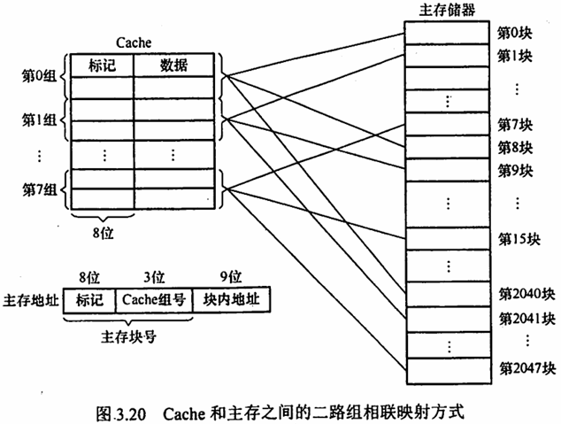

# 第 3 章 存储系统

## Intro

**【考纲内容】**

1. 存储器的分类
2. 层次化存储器的基本结构
3. 半导体随机存取存储器
   SRAM、DRAM、Flash 存储器
4. 主存储器
   DRAM 芯片和内存条、多模块存储器、主存和 CPU 之间的连接
5. 外部存储器
   磁盘存储器、固态硬盘（SSD）
6. 高速缓冲存储器（Cache）
   Cache 的基本原理；Cache 和主存之间的映射方式
   Cache 中主存块的替换算法；Cache 写策略
7. 虚拟存储器
   虚拟存储器的基本概念
   页式虚拟存储器：基本原理、页表、地址转换、TLB（快表）
   段式虚拟存储器的基本原理；段页式虚拟存储器的基本原理

**【复习提示】**

- 有关 Cache 和虚拟存储器的考点容易出综合题。
- 存储器的特点，存储器的扩展（芯片选择、连接方式、地址范围等），交叉存储器，Cache 的相关计算与替换算法，虚拟存储器与快表也容易出选择题。
- 需掌握存在 Cache 和 TLB 的计算机中的地址翻译与 Cache 映射问题


## 一、存储器概述 

### 0x00 存储器的分类

#### 1. 按在计算机中的作用（层次）分类 

1. **主存储器**（内存）：存放计算机运行期间所需的程序和数据，CPU 可以直接随机访问，也可与高速缓冲存储器（Cache）及辅助存储器交换数据。特点：容量小、速度快、价格高。
2. **辅助存储器**（外存）：存放当前暂时不用的程序和数据，以及需要永久保存的信息。辅存的内容需要调入主存后才能被 CPU 访问。特点：容量大、速度慢、价格低。
3. **高速缓冲存储器**（Cache）：位于主存和 CPU 之间，存放 CPU 经常使用的指令和数据，以便高速访问。特点：速度快、容量小、价格高。现代计算机通常将其集成在 CPU 中。

#### 2. 按存储介质分类

存储器按存储介质可分为：
- **磁表面存储器**：磁盘、磁带
- **磁芯存储器**
- **半导体存储器**：MOS 型存储器、双极型存储器
- **光存储器**：光盘

#### 3. 按存取方式分类

1. **随机存储器**（RAM）：任何一个存储单元都可以随机存取，存取时间与物理位置无关。优点：读写方便、使用灵活，主要用作主存或高速缓冲存储器。RAM 分为静态 RAM 和动态 RAM。
2. **只读存储器**（ROM）：只能随机读出，不能写入。信息一旦写入即固定不变，即使断电，内容也不会丢失。用于存放固定程序、常数和字库等。ROM 和 RAM 的存取方式均为随机存取。广义 ROM 可通过电擦除写入，但写入速度较慢。
3. **串行访问存储器**：读/写操作需按物理位置的顺序寻址，包括顺序存取存储器（如磁带）与直接存取存储器（如磁盘、光盘）。顺序存取存储器按顺序存取，存取时间与物理位置有关，速度慢。直接存取存储器介于随机存取和顺序存取之间。

#### 4. 按信息的可保存性分类

1. **易失性存储器**：如 RAM，断电后信息消失。
2. **非易失性存储器**：如 ROM、磁表面存储器和光存储器，断电后信息仍保持。
3. **破坏性读出**：读取信息时，原存储信息被破坏，需再生操作恢复信息。
4. **非破坏性读出**：读取信息时，原存储信息不被破坏。

#### 存储器分类总结

- **按作用（层次）分类**：
  - 主存储器（内存）
  - 辅助存储器（外存）
  - 高速缓冲存储器（Cache）
  
- **按存储介质分类**：
  - 磁表面存储器
  - 磁芯存储器
  - 半导体存储器
  - 光存储器
  
- **按存取方式分类**：
  - 随机存储器（RAM）
  - 只读存储器（ROM）
  - 串行访问存储器

- **按信息的可保存性分类**：
  - 易失性存储器
  - 非易失性存储器
  - 破坏性读出
  - 非破坏性读出


### 0x01 存储器的性能指标

存储器有三个主要性能指标，即存储容量、单位成本和存储速度。这三个指标相互制约，设计存储器系统所追求的目标是大容量、低成本和高速度。

1. **存储容量**
   存储容量 = 存储字数 × 字长（如 1M × 8 位）。单位换算：1B（Byte，字节）= 8b（bit，位）。存储字数表示存储器的地址空间大小，字长表示一次存取操作的数据量。

2. **单位成本**
   每位价格 = 总成本 / 总容量。

3. **存储速度**
   数据传输率 = 数据宽度 / 存取周期（或称存储周期）。
   - **存取时间（$T_a$）**：存取时间是指从启动一次存储器操作到完成该操作所经历的时间，分为读出时间和写入时间。
   - **存取周期（$T_m$）**：存取周期又称读写周期或访问周期。它是指存储器进行一次完整的读写操作所需的全部时间，即连续两次独立访问存储器操作（读或写操作）之间所需的最小时间间隔。
   - **主存带宽（$B_m$）**：主存带宽又称数据传输率，表示每秒从主存进出信息的最大数量，单位为字/秒、字节/秒（B/s）或位/秒（b/s）。

存取时间不等于存取周期，通常存取周期大于存取时间。这是因为对任何一种存储器，在读写操作之后，总要有一段恢复内部状态的复原时间。对于破坏性读出的存储器，存取周期往往比存取时间大得多，甚至可达 $T_m = 2T_a$，因为存储器中的信息读出后需要马上进行再生。

存取时间与存取周期的关系如图 3.1 所示：


### 0x02 多级层次的存储系统

为了解决存储系统大容量、高速度和低成本三者相互制约的矛盾，在计算机系统中，通常采用多级存储器结构，如图 3.2 所示。在图中由上至下，位价越来越低，速度越来越慢，容量越来越大，CPU 访问的频度也越来越低。
实际上，存储系统层次结构主要体现在 Cache-主存层和主存-辅存层。前者主要解决 CPU 和主存速度不匹配的问题，后者主要解决存储系统的容量问题。在存储体系中，Cache 和主存能与 CPU 直接交换信息，而辅存则要通过主存与 CPU 交换信息；主存与 CPU、Cache、辅存都能交换信息，如图 3.3 所示。


存储器层次结构的主要思想是上一层的存储器作为低一层存储器的高速缓存。

- 从 CPU 的角度看，Cache-主存层速度接近于 Cache，容量和位价却接近于主存
- 从主存-辅存层分析，其速度接近于主存，容量和位价却接近于辅存

这就解决了速度、容量、成本三者之间的矛盾，现代计算机系统几乎都采用这种三级存储系统。需要注意的是，

- 主存和 Cache 之间的数据调动是由硬件自动完成的，对**所有程序员**均是透明的
- 而主存和辅存之间的数据调动则是由硬件和操作系统共同完成的，对**应用程序员**是透明的。

在主存-辅存层的不断发展中，逐渐形成了虚拟存储系统。在这个系统中，程序员编程的地址范围与虚拟存储器的地址空间相对应。对于具有虚拟存储器的计算机系统而言，编程时可用的地址空间远大于主存空间。

需要注意的是，在 Cache-主存层和主存-辅存层中，上一层中的内容都只是下一层中的内容的副本，也即 Cache（或主存）中的内容只是主存（或辅存）中的内容的一部分。


## 二、主存储器

主存储器一般由 DRAM 实现，Cache 一般由 SRAM 实现，它们都属于易失性存储器，只要电源被切断，原来保存的信息便会丢失。DRAM 的每位价格低于 SRAM，速度也慢于 SRAM。

### 0x00 SRAM 芯片和 DRAM 芯片

#### 1. SRAM 的工作原理

通常把存放一个二进制位的物理器件称为**存储元**，它是存储器的最基本构件。地址码相同的多个存储元构成一个**存储单元**，若干存储单元的集合构成存储体。
静态随机存储器（SRAM）的存储元是用双稳态触发器（六晶体管 MOS）来记忆信息的，因此即使信息被读出后，它仍保持其原状态而不需要再生（非破坏性读出）。SRAM 的存取速度快，但集成度低，功耗较大，价格昂贵，一般用于高速缓冲存储器。

#### 2. DRAM 的工作原理

与 SRAM 的存储原理不同，动态随机存储器（DRAM）是利用存储元电路中栅极电容上的电荷来存储信息的。DRAM 的基本存储元通常只使用一个晶体管，所以它比 SRAM 的密度要高很多。相对于 SRAM 来说，DRAM 具有容易集成、位价低、容量大和功耗低等优点，但 DRAM 的存取速度比 SRAM 的慢，一般用于大容量的主存系统。DRAM 电容上的电荷一般只能维持 1～2 ms，因此即使电源不断电，信息也会自动消失。为此，每隔一定时间必须刷新，通常取 2 ms，称为刷新周期。常用的刷新方式有三种：
1. **集中刷新**：指在一个刷新周期内，利用一段固定的时间，依次对存储器的所有行进行逐一再生，在此期间停止对存储器的读写操作，称为“死时间”，又称访存“死区”。优点是读写操作时不受刷新工作的影响；缺点是在集中刷新期间（死区）不能访问存储器。
2. **分散刷新**：将刷新周期分为两部分：前半部分用于正常读、写或保持；后半部分用于刷新。这种刷新方式增加了系统的存取周期，如存储芯片的存取周期为 0.5 µs，则系统的存取周期为 1 µs。优点是没有死区；缺点是加长了系统的存取周期，降低了整机的速度。
3. **异步刷新**：异步刷新是前两种方法的结合，它既可缩短“死时间”，又能充分利用最大刷新间隔为 2 ms 的特点。具体做法是将刷新周期除以行数，得到两次刷新操作之间的时间间隔 $t$，利用逻辑电路每隔时间 $t$ 产生一次刷新请求。这样可以避免使 CPU 连续等待过长的时间，而且减少了刷新次数，从根本上提高了整机的工作效率。DRAM 的刷新需要注意以下问题：
    1. 刷新对 CPU 是透明的，即刷新不依赖于外部的访问；
    2. 动态 RAM 的刷新单位是行，由芯片内部自行生成行地址；
    3. 刷新操作类似于读操作，但又有所不同。另外，刷新时不需要选片，即整个存储器中的所有芯片同时被刷新。

#### 3. DRAM 芯片的读写周期

在读周期中，为使芯片能正确接收行、列地址，在 $\overline{RAS}$ 有效前将行地址送到芯片的地址引脚，$\overline{CAS}$ 滞后 $\overline{RAS}$ 一段时间，在 $\overline{CAS}$ 有效前再将列地址送到芯片的地址引脚。$\overline{RAS}$、$\overline{CAS}$ 应至少保持 $t_{RAS}$ 和 $t_{CAS}$ 的时间。在读周期中 WE 为高电平，并在 $\overline{CAS}$ 有效前建立。

在写周期中，行列选通的时序关系和读周期相同。在写周期中 $\overline{WE}$ 为低电平，同样在 $\overline{CAS}$ 有效前建立。为了保证数据可靠地写入，写数据必须在 $\overline{CAS}$ 有效前在数据总线上保持稳定。读（写）周期时间 $t_{RC}$（$t_{WC}$）表示 DRAM 芯片进行两次连续读（写）操作时所必须间隔的时间。DRAM 芯片读写周期的时序图如图 3.4 所示：


#### 4. SRAM 和 DRAM 的比较

表 3.1 详细列出了 SRAM 和 DRAM 各自的特点。

| 类型       | SRAM     | DRAM     |
| ---------- | -------- | -------- |
| 存储信息   | 触发器   | 电容     |
| 破坏性读出 | 否       | 是       |
| 刷新       | 不需要   | 需要     |
| 地址发送   | 同时送   | 分两次送 |
| 运行速度   | 快       | 慢       |
| 集成度     | 低       | 高       |
| 存储成本   | 高       | 低       |
| 主要用途   | 高速缓存 | 主机内存 |

#### 5. 存储器芯片的内部结构

如图 3.5 所示，存储器芯片由存储体、I/O 读写电路、地址译码和控制电路等部分组成。


1. **存储体（存储矩阵）**：存储体是存储单元的集合，它由行选择线（X）和列选择线（Y）来选择所访问单元，存储体的相同行、列上的位同时被读出或写入。
2. **地址译码器**：用来将地址转换为译码输出线上的高电平，以便驱动相应的读写电路。
3. **I/O 控制电路**：用以控制被选中的单元的读出或写入，具有放大信息的作用。
4. **片选控制信号**：单个芯片容量太小，往往满足不了计算机对存储器容量的要求，因此需用一定数量的芯片进行存储器的扩展。在访问某个字时，必须“选中”该存储字所在的芯片，而其他芯片不被“选中”，因此需要有片选控制信号。
5. **读/写控制信号**：根据 CPU 给出的读命令或写命令，控制被选中单元进行读或写。


### 0x01 只读存储器

#### 1. 只读存储器（ROM）的特点

ROM 和 RAM 都是支持随机访问的存储器，其中 SRAM 和 DRAM 均为易失性半导体存储器，而 ROM 中一旦有了信息，就不能轻易改变，即使掉电也不会丢失，它在计算机系统中是只供读出的存储器。ROM 器件有两个显著的优点：
1. 结构简单，所以位密度比可读写存储器的高。
2. 具有非易失性，所以可靠性高。

#### 2. ROM 的类型

根据制造工艺的不同，ROM 可分为掩模式只读存储器（MROM）、一次可编程只读存储器（PROM）、可擦除可编程只读存储器（EPROM）、Flash 存储器和固态硬盘（SSD）。

1. **掩模式只读存储器（MROM）**
   MROM 的内容由半导体制造厂按用户提出的要求在芯片的生产过程中直接写入，写入以后任何人都无法改变其内容。优点是可靠性高，集成度高，价格便宜；缺点是灵活性差。

2. **一次可编程只读存储器（PROM）**
   PROM 的程序一旦写入，内容就无法改变。

3. **可擦除可编程只读存储器（EPROM）**
   EPROM 既可读又可写，但它不能取代 RAM，因为 EPROM 的编程次数有限，且写入时间过长。

4. **Flash 存储器**
   Flash 存储器是在 EPROM 和 E²PROM 的基础上发展起来的，其主要特点是既可在不加电的情况下长期保存信息，又能在线进行快速擦除与重写。Flash 存储器既有 EPROM 的价格便宜、集成度高的优点，又有 E²PROM 电可擦除重写的特点，且擦除重写的速度快。

5. **固态硬盘（Solid State Drives, SSD）**
   基于闪存的固态硬盘是用固态电子存储芯片阵列制成的硬盘，由控制单元和存储单元（Flash 芯片）组成。保留了 Flash 存储器长期保存信息、快速擦除与重写的特性。相比传统硬盘，固态硬盘具有读写速度快、低功耗的特性，缺点是价格较高。


### 0x02 主存储器的基本组成

图 3.6 是主存储器（Main Memory, MM）的基本组成框图，其中由一个个存储 0 或 1 的记忆单元（也称存储元件）构成的存储矩阵（也称存储体）是存储器的核心部分。记忆单元是具有两种稳态的能表示二进制 0 和 1 的物理器件。为了存取存储体中的信息，必须对存储单元编号（也称编址）。编址单位是指具有相同地址的那些存储元件构成的一个单位，可以按字节编址，也可以按字编址。现代计算机通常采用字节编址方式，此时存储体内的一个地址中有 1 字节。


指令执行过程中需要访问主存时，CPU 首先把被访问单元的地址送到 MAR（内存地址寄存器）中，然后通过地址线将主存地址送到主存中的地址寄存器，以便地址译码器进行译码选中相应单元。同时，CPU 将读写信号通过控制线送到主存的读写控制电路。如果是写操作，那么 CPU 同时将要写的信息送到 MDF（内存数据寄存器）中，在读写控制电路的控制下，经数据线将信号写入选中的单元；如果是读操作，那么主存读出选中单元的内容送到数据线，然后送到 MDR（内存数据寄存器）中。数据线的宽度与 MDR 的宽度相同，地址线的宽度与 MAR 的宽度相同。图 3.6 采用 64 位数据线，所以在按字节编址方式下，每次最多可以存取 8 个单元的内容。地址线的位数决定了主存地址空间的最大可寻址范围。例如，36 位地址的最大寻址范围为 $0 \sim 2^{36}-1$，即地址从 0 开始编号。

DRAM 芯片容量较大，地址位数较多，为了减少芯片的地址引脚数，通常采用地址引脚复用技术，行地址和列地址通过相同的引脚分先后两次输入，这样地址引脚数可减少一半。

### 0x03 多模块存储器

多模块存储器是一种空间并行技术，利用多个结构完全相同的存储模块的并行工作来提高存储器的吞吐率。常用的有单体多字存储器和多体低位交叉存储器。注意：CPU 的速度比存储器的快，若同时从存储器中取出 $n$ 条指令，就可充分利用 CPU 资源，提高运行速度。多体交叉存储器就是基于这种思想提出的。

#### 1. 单体多字存储器

单体多字系统的特点是存储器中只有一个存储体，每个存储单元存储 $m$ 个字，总线宽度也为 $m$ 个字。一次并行读出 $m$ 个字，地址必须顺序排列并处于同一存储单元。

单体多字系统在一个存取周期内，从同一地址取出 $m$ 条指令，然后将指令逐条送至 CPU 执行，即每隔 $1/m$ 存取周期，CPU 向主存取一条指令。这显然提高了单体存储器的工作速度。缺点：指令和数据在主存内必须是连续存放的，一旦遇到转移指令，或操作数不能连续存放，这种方法的效果就不明显。

#### 2. 多体并行存储器

多体并行存储器由多体模块组成。每个模块都有相同的容量和存取速度，各模块都有独立的读写控制电路、地址寄存器和数据寄存器。它们既能并行工作，又能交叉工作。多体并行存储器分为高位交叉编址和低位交叉编址两种。

1. **高位交叉编址（顺序方式）**
   高位地址表示体号，低位地址为体内地址。如图 3.7 所示，存储器共有 4 个模块 $M_0 \sim M_3$，每个模块有 $n$ 个单元，各模块的地址范围如图中所示。

   

   高位交叉方式下，总是把低位的体内地址送到由高位体号确定的模块内进行译码。访问一个连续主存块时，总是先在一个模块内访问，等到该模块访问完才转到下一个模块访问，CPU 总是按顺序访问存储模块，各模块不能被并行访问，因而不能提高存储器的吞吐率。
   注意：模块内的地址是连续的，存取方式仍是串行存取，因此这种存储器仍是顺序存储器。
   
2. **低位交叉编址（交叉方式）**
   低位地址为体号，高位地址为体内地址。如图 3.8 所示，每个模块按“模 $m$”交叉编址，
   模块号 = 单元地址 % $m$，假定有 $m$ 个模块，每个模块有 $k$ 个单元，
   则 $0, m, 2m, \ldots, (k-1)m$ 单元位于 $M_0$，
   第 $1, m+1, 2m+1, \ldots, (k-1)m+1$ 单元位于 $M_1$；
   以此类推。

   
   
   低位交叉方式下，总是把高位的体内地址送到由低位体号确定的模块内进行译码。程序连续存放在相邻模块中，因此称采用此编址方式的存储器为交叉存储器。采用低位交叉编址后，可在不改变每个模块存取周期的前提下，采用流水线的方式并行存取，提高存储器的带宽。

   设模块字长等于数据总线宽度，模块存取一个字的存取周期为 $T$，总线传送周期为 $r$，为实现流水线方式存取，存储器交叉模块数应大于等于 $m = T/r$。
   式中，$m$ 称为交叉存取度。每经过 $r$ 时间延迟后启动下一个模块，交叉存储器要求其模块数必须大于等于 $m$，以保证启动某模块后经过 $m \cdot r$ 的时间后再次启动该模块时，其上次的存取操作已经完成（即流水线不间断）。这样，连续存取 $m$ 个字所需的时间为
   $$
   t_1 = T + (m - 1)r
   $$
   而顺序方式连续读取 $m$ 个字所需的时间为
   
   $$
   t_2 = mT
   $$
   可见低位交叉存储器的带宽大大提高。模块数为 4 的流水线方式存取示意图如图 3.9 所示，其中，每个长方形错开的距离应该就是 $r$。
   
   
   

> 例题：设存储器容量为 32 个字，字长为 64 位，模块数 $m=4$，分别采用顺序方式和交叉方式进行组织。存储周期 $T=200$ ns，数据总线宽度为 64 位，总线传输周期 $r=50$ ns。在连续读出 4 个字的情况下，求顺序存储器和交叉存储器各自的带宽。
>
> **解**：
> 顺序存储器和交叉存储器连续读出 $m=4$ 个字的信息总量均是
> $$
> q = 64 \text{ 位} \times 4 = 256 \text{ 位}
> $$
> 顺序存储器和交叉存储器连续读出 4 个字所需的时间分别是
>
> $$
> t_1 = mT = 4 \times 200 \text{ ns} = 800 \text{ ns}
> $$
>
> $$
> t_2 = T + (m-1)r = 200 \text{ ns} + 3 \times 50 \text{ ns} = 350 \text{ ns}
> $$
>
> 顺序存储器和交叉存储器的带宽分别是
>
> $$
> W_1 = \frac{q}{t_1} = \frac{256}{800 \times 10^{-9}} = 32 \times 10^6 \text{ b/s}
> $$
>
> $$
> W_2 = \frac{q}{t_2} = \frac{256}{350 \times 10^{-9}} = 73 \times 10^6 \text{ b/s}
> $$
>
> 由此可见，交叉存储器的带宽明显高于顺序存储器。


## 三、主存储器与 CPU 的连接

### 0x01 连接原理

1. 主存储器通过数据总线、地址总线和控制总线与 CPU 连接。
2. 数据总线的位数与工作频率的乘积正比于数据传输率。
3. 地址总线的位数决定了可寻址的最大内存空间。
4. 控制总线（读/写）指出总线周期的类型和本次输入/输出操作完成的时刻。

主存储器与 CPU 的连接如图 3.10 所示。


单个芯片的容量不可能很大，往往通过存储器芯片扩展技术，将多个芯片集成在一个内存条上，然后由多个内存条及主板上的 ROM 芯片组成计算机所需的主存空间，再通过总线与 CPU 相连。图 3.11 是存储控制器、存储器总线和内存条的连接关系示意图。


在图 3.11 中，内存条插槽就是存储器总线，内存条中的信息通过内存条的引脚，再通过插槽内的引线连接到主板上，通过主板上的导线连接到 CPU 芯片。


### 0x01 主存容量的扩展

由于单个存储芯片的容量是有限的，它在字数或字长方面与实际存储器的要求都有差距，因此需要在字和位两方面进行扩充才能满足实际存储器的容量要求。通常采用位扩展法、字扩展法和字位同时扩展法来扩展主存容量。

#### 1. 位扩展法

CPU 的数据线数与存储芯片的数据位数不一定相等，此时必须对存储芯片扩位（即进行扩展，用多个存储器件对字长进行扩充，增加存储字长），使其数据位数与 CPU 的数据线数相等
位扩展的连接方式是将多个存储芯片的地址端、片选端和读写控制端相应并联，数据端分别引出

如图 3.12 所示，用 8 片 8K×1 位的 RAM 芯片组成 8K×8 位的存储器。
8 片 RAM 芯片的地址 $A_{12}\sim A_0$、$\overline{CS}$、$\overline{WE }$ 都分别连在一起，每片的数据线依次作为 CPU 数据线的一位。


> 注意：仅采用位扩展时，各芯片连接地址线的方式相同，但连接数据线的方式不同，在某一时刻选中所有的芯片，所以片选信号 $\overline{CS}$ 要连接到所有芯片。

#### 2. 字扩展法

字扩展是指增加存储器中字的数量，而位数不变。字扩展将芯片的地址线、数据线、读写控制线相应并联，而由片选信号来区分各芯片的地址范围。

如图 3.13 所示，用 4 片 16K×8 位的 RAM 芯片组成 64K×8 位的存储器。4 片 RAM 芯片的数据线 $D_0\sim D_7$ 和 $\overline{WE}$ 都分别连在一起。将 $A_{15}A_{14}$ 用作片选信号，$A_{15}A_{14}=00$ 时，译码器输出端 0 有效，选中最左边的 1 号芯片；$A_{15}A_{14}=01$ 时，译码器输出端 1 有效，选中 2 号芯片，以此类推。在某一时刻内只能有一个芯片被选中。各芯片的地址分配如下：

- 第 1 片，最低地址：00 00000000000000；最高地址：00 11111111111111（16 位）
- 第 2 片，最低地址：01 00000000000000；最高地址：01 11111111111111
- 第 3 片，最低地址：10 00000000000000；最高地址：10 11111111111111
- 第 4 片，最低地址：11 00000000000000；最高地址：11 11111111111111


> 注意：仅采用字扩展时，各芯片连接地址线的方式相同，连接数据线的方式也相同，但在某一时刻只需选中部分芯片，所以通过片选信号 $\overline{CS}$ 或采用译码器设计连接到相应的芯片。

#### 3. 字位同时扩展法

存储器往往需要同时扩充字和位。字位同时扩展是指既增加存储字的数量，又增加存储字长。

如图 3.14 所示，用 8 片 16K×4 位的 RAM 芯片组成 64K×8 位的存储器。
每两片构成一组 16K×8 位的存储器（位扩展），4 组便构成 64K×8 位的存储器（字扩展）
地址线 $A_{15}A_{14}$ 经译码器得到 4 个片选信号，

- $A_{15}A_{14}=00$ 时，输出端 0 有效，选中第一组的芯片（①和②）
- $A_{15}A_{14}=01$ 时，输出端 1 有效，选中第二组的芯片（③和④），以此类推。


> 注意：采用字位同时扩展时，各芯片连接地址线的方式相同，但连接数据线的方式不同，而且需要通过片选信号 $\overline{CS}$ 或采用译码器设计连接到相应的芯片。


### 0x02 存储芯片的地址分配和片选

CPU 要实现对存储单元的访问，首先要选择存储芯片，即进行片选；然后为选中的芯片依地址码选择相应的存储单元，以进行数据的存取，即进行字选。片内的字选通常是由 CPU 送出的 N 条低位地址线完成的，地址线直接接到所有存储芯片的地址输入端（N 由片内存储容量 $2^N$ 决定）。片选信号的产生分为线选法和译码片选法。

#### 1. 线选法

线选法用除片内寻址外的高位地址线直接（或经反相器）分别接至各个存储芯片的片选端，当某地址线信息为“0”时，就选中与之对应的存储芯片。这些片选地址线每次寻址时只能有一位有效，不允许同时有多位有效，这样才能保证每次只选中一个芯片。表 3.2 展示了线选法的地址分配（或芯片组）。

假设 4 片 2K×8 位存储芯片用线选法构成 8K×8 位存储器，各芯片的片选信号见表 3.2，其中低位地址线 $A_{10}\sim A_0$ 作为字选线，用于片内寻址。

表 3.2 线选法的地址分配

| 芯片编号 | $A_{14}\sim A_{11}$ |
| -------- | ------------------- |
| 1        | 1101                |
| 2        | 1011                |
| 3        | 0111                |
| 4        | 1110                |

优点：不需要地址译码器，线路简单。
缺点：地址空间不连续，选片的地址线必须分时为低电平（否则不能工作），不能充分利用系统的存储器空间，造成地址资源的浪费。

#### 2. 译码片选法

译码片选法用除片内寻址外的高位地址线通过地址译码器芯片产生片选信号。
如用 8 片 8K×8 位的存储芯片组成 64K×8 位存储器（地址线为 16 位，数据线为 8 位），需要 8 个片选信号；
若采用线选法，除去片内寻址的 13 位地址线，仅余高 3 位，不足以产生 8 个片选信号。
因此，采用译码片选法，即用一片 74LS138 作为地址译码器，则 $A_{15}A_{14}A_{13}=000$ 时选中第一片，$A_{15}A_{14}A_{13}=001$ 时选中第二片，以此类推（即 3 位二进制编码）。


### 0x03 存储器与 CPU 的连接

#### 1. 合理选择存储芯片

要组成一个主存系统，选择存储芯片是第一步，主要指存储芯片的类型（RAM 或 ROM）和数量的选择。通常选用 ROM 存放系统程序、标准子程序和各类常数，RAM 则是为用户编程而设置的。此外，在考虑芯片数量时，要尽量使连线简单、方便。

#### 2. 地址线的连接

存储芯片的容量不同，其地址线数也不同，而 CPU 的地址线数往往比存储芯片的地址线数要多。通常将 CPU 地址线的低位与存储芯片的地址线相连，以选择芯片中的某一单元（字选），这部分的译码是由芯片的片内逻辑完成的。而 CPU 地址线的高位则在扩充存储芯片时使用，用来选择存储芯片（片选），这部分译码由外接译码器逻辑完成。

例如，设 CPU 地址线为 16 位，即 $A_{15}\sim A_0$，1K×4 位的存储芯片仅有 10 根地址线，此时可将 CPU 的低位地址 $A_9\sim A_0$ 与存储芯片的地址线 $A_9\sim A_0$ 相连。

#### 3. 数据线的连接

CPU 的数据线数与存储芯片的数据线数不一定相等。在相等时可直接相连
在不等时必须对存储芯片扩位，使其数据位数与 CPU 的数据线数相等。

#### 4. 读/写命令线的连接

CPU 读/写命令线一般可直接与存储芯片的读/写控制端相连，通常高电平为读，低电平为写。有些 CPU 的读/写命令线是分开的（读为 $\overline{RD}$，写为 $\overline{WE}$，均为低电平有效），此时 CPU 的读命令线应与存储芯片的允许读控制端相连，而 CPU 的写命令线则应与存储芯片的允许写控制端相连。

#### 5. 片选线的连接

片选线的连接是 CPU 与存储芯片连接的关键。存储器由许多存储芯片叠加而成，哪一片被选中完全取决于该存储芯片的片选控制端 $\overline{CS}$ 是否能接收到来自 CPU 的片选有效信号。

片选有效信号与 CPU 的访存控制信号 $\overline{MREQ}$（低电平有效）有关，因为只有当 CPU 要求访存时，才要求选中存储芯片。若 CPU 访问 I/O，则 $\overline{MREQ}$ 为高，表示不要求存储器工作。


## 四、外部存储器

### 0x00 磁盘存储器

磁盘存储器的优点：
1. 存储容量大，位价格低。
2. 记录介质可重复使用。
3. 记录信息可长期保存而不丢失，甚至可脱机存档。
4. 非破坏性读出，读出时不需要再生。

缺点：存取速度慢，机械结构复杂，对工作环境要求较高。

#### 1. 磁盘存储器

##### (1) 磁盘设备的组成
1. **硬盘存储器的组成**
   硬盘存储器由磁盘驱动器、磁盘控制器和盘片组成。
   - **磁盘驱动器**
     核心部件是磁头组件和盘片组件，温彻斯特盘是一种可移动磁头固定盘片的硬盘存储器。
   - **磁盘控制器**
     硬盘存储器和主机的接口，主流的标准有 IDE、SCSI、SATA 等。
2. **存储区域**
   一块硬盘含有若干记录面，每个记录面划分为若干磁道，而每条磁道又划分为若干扇区，扇区（也称块）是磁盘读写的最小单位，即磁盘按块存取。
   - **磁头数（Heads）**：即记录面数，表示硬盘共有多少个磁头，磁头用于读取/写入盘片上记录面的信息，一个记录面对应一个磁头。
   - **柱面数（Cylinders）**：表示硬盘每面盘片上有多少条磁道。在一个盘组中，不同记录面的相同编号（位置）的诸磁道构成一个圆柱面。
   - **扇区数（Sectors）**：表示每条磁道上有多少个扇区。

##### (2) 磁记录原理
- **原理**：磁头和磁性记录介质相对运动时，通过电磁转换完成读/写操作。
- **编码方法**：按某种方案（规律），把一连串的二进制信息变换成存储介质磁层中一个磁化翻转状态的序列，并使读/写控制电路容易、可靠地实现转换。
- **磁记录方式**：通常采用调频制（FM）和改进型调频制（MFM）的记录方式。

##### (3) 磁盘的性能指标
1. **记录密度**
   记录密度是指盘片单位面积上记录的二进制信息量，通常以道密度、位密度和面密度表示。道密度是沿磁盘半径方向单位长度上的磁道数，位密度是磁道单位长度上能记录的二进制代码位数，面密度是位密度和道密度的乘积。
2. **磁盘的容量**
   磁盘容量有非格式化容量和格式化容量之分。非格式化容量是指磁记录表定的记录格式所能存储信息的总量。格式化后的容量比非格式化容量要小。
3. **平均存取时间**
   平均存取时间由寻道时间（磁头移动到目的磁道的时间）、旋转延迟时间（磁头定位到要读写扇区的时间）和传输时间（传输数据所花费的时间）三部分构成。由于寻道和找扇区的距离远近不一，故寻道时间和旋转延迟时间通常取平均值。
4. **数据传输率**
   磁盘存储器在单位时间内向主机传送数据的字节数，称为数据传输率。假设磁盘转数为 $r$ 转/秒，每条磁道容量为 $N$ 字节，则数据传输率为 $D_t = rN$。

##### (4) 磁盘地址
主机向磁盘控制器发送寻址信息，磁盘的地址一般如下图所示：


##### (5) 硬盘的工作过程
硬盘的主要操作是寻址、读盘、写盘。每个操作都对应一个控制字，硬盘工作时，第一步是取控制字，第二步是执行控制字。
硬盘属于机械式部件，其读写操作是串行的，不可能在同一时刻既读又写，也不可能在同一时刻读两组数据或写两组数据。

#### 2. 磁盘阵列

RAID（独立冗余磁盘阵列）是指将多个独立的物理磁盘组成一个独立的逻辑盘，数据在个物理盘上分割交叉存储、并行访问，具有更好的存储性能、可靠性和安全性。RAID 的分级如下所示：

- **RAID 0**：无冗余和无校验的磁盘阵列。
- **RAID 1**：镜像磁盘阵列。
- **RAID 2**：采用纠错的海明码的磁盘阵列。
- **RAID 3**：位交叉奇偶校验的磁盘阵列。
- **RAID 4**：块交叉奇偶校验的磁盘阵列。
- **RAID 5**：无独立校验的奇偶校验磁盘阵列。

RAID 0 把连续多个数据块交替地存放在不同物理磁盘的扇区中，几个磁盘交叉并行读写，不仅扩大了存储容量，而且提高了磁盘数据存取速度，但 RAID 0 没有容错能力。为了提高可靠性，RAID 1 使两个磁盘同时进行读写，互为备份，若一个磁盘出现故障，可从另一磁盘中读出数据。两个磁盘当一个磁盘使用，意味着容量减少一半。

总之，RAID 
通过同时使用多个磁盘，提高了传输率；
通过在多个磁盘上并行存取来大幅提高存储系统的数据吞吐量；
通过镜像功能，提高安全可靠性；
通过数据校验，提供容错能力。


### 0x01 固态硬盘

固态硬盘（SSD）是一种基于闪存技术的存储器。它与 U 盘没有本质上的差别，只是容量更大，存取性能更好。一个 SSD 由一个或多个闪存芯片和闪存翻译层组成，闪存芯片替代传统旋转磁盘中的机械驱动器，而闪存翻译层将来自 CPU 的逻辑块读写请求翻译成对底层物理设备的读写控制信号。因此，这个闪存翻译层相当于扮演了磁盘控制器的角色。

如图 3.15 所示，一个闪存由 $B$ 个块（Block）组成，每块由 $P$ 个页（Page）组成。通常，页的大小是 512B～4KB，每块由 32～128 页组成；块的大小为 16KB～512KB。数据是以页为单位读写的。只有在一页所属的块整个被擦除后，才能写这一页。不过，一旦一个块被擦除，块中的每个页都可以直接再写一次。某个块进行了约 10 万次重复写之后，就会磨损坏，不能再使用。


随机写很慢，有两个原因。首先，擦除块比较慢，1ms 级，比访问页高一个数量级。其次，如果写操作试图修改一个包含已有数据的页 $P_i$，那么这个块中所有含有用数据的页都必须被复制到一个新（擦除过的）块中，才能进行对页 $P_i$ 的写。

比起传统磁盘，SSD 有很多优点，它由半导体存储器构成，没有移动的部件，因而随机访问时间比机械磁盘要快很多，也没有任何机械噪声和震动，能耗更低，抗震性好，安全性高等。不过，SSD 也有缺点，因为反复写之后，闪存块会磨损，所以 SSD 也容易磨损。闪存翻译层中有一个平均磨损逻辑试图通过将擦除平均分布在所有的块上来最大化每个块的寿命。实际上，平均磨损逻辑处理得非常好，要很多年 SSD 才会磨损坏。

随着技术的不断发展，价格也不断下降，SSD 有望逐步取代传统机械硬盘。


## 五、高速缓冲存储器

由于程序的转移概率不会很低，数据分布的离散性较大，所以单纯依靠并行主存系统提高主存系统的频宽是有限的。这就必须从系统结构上进行改进，即采用存储体系。通常将存储系统分为“Cache-主存”层次和“主存-辅存”层次。

### 0x00 程序访问的局部性原理

程序访问的局部性原理包括时间局部性和空间局部性。时间局部性是指在最近的未来要用到的信息，很可能是现在正在使用的信息，因为程序中存在循环。空间局部性是指在最近的未来要用到的信息，很可能与现在正在使用的信息在存储空间上是邻近的，因为指令通常是顺序存放、顺序执行的，数据一般也是以向量、数组等形式簇聚地存储在一起的。高速缓冲技术就是利用局部性原理，把程序中正在使用的部分数据存放在一个高速的、容量较小的 Cache 中，使 CPU 的访存操作大多数针对 Cache 进行，从而提高程序的执行速度。

**例 3.2** 假定数组元素按行优先方式存储，对于下面的两个函数：

1. 对于数组 a 的访问，哪个空间局部性更好？哪个时间局部性更好？
2. 对于指令访问来说，for 循环体的空间局部性和时间局部性如何？

程序 A:
```c
int sumarrayrows(int a[M][N]) {
    int i, j, sum = 0;
    for (i = 0; i < M; i++)
        for (j = 0; j < N; j++)
            sum += a[i][j];
    return sum;
}
```

程序 B:
```c
int sumarraycols(int a[M][N]) {
    int i, j, sum = 0;
    for (j = 0; j < N; j++)
        for (i = 0; i < M; i++)
            sum += a[i][j];
    return sum;
}
```

**解**：

假定 M、N 都为 2048，按字节编址，每个数组元素占 4 字节，则指令和数据在主存的存放情况如图 3.16 所示。


1. 对于数组 a，程序 A 和程序 B 的空间局部性相差较大。对于 for 内/外循环：
   - 程序 A 对数组 a 的访问顺序为 `a[0][0], a[0][1], ..., a[0][2047], a[1][0], a[1][1], ..., a[1][2047]`。由此可见，访问顺序与存放顺序是一致的，因此空间局部性好。
   - 程序 B 对数组 a 的访问顺序为 `a[0][0], a[1][0], ..., a[2047][0], a[0][1], a[1][1], ..., a[2047][1]`。由此可见，访问顺序与存放顺序不一致，每次访问都要跳过 2048 个数组元素，即 8192 字节，若主存与 Cache 的交换单位小于 8KB，则每访一个数组元素都需要装入一个主存块到 Cache 中，因而没有空间局部性。
   
   两个程序的时间局部性都差，因为每个数组元素都只被访问一次。

2. 对于 for 循环体，程序 A 和程序 B 中的访问局部性是一样的。因为循环体内指令按序连续存放，所以空间局部性好；内循环体被连续重复执行 2048×2048 次，因此时间局部性也好。

由上述分析可知，虽然程序 A 和程序 B 的功能相同，但因内、外两重循环的顺序不同而导致两者对数组 a 访问的空间局部性相差较大，从而带来执行时间的不同。有人在 2GHz Pentium 4 机器上执行上述两个程序，实际执行所需的时钟周期相差 21.5 倍！


### 0x01 Cache 的基本工作原理

Cache 位于存储器层次结构的顶层，通常由 SRAM 构成，其基本结构如图 3.17 所示。


为便于 Cache 和主存间交换信息，Cache 和主存都被划分为相等的块，Cache 块又称 Cache 行，每块由若干字节组成，块的长度称为块长（Cache 行长）。由于 Cache 的容量远小于主存的容量，所以 Cache 中的块数要远少于主存中的块数，它仅保存主存中最活跃的若干块的副本。因此，Cache 按照某种策略，预测 CPU 在未来一段时间内欲访存的数据，将其装入 Cache。

当 CPU 发出读请求时，若访存地址在 Cache 中命中，就将此地址转换成 Cache 地址，直接对 Cache 进行读操作，与主存无关；若 Cache 不命中，则仍需访问主存，并把此字所在的块一次性地从主存调入 Cache。若此时 Cache 已满，则需根据某种替换算法，用这个块替换 Cache 中原来的某块信息。整个过程全部由硬件实现。值得注意的是，CPU 与 Cache 之间的数据交换以字为单位，而 Cache 与主存之间的数据交换则以 Cache 块为单位。

> 注意：某些计算机中也采用同时访问 Cache 和主存的方式，若 Cache 命中，则主存访问终止；否则访问主存并替换 Cache。

当 CPU 发出写请求时，若 Cache 命中，有可能会遇到 Cache 与主存中的内容不一致的问题。例如，由于 CPU 写 Cache，把 Cache 某单元中的内容从 X 修改成了 X'，而主存对应单元中的内容仍然是 X，没有改变。所以若 Cache 命中，需要按照一定的写策略处理，常见的处理方法有全写法和回写法，详见本节的 Cache 写策略部分。

CPU 欲访问的信息已在 Cache 中的比率称为 Cache 的命中率。设一个程序执行期间，Cache 的总命中次数为 $N_c$，访问主存的总次数为 $N_m$，则命中率 $H$ 为：

$$
H = \frac{N_c}{N_c + N_m}
$$
可见为提高访问效率，命中率 $H$ 越接近 1 越好。设 $t_c$ 为命中时的 Cache 访问时间，$t_m$ 为未命中时的访问时间，$1 - H$ 表示未命中率，则 Cache-主存系统的平均访问时间 $T_a$ 为：

$$
T_a = H t_c + (1 - H) t_m
$$
> **例题** 假设 Cache 的速度是主存的 5 倍，且 Cache 的命中率为 95%，则采用 Cache 后，存储器性能提高多少（设 Cache 和主存同时被访问，若 Cache 命中则中断访问主存）？
>
> 解：设 Cache 的存取周期为 $t$，主存的存取周期为 $5t$，由 $H=95\%$ 得系统的平均访问时间为：
>
> $$
> T_a = 0.95 \cdot t + 0.05 \cdot 5t = 1.2t
> $$
> 可知，采用 Cache 后的存储器性能为原来的：
>
> $$
> \frac{5t}{1.2t} \approx 4.17 \text{ 倍}
> $$
> 

根据 Cache 的读、写流程，实现 Cache 时需解决以下关键问题：
1. **数据查找**：如何快速判断数据是否在 Cache 中。
2. **地址映射**：主存块如何存放在 Cache 中，如何将主存地址转换为 Cache 地址。
3. **替换策略**：Cache 满后，使用何种策略对 Cache 块进行替换或淘汰。
4. **写入策略**：如何既保证主存块和 Cache 块的数据一致性，又尽量提升效率。


### 0x02 Cache 和主存的映射方式

Cache 行中的信息是主存中某个块的副本，地址映射是指把主存地址空间映射到 Cache 地址空间，即把存放在主存中的信息按照某种规则装入 Cache。

由于 Cache 行数比主存块数少得多，因此主存中只有一部分块的信息可放在 Cache 中，因此在 Cache 中要为每块加一个标记，指明它是主存中哪一块的副本。该标记的内容相当于主存中块的编号。为了说明 Cache 行中的信息是否有效，每个 Cache 行需要一个有效位。地址映射的方法有以下三种。

#### 1. 直接映射

主存中的每一块只能装入 Cache 中的唯一位置。若这个位置已有内容，则产生块冲突，原来的块将无条件地被替换出去（无须使用替换算法）。直接映射实现简单，但不够灵活，即使 Cache 未满也可能发生冲突。直接映射的映射函数为：

$$
\text{Cache 行号} = \text{主存块号} \mod \text{Cache 总行数}
$$
假设 Cache 共有 $2^c$ 行，主存有 $2^m$ 块
在直接映射方式中，主存的第 0 块、第 $2^c$ 块、第 $2^{2c}$ 块......只能映射到 Cache 的第 0 行
而主存的第 1 块、第 $2^c + 1$ 块、第 $2^{2c} + 1$ 块......只能映射到 Cache 的第 1 行，以此类推
由映射函数可看出，主存块号的低 $c$ 位正好是它要装入的 Cache 行号。主存地址结构如图 3.18(a) 所示：


直接映射的地址结构为：

| 标记 | Cache 行号 | 块内地址 |
| :--: | :--------: | :------: |

CPU 访存过程如图 3.18(b) 所示。首先根据访存地址中间的 $c$ 位，找到对应的 Cache 行，将对应 Cache 行中的标记和主存地址的高位标记进行比较，若相等且有效位为 1，则访问 Cache“命中”，此时根据主存地址中低位的块内地址，在对应的 Cache 行中存取信息；若不相等或有效位为 0，则“不命中”，此时 CPU 从主存中读出该地址所在的一块信息送到对应的 Cache 行中，将有效位置 1，并将标记设置为地址中的高位，同时将该地址中的内容送 CPU。

伪代码形式的描述：

```python
if Cache[行号][标记] == 主存地址[高位标记] and Cache[行号][有效位] == 1:
    // Cache 命中
    数据 = Cache[行号][块内地址]
else:
    // Cache 不命中
    数据 = 主存[地址]
    Cache[行号] = 主存[块]  // 将主存块加载到 Cache 行
    Cache[行号][标记] = 主存地址[高位标记]
    Cache[行号][有效位] = 1
返回 数据
```


#### 2. 全相联映射

主存中的每一块可以装入 Cache 中的任何位置，每行的标记用于指出该行取自主存的哪一块，所以 CPU 访存时需要与所有 Cache 行的标记进行比较。全相联映射方式的优点是比较灵活，Cache 块的冲突概率低，空间利用率高，命中率也高；缺点是标记的比较速度较慢，实现成本较高，通常需采用昂贵的按内容寻址的相联存储器进行地址映射，如图 3.19 所示：


全相联映射的地址结构为：

| 标记 | 块内地址 |
| :--: | :------: |


#### 3. 组相联映射

将 Cache 分成 $Q$ 个大小相等的组，每个主存块可以装入固定组中的任意一行，即组间采用直接映射、而组内采用全相联映射的方式，如图 3.20 所示。它是对直接映射和全相联映射的一种折中方案，又称为 $r$ 路组相联映射，图 3.20 中每组有 2 个 Cache 行，因此称为二路组相联。



组相联映射的关系可以定义为：

$$
\text{Cache 组号} = \text{主存块号} \mod \text{Cache 组数(Q)}
$$

路数越大，即每组 Cache 行的数量越大，发生块冲突的概率越低，但相联比较电路也越复杂。选定适当的数量，可使组相联映射的成本接近直接映射，而性能上仍接近全相联映射。

组相联映射的地址结构为：

| 标记 | 组号 | 块内地址 |
| :--: | :--: | :------: |

CPU 访存过程如下：

- 首先根据访存地址中间的组号找到对应的 Cache 组；
- 将对应 Cache 组中每个行的标记与主存地址的高位标记进行比较；若有一个相等且有效位为 1，则访问 Cache 命中，此时根据主存地址中的块内地址，在对应 Cache 行中存取信息；
- 若都不相等或虽相等但有效位为 0，则不命中，此时 CPU 从主存中读出该地址所在的一块信息送到对应 Cache 组的任意一个空闲行中，将有效位置 1，并设置标记，同时将该地址中的内容送 CPU。

> **例 3.4** 假设某个计算机的主存地址空间大小为 256MB，按字节编址，其数据 Cache 有 8 个 Cache 行，行长为 64B。
>
> 1. 若不考虑用于 Cache 的一致维护性和替换算法控制位，并且采用直接映射方式，则该数据 Cache 的总容量为多少？
> 2. 若该 Cache 采用直接映射方式，则主存地址为 3200（十进制）的主存块对应的 Cache 行号是多少？采用二路组相联映射时又是多少？
> 3. 以直接映射方式为例，简述访存过程（设访存的地址为 0123456H）。
>
> **解**：
>
> 1. 地址长度：$\log_2(256M)=28$，Cache 行长为 64B，则块内地址位数为 $\log_2(64)=6$ 位，有 8 个 Cache 行，则 Cache 组号位数为 $\log_28=3$ 位，因此标记有 $28-6-3=19$ 位，因此 Cache 的每一行有 $1+19+64*8=532$ 位，该 Cache 的容量就有 $532\times 8=4256$ 位
> 2. 3200 转二进制 110010 000000，如果采用直接映射方式，则 Cache 行号为 2。如果采用二路组相联映射，则在第 2 组 Cache 行内，这一组中的 Cache 行号是 4 和 5
> 3. 0123456H 转二进制：100100011010 001 010110，因此，块号是 001，标记是 100100011010 
>    首先根据块号，查 Cache（即 001 号 Cache 行）中对应的主存标记位，看是否相同。
>    若相同，再看 Cache 行中的装入有效位是否为 1，若是，则表示有效，称此访问命中；
>    按块内地址 010110 读出 Cache 行所对应的单元并送入 CPU 中，完成访存。
>    若出现标记位不相等或有效位为 0 的情况，则不命中，访问主存将数据取出并送往 CPU 和 Cache 的对应块中，把主存的最高 19 位存入 001 行的 Tag 中，并将有效位置 1


总结：
- 直接映射的每个主存块只能映射到 Cache 中的某一固定行；
- 全相联映射可以映射到所有 Cache 行；
- $N$ 路组相联映射可以映射到 $N$ 行。

当 Cache 大小、主存块大小一定时：
1. 直接映射的命中率最低，全相联映射的命中率最高。
2. 直接映射的判断开销最小、所需时间最短，全相联映射的判断开销最大、所需时间最长。
3. 直接映射标记所占的额外空间开销最少，全相联映射标记所占的额外空间开销最大。


### 0x03 Cache 中主存块的替换算法

在采用全相联映射或组相联映射方式时，从主存向 Cache 传送一个新块，当 Cache 或 Cache 组中的空间已被占满时，就需要使用替换算法置换 Cache 行。而采用直接映射时，一个给定的主存块只能放到唯一的固定 Cache 行中，所以在对应 Cache 行已有一个主存块的情况下，新的主存块毫无选择地把原先已有的那个主存块替换掉，因而无须考虑替换算法。常用的替换算法有随机（RAND）算法、先进先出（FIFO）算法、近期最少使用（LRU）算法和最不经常使用（LFU）算法。其中最常考查的是 LRU 算法。

1. **随机算法**：随机地确定替换的 Cache 块。它的实现比较简单，但未依据程序访问的局部性原理，因此可能命中率较低。

2. **先进先出算法（FIFO）**：选择最早调入的行进行替换。它比较容易实现，但也未依据程序访问的局部性原理，因为最早进入的主存块也可能是目前经常要用的。

3. **近期最少使用算法（LRU）**：依据程序访问的局部性原理，选择近期内长久未访问过的 Cache 行作为替换的行，平均命中率要比 FIFO 的高，是堆栈类算法。LRU 算法对每个 Cache 行设置一个计数器，用计数值来记录主存块的使用情况，并根据计数值选择淘汰某个块，计数值的位数与 Cache 组大小有关。
   假定采用四路组相联，有 5 个主存块 {1, 2, 3, 4, 5} 映射到 Cache 的同一组，对于主存访问序列 {1, 2, 3, 4, 1, 2, 5, 1, 2, 3, 4, 5}，采用 LRU 算法的替换过程如图 3.23 所示，图中左边阴影数字对应 Cache 行的计数值，右边的数字是存放在改行中的主存块号。
   

   计数器的变化规则：

   - 命中时，所命中行的计数器清零，比起低的计数器+1，其余不变
   - 未命中且还有空闲行时，新装入行的计数器置 0，其余全+1
   - 未命中且无空闲行时，计数值为 3 的行的信息块被淘汰，新装行的块的计数器置 0，其余全+1

   当集中访问的存储区超过 Cache 组的大小时，命中率可能会变低，在上个例子中，如果将访问序列变为 `1,2,3,4,5,1,2,3,4,5,...,`，命中率就会变成 0，这种现象称作**抖动**

4. **最不经常使用算法（LFU）**：将一段时间内被访问次数最少的存储行换出。每行也设置一个计数器，新行建立后从 0 开始计数，每访问一次，被访问的行计数器加 1，需要替换时比较各特定行的计数值，将计数值最小的行换出。这种算法与 LRU 类似，但不完全相同。


### 0x04 Cache 写策略

因为 Cache 中的内容是主存块副本，当对 Cache 中的内容进行更新时，就需选用写操作策略使 Cache 内容和主存内容保持一致。此时分两种情况：

1. **Cache 写命中（write hit）**：

   - **全写法（写直通法，write-through）**：当 CPU 对 Cache 写命中时，必须把数据同时写入 Cache 和主存。当某一块需要替换时，不必把这一块写回主存，用新调入的块直接覆盖即可。这种方法实现简单，能随时保持主存数据的正确性。缺点是增加了访存次数，降低了 Cache 的效率。为减少全写法直接写入主存的时间损耗，在 Cache 和主存之间加一个写缓冲（Write Buffer），如下图所示。CPU 同时写数据到 Cache 和写缓冲中，写缓冲再控制将内容写入主存。写缓冲是一个 FIFO 队列，可以解决速度不匹配的问题，但若出现频繁写时，会使写缓冲饱和溢出。
     

   - **回写法（write-back）**：当 CPU 对 Cache 写命中时，只更新 Cache 中的内容，不立即写回主存，只有当此块被换出时才写回主存。这种方法减少了访存次数，但存在不一致的隐患。
     为减少写回主存的开销，每个 Cache 行设置一个修改位（脏位）。
     若修改位为 1，则说明对应 Cache 行中的块被修改过，替换时需要写回主存；
     若修改位为 0，则说明对应 Cache 行中的块未被修改过，替换时无须写回主存。

2. **Cache 写不命中（write miss）**：

   - **写分配法（write-allocate）**：加载主存中的块到 Cache 中，然后更新这个 Cache 块。它试图利用程序的空间局部性，但缺点是每次不命中都需要从主存中读取一块。

   - **非写分配法（not-write-allocate）**：只写入主存，不进行调块。
   
   非写分配法通常与全写法合用，写分配法通常和回写法合用。

随着新技术的发展（如指令预取），需要将指令 Cache 和数据 Cache 分开设计，这就有了分离的 Cache 结构。统一 Cache 的优点是设计和实现相对简单，但由于执行部件存取数据时，指令预取部件要从同一 Cache 读指令，会引发冲突。采用分离 Cache 结构可以解决这个问题，而且分离的指令和数据 Cache 还可以充分利用指令和数据的不同局部性来优化性能。

现代计算机的 Cache 通常设立多级 Cache，假定设 3 级 Cache，按离 CPU 的远近可各自命名为 L1 Cache、L2 Cache、L3 Cache，离 CPU 越远，访问速度越慢，容量越大。指令 Cache 与数据 Cache 分离一般在 L1 级，此时通常为写分配法与回写法合用。下图是一个含有两级 Cache 的系统，L1 Cache 对 L2 Cache 使用全写法，L2 Cache 对主存使用回写法，由于 L2 Cache 的存在，其访问速度大于主存，因此避免了因频繁写时造成的写缓冲饱和溢出。


## 六、虚拟存储器

主存和辅存共同构成了虚拟存储器，二者在硬件和系统软件的共同管理下工作。对于应用程序员而言，虚拟存储器是透明的。虚拟存储器具有主存的速度和辅存的容量。

### 0x00 虚拟存储器的基本概念

虚拟存储器将主存和辅存的地址空间统一编址，形成一个庞大的地址空间。在这个空间内，用户可以自由编程，而不必在乎实际的主存容量和程序在主存中实际的存放位置。

用户编程允许涉及的地址称为虚地址或逻辑地址，虚地址对应的存储空间称为虚拟空间或程序空间。实际的主存单元地址称为实地址或物理地址，实地址对应的是主存地址空间，也称实地址空间。虚地址比实地址要大很多。虚拟存储器的地址空间如下图所示。


CPU 使用虚地址时，由辅助硬件找出虚地址和实地址之间的对应关系，并判断这个虚地址对应的存储单元内容是否已装入主存。若已在主存中，则通过地址变换，CPU 可直接访问主存指示的实际单元；若不在主存中，则把包含这个字的一页或一段调入主存后再由 CPU 访问。若主存已满，则采用替换算法置换主存中的交换块（即页面）。

虚拟存储器也采用和 Cache 类似的技术，将辅存中经常访问的数据副本存放到主存中。但是缺页（或段）而访问辅存的代价很大，提高命中率是关键，因此虚拟存储机制采用全相联映射，每个虚页面可以存放到对应主存区域的任何一个空闲页位置。此外，当进行写操作时，不能每次写操作都同时写回磁盘，因而，在处理一致性问题时，采用回写法。


### 0x01 页式虚拟存储器

页式虚拟存储器以页为基本单位。虚拟空间与主存空间都被划分成同样大小的页，主存的页称为实页、页框，虚存的页称为虚页。把虚拟地址分为两个字段：虚页号和页内地址。虚拟地址到物理地址的转换是由页表实现的。页表是一张存放在主存中的虚页号和实页号的对照表，它记录程序的虚页调入主存时被安排在主存中的位置。页表一般长久地保存在内存中。

#### 1. 页表

下图是一个页表示例。有效位也称装入位，用来表示对应页面是否在主存，若为 1，则表示该虚拟页已从外存调入主存，此时页表项存放该页的物理页号；若为 0，则表示没有调入主存，此时页表项可以存放该页的磁盘地址。脏位也称修改位，用来表示页面是否被修改过，虚存机制中采用回写策略，利用脏位可判断替换时是否需要写回磁盘。引用位也称使用位，用来配合替换策略进行设置，例如是否实现先进先出（FIFO 位）或最近最少用（LRU 位）策略等。


CPU 执行指令时，需要先将虚拟地址转换为主存物理地址。页表基址寄存器存放进程的页表首地址，然后根据虚拟地址高位部分的虚拟页号找到对应的页表项，若装入位为 1，则取出物理页号，和虚拟地址低位部分的页内地址拼接，形成实际物理地址；若装入位为 0，则说明缺页，需要操作系统进行缺页处理。地址变换的过程如下图所示。


页式虚拟存储器的优点是，页面的长度固定，页表简单，调入方便。缺点是，由于程序不可能正好是页面的整数倍，最后一页的零头将无法利用而造成浪费，并且页不是逻辑上独立的实体，所以处理、保护和共享都不及段式虚拟存储器方便。

#### 2. 快表（TLB）

由地址转换过程可知，访存时先访问一次主存去查页表，再访问主存才能取得数据。如果缺页，那么还要进行页面替换、页面修改等，因此采用虚拟存储机制后，访问主存的次数更多了。

依据程序执行的局部性原理，在一段时间内总是经常访问某些页时，若把这些页对应的页表项存放在高速缓冲器组成的快表（TLB）中，则可以明显提高效率。相应地把放在主存中的页表称为慢表（Page）。在地址转换时，首先查找快表，若命中，则无须访问主存中的页表。

快表通常采用全相联或组相联方式。每个 TLB 项由页表表项内容加上一个 TLB 标记字段组成，TLB 标记用来表示该表项取自页表中哪个虚页号对应的页表项，因此，TLB 标记的内容在全相联方式下就是该页表项对应的虚页号；组相联方式下则是对应虚页号的高位部分，而虚页号的低位部分用于选择 TLB 组的组索引。

#### 3. 具有 TLB 和 Cache 的多级存储系统

下图是一个具有 TLB 和 Cache 的多级存储系统，其中 Cache 采用二路组相联方式。CPU 给出一个 32 位的虚拟地址，TLB 采用全相联方式，每一项都有一个比较器，查找时将虚页号与每个 TLB 标记字段同时进行比较，若有某一项相等且对应有效位为 1，则 TLB 命中，此时可直接通过 TLB 进行地址转换；若未命中，则 TLB 缺失，需要访问主存去查页表。图中所示的是两级页表方式，虚页号被分成页目录索引和页表索引两部分，由这两部分得到对应的页表项，从而进行地址转换，并将相应表项调入 TLB，若 TLB 已满，则还需要采用替换策略。完成由虚拟地址到物理地址的转换后，Cache 机构根据映射方式将物理地址划分成多个字段，然后根据映射规则找到对应的 Cache 行或组，将对应 Cache 行中的标记与物理地址中的高位部分进行比较，若相等且对应有效位为 1，则 Cache 命中，此时根据块内地址取出对应的字送 CPU。


查找时，快表和慢表也可以同步进行，若快表中有此虚页号，则能很快地找到对应的实页号，并使慢表的查找作废，从而就能做到虽采用虚拟存储器但访问主存速度几乎没有下降。主存和磁盘的访问过程如下图所示


可见，CPU 访存过程中存在三种缺失情况：

1. **TLB 缺失**：要访问的页面的页表项不在 TLB 中。
2. **Cache 缺失**：要访问的主存块不在 Cache 中。
3. **Page 缺失**：要访问的页面不在主存中。

这三种缺失的可能组合情况如下表所示：

| 序号 | TLB  | Page | Cache | 说明                                                         |
| :--: | :--: | :--: | :---: | ------------------------------------------------------------ |
|  1   | 命中 | 命中 | 命中  | TLB 命中则 Page 一定命中，信息在主存，就可能在 Cache 中      |
|  2   | 命中 | 命中 | 缺失  | TLB 命中则 Page 一定命中，信息在主存，也可能不在 Cache 中    |
|  3   | 缺失 | 命中 | 命中  | TLB 缺失但 Page 可能命中，信息在主存，就可能在 Cache 中      |
|  4   | 缺失 | 命中 | 缺失  | TLB 缺失但 Page 可能命中，信息在主存，也可能不在 Cache 中    |
|  5   | 缺失 | 缺失 | 缺失  | TLB 缺失则 Page 也可能缺失，信息不在主存，也一定不在 Cache 中 |

最好的情况是第 1 种组合，此时无须访问主存；
第 2 种和第 3 种组合都需要访问一次主存；
第 4 种组合需要访问两次主存；
第 5 种组合发生“缺页异常”，需要访问磁盘，并且至少访问两次主存。
Cache 缺失处理由硬件完成；缺页处理由软件完成，操作系统通过“缺页异常处理程序”来实现；而 TLB 缺失既可以用硬件又可以用软件来处理。


### 0x02 段式虚拟存储器

段式虚拟存储器中的段是按程序的逻辑结构划分的，各个段的长度因程序而异。把虚拟地址分为两部分：段号和段内地址。虚拟地址到实地址之间的变换是由段表来实现的。段表是程序的逻辑段和在主存中存放位置的对照表。段表的每行记录与某个段对应的段号、装入位、段起点和段长等信息。由于段的长度可变，所以段表中要给出各段的起始地址与段的长度。

CPU 根据虚拟地址访存时，首先根据段号与段表基地址拼接成对应的段表行，然后根据该段表行的装入位判断该段是否已调入主存（装入位为 1，表示该段已调入主存；装入位为 0，表示该段不在主存中）。已调入主存时，从段表读出该段在主存中的起始地址，与段内地址相加，得到对应的主存实地址。段式虚拟存储器的地址变换过程如下图所示。


段式虚拟存储器的优点是，段的分界与程序的自然分界相对应，因而具有逻辑独立性，使得它易于编译、管理、修改和保护，也便于多道程序的共享。缺点是因为段长度可变，分配空间不便，容易在段间留下碎片，不好利用，造成浪费。


### 0x03 段页式虚拟存储器

把程序按逻辑结构分段，每段再划分为固定大小的页，主存空间也划分为大小相等的页，程序对主存的调入、调出仍以页为基本传送单位，这样的虚拟存储器称为段页式虚拟存储器。在段页式虚拟存储器中，每个程序对应一个段表，每段对应一个页表，段的长度必须是页长的整数倍，段的起点必须是某一页的起点。

虚地址分为段号、段内页号、页内地址三部分。CPU 根据虚地址访存时，首先根据段号得到段表地址；然后从段表中取出该段的页表起始地址，与虚地址段内页号合成，得到页表地址；最后从页表中取出实页号，与页内地址拼接形成主存实地址。

段页式虚拟存储器的优点是，兼具页式和段式虚拟存储器的优点，可以按段实现共享和保护。缺点是在地址变换过程中需要两次查表，系统开销较大。


### 0x04 虚拟存储器与 Cache 的比较

虚拟存储器与 Cache 既有很多相同之处，又有很多不同之处。

**相同之处**：
1. 目标都是为了提高系统性能，两者都有容量、速度、价格的梯度。
2. 都把数据划分为小信息块，并作为基本的传递单位，虚存系统的信息块更大。
3. 都有地址的映射、替换算法、更新策略等问题。
4. 依据程序的局部性原理应用“快速缓存的思想”，将活跃的数据放在相对高速的部件中。

**不同之处**：
1. Cache 主要解决系统速度，而虚拟存储器解决主存容量。
2. Cache 全由硬件实现，是硬件存储器，对所有程序员透明；而虚拟存储器由操作系统和硬件共同实现，是逻辑上的存储器，对系统程序员不透明，但对应用程序员透明。
3. 对于不命中性能影响，CPU 的速度约为 Cache 的 10 倍，主存的速度为硬盘的 100 倍以上，因此虚拟存储器系统不命中时对系统性能影响更大。
4. CPU 与 Cache 和主存都建立了直接访问的通路，而辅存与 CPU 没有直接通路。Cache 不命中时主存能和 CPU 直接通信，同时将数据调入 Cache；虚拟存储器系统不命中时，只能先由硬盘调入主存，而不能直接和 CPU 通信。

