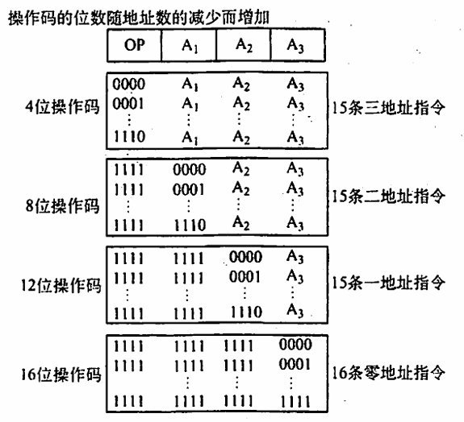
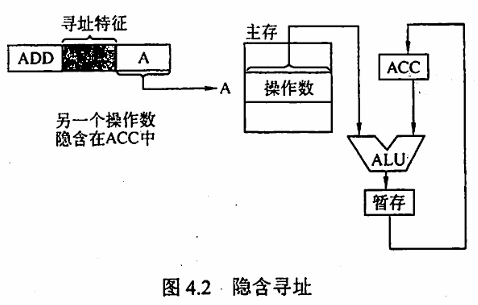
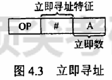
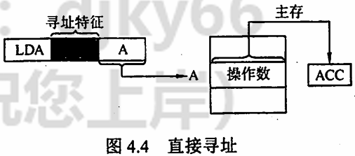
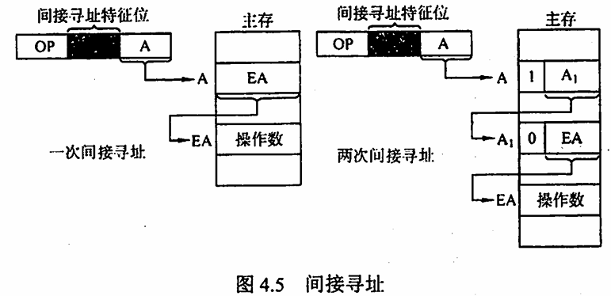
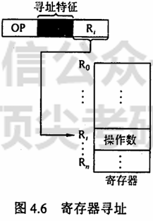
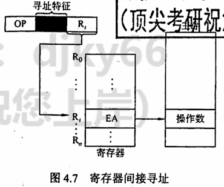
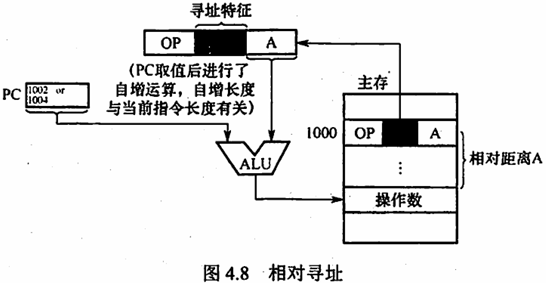
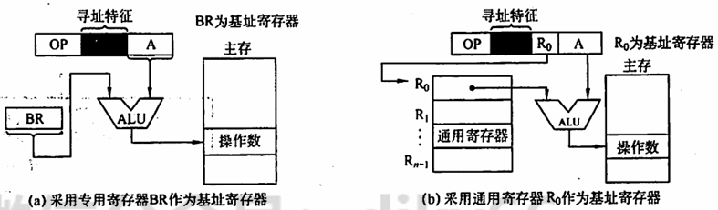
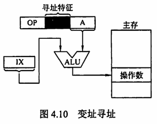

# 第 4 章 指令系统

## Intro

**【考纲内容】**

1. 指令格式的基本概念
2. 指令格式
3. 寻址方式
4. 数据的对齐和大/小端存放方式
5. CISC 和 RISC 的基本概念
6. 高级语言程序与机器级代码之间的对应编译器、汇编器与链接器的基本概念
   - 选择结构语句的机器级表示
   - 循环结构语句的机器级表示
   - 过程（函数）调用对应的机器级表示

**【复习提示】**

指令系统是表征一台计算机性能的重要因素。应掌握各种寻址方式的特点及有效地址的计算，相对寻址的计算，CISC 与 RISC 的特点与区别。2022 年大纲新增的机器级表示，在 2017 年和 2019 年的真题中考查过。本章知识点既可能出选择题，也可能结合其他章节出有关指令的综合题。指令格式、机器指令和指令寻址方式与 CPU 指令执行过程部分紧密相关，需引起重视。

带着这些问题学习本章：
1. 什么是指令？什么是指令系统？为什么要引入指令系统？
2. 一般来说，指令分为哪些部分？每部分有什么用处？
3. 对于一个指令系统来说，寻址方式多和少有什么影响？


## 一、指令系统

指令（机器指令）是指示计算机执行某种操作的命令。一台计算机的所有指令的集合构成该机的指令系统，也称指令集。指令系统是指令集体系结构（ISA）中最核心的部分，ISA 完整定义了软件和硬件之间的接口，是机器语言或汇编语言程序员所应熟悉的。ISA 规定的内容主要包括：指令格式，数据类型及格式，操作数的存放方式，程序可访问的寄存器个数、位数和编号，存储空间的大小和编址方式，寻址方式，指令执行过程的控制方式等。

### 0x00 指令的基本格式

一条指令就是机器语言的一个语句，它是一组有意义的二进制代码。一条指令通常包括操作码字段和地址码字段两部分：

| 操作码字段 | 地址码字段 |
| :--------: | :--------: |

- **操作码字段**：指出该指令应该执行什么性质的操作以及具有何种功能。操作码是识别指令、了解指令功能及区分操作数地址内容的组成和使用方法等的关键信息。例如，指出是算术加运算还是算术减运算，是程序转移还是返回操作。
- **地址码字段**：用于指明操作数的地址、运算结果的保存地址、程序的转移地址、被调用的子程序的入口地址等。

指令的长度是指一条指令中所包含的二进制代码的位数。
指令字长取决于操作码的长度、操作数地址码的长度和操作数地址的个数。
指令长度与机器字长没有固定的关系，它可以等于机器字长，也可以大于或小于机器字长。

通常，
把指令长度等于机器字长的指令称为单字长指令，
指令长度等于半个机器字长的指令称为半字长指令，
指令长度等于两个机器字长的指令称为双字长指令。

在一个指令系统中，
若所有指令的长度都是相等的，则称为定长指令字结构。定字长指令的执行速度快，控制简单。
若各种指令的长度随指令功能而异，则称为变长指令字结构。

根据指令中操作数地址码的数目的不同，可将指令分成以下几种格式：

#### 1. 零地址指令

只给出操作码，没有显式地址。这种指令有两种可能：
1. 不需要操作数的指令，如空操作指令、停机指令、关中断指令等。
2. 零地址的运算类指令仅用在堆栈计算机中。通常参与运算的两个操作数隐含地从栈顶和次栈顶弹出，送到运算器进行运算，运算结果再隐含地压入堆栈。

#### 2. 一地址指令

指令结构如下：

| $OP$ | $A_1$ |
| :--: | :---: |

一地址指令有两种常见的形态：
1. 只有目的操作数的单操作数指令，按地址读取操作数，进行操作后，结果存回原地址。指令含义：$ OP(A_1) \rightarrow A_1 $，如操作码含义是加 1、减 1、求反、求补等。
2. 隐含约定目的地址的双操作数指令，按指令地址 A 读取源操作数，另一个操作数由累加器（ACC）提供，运算结果也存放在 ACC 中。指令含义：$ (ACC)OP(A_1)\to ACC$。

若指令字长为 32 位，操作码占 8 位，1 个地址码字段占 24 位，则指令操作数的直接寻址范围为 $2^{24}=16M$

#### 3. 二地址指令

指令结构如下：

| $OP$ | $A_1$ | $A_2$ |
| :--: | :---: | :---: |

指令含义：$(A_1)OP(A_2)\to A_1$。

对于常用的算术和逻辑运算指令，需分别给出目的操作数和源操作数的地址，结果保存于目的地址中。

#### 4. 三地址指令

指令结构如下：

| $OP$ | $A_1$ | $A_2$ | $A_3$ （结果） |
| :--: | :---: | :---: | :------------: |

指令含义：$(A_1)OP(A_2)\to A_3$。

若地址字段均为主存地址，则完成一条三地址指令需要 4 次访问存储器
（取指令 1 次，取两个操作数 2 次，存放结果 1 次）。

#### 5. 四地址指令

指令结构如下：

| $OP$ | $A_1$ | $A_2$ | $A_3$ | $A_4$ |
| :--: | :---: | :---: | ----- | :---: |

指令含义：$ (\text{A1}) \text{OP(A2)} \rightarrow \text{A3} $，$ \text{A4} = \text{下一条将要执行指令的地址} $。


### 0x01 定长操作码指令格式

定长操作码指令在指令字的最高位部分分配固定的若干位（定长）表示操作码。一般 n 位操作码字段的指令系统最大能够表示 $2^n$ 条指令。定长操作码对于简化计算机硬件设计，提高指令译码和识别速度很有利。当计算机字长为 32 位或更长时，这是常规用法。

### 0x02 扩展操作码指令格式

为了在指令字长有限的前提下仍保持比较丰富的指令种类，可采取可变长度操作码，即全部指令的操作码字段的位数不固定，且分散地放在指令字的不同位置上。显然，这将增加指令译码和分析的难度，使控制器的设计复杂化。最常见的变长操作码方法是扩展操作码，它使操作码的长度随地址码的减少而增加，不同地址数的指令可具有不同长度的操作码，从而在满足需要的前提下，有效地缩短指令字长。下图所示即为一种扩展操作码的安排方式。



在图中，指令字长为 16 位，其中 4 位为基本操作码字段 OP，另有 3 个 4 位长的地址字段 A1、A2 和 A3。
4 位基本操作码若全部用于三地址指令，则有 16 条。图中所示的三地址指令为 15 条，1111 留作扩展操作码之用；
二地址指令为 15 条，1111 留作扩展操作码之用；
一地址指令为 15 条，1111 留作扩展操作码之用；
零地址指令为 16 条。
除这种安排外，还有其他多种扩展方法，如形成 15 条三地址指令、12 条二地址指令、63 条一地址指令和 16 条零地址指令，共 106 条指令。

在设计扩展操作码指令格式时，必须注意以下两点：
1. 各指令的操作码一定不能重复。
2. 对使用频率较高的指令分配较短的操作码，对使用频率较低的指令分配较长的操作码，从而尽可能减少指令译码和分析的时间。


### 0x03 指令的操作类型

设计指令系统时必须考虑应提供哪些操作类型，指令操作类型按功能可分为以下几种：

1. **数据传送**
   - **传送指令**：通常有寄存器之间的传送（`MOV`），从内存单元读取数据到 CPU 寄存器（`LOAD`），从 CPU 寄存器写数据到内存单元（`STORE`）等。

2. **算术和逻辑运算**
   - **算术运算**：主要有加（`ADD`），减（`SUB`），比较（`CMP`），乘（`MUL`），除（`DIV`），加 1（`INC`），减 1（`DEC`）等。
   - **逻辑运算**：主要有与（`AND`），或（`OR`），取反（`NOT`），异或（`XOR`）等。

3. **移位操作**
   - **移位指令**：主要有算术移位、逻辑移位、循环移位等。

4. **转移操作**
   - **转移指令**：主要有无条件转移（`JMP`），条件转移（`BRANCH`），调用（`CALL`），返回（`RET`），陷阱（`TRAP`）等。
     - **无条件转移指令**：在任何情况下都执行转移操作。
     - **条件转移指令**：仅在特定条件满足时才执行转移操作，转移条件一般是某个标志位的值，或几个标志位的组合。
     - **调用指令**：与转移指令的区别在于，执行调用指令时必须保存下一条指令的地址（返回地址）。

5. **输入输出操作**
   - **输入输出指令**：用于完成 CPU 与外部设备交换数据或传送控制命令及状态信息。


## 二、指令的寻址方式

寻址方式是指寻找指令或操作数有效地址的方式，即确定本条指令的数据地址及下一条待执行指令的地址的方法。寻址方式分为指令寻址和数据寻址两大类。

指令中的地址码字段并不代表操作数的真实地址，这种地址称为形式地址（A)。形式地址结合寻址方式，可以计算出操作数在存储器中的真实地址，这种地址称为有效地址（EA)。

注意，$(A)$ 表示地址为 A 的数值，A 既可以是寄存器编号，也可以是内存地址。对应的$(A)$就是寄存器中的数值，或相应内存单元的数值。例如，$EA = (A)$ 意思是有效地址是地址 A 中的数值。

### 0x00 指令寻址和数据寻址

寻址方式分为指令寻址和数据寻址两大类。寻找下一条将要执行的指令地址称为指令寻址；寻找本条指令的数据地址称为数据寻址。

1. **指令寻址**
   指令寻址方式有两种：一种是顺序寻址方式，另一种是跳跃寻址方式。
   
   1. **顺序寻址**：通过程序计数器 PC 加 1（1 个指令字长)，自动形成下一条指令的地址。
   2. **跳跃寻址**：通过转移类指令实现。所谓跳跃，是指下条指令的地址不由程序计数器 PC 自动给出，而由本条指令给出下条指令地址的计算方式。而是否跳跃可能受到状态寄存器和操作数的控制，跳跃的地址分为绝对地址（由标记符直接得到）和相对地址（相对于当前指令地址的偏移量），跳跃的结果是当前指令修改 PC 值，所以下一条指令仍然通过 PC 给出。
   
2. **数据寻址**
   数据寻址的方式较多，为区别各种方式，通常在指令字中设一个字段，用来指明属于哪种寻址方式，由此可得指令的格式如下所示：

   | 操作码 | 寻址特征 | 形式地址 A |
   | :----: | :------: | :--------: |
   
   

### 0x01 常见的数据寻址方式

1. **隐含寻址**
   这种类型的指令不明显地给出操作数的地址，而在指令中隐含操作数的地址。例如，单地址的指令格式就不明显地在地址字段中指出第二操作数的地址，而规定累加器（ACC）作为第二操作数地址，指令格式明显指出的仅是第一操作数的地址。因此，累加器（ACC）对单地址指令格式来说是隐含寻址。如下图所示：

   

   隐含寻址的优点是有利于缩短指令字长；缺点是需增加存储操作数或隐含地址的硬件。

2. **立即（数）寻址**
   立即数作为操作数，指令中直接给出操作数。图 4.3 所示为立即寻址示意图，图中 # 表示立即寻址特征，A 就是操作数。

   

   立即寻址的优点是指令在执行阶段不访问主存，指令执行时间最短；缺点是 A 的位数限制了立即数的范围。

3. **直接寻址**
   指令字中的形式地址 A 是操作数的真实地址 EA，即 $EA = A$。

   

   直接寻址的优点是简单，指令在执行阶段仅访问一次主存，不需要专门计算操作数的地址；缺点是 A 的位数决定了该指令操作数的寻址范围，操作数的地址不易修改。

4. **间接寻址**
   指令的地址字段给出的形式地址不是操作数的真实地址，而是操作数的地址所在的存储单元地址。间接寻址可以是一次间接寻址，还可以是多次间接寻址。

   
   在上图中，主存中的字第一位为 1 时，表示取出的仍不是操作数的地址，也就是多次间址，当主存字的第 1 位为 1 时，表示取得的是操作数的地址
   
   间接寻址的优点是可扩大寻址范围（有效地址 EA 的位数大于形式地址 A 的位数），便于编制程序（用间接寻址可方便地完成子程序返回）；缺点是指令在执行阶段要多次访存（一次间接寻址需两次访存，多次间接寻址需根据存储字的最高位确定访存次数）。由于访问速度过慢，这种寻址方式并不常用。
   
5. **寄存器寻址**
   在指令字中直接给出操作数所在的寄存器编号，即 $EA = R$，其操作数在由 $R_i$ 所指的寄存器内。

   

   寄存器寻址的优点是指令在执行阶段不访问主存，只访问寄存器，因寄存器数量较少，对应地址码长度较小，使得指令字短且因不用访存，所以执行速度快，支持向量/矩阵运算；缺点是寄存器价格昂贵，计算机中的寄存器个数有限。

6. **寄存器间接寻址**
   指令的地址字段给出的是寄存器编号，寄存器中的内容是操作数的地址，即 $EA = (R)$。

   

   寄存器间接寻址的特点是，与一般间接寻址相比速度更快，但指令的执行阶段需要访问主存（因为操作数在主存中）。

7. **相对寻址**
   将程序计数器（PC）的内容加上指令格式中的形式地址 A 而形成操作数的有效地址，即 $EA = (PC) + A$，其中 A 是相对于当前 PC 值的位移量，可正可负，补码表示。

   

   相对寻址的优点是操作数的地址不是固定的，它随 PC 值的变化而变化，且与指令地址之间总是相差一个固定值，因此便于程序浮动。相对寻址广泛应用于转移指令。

8. **基址寻址**
   将基址寄存器（BR）的内容加上指令格式中的形式地址 A 而形成操作数的有效地址，即 $EA = (BR) + A$。基址寄存器既可采用专用寄存器，又可采用通用寄存器。

   

   基址寄存器是面向操作系统的，其内容由操作系统或管理程序确定，主要用于解决程序逻辑空间与存储器物理空间的无关性。在程序执行过程中，基址寄存器的内容不变（作为基地址)，形式地址可变（作为偏移量）。采用通用寄存器作为基址寄存器时，可由用户决定哪个寄存器作为基址寄存器，但其内容仍由操作系统确定。

9. **变址寻址**
   有效地址 EA 等于指令字中的形式地址 A 与变址寄存器 IX 的内容之和，即 $EA = (IX) + A$，其中 IX 为变址寄存器（专用），也可用通用寄存器作为变址寄存器。

   

   变址寄存器是面向用户的，在程序执行过程中，变址寄存器的内容可由用户改变（作为偏移量），形式地址 A 不变（作为基地址）。变址寻址的优点是可扩大寻址范围（变址寄存器的位数大于形式地址 A 的位数）；在数组处理过程中，可设定 A 为数组的首地址，不断改变变址寄存器 IX 的内容，便可很容易形成数组中任意一个数据的地址，特别适合编制循环程序。

10. **堆栈寻址**
    堆栈是存储器（或专用寄存器组）中一块特定的、按后进先出（LIFO）原则管理的存储区，该存储区中读/写单元的地址是用一个特定的寄存器给出的，该寄存器称为堆栈指针（SP）。堆栈可分为硬堆栈与软堆栈两种。寄存器堆栈又称硬堆栈

。寄存器堆栈的成本较高，不适合做大容量的堆栈；而从主存中划出一段区域来做堆栈是最合算且最常用的方法，这种堆栈称为软堆栈。在采用堆栈结构的计算机系统中，大部分指令表面上都表现为无操作数指令的形式，因为操作数地址都隐含使用了 SP。通常情况下，在读/写堆栈中的一个单元的前后都伴有自动完成对 SP 内容的增量或减量操作。

#### 总结：各种寻址方式的有效地址及访存次数

下表总结了各种寻址方式的有效地址及访存次数（不含取本条指令的访存）：

| 寻址方式       | 有效地址      | 访存次数 |
| -------------- | ------------- | -------- |
| 隐含寻址       | 程序指定      | 0        |
| 立即寻址       | A 即是操作数  | 0        |
| 直接寻址       | EA = A        | 1        |
| 一次间接寻址   | EA = (A)      | 2        |
| 寄存器寻址     | EA = R        | 0        |
| 寄存器间接寻址 | EA = (R)      | 1        |
| 相对寻址       | EA = (PC) + A | 1        |
| 基址寻址       | EA = (BR) + A | 1        |
| 变址寻址       | EA = (IX) + A | 1        |


## 三、程序的机器级代码表示

### 0x00 常用汇编指令介绍

#### 1. 相关寄存器

x86 处理器中有 8 个 32 位的通用寄存器，各寄存器及说明如下：

- 为了向后兼容，EAX、EBX、ECX 和 EDX 的高两位字节和低两位字节可以独立使用，E 为 Extended，表示 32 位的寄存器。例如，EAX 的低两位字节称为 AX，而 AX 的高低字节又可分别作为两个 8 位寄存器，分别称为 AH 和 AL。
- 除 EBP 和 ESP 外，其他几个寄存器的用途是比较任意的。

#### 2. 汇编指令格式

使用不同的编程工具开发程序时，用到的汇编程序也不同，一般有两种不同的汇编格式：

- **AT&T 格式和 Intel 格式**。它们的区别主要如下：
  1. AT&T 格式的指令只能用小写字母，而 Intel 格式的指令对大小写不敏感。
  2. 在 AT&T 格式中，第一个为源操作数，第二个为目的操作数，方向从左到右，合乎自然；在 Intel 格式中，第一个为目的操作数，第二个为源操作数，方向从右向左。
  3. 在 AT&T 格式中，寄存器需要加前缀 `%`，立即数需要加前缀 `$`；在 Intel 格式中，寄存器和立即数都不需要加前缀。
  4. 在处理复杂寻址方式时，例如 AT&T 格式的内存操作数 `disp(base,index,scale)` 分别表示偏移量、基址寄存器、变址寄存器和比例因子，如 `8(%edx, %eax, 2)` 表示操作数为 `M[R[edx] + R[eax]*2 + 8]`，其对应的 Intel 格式的操作数为 `[edx + eax*2 + 8]`。
  5. 在指定数据长度方面，AT&T 格式指令操作码的后面紧跟一个字符，表明操作数大小，“b" 表示 byte（字节）、“w” 表示 word（字）或 “1” 表示 long（双字）。Intel 格式也有类似的语法，它在操作码后面显式地注明 `byte ptr`、`word ptr` 或 `dword ptr`。

注意：由于 32 或 64 位体系结构都是由 16 位扩展而来的，因此用 word（字）表示 16 位。

表 4.2 展示了两种格式的几条不同指令。其中，`mov` 指令用于在内存和寄存器之间或者寄存器之间移动数据；`lea` 指令用于将一个内存地址（而不是其所指的内容）加载到目的寄存器。

| AT&T 格式                    | Intel 格式               | 含义                             |
| ---------------------------- | ------------------------ | -------------------------------- |
| `mov $100, %eax`             | `mov eax, 100`           | 100 -> R[eax]                    |
| `mov %eax, %ebx`             | `mov ebx, eax`           | R[eax] -> R[ebx]                 |
| `mov %eax, (%ebx)`           | `mov [ebx], eax`         | R[eax] -> M[R[ebx]]              |
| `mov %eax, -8(%ebp)`         | `mov [ebp-8], eax`       | R[eax] -> M[R[ebp]-8]            |
| `lea 8(%edx, %eax, 2), %eax` | `lea eax, [edx+eax*2+8]` | R[edx] + R[eax]*2 + 8 -> R[eax]  |
| `movl %eax, %ebx`            | `mov dword ptr ebx, eax` | 长度为 4 字节的 R[eax] -> R[ebx] |

注：R[r] 表示寄存器 r 的内容，M[addr] 表示主存单元 addr 的内容，→ 表示信息传送方向。

两种汇编指令的相互转换并不复杂。考虑到本书参考教材之一［袁春风所著《计算机系统基础（第二版）》］使用的是 AT&T 格式，但 2017 年和 2019 年统考综合题使用的是 Intel 格式，因此本书将混用两种格式，两种格式的汇编指令都需要理解。在本节介绍常用指令时，使用 Intel 格式；在后面介绍具体结构的机器级表示时，使用 AT&T 格式。读者在学习时可以尝试转换。

#### 3. 常用指令

汇编指令通常可以分为数据传送指令、逻辑计算指令和控制流指令，下面以 Intel 格式为例，介绍一些重要的指令。以下用于操作数的标记分别表示寄存器、内存和常数：

- `<reg>`：表示任意寄存器，若其后带有数字，则指定其位数，如 `<reg32>` 表示 32 位寄存器（eax、ebx、ecx、edx、esi、edi、esp 或 ebp）；`<reg16>` 表示 16 位寄存器（ax、bx、cx 或 dx）；`<reg8>` 表示 8 位寄存器（ah、al、bh、bl、ch、cl、dh、dl）。
- `<mem>`：表示内存地址（如 `[eax]`、`[var+4]` 或 `dword ptr [eax+ebx]`）。
- `<con>`：表示 8 位、16 位或 32 位常数。`<con8>` 表示 8 位常数；`<con16>` 表示 16 位常数；`<con32>` 表示 32 位常数。

x86 中的指令机器码长度为 1 字节，对同一指令的不同用途有多种编码方式，比如 `mov` 指令就有 28 种机内编码，用于不同操作数类型或用于特定寄存器，例如：

- `mov ax, <con16>` # 机器码为 B8H
- `mov al, <con8>` # 机器码为 BOH
- `mov <reg16>, <reg16>/<mem16>` # 机器码为 89H
- `mov <reg8>/<mem8>, <reg8>` # 机器码为 8AH
- `mov <reg16>/<mem16>, <reg16>` # 机器码为 8BH

##### （1）数据传送指令

1. **`mov` 指令**：将第二个操作数（寄存器的内容、内存中的内容或常数值）复制到第一个操作数（寄存器或内存）。但不能用于直接从内存复制到内存。其语法如下：

    ```
    mov <reg>, <reg>
    mov <reg>, <mem>
    mov <mem>, <reg>
    mov <reg>, <con>
    mov <mem>, <con>
    ```

    举例：
    
    ```assembly
    mov eax, ebx        # 将 ebx 值复制到 eax
    mov byte ptr [var], 5  # 将 5 保存到 var 值指示的内存地址的一字节中
    ```

2. **`push` 指令**：将操作数压入内存的栈，常用于函数调用。ESP 是栈顶，压栈前先将 ESP 值减 4（栈增长方向与内存地址增长方向相反），然后将操作数压入 ESP 指示的地址。其语法如下：

    ```
    push <reg32>
    push <mem>
    push <con32>
    ```

    举例：

    ```assembly
    push eax      # 将 eax 值压栈
    push [var]    # 将 var 值指示的内存地址的 4 字节值压栈
    ```

3. **`pop` 指令**：与 `push` 指令相反，`pop` 指令执行的是出栈工作，出栈前先将 ESP 指示的地址中的内容出栈，然后将 ESP 值加 4。其语法如下：

    ```
    pop <reg32>
    pop <mem>
    ```

    举例：

    ```assembly
    pop edi       # 弹出栈顶元素送到 edi
    pop [var]     # 弹出栈顶元素送到 var 值指示的内存地址的 4 字节中
    ```

##### （2）算术和逻辑运算指令

1. **`add`/`sub` 指令**：`add` 指令将两个操作数相加，相加的结果保存到第一个操作数中。`sub` 指令用于两个操作数相减，相减的结果保存到第一个操作数中。其语法如下：

   ```assembly
   add <reg>, <reg>  / sub <reg>, <reg>
   add <reg>, <mem>  / sub <reg>, <mem>
   add <mem>, <reg>  / sub <mem>, <reg>
   add <reg>, <con>  / sub <reg>, <con>
   add <mem>, <con>  / sub <mem>, <con>
   ```

   举例：
   ```assembly
   sub eax, 10      # eax - eax - 10
   add byte ptr [var], 10  # 10 与 var 值指示的内存地址的一字节值相加，并将结果保存在 var 值指示的内存地址的字节中
   ```

2. **`inc`/`dec` 指令**：`inc`、`dec` 指令分别表示将操作数自加 1、自减 1。其语法如下：

    ```
    inc <reg>  / dec <reg>
    inc <mem>  / dec <mem>
    ```

    举例：

    ```assembly
    dec eax      # eax 值自减 1
    inc dword ptr [var]  # var 值指示的内存地址的 4 字节值自加 1
    ```

3. **`imul` 指令**：带符号整数乘法指令，有两种格式：①两个操作数，将两个操作数相乘，将结果保存在第一个操作数中，第一个操作数必须为寄存器；②三个操作数，将第二个和第三个操作数相乘，将结果保存在第一个操作数中，第一个操作数必须为寄存器。其语法如下：

    ```
    imul <reg32>, <reg32>
    imul <reg32>, <mem>
    imul <reg32>, <reg32>, <con>
    imul <reg32>, <mem>, <con>
    ```

    举例：

    ```assembly
    imul eax, [var]     # eax - eax * [var]
    imul esi, edi, 25   # esi - edi * 25
    ```

    乘法操作结果可能溢出，则编译器置溢出标志 OF=1，以使 CPU 调出溢出异常处理程序。

4. **`idiv` 指令**：带符号整数除法指令，它只有一个操作数，即除数，而被除数则为 edx:eax 中的内容（64 位整数），操作结果有两部分：商和余数，商送到 eax，余数则送到 edx。其语法如下：

    ```
    idiv <reg32>
    idiv <mem>
    ```

    举例：

    ```assembly
    idiv ebx
    idiv dword ptr [var]
    ```

5. **`and`/`or`/`xor` 指令**：`and`、`or`、`xor` 指令分别是逻辑与、逻辑或、逻辑异或操作指令，用于操作数的位操作，操作结果放在第一个操作数中。其语法如下：

    ```
    and <reg>, <reg>  / or <reg>, <reg>  / xor <reg>, <reg>
    and <reg>, <mem>  / or <reg>, <mem>  / xor <reg>, <mem>
    and <mem>, <reg>  / or <mem>, <reg>  / xor <mem>, <reg>
    and <reg>, <con>  / or <reg>, <con>  / xor <reg>, <con>
    and <mem>, <con>  / or <mem>, <con>  / xor <mem>, <con>
    ```

    举例：

    ```assembly
    and eax, 0fH      # 将 eax 中的前 28 位全部置为 0，最后 4 位保持不变
    xor edx, edx      # 置 edx 中的内容为 0
    ```

6. **`not` 指令**：位翻转指令，将操作数中的每一位翻转，即 0→1、1→0。其语法如下：

    ```
    not <reg>
    ```

    举例：

    ```assembly
    not byte ptr [var]  # 将 var 值指示的内存地址的一字节的所有位翻转
    ```

7. **`neg` 指令**：取负指令。其语法如下：

    ```
    neg <reg>
    neg <mem>
    ```

    举例：

    ```assembly
    neg eax  # eax - eax
    ```

8. **`shl`/`shr` 指令**：逻辑移位指令，`shl` 为逻辑左移，`shr` 为逻辑右移，第一个操作数表示被操作数，第二个操作数指示移位的位数。其语法如下：

    ```
    shl <reg>, <con8>  / shr <reg>, <con8>
    shl <mem>, <con8>  / shr <mem>, <con8>
    shl <reg>, <cl>    / shr <reg>, <cl>
    shl <mem>, <cl>    / shr <mem>, <cl>
    ```

    举例：

    ```assembly
    shl eax, 1  # 将 eax 值左移 1 位
    shr ebx, cl # 将 ebx 值右移 n 位（n 为 cl 中的值）
    ```

##### （3）控制流指令

x86 处理器维持着一个指示当前执行指令的指令指针（IP），当一条指令执行后，此指针自动指向下一条指令。IP 寄存器不能直接操作，但可以用控制流指令更新。通常用标签（label）指示程序中的指令地址，在 x86 汇编代码中，可在任何指令前加入标签。例如：

```assembly
mov esi, [ebp+8]
begin:
xor ecx, ecx
mov eax, [esi]
```

这样就用 `begin` 指示了第二条指令，控制流指令通过标签就可以实现程序指令的跳转。

1. **`jmp` 指令**：`jmp` 指令控制 IP 转移到 label 所指示的地址（从 label 中取出指令执行）。其语法如下：

    ```
    jmp <label>
    ```

    举例：

    ```assembly
    jmp begin  # 转跳到 begin 标记的指令执行
    ```

2. **`jcondition` 指令**：条件转移指令，依据 CPU 状态字中的一系列条件状态转移。CPU 状态字中包括指示最后一个算术运算结果是否为 0，运算结果是否为负数等。其语法如下：

    ```
    je <label>     (jump when equal)
    jne <label>    (jump when not equal)
    jz <label>     (jump when last result was zero)
    jg <label>     (jump when greater than)
    jl <label>     (jump when less than)
    jle <label>    (jump when less than or equal to)
    ```

    举例：

    ```assembly
    cmp eax, ebx
    jle done  # 如果 eax 的值小于或等于 ebx 值，跳转到 done 指示的指令执行，否则执行下条指令
    ```

3. **`cmp`/`test` 指令**：`cmp` 指令用于比较两个操作数的值，`test` 指令对两个操作数进行逐位与运算，这两类指令都不保存操作结果，仅根据运算结果设置 CPU 状态字中的条件码。其语法如下：

    ```
    cmp <reg>, <reg>  / test <reg>, <reg>
    cmp <reg>, <mem>  / test <reg>, <mem>
    cmp <mem>, <reg>  / test <mem>, <reg>
    cmp <reg>, <con>  / test <reg>, <con>
    ```

    `cmp` 和 `test` 指令通常和 `jcondition` 指令搭配使用。举例：

    ```assembly
    cmp dword ptr [var], 10  # 将 var 指示的主存地址的 4 字节内容，与 10 比较
    jne loop                # 如果相等则继续顺序执行，否则跳转到 loop 处执行
    test eax, eax           # 测试 eax 是否为零
    jz xxxx                 # 为零则置标志 ZF 为 1，转跳到 xxxx 处执行
    ```

4. **`call`/`ret` 指令**：分别用于实现子程序（过程、函数等）的调用及返回。其语法如下：

    ```
    call <label>
    ret
    ```

    `call` 指令首先将当前执行指令地址入栈，然后无条件转移到

由标签指示的指令。与其他简单的跳转指令不同，`call` 指令保存调用之前的地址信息（当 `call` 指令结束后，返回调用之前的地址）。`ret` 指令实现子程序的返回机制，`ret` 指令弹出栈中保存的指令地址，然后无条件转移到保存的指令地址执行。`call` 和 `ret` 是程序（函数）调用中最关键的两条指令。理解上述指令的语法和用途，可以更好地帮助读者解答相关题型。读者在上机调试 C 程序代码时，也可以尝试用编译器调试，以便更好地帮助理解机器指令的执行。


### 0x01 过程调用的机器级表示

上面提到的 `call`/`ret` 指令主要用于过程调用，它们都属于一种无条件转移指令。假定过程 P（调用者）调用过程 Q（被调用者），过程调用的执行步骤如下：

1. P 将入口参数（实参）放在 Q 能访问到的地方。
2. P 将返回地址存到特定的地方，然后将控制转移到 Q。
3. Q 保存 P 的现场（通用寄存器的内容），并为自己的非静态局部变量分配空间。
4. 执行过程 Q。
5. Q 恢复 P 的现场，将返回结果放到 P 能访问到的地方，并释放局部变量所占空间。
6. Q 取出返回地址，将控制转移到 P。

步骤 2 是由 `call` 指令实现的，步骤 6 通过 `ret` 指令返回到过程 P。

在上述步骤中，需要为入口参数、返回地址、过程 P 的现场、过程 Q 的局部变量、返回结果找到存放空间。但用户可见寄存器数量有限，为此需要设置一个专门的存储区域来保存这些数据，这个存储区域就是栈。

寄存器 EAX、ECX 和 EDX 是调用者保存寄存器，其保存和恢复的任务由过程 P 负责，当 P 调用 Q 时，Q 就可以直接使用这三个寄存器。寄存器 EBX、ESI、EDI 是被调用者保存寄存器，Q 必须先将它们的值保存在栈中才能使用它们，并在返回 P 之前先恢复它们的值。

每个过程都有自己的栈区，称为栈帧，因此，一个栈由若干栈帧组成。帧指针寄存器 EBP 指示栈帧的起始位置（栈底），栈指针寄存器 ESP 指示栈顶，栈从高地址向低地址增长，因此，当前栈帧的范围在帧指针 EBP 和 ESP 指向的区域之间。

下面用一个简单的 C 语言程序来说明过程调用的机器级实现：

```c
int add(int x, int y) {
    return x + y;
}

int caller() {
    int temp1 = 125;
    int temp2 = 80;
    int sum = add(temp1, temp2);
    return sum;
}
```

经 GCC 编译后，`caller` 过程对应的代码如下（`#` 后面的文字是注释）：

```assembly
caller:
    push %ebp              # 保存旧的 EBP
    movl %esp, %ebp        # 将 ESP 传送到 EBP，EBP 指向栈帧底部
    subl $24, %esp         # 为局部变量分配 24 字节的栈空间
    movl $125, -12(%ebp)   # temp1 = 125
    movl $80, -8(%ebp)     # temp2 = 80
    movl -8(%ebp), %eax    # 将 temp2 的值送到 EAX
    movl %eax, 4(%esp)     # 将 EAX 的值压栈（作为 add 的第二个参数）
    movl -12(%ebp), %eax   # 将 temp1 的值送到 EAX
    movl %eax, (%esp)      # 将 EAX 的值压栈（作为 add 的第一个参数）
    call add               # 调用 add 函数
    movl %eax, -4(%ebp)    # 将 add 的返回值存入 sum
    movl -4(%ebp), %eax    # 将 sum 的值作为返回值送到 EAX
    leave                  # 释放栈帧
    ret                    # 返回到调用者
```

图 4.12 给出了 `caller` 栈帧的状态，假定 `caller` 被过程 P 调用。执行了第 4 行指令后，ESP 所指的位置如图中 sum 所示，可以看出 GCC 为 `caller` 的参数分配了 24 字节的空间。从汇编代码中可以看出，`caller` 中只使用了调用者保存寄存器 EAX，没有使用任何被调用者保存寄存器，因此在 `caller` 栈帧中无须保存除 EBP 外的任何寄存器的值；`caller` 有三个局部变量 temp1、temp2 和 sum，皆被分配在栈帧中；在用 `call` 指令调用 `add` 函数之前，`caller` 先将入口参数从右向左依次将 temp2 和 temp1 的值保存到栈中。在执行 `call` 指令时再把返回地址压入栈中。此外，在最初进入 `caller` 时，还将 EBP 的值压入了栈，因此 `caller` 的栈帧中用到的空间占 4 + 12 + 8 + 4 = 28 字节。但是，`caller` 的栈帧共有 4 + 24 + 4 = 32 字节，其中浪费了 4 字节的空间（未使用）。这是因为 GCC 为保证数据的严格对齐而规定每个函数的栈帧大小必须是 16 字节的倍数。


`call` 指令执行后，`add` 函数的返回参数存放到 EAX 中，因而在 `call` 指令后面的两条指令中，指令 `movl %eax, -4(%ebp)` 将 `add` 的结果存入 `sum` 变量的存储空间，该变量的地址为 `R[ebp]-4`；指令 `movl -4(%ebp), %eax` 将 `sum` 变量的值作为返回值送到寄存器 EAX 中。在执行 `ret` 指令之前，应将当前栈帧释放，并恢复旧 EBP 的值，上述第 14 行 `leave` 指令实现了这个功能，`leave` 指令功能相当于以下两条指令的功能：

```assembly
movl %ebp, %esp
popl %ebp
```

其中，第一条指令使 ESP 指向当前 EBP 的位置，第二条指令执行后，EBP 恢复为 P 中的旧值，并使 ESP 指向返回地址。执行完 `leave` 指令后，`ret` 指令就可从 ESP 所指处取返回地址，以返回 P 执行。当然，编译器也可通过 `pop` 指令和对 ESP 的内容做加法来进行退栈操作，而不一定要使用 `leave` 指令。

`add` 过程经 GCC 编译并进行链接后，对应的代码如下所示：

```assembly
8048469: 55         push %ebp
804846a: 89 e5      mov %esp, %ebp
804846c: 8b 45 0c   mov 0xc(%ebp), %eax
8048472: 8d 04 02   lea (%edx, %eax, 1), %eax
8048475: 5d         pop %ebp
8048476: c3         ret
```

通常，一个过程对应的机器级代码都有三个部分：准备阶段、过程体和结束阶段。上述第 1、2 行指令构成准备阶段的代码段，这是最简单的准备阶段代码段，它通过将当前栈指针 ESP 传送到 EBP 来完成将 EBP 指向当前栈帧底部的任务，如图 4.12 所示，EBP 指向 `add` 栈帧底部，从而可以方便地通过 EBP 获取入口参数。这里 `add` 的入口参数 x 和 y 对应的值（125 和 80）分别在地址为 `R[ebp]+8`、`R[ebp]+12` 的存储单元中。

上述第 3、4、5 行指令序列是过程体的代码段，过程体结束时将返回值放到 EAX 中。这里好像没有加法指令，实际上第 5 行 `lea` 指令执行的是加法运算 `R[edx]+R[eax]*1 = x + y`。

上述第 6、7 行指令序列是结束阶段的代码段，通过将 EBP 弹出栈帧来恢复 EBP 在 `caller` 过程中的值，并在栈中退出 `add` 过程的栈帧，使得执行到 `ret` 指令时栈顶中已经是返回地址。这里 `add` 过程中没有用到任何被调用者保存寄存器，没有局部变量，此外，`add` 是一个被调用过程，并且不再调用其他过程，因而也没有入口参数和返回地址要保存，因此，在 `add` 的栈帧中除了需要保存 EBP，无须保留其他任何信息。


### 0x02 选择语句的机器级表示

常见的选择结构语句有 `if-then`、`if-then-else`、`case`（或 `switch`）等。编译器通过条件码（标志位）设置指令和各类转移指令来实现程序中的选择结构语句。

#### 1. 条件码（标志位）

除了整数寄存器，CPU 还维护一组条件码（标志位）寄存器，它们描述了最近的算术或逻辑运算操作的属性。可以检测这些寄存器来执行条件分支指令，最常用的条件码如下：

- **CF**：进（借）位标志。最近无符号整数加（减）运算后的进（借）位情况。有进（借）位时，CF=1；否则 CF=0。
- **ZF**：零标志。最近的操作的运算结果是否为 0。若结果为 0，ZF=1；否则 ZF=0。
- **SF**：符号标志。最近的带符号数运算结果的符号。若为负，SF=1；否则 SF=0。
- **OF**：溢出标志。最近的带符号数运算结果是否溢出。若溢出，OF=1；否则 OF=0。

可见，OF 和 SF 对无符号数运算来说没有意义，而 CF 对带符号数运算来说没有意义。常见的算术逻辑运算指令（add、sub、imul、or、and、shl、inc、dec、not、sal 等）会设置条件码。但有两类指令只设置条件码而不改变任何其他寄存器：`cmp` 指令和 `sub` 指令的行为一样，`test` 指令与 `and` 指令的行为一样，但是它们只设置条件码，而不更新目的寄存器。

之前介绍的 `jcondition` 条件转跳指令，就是根据条件码 ZF 和 SF 来实现转跳的。

#### 2. if 语句

`if-else` 语句的通用形式如下：

```c
if (test_expr)
    then_statement
else
    else_statement
```

这里的 `test_expr` 是一个整数表达式，它的取值为 0（假），或为非 0（真）。两个分支语句（`then_statement` 或 `else_statement`）中只会执行一个。这种通用形式可以被翻译成如下所示的 `goto` 语句形式：

```c
t = test_expr;
if (!t) goto false;
then_statement
goto done;
false:
else_statement
done:
```

对于下面的 C 语言函数：

```c
int get_min(int* p1, int* p2) {
    if (p1 > p2)
        return *p2;
    else
        return *p1;
}
```

已知 `p1` 和 `p2` 对应的实参已被压入调用函数的栈帧，它们对应的存储地址分别为 `R[ebp] + 8`、`R[ebp] + 12`（EBP 指向当前栈帧底部），返回结果存放在 EAX 中。对应的汇编代码为：

```assembly
movl 8(%ebp), %eax    # R[eax] = M[R[ebp] + 8], 即 R[eax] = p1
movl 12(%ebp), %edx   # R[edx] = M[R[ebp] + 12], 即 R[edx] = p2
cmpl %edx, %eax       # 比较 p1 和 p2，即根据 p1 - p2 的结果置标志位
jbe .L1               # 若 p1 <= p2，则转标记 L1 处执行
movl (%edx), %eax     # R[eax] = M[R[edx]], 即 R[eax] = *p2
jmp .L2               # 无条件跳转到标记 L2 执行
.L1:
movl (%eax), %eax     # R[eax] = M[R[eax]], 即 R[eax] = *p1
.L2:
```

`p1` 和 `p2` 是指针型参数，故在 32 位机中的长度为 4 字节，比较指令 `cmpl` 的两个操作数都应来自寄存器，故应先将 `p1` 和 `p2` 对应的实参从栈中取到通用寄存器。比较指令执行后得到各个条件标志位，然后根据各条件标志值的组合选择执行不同的指令，因此需要用到条件转移指令。


### 0x03 循环语句的机器级表示

常见的循环结构语句有 `while`、`for` 和 `do-while`。汇编中没有相应的指令存在，可以用条件测试和转跳组合起来实现循环的效果，大多数编译器将这三种循环结构都转换为 `do-while` 形式来产生机器代码。在循环结构中，通常使用条件转移指令来判断循环条件的结束。

#### 1. do-while 循环

`do-while` 语句的通用形式如下：

```c
do
    body_statement
while (test_expr);
```

汇编代码表示如下：

```assembly
loop:
    body_statement
    t = test_expr;
    if (t) goto loop;
```

也就是说，每次循环，程序会执行循环体内的语句，`body_statement` 至少会执行一次，然后执行测试表达式。如果测试为真，就继续执行循环。

#### 2. while 循环

`while` 语句的通用形式如下：

```c
while (test_expr)
    body_statement
```

与 `do-while` 的不同之处在于，第一次执行 `body_statement` 之前，就会测试 `test_expr` 的值，循环有可能中止。GCC 通常会将其翻译成条件分支加 `do-while` 循环的方式。用如下模板来表达这种方法，将通用的 `while` 循环格式翻译成 `do-while` 循环：

```c
t = test_expr;
if (!t) goto done;
do
    body_statement
while (test_expr);
done:
```

相应地，进一步将它翻译成 `goto` 语句：

```assembly
t = test_expr;
if (!t) goto done;
loop:
    body_statement
    t = test_expr;
    if (t) goto loop;
done:
```

#### 3. for 循环

`for` 循环的通用形式如下：

```c
for (init_expr; test_expr; update_expr)
    body_statement
```

这个 `for` 循环的行为与下面这段 `while` 循环代码的行为一样：

```c
init_expr;
while (test_expr) {
    body_statement
    update_expr;
}
```

进一步把它翻译成 `goto` 语句：

```assembly
init_expr;
t = test_expr;
if (!t) goto done;
loop:
    body_statement
    update_expr;
    t = test_expr;
    if (t) goto loop;
done:
```

#### 示例

下面是一个用 `for` 循环写的自然数求和的函数：

```c
int nsum_for(int n) {
    int i;
    int result = 0;
    for (i = 1; i <= n; i++)
        result += i;
    return result;
}
```

这段代码中的 `for` 循环的不同组成部分如下：

- `init_expr`：`i = 1`
- `test_expr`：`i <= n`
- `update_expr`：`i++`
- `body_statement`：`result += i`

通过替换前面给出的模板中的相应位置，很容易将 `for` 循环转换为 `while` 或 `do-while` 循环。将这个函数翻译为 `goto` 语句代码后，不难得出其过程体的汇编代码：

```assembly
movl 8(%ebp), %ecx   # R[ecx] = M[R[ebp] + 8], 即 R[ecx] = n
movl $0, %eax        # R[eax] = 0, 即 result = 0
movl $1, %edx        # R[edx] = 1, 即 i = 1
cmp %ecx, %edx       # 比较 R[ecx] 和 R[edx]，即比较 i 和 n
jg .L2               # 如果 i > n，则跳转到标记 L2 执行
.L1:
addl %edx, %eax      # R[eax] = R[eax] + R[edx], 即 result += i
addl $1, %edx        # R[edx] = R[edx] + 1, 即 i++
cmp %ecx, %edx       # 比较 R[ecx] 和 R[edx]，即比较 i 和 n
jle .L1              # 如果 i <= n，则跳转到标记 L1 执行
.L2:
```

已知 `n` 对应的实参已被压入调用函数的栈帧，其对应的存储地址为 `R[ebp] + 8`，过程 `nsum_for` 中的局部变量 `i` 和 `result` 被分别分配到寄存器 `EDX` 和 `EAX` 中，返回参数在 `EAX` 中。


## 四、CISC 和 RISC 的基本概念

指令系统朝两个截然不同的方向发展：一是增强原有指令的功能，设置更为复杂的新指令实现软件功能的硬化，这类机器称为复杂指令系统计算机（CISC），典型的有采用 x86 架构的计算机；二是减少指令种类和简化指令功能，提高指令的执行速度，这类机器称为精简指令系统计算机（RISC），典型的有 ARM、MIPS 架构的计算机。

### 0x00 复杂指令系统计算机（CISC）

随着 VLSI 技术的发展，硬件成本不断下降，软件成本不断上升，促使人们在指令系统中增加更多、更复杂的指令，以适应不同的应用领域，这样就构成了复杂指令系统计算机（CISC）。CISC 的主要特点如下:

1. **指令系统复杂庞大**：指令数目一般为 200 条以上。
2. **指令长度不固定**：指令格式多，寻址方式多。
3. **可以访存的指令不受限制**。
4. **各种指令使用频度相差很大**。
5. **各种指令执行时间相差很大**：大多数指令需多个时钟周期才能完成。
6. **控制器大多数采用微程序控制**：有些指令非常复杂，以至于无法采用硬连线控制。
7. **难以用优化编译生成高效的目标代码程序**。

如此庞大的指令系统，对指令的设计提出了极高的要求，研制周期变得很长。后来人们发现，一味地追求指令系统的复杂和完备程度不是提高计算机性能的唯一途径。对传统 CISC 指令系统的测试表明，各种指令的使用频率相差悬殊，大概只有 20%的比较简单的指令被反复使用，约占整个程序的 80%；而 80%左右的指令则很少使用，约占整个程序的 20%。从这一事实出发，人们开始了对指令系统合理性的研究，于是 RISC 随之诞生。

### 0x01 精简指令系统计算机（RISC）

精简指令系统计算机（RISC）的中心思想是要求指令系统简化，尽量使用寄存器-寄存器操作指令，指令格式力求一致。RISC 的主要特点如下：

1. **选取使用频率最高的一些简单指令**：复杂指令的功能由简单指令的组合来实现。
2. **指令长度固定**：指令格式种类少，寻址方式种类少。
3. **只有 Load/Store（取数/存数）指令访存**：其余指令的操作都在寄存器之间进行。
4. **CPU 中通用寄存器的数量相当多**。
5. **RISC 一定采用指令流水线技术**：大部分指令在一个时钟周期内完成。
6. **以硬布线控制为主**：不用或少用微程序控制。
7. **特别重视编译优化工作**：以减少程序执行时间。

值得注意的是，从指令系统兼容性看，CISC 大多能实现软件兼容，即高档机包含了低档机的全部指令，并可加以扩充。但 RISC 简化了指令系统，指令条数少，格式也不同于老机器，因此大多数 RISC 机不能与老机器兼容。由于 RISC 具有更强的实用性，因此应该是未来处理器的发展方向。但事实上，当今时代 Intel 几乎一统江湖，且早期很多软件都是根据 CISC 设计的，单纯的 RISC 将无法兼容。此外，现代 CISC 结构的 CPU 已经融合了很多 RISC 的成分，其性能差距已经越来越小。CISC 可以提供更多的功能，这是程序设计所需要的。

### 0x02 CISC 和 RISC 的比较

和 CISC 相比，RISC 的优点主要体现在以下几点：

1. **更能充分利用 VLSI 芯片的面积**：CISC 的控制器大多采用微程序控制，其控制存储器在 CPU 芯片内所占的面积达 50%以上，而 RISC 控制器采用组合逻辑控制，其硬布线逻辑只占 CPU 芯片面积的 10%左右。
2. **更能提高运算速度**：RISC 的指令数、寻址方式和指令格式种类少，又设有多个通用寄存器，采用流水线技术，所以运算速度更快，大多数指令在一个时钟周期内完成。
3. **便于设计**：可降低成本，提高可靠性。RISC 指令系统简单，因此机器设计周期短;其逻辑简单，因此可靠性高。
4. **有利于编译程序代码优化**：RISC 指令类型少，寻址方式少，使编译程序容易选择更有效的指令和寻址方式，并适当地调整指令顺序，使得代码执行更高效化。

CISC 和 RISC 的对比见下表。

| 类别             | CISC                                 | RISC                                 |
| ---------------- | ------------------------------------ | ------------------------------------ |
| 指令系统         | 复杂，庞大                           | 简单，精简                           |
| 指令数目         | 一般大于 200 条                      | 一般小于 100 条                      |
| 指令字长         | 不固定                               | 定长                                 |
| 可访存指令       | 不加限制                             | 只有 Load/Store 指令                 |
| 各种指令执行时间 | 相差较大                             | 绝大多数在一个周期内完成             |
| 各种指令使用频度 | 相差很大                             | 都比较常用                           |
| 通用寄存器       | 较少                                 | 数量多                               |
| 目标代码         | 难以用优化编译生成高效的目标代码程序 | 采用优化的编译程序，生成代码较为高效 |
| 控制方式         | 绝大多数为微程序控制                 | 绝大多数为组合逻辑控制               |
| 指令流水线       | 可以通过一定方式实现                 | 必须实现                             |