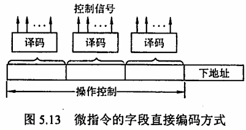

# 第 5 章 中央处理器

## Intro

**【考纲内容】**

1. CPU 的功能和基本结构
2. 指令执行过程
3. 数据通路的功能和基本结构
4. 控制器的功能和工作原理
5. 异常和中断机制
   异常和中断的基本概念；异常和中断的分类；异常和中断的检测与响应
6. 指令流水线
   指令流水线的基本概念；指令流水线的基本实现结构冒险、数据冒险和控制冒险的处理；超标量和动态流水线的基本概念
7. 多处理器基本概念
   SISD、SIMD、MIMD、向量处理器的基本概念；硬件多线程的基本概念
   多核（multi-core）处理器的基本概念；共享内存多处理器（SMP）的基本概念

**【复习提示】**

中央处理器是计算机的中心，也是课程最大的难点。其中，数据通路的分析、指令执行阶段的节拍与控制信号的安排、流水线技术与性能分析容易出综合题。而关于各种寄存器的特点、指令执行的各种周期与特点、控制器的相关概念、流水线的相关概念也极易出选择题。

应当考虑以下问题：

1. 指令和数据均存放在内存中，计算机如何从时间和空间上区分它们是指令还是数据？
2. 什么是指令周期、机器周期和时钟周期？它们之间有何关系？
3. 什么是微指令？
4. 什么是指令流水线？指令流水线相对于传统体系结构的优势是什么？


## 一、CPU 的功能和基本结构

### 0x00 CPU 的功能

中央处理器（CPU）由运算器和控制器组成。其中，控制器的功能是负责协调并控制计算机各部件执行程序的指令序列，包括取指令、分析指令和执行指令；运算器的功能是对数据进行加工。CPU 的具体功能包括：

1. **指令控制**：完成取指令、分析指令和执行指令的操作，即程序的顺序控制。
2. **时间控制**：对各种操作进行时间上的控制，为每条指令按时间顺序提供应有的控制信号。
3. **数据加工**：对数据进行算术和逻辑运算。
4. **中断处理**：处理计算机运行过程中出现的异常情况和特殊请求。

### 0x01 CPU 的基本结构

在计算机系统中，中央处理器主要由运算器和控制器两大部分组成，如图 5.1 所示。


#### 1. 运算器

运算器接收从控制器送来的命令并执行相应的动作，对数据进行加工和处理。运算器是计算机对数据进行加工处理的中心，它主要由以下部分组成：

1. **算术逻辑单元（ALU）**：主要功能是进行算术和逻辑运算。
2. **暂存寄存器**：对应用程序员透明，用于暂时存放数据。
3. **累加寄存器（ACC）**：一个通用寄存器，用于暂时存放 ALU 运算的结果信息，可以作为加法运算的一个输入端。
4. **通用寄存器组**：如 AX、BX、CX、DX、SP 等，用于存放操作数和各种地址信息。SP 是堆栈指针，用于指示栈顶的地址。
5. **程序状态字寄存器（PSW）**：保留由算术逻辑运算指令或测试指令的结果而建立的各种状态信息，如溢出标志（OF）、符号标志（SF）、零标志（ZF）、进位标志（CF）等。
6. **移位器**：对操作数或运算结果进行移位运算。
7. **计数器（CT）**：控制乘除运算的操作步数。

#### 2. 控制器

控制器是整个系统的指挥中枢，在控制器的控制下，运算器、存储器和输入/输出设备等功能部件构成一个有机的整体，根据指令的要求指挥全机协调工作。控制器的基本功能是执行指令，每条指令的执行是由控制器发出的一组微操作实现的。控制器由以下部分组成：

1. **程序计数器（PC）**：用于指出欲执行指令在主存中的存放地址，具有自增功能。
2. **指令寄存器（IR）**：用于保存当前正在执行的指令。
3. **指令译码器**：对操作码字段进行译码，向控制器提供特定的操作信号。
4. **存储器地址寄存器（MAR）**：用于存放要访问的主存单元的地址。
5. **存储器数据寄存器（MDR）**：用于存放向主存写入的信息或从主存读出的信息。
6. **时序系统**：用于产生各种时序信号，由统一时钟（CLOCK）分频得到。
7. **微操作信号发生器**：根据 IR 的内容（指令）、PSW 的内容（状态信息）及时序信号，产生控制整个计算机系统所需的各种控制信号，结构有组合逻辑型和存储逻辑型两种。

> 注意：CPU 内部寄存器大致可分为两类：
> 一类是用户可见的寄存器，可对这类寄存器编程，如通用寄存器组、程序状态字寄存器
> 另一类是用户不可见的寄存器，对用户透明，不可对这类寄存器编程，如存储器地址寄存器、存储器数据寄存器、指令寄存器。


## 二、指令执行过程

### 0x00 指令周期

CPU 从主存中取出并执行一条指令的时间称为指令周期，不同指令的指令周期可能不同。指令周期常用若干机器周期来表示，一个机器周期又包含若干时钟周期（也称节拍或 T 周期，它是 CPU 操作的最基本单位）。每个指令周期内的机器周期数可以不等，每个机器周期内的节拍数也可以不等。图 5.2 反映了上述关系。


对于无条件转移指令 JUMP X，在执行时不需要访问主存，只包含取指阶段（包括取指和分析）和执行阶段，所以其指令周期仅包含取指周期和执行周期。对于间接寻址的指令，为了取操作数，需要先访问一次主存，取出有效地址，然后访问主存，取出操作数，所以还需包括间址周期。间址周期介于取指周期和执行周期之间。当 CPU 采用中断方式实现主机和 I/O 设备的信息交换时，CPU 在每条指令执行结束前，都要发出中断查询信号，若有中断请求，则 CPU 进入中断响应阶段，又称中断周期。这样，一个完整的指令周期应包括取指、间址、执行和中断 4 个周期，如图 5.3 所示。

e

上述 4 个工作周期都有 CPU 访存操作，只是访存的目的不同。取指周期是为了取指令，间址周期是为了取有效地址，执行周期是为了取操作数，中断周期是为了保存程序断点。

为了区别不同的工作周期，在 CPU 内设置 4 个标志触发器 FE、IND、EX 和 INT，它们分别对应取指、间址、执行和中断周期，并以“1”状态表示有效，分别由 1 → FE、1 → IND、1 → EX 和 1 → INT 这 4 个信号控制。注意：中断周期中的进栈操作是将 SP 减 1，这和传统意义上的进栈操作相反，原因是计算机的堆栈中都是向低地址增加，所以进栈操作是减 1 而不是加 1。


### 0x01 指令周期的数据流

数据流是根据指令要求依次访问的数据序列。在指令执行的不同阶段，要求依次访问的数据序列是不同的。而且对于不同的指令，它们的数据流往往也是不同的。

#### 1. 取指周期

取指周期的任务是根据 PC 中的内容从主存中取出指令代码并存放在 IR 中。取指周期的数据流如图 5.4 所示。PC 中存放的是指令的地址，根据此地址从内存单元中取出指令，并放在指令寄存器 IR 中，取指令的同时，PC 加 1。取指周期的数据流向如下：

1. PC → MAR → 地址总线 → 主存
2. CU 发出读命令 → 控制总线 → 主存
3. 主存数据总线 → MDR → IR（存放指令）
5. CU 发出控制信号 → PC 内容加 1


#### 2. 间址周期

间址周期的任务是取操作数有效地址。以一次间址为例（见图 5.5），将指令中的地址码送到 MAR 并送至地址总线，此后 CU 向存储器发读命令，以获取有效地址并存至 MDR。间址周期的数据流向如下：

1. Ad(IR)（或 MDR） → MAR → 地址总线 → 主存
2. CU 发出读命令 → 控制总线 → 主存
4. 主存数据总线 → MDR（存放有效地址）


#### 3. 执行周期

执行周期的任务是取操作数，并根据 IR 中的指令字的操作码通过 ALU 操作产生执行结果。不同指令的执行周期操作不同，因此没有统一的数据流向。

#### 4. 中断周期

中断周期的任务是处理中断请求。假设程序断点存入堆栈中，并用 SP 指示栈顶地址，而且进栈操作是先修改栈顶指针，后存入数据，数据流如图 5.6 所示。中断周期的数据流向如下:

1. CU 控制将 SP 减 1，SP → MAR → 地址总线 → 主存
2. CU 发出写命令 → 控制总线 → 主存
3. PC → MDR → 数据总线 → 主存（程序断点存入主存）
5. CU（中断服务程序的入口地址） → PC


### 0x02 指令执行方案

一个指令周期通常包括几个时间段（执行步骤），每个步骤完成指令的一部分功能，几个依次执行的步骤完成这条指令的全部功能。出于性能和硬件成本等考虑，可以选用 3 种不同的方案来安排指令的执行步骤。

1. **单指令周期**：对所有指令都选用相同的执行时间来完成，称为单指令周期方案。此时每条指令都在一个时钟周期内完成，指令之间串行执行，即下一条指令只能在前一条指令执行结束后才能启动。因此，时钟周期取决于执行时间最长的指令的执行时间。对于那些本来可以在更短时间内完成的指令，要使用这个较长的周期来完成，会降低整个系统的运行速度。

2. **多指令周期**：对不同类型的指令选用不同的执行步骤，称为多指令周期方案。指令之间串行执行，即下条指令只能在前一指令执行完后才能启动。但可选用不同个数的时钟周期来完成不同指令的执行过程，指令需要几个周期就为其分配几个周期，不再要求所有指令占用相同的执行时间。

3. **流水线方案**：指令之间可以并行执行的方案，称为流水线方案，其追求的目标是力争在每个时钟脉冲周期完成一条指令的执行过程（只在理想情况下才能达到该效果）。这种方案通过在每个时钟周期启动一条指令，尽量让多条指令同时运行，但各自处在不同的执行步骤中。


## 三、数据通路的功能和基本结构

### 0x00 数据通路的功能

数据在功能部件之间传送的路径称为数据通路，包括数据通路上流经的部件，如 ALU、通用寄存器、状态寄存器、异常和中断处理逻辑等。数据通路描述了信息从什么地方开始，中间经过哪个寄存器或多路开关，最后传送到哪个寄存器，这些都需要加以控制。

数据通路由控制部件控制，控制部件根据每条指令功能的不同生成对数据通路的控制信号。数据通路的功能是实现 CPU 内部的运算器与寄存器及寄存器之间的数据交换。

### 0x01 数据通路的基本结构

数据通路的基本结构主要有以下几种：

1. **CPU 内部单总线方式**：将所有寄存器的输入端和输出端都连接到一条公共通路上，这种结构比较简单，但数据传输存在较多的冲突现象，性能较低。连接各部件的总线只有一条时，称为单总线结构；CPU 中有两条或更多的总线时，构成双总线结构或多总线结构。图 5.7 所示为 CPU 内部总线的数据通路和控制信号。
   
2. **CPU 内部多总线方式**：将所有寄存器的输入端和输出端都连接到多条公共通路上，相比单总线方式，同时在多个总线上传送不同的数据，提高效率。

3. **专用数据通路方式**：根据指令执行过程中的数据和地址的流动方向安排连接线路，避免使用共享的总线，性能较高，但硬件量大。


在图 5.7 中，各部件用大写字母表示，字母加“in”表示该部件的允许输入控制信号；字母加“out”表示该部件的允许输出控制信号。

> 注意：内部总线是指同一部件，如 CPU 内部连接各寄存器及运算部件之间的总线；系统总线是指同一台计算机系统的各部件，如 CPU、内存和各类 I/O 接口间互相连接的总线。

#### 1. 寄存器之间的数据传送

寄存器之间的数据传送可通过 CPU 内部总线完成。在图 5.7 中，某寄存器 AX 的输出和输入分别由 AXout 和 AXin 控制。现以 PC 寄存器为例，把 PC 内容送至 MAR，实现传送操作的流程及控制信号为：

```
(PC) → MAR      PCout 和 MARin 有效，PC 内容 → MAR
```

#### 2. 主存与 CPU 之间的数据传送

主存与 CPU 之间的数据传送也要借助 CPU 内部总线完成。现以 CPU 从主存读取指令为例说明数据在数据通路中的传送过程。实现传送操作的流程及控制信号为：

```
(PC) → MAR      PCout 和 MARin 有效，现行指令地址 → MAR
1 → R           CU 发读命令
MEM(MAR)→MDR    MDRin 有效
(MDR) → IR      MDRout 和 IRin 有效，现行指令 → IR
```

#### 3. 执行算术或逻辑运算

执行算术或逻辑操作时，由于 ALU 本身是没有内部存储功能的组合电路，因此如要执行加法运算，相加的两个数必须在 ALU 的两个输入端同时有效。图 5.7 中的暂存器 Y 即用于该目的。先将一个操作数经 CPU 内部总线送入暂存器 Y 保存，Y 的内容在 ALU 的左输入端始终有效，再将另一个操作数经总线直接送到 ALU 的右输入端。这样两个操作数都送入了 ALU，运算结果暂存在暂存器 Z 中。

1. $ \text{(MDR)} \rightarrow \text{MAR} $
   - MDRout 和 MARin 有效，操作数有效地址 $\rightarrow \text{MAR}$
2. $ \text{MEM(MAR)} \rightarrow \text{MDR} $
   - CU 发读命令，MEM(MAR) $\rightarrow \text{MDR}$
3. $ \text{(MDR)} \rightarrow \text{Y} $
   - MDRout 和 Yin 有效，操作数 $\rightarrow \text{Y}$
4. $ \text{(ACC) + (Y)} \rightarrow \text{Z} $
   - ACCout 和 ALUin 有效，CU 向 ALU 发加命令，结果 $\rightarrow \text{Z}$
5. $ \text{(Z)} \rightarrow \text{ACC} $
   - Zout 和 ACCin 有效，结果 $\rightarrow \text{ACC}$

数据通路结构直接影响 CPU 内各种信息的传送路径，数据通路不同，指令执行过程的微操作序列的安排也不同，它关系着微操作信号形成部件的设计。

## 四、控制器的功能和工作原理

### 0x00 控制器的结构和功能

从图 5.8 可以看到计算机硬件系统的五大功能部件及其连接关系。它们通过数据总线、地址总线和控制总线连接在一起，其中点画线框内的是控制器部件。

其主要连接关系如下：

1. 运算器部件通过数据总线与内存储器、输入设备和输出设备传送数据
2. 输入设备和输出设备通过接口电路与总线相连接
3. 内存储器、输入设备和输出设备从地址总线接收地址信息，从控制总线得到控制信号，通过数据总线与其他部件传送数据。
4. 控制器部件从数据总线接收指令信息，从运算器部件接收指令转移地址，送出指令地址到地址总线，还要向系统中的部件提供它们运行所需要的控制信号。


控制器是计算机系统的指挥中心，其主要功能有：
1. 从主存中取出一条指令，并指出下一条指令在主存中的位置。
2. 对指令进行译码或测试，产生相应的操作控制信号，以便启动规定的动作。
3. 指挥并控制 CPU、主存、输入和输出设备之间的数据流动方向。

根据控制器产生微操作控制信号的方式不同，控制器可分为硬布线控制器和微程序控制器。这两类控制器中的程序计数器（PC）和指令寄存器（IR）是相同的，但确定和表示指令执行步骤的方法以及给出控制各部件运行所需要的控制信号的方案是不同的。


### 0x01 硬布线控制器

硬布线控制器的基本原理是根据指令的要求、当前的时序及外部和内部的状态，按时间的顺序发送一系列微操作控制信号。它由复杂的组合逻辑门电路和一些触发器构成，因此又称组合逻辑控制器。

#### 1. 硬布线控制单元图

指令的操作码是决定控制单元发出不同操作命令（控制信号）的关键。为了简化控制单元（CU）的逻辑，将指令的操作码译码和节拍发生器从CU分离出来，便可得到简化的控制单元图，如图 5.9 所示。


CU的输入信号来源如下：
1. 经指令译码器译码产生的指令信息。执行指令的操作码决定了不同指令在执行周期所需完成的不同操作，因此指令的操作码字段是控制单元的输入信号，它与时钟配合产生不同的控制信号。
2. 时序系统产生的机器周期信号和节拍信号。为了使控制单元按一定的先后顺序、一定的节奏发出各个控制信号，控制单元必须受时钟控制，即一个时钟脉冲使控制单元发送一个操作命令，或发送一组需要同时执行的操作命令。
3. 来自执行单元的反馈信息即标志。控制单元有时需依赖CPU当前所处的状态产生控制信号，如BAN指令，控制单元要根据上条指令的结果是否为负来产生不同的控制信号。

在图 5.9 中，节拍发生器产生各机器周期中的节拍信号，使不同的微操作命令按时间的先后发出。个别指令的操作不仅受操作码控制，还受状态标志控制，因此CU的输入来自操作码译码电路、节拍发生器及状态标志，其输出到CPU内部或外部控制总线上。注意：控制单元还接收来自系统总线（控制总线）的控制信号，如中断请求、DMA请求。

#### 2. 硬布线控制器的时序系统及微操作

1. **时钟周期**：用时钟信号控制节拍发生器，可以产生节拍，每个节拍的宽度正好对应一个时钟周期。在每个节拍内机器可完成一个或几个需同时执行的操作。
2. **机器周期**：机器周期可视为所有指令执行过程中的一个基准时间。不同指令的操作不同，指令周期也不同。访问一次存储器的时间是固定的，因此通常以存取周期作为基准时间，即内存中读取一个指令字的最短时间作为机器周期。在存储字长等于指令字长的前提下，取指周期也可视为机器周期。在一个机器周期里可完成若干微操作，每个微操作都需一定的时间，可用时钟信号来控制产生每个微操作命令。
3. **指令周期**：指令周期详见 5.2.1 节。
4. **微操作命令分析**：控制单元具有发出各种操作命令（控制信号）序列的功能。这些命令与指令有关，而且必须按一定次序发出，才能使机器有序地工作。执行程序的过程中，对于不同的指令，控制单元需发出各种不同的微操作命令。一条指令分为三个工作周期：取指周期、间址周期和执行周期。下面分析各个子周期的微操作命令。
   1. **取指周期的微操作命令**：无论是什么指令，取指周期都需有下列微操作命令：
   ```assembly
   (PC) → MAR         # 现行指令地址 → MAR
   1 → R              # 命令存储器读
   M(MAR) → MDR       # 现行指令从存储器中读至 MDR
   (MDR) → IR         # 现行指令 → IR
   OP(IR) → CU        # 指令的操作码 → CU 译码
   (PC) + 1 → PC      # 形成下一条指令的地址
   ```
   2. **间址周期的微操作命令**：间址周期完成取操作数地址的任务，具体微操作命令如下：
   ```assembly
   Ad(IR) → MAR       # 将指令字中的地址码（形式地址）→ MAR
   1 → R              # 命令存储器读
   M(MAR) → MDR       # 将有效地址从存储器读至 MDR
   ```
   3. **执行周期的微操作命令**：执行周期的微操作命令视不同指令而定。
      - **非访存指令**：
      ```assembly
      CLA   # 清 ACC → ACC
      COM   # 取反 ĀCC → ACC
      SHR   # 算术右移 L(ACC) → R(ACC), ACC0 → ACC0
      CSL   # 循环左移 R(ACC) → L(ACC), ACC0 → ACC0
      STP   # 停机指令 0 → G
      ```
      - **访存指令**：
      ```assembly
      ADD X   # 加法指令
      Ad(IR) → MAR, 1 → R
      M(MAR) → MDR
      (ACC) + (MDR) → ACC
      STA X   # 存数指令
      Ad(IR) → MAR, 1 → W
      (ACC) → MDR,
      (MDR) → M(MAR)
      LDA X   # 取数指令
      Ad(IR) → MAR, 1 → R
      M(MAR) → MDR,
      (MDR) → ACC
      ```
      - **转移指令**：
      ```assembly
      JMP   # 无条件转移 Ad(IR) → PC
      BANX  # 条件转移（负则转） A0·Ad(IR) + A1·(PC) → PC
      ```


#### 3. CPU 的控制方式

控制单元控制一条指令执行的过程，实质上是依次执行一个确定的微操作序列的过程。由于不同指令所对应的微操作数及复杂程度不同，因此每条指令和每个微操作所需的执行时间也不同。主要有以下 3 种控制方式：

1. **同步控制方式**：系统有一个统一的时钟，所有的控制信号均来自这个统一的时钟信号。通常以最长的微操作序列和最复杂的微操作作为标准，采取完全统一的、具有相同时间间隔和相同数目的节拍作为机器周期来运行不同的指令。优点是控制电路简单，缺点是运行速度慢。
2. **异步控制方式**：不存在基准时标信号，各部件按自身固有的速度工作，通过应答方式进行联络。优点是运行速度快，缺点是控制电路比较复杂。
3. **联合控制方式**：介于同步、异步之间的一种折中方式。这种方式对各种不同的指令的微操作实行大部分采用同步控制、小部分采用异步控制的办法。


#### 4. 硬布线控制单元设计步骤

硬布线控制单元设计步骤包括：

1. **列出微操作命令的操作时间表**：先根据微操作节拍安排，列出微操作命令的操作时间表。操作时间表中包括各个机器周期、节拍下的每条指令完成的微操作控制信号。
   表 5.1 列出了 CLA、COM、SHR 等 10 条机器指令微操作命令的操作时间表。

   - 表中 FE、IND 和 EX 为 CPU 工作周期标志，$T_0\sim T_2$ 为节拍，$I$ 为间址标志，
     在取指周期的 $T_2$ 时刻

     - 若测得 $I=1$则 IND 触发器置“1”，标志进入间址周期
     - 若 $I=0$，则 EX 触发器置“1”，标志进入执行周期。

   - 同理，在间址周期的 T2 时刻，

     - 若测得 IND=0（表示一次间接寻址），则 EX 触发器置“1”，进入执行周期
     - 若测得 IND=1（表示多次间接寻址），则继续间接寻址。

     在执行周期的 T2 时刻，CPU 要向所有中断源发中断查询信号，若检测到有中断请求并满足响应条件，则 INT 触发器置“1”，标志进入中断周期。表中未列出 INT 触发器置“1”的操作和中断周期的微操作。

   - 表中第一行对应 10 条指令的操作码，代表不同的指令。若某指令有表中所列出的微操作命令，其对应的单元格内为 1。

2. **进行微操作信号综合**：在列出微操作时间表后，即可对它们进行综合分析、归类，根据微操作时间表可写出各微操作控制信号的逻辑表达式并进行适当的简化。表达式一般包括下列因素：
   $$
   微操作控制信号=机器周期\and 节拍\and 脉冲\and 操作码\and 机器状态条件
   $$
   根据表 5.1 便可列出每个微操作命令的初始逻辑表达式，经化简、整理可获得能用现有门电路实现的微操作命令逻辑表达式。

例如，根据表 5.1 可写出 M(MAR)→MDR 微操作命令的逻辑表达式：
$$
M(MAR) \rightarrow MDR\\
= FE \cdot T_1 + IND \cdot T_2 \cdot (ADD + STA + LDA + JMP + BAN) + EX \cdot T_3 \cdot(ADD + LDA)\\
=T_1\{FE+IND(ADD+STA+LDA+JMP+BAN)+EX(ADD+LDA)\}
$$

式中，ADD、STA、LDA、JMP、BAN 均来自操作码译码器的输出。

3. **画出微操作命令的逻辑图**：根据逻辑表达式可画出对应每个微操作信号的逻辑电路图，并用逻辑门电路实现。例如，M(MAR)→MDR的逻辑表达式所对应的逻辑图如下图所示，图中未考虑门的扇入系数。


### 0x02 微程序控制器

微程序控制器采用存储逻辑实现，也就是把微操作信号代码化，使每条机器指令转化为一段微程序并存入一个专门的存储器（控制存储器）中，微操作控制信号由微指令产生。

#### 1. 微程序控制的基本概念

指令对应一个或几个微操作命令。这些微程序可以存到一个控制存储器中，用寻址用户程序机器指令的办法来寻址每个微程序中的微指令。目前，大多数计算机都采用微程序设计技术。微程序设计技术涉及的基本术语如下：

1. **微命令与微操作**：一条机器指令可以分解成一个微操作序列，这些微操作是计算机中最基本的、不可再分解的操作。在微程序控制的计算机中，将控制部件向执行部件发出的各种控制命令称为微命令，它是构成控制序列的最小单位。例如，打开或关闭某个控制门的电位信号、某个寄存器的打入脉冲等。微命令和微操作是一一对应的。微命令是微操作的控制信号，微操作是微命令的执行过程。微命令有相容性和互斥性之分。相容性微命令是指那些可以同时产生、共同完成某一些微操作的微命令；而互斥性微命令是指在机器中不允许同时出现的微命令。相容和互斥都是相对的，一个微命令可以和一些微命令相容，和另一些微命令互斥。

2. **微指令与微周期**：微指令是若干微命令的集合。存放微指令的控制存储器的单元地址称为微地址。一条微指令通常至少包含两大部分信息：
    - 操作控制字段：又称微操作码字段，用于产生某一步操作所需的各种操作控制信号。
    - 顺序控制字段：又称微地址码字段，用于控制产生下一条要执行的微指令地址。微周期是指执行一条微指令所需的时间，通常为一个时钟周期。

3. **主存储器与控制存储器**：主存储器用于存放程序和数据，在 CPU 外部，用 RAM 实现；控制存储器（CM）用于存放微程序，在 CPU 内部，用 ROM 实现。

4. **程序与微程序**：程序是指令的有序集合，用于完成特定的功能；微程序是微指令的有序集合，一条指令的功能由一段微程序来实现。

微程序和程序是两个不同的概念。微程序是由微指令组成的，用于描述机器指令。微程序实际上是机器指令的实时解释器，是由计算机设计者事先编制好并存放在控制存储器中的，一般不提供给用户。对程序员来说，计算机系统中的微程序的结构和功能是透明的，无需知道。而程序最终由机器指令组成，是由软件设计人员事先编制好并存放在主存或辅存中的。

应注意区分以下寄存器：

- **地址寄存器（MAR）**：用于存放主存的读/写地址。
- **微地址寄存器（CMAR）**：用于存放控制存储器的读/写微指令的地址。
- **指令寄存器（IR）**：用于存放从主存中读出的指令。
- **微指令寄存器（CMDR 或 μIR）**：用于存放从控制存储器中读出的微指令。


#### 2. 微程序控制器组成和工作过程

##### (1) 微程序控制器的基本组成

微程序控制器的基本组成包括：


- **控制存储器**：它是微程序控制器的核心部件，用于存放各指令对应的微程序，控制存储器可用只读存储器 ROM 构成。
- **微指令寄存器**：用于存放从控制存储器中取出的微指令，它的位数同微指令字长相等。
- **微地址形成部件**：用于产生初始微地址和后继微地址，以保证微指令的连续执行。
- **微地址寄存器**：接收微地址形成部件送来的微地址，为在控制存储器中读取微指令作准备。

##### (2) 微程序控制器的工作过程

微程序控制器的工作过程实际上就是在微程序控制器的控制下计算机执行机器指令的过程，这个过程可以描述如下：

- **取微指令公共操作**：在机器开始运行时，自动将取指微程序的入口地址送入 CMAR，并从控制存储器中读出相应的微指令送入 CMDR，并从 CM 中读出相应的微指令送入 CMDR。取指微程序的入口地址一般为 CM 的 0 号单元。当取址微程序执行完后，从主存中取出的机器指令就已存入指令寄存器中。
- **机器指令的操作码字段产生微程序入口地址**：由机器指令的操作码字段通过微地址形成部件产生该机器指令所对应的微程序的入口地址，并送入 CMAR。
- **逐条取出并执行对应的微指令**：从 CM 中逐条取出对应的微指令并执行。
- **取下一条机器指令**：执行完对应于一条机器指令的微程序后，又回到取指微程序的入口地址，继续第一个步骤，以完成取下一条机器指令的公共操作。

##### (3) 微程序和机器指令

通常，一条机器指令对应一个微程序。由于任何机器指令的取指令操作都是相同的，因此可将取指令操作的微命令统一编成一个微程序，这个微程序只负责将指令从主存单元中取出并送至指令寄存器。此外，也可编出对应间址周期的微程序和中断周期的微程序。这样，控制存储器中的微程序个数应为机器指令数再加上对应取指、间址和中断周期等公共的微程序数。


#### 3. 微指令的编码方式

微指令的编码方式又称微指令的控制方式，是指如何对微指令的控制字段进行编码，以形成控制信号。编码的目标是在保证速度的情况下，尽量缩短微指令字长。

##### (1) 直接编码（直接控制）方式

微指令的直接编码方式如图 5.12 所示。直接编码法无须进行译码，微指令的微命令字段中每位都代表一个微命令。设计微指令时，选用或不选用某个微命令，只要将表示该微命令的对应位设置成 1 或 0 即可。每个微命令对应并控制数据通路中的一个微操作。


这种编码的优点是简单、直观，执行速度快，操作并行性好；缺点是微指令字长过长，n 个微命令就要求微指令的操作字段有 n 位，造成控制存储器容量极大。

##### (2) 字段直接编码方式

将微指令的微命令字段分成若干小字段，把互斥性微命令组合在同一字段中，把相容性微命令组合在不同字段中，每个字段独立编码，每种编码代表一个微命令且各字段编码含义单独定义，与其他字段无关。

这种方式可以缩短微指令字长，但因为要通过译码电路后再发出微命令，因此比直接编码方式慢。



微命令字段分段的原则：

1. 互斥性微命令分在同一段内，相容性微命令分在不同段内
2. 每个小段中包含的信息位不能太多，否则将增加译码线路的复杂性和译码时间
3. 一般每个小椴还要留出一个状态，表示本字段不发出任何微命令。因此，当某字段的长度为 3 位时，最多只能表示 7 个互斥的微命令，通常用 000 表示不操作

##### (3) 字段间接编码方式

一个字段的某些微命令需由另一个字段中的某些微命令来解释，由于不是靠字段直接译码发出的微命令，因此称为字段间接编码，又称隐式编码。这种方式可进一步缩短微指令字长，但因削弱了微指令的并行控制能力，因此通常作为字段直接编码方式的一种辅助手段。


#### 4. 微指令的地址形成方式

后继微地址的形成主要有以下两大基本类型：

1. **直接由微指令的下地址字段指出**：微指令格式中设置一个下地址字段，由微指令的下地址字段直接指出后继微指令的地址，这种方式又称断定方式。
2. 根据机器指令的操作码形成。机器指令取至指令寄存器后，微指令的地址由操作码经微地址形成部件形成

实际上，微指令序列地址的形成方式还有以下几种：

- 增量计数器法，即 (CMAR)+1 → CMAR，适用于后继微指令的地址连续的情况。
- 根据各种标志决定微指令分支转移的地址。
- 通过测试网络形成。
- 由硬件直接产生微程序入口地址。

电源加电后，第一条微指令的地址可由专门的硬件电路产生，也可由外部直接向 CMAR 输入微指令的地址，这个地址即为取指周期微程序的入口地址。


#### 5. 微指令的格式

微指令格式与微指令的编码方式有关，通常分水平型微指令和垂直型微指令两种。

1. **水平型微指令**：直接编码、字段直接编码、字段间接编码和混合编码都属于水平型微指令。水平型微指令的基本指令格式如图 5.14 所示，指令字中的一位对应一个控制信号，有输出时为 1，否则为 0。一条水平型微指令定义并执行几种并行的基本操作。


   优点是微程序短，执行速度快；缺点是微指令长，编写微程序较麻烦。

2. **垂直型微指令**：采用类似机器指令操作码的方式，在微指令中设置微操作码字段，采用微操作码编译法，由微操作码规定微指令的功能，其基本的指令格式如图 5.15 所示。一条垂直型微指令只能定义并执行一种基本操作。


   垂直型微指令格式的优点是微指令短、简单、规整，便于编写微程序；缺点是微程序长，执行速度慢，工作效率低。

3. **混合型微指令**：在垂直型的基础上增加一些不太复杂的并行操作。微指令较短，仍便于编写；微程序也不长，执行速度加快。

4. **水平型和垂直型微指令的比较**：
    - 水平型微指令并行操作能力强、效率高、灵活性强；垂直型微指令则较差。
    - 水平型微指令执行一条指令的时间短；垂直型微指令执行的时间长。
    - 水平型微指令解释指令的微程序，具有微指令字较长但微程序短的特点；垂直型微指令则与之相反，其微指令字较短而微程序长。
    - 水平型微指令用户难以掌握，而垂直型微指令与指令比较相似，相对容易掌握。


#### 6. 微程序控制单元的设计步骤

微程序控制单元设计的主要任务是编写各条机器指令所对应的微程序。具体的设计步骤如下：

1. **写出对应机器指令的微操作命令及节拍安排**：无论是组合逻辑设计还是微程序设计，对应相同的 CPU 结构，两种控制单元的微操作命令和节拍安排都是极相似的。如微程序控制单元在取指阶段发出的微操作命令及节拍安排如下：

    | $T_0$ | (PC) → MAR, 1 → R                       |
    | :---: | --------------------------------------- |
    | $T_1$ | **M(MAR) → MDR, (PC) + 1 → PC**         |
    | $T_2$ | **(MDR) → IR, OP(IR) → 微地址形成部件** |

    与硬布线控制单元相比，只在 $T_2$ 节拍内的微操作命令不同。微程序控制单元在 T 节拍内要将指令的操作码送至微地址形成部件，即 `OP(IR) → 微地址形成部件`，以形成该条机器指令的微程序首地址。而硬布线控制单元在 $T_2$ 节拍内要将指令的操作码送至指令译码器，以控制 CU 发出相应的微命令，即 `OP(IR) → ID`

    若把一个节拍 $T$ 内的微操作安排在一条微指令中完成，上述微操作对应 3 条微指令。
    但由于微程序控制的所有控制信号都来自微指令，而微指令又存在控制存储器中，因此欲完成上述这些微操作，必须先将微指令从控制存储器中读出，即必须先给出这些微指令的地址。
    在取指微程序中，除第一条微指令外，其余微指令的地址均由上一条微指令的下地址字段直接给出，因此上述每条微指令都需增加一个将微指令下地址字段送至 CMAR 的微操作，记为 `Ad(CMDR) → CMAR`。
    取指微程序的最后一条微指令，其后继微指令的地址是由微地址形成部件形成的，即 `微地址形成部件 → CMAR`。为了反映该地址与操作码有关，因此记为 `OP(IR) → 微地址形成部件 → CMAR`。

    综上所述，考虑到需要形成后继微指令地址，上述分析的取指操作共需 6 条微指令完成：

    | $T_0$ | (PC) → MAR, 1 → R                  |
    | :---: | ---------------------------------- |
    | $T_1$ | **Ad(CMDR) → CMAR**                |
    | $T_2$ | **M(MAR) → MDR, (PC) + 1 → PC**    |
    | $T_3$ | **Ad(CMDR) → CMAR**                |
    | $T_4$ | **(MDR) → IR**                     |
    | $T_5$ | **OP(IR) → 微地址形成部件 → CMAR** |

    执行阶段的微操作命令及节拍安排，分配原则类似。与硬布线控制单元微操作命令的节拍安排相比，多了将下一条微指令地址送至 CMAR 的微操作命令，即 Ad(CMDR) → CMAR。其余的微操作命令与硬布线控制单元相同。

    > 注意：这里为了理解，应将微指令和机器指令相联系，因为每执行完一条微指令后要得到下一条微指令的地址。

2. **确定微指令格式**：微指令格式包括微指令的编码方式、后继微指令地址的形成方式和微指令字长等。根据微操作个数决定采用何种编码方式，以确定微指令的操作控制字段的位数。由微指令数确定微指令的顺序控制字段的位数。最后按操作控制字段位数和顺序控制字段位数就可确定微指令字长。

3. **编写微指令码点**：根据操作控制字段每位代表的微操作命令，编写每条微指令的码点。


#### 7. 动态微程序设计和毫微程序设计

1. **动态微程序设计**：在一台微程序控制的计算机中，假如能根据用户的要求改变微程序，则这台机器就具有动态微程序设计功能。动态微程序的设计需要可写控制寄存器的支持，否则难以改变微程序的内容。实现动态微程序设计可采用可擦除可编程只读存储器（EPROM）。
2. **毫微程序设计**：在普通的微程序计算机中，从主存取出的每条指令是由放在控制存储器中的微程序来解释执行的，通过控制线对硬件进行直接控制。若硬件不由微程序直接控制，而是通过存放在第二级控制存储器中的毫微程序来解释的，这个第二级控制存储器就称为毫微存储器，直接控制硬件的是毫微指令。


#### 8. 硬布线和微程序控制器的特点

1. **硬布线控制器的特点**：硬布线控制器的优点是由于控制器的速度取决于电路延迟，所以速度快。
   缺点是由于将控制部件视为专门产生固定时序的控制信号的逻辑电路，所以把用最少元件和取得最高速度作为设计目标，一旦设计完成，就不可能通过其他额外修改添加新功能。
2. **微程序控制器的特点**：微程序控制器的优点是同组合逻辑控制器相比，微程序控制器具有规整性、灵活性、可维护性等一系列优点；
   缺点是由于微程序控制器采用了存储程序原理，所以每条指令都要从控制存储器中取一次，影响速度。

为便于比较，下面以表格的形式对比二者的不同：

| 类别     | 微程序控制器                                                 | 硬布线控制器                                                 |
| -------- | ------------------------------------------------------------ | ------------------------------------------------------------ |
| 工作原理 | 微操作控制信号以微程序的形式存放在控制存储器中；执行指令时读出即可 | 微操作控制信号由组合逻辑电路根据当前的指令码、状态和时序，即时产生 |
| 执行速度 | 慢                                                           | 快                                                           |
| 规整性   | 较规整                                                       | 繁琐、不规整                                                 |
| 应用场合 | CISC CPU                                                     | RISC CPU                                                     |
| 易扩充性 | 易扩充                                                       | 修改困难                                                     |


## 五、异常和中断机制

异常和中断机制由硬件和操作系统共同完成。硬件部分包括 CPU 的异常/中断逻辑和外设接口中的中断请求和控制逻辑。操作系统中有相应的中断服务程序。中断硬件线路和中断服务程序结合，共同完成异常和中断的处理过程。

### 0x00 异常和中断的基本概念

- **异常**：由 CPU 内部产生的意外事件，也称内中断。
- **中断**：由 CPU 外部设备向 CPU 发出的中断请求，通常用于信息的输入和输出，也称外中断。

异常是 CPU 执行指令时检测到的同步事件；中断是由外部设备触发的异步事件。

处理过程：当 CPU 在执行指令时检测到异常或中断请求时，CPU 会打断当前程序，转到相应的异常或中断处理程序去执行。处理完毕后，CPU 执行返回指令，回到被打断的程序继续执行。如果是致命错误，则终止用户程序。具体处理过程由操作系统和驱动程序完成。

### 0x01 异常和中断的分类

#### 1. 异常的分类

异常分为硬故障中断和程序性异常。

- **硬故障中断**：由硬连线异常引起，如存储器校验错、总线错误等。
- **程序性异常**：因执行指令而引起的异常事件，如整除 0、溢出、断点、单步跟踪、非法指令、栈溢出、地址越界、缺页等。

按异常发生原因和返回方式的不同，异常可分为故障、自陷和终止：

1. **故障 (Fault)**：指令执行过程中检测到的异常事件，如非法操作码、缺段、缺页、除数为 0 等。处理后可恢复。
2. **自陷 (Trap)**：预先安排的异常事件，通过特殊指令或控制标志设置的陷阱。执行自陷指令后，CPU 自动处理，然后返回继续执行。
3. **终止 (Abort)**：无法恢复的硬件故障，如控制器出错、存储器校验错等，导致程序终止。

#### 2. 中断的分类

中断包括来自 CPU 外部的事件，如 I/O 中断（如键盘输入、打印机缺纸等）或特殊事件（如用户按 Esc 键、定时器计数时间到等）。中断可分为可屏蔽中断和不可屏蔽中断：

1. **可屏蔽中断**：通过 INTR 线向 CPU 发出的中断请求，CPU 可以选择屏蔽或不屏蔽。
2. **不可屏蔽中断**：通过 NMI 线向 CPU 发出的紧急硬件故障中断请求，如电源掉电等，不可被屏蔽。

中断和异常在本质上相同，但有以下不同点：

1. 异常事件与特定指令相关，而中断与指令无关。
2. 异常由 CPU 自身检测，中断需通过中断请求线获取信息。

### 0x02 异常和中断响应过程

当 CPU 执行指令时发生异常或中断请求，需要进行处理。响应过程包括关中断、保存断点和程序状态、识别异常和中断并转到相应的处理程序：

1. **关中断**：保存断点和程序状态期间不能被新中断打断，通过设置“中断允许”（IF）触发器实现。IF 置为 1 表示开中断，置为 0 表示关中断。
2. **保存断点和程序状态**：保存断点（返回地址）和程序状态字寄存器 PSWR 的内容到栈中，以便异常或中断返回时恢复。
3. **识别异常和中断并转到相应的处理程序**：异常和中断源的识别有软件和硬件两种方式。
    - **软件识别方式**：CPU 设置异常状态寄存器记录异常原因，操作系统查询寄存器以检测类型，按优先级顺序处理。
    - **硬件识别方式（向量中断）**：异常或中断处理程序的首地址称为中断向量，存放在中断向量表中。每个异常或中断有一个类型号，通过类型号找到处理程序。

响应过程结束后，CPU 从 PC 中取出中断服务程序的第一条指令开始执行，直至中断返回。整个中断处理过程由软/硬件协同实现。


## 六、指令流水线

传统单周期处理机采用串行方法执行指令，同一时刻 CPU 中只有一条指令在执行，因此功能部件的使用率较低。现代计算机普遍采用指令流水线技术，使得同一时刻多条指令在 CPU 的不同功能部件中并发执行，从而大幅提高了功能部件的并行性和程序的执行效率。

### 0x00 指令流水线的基本概念

提高处理机并行性的方法有两种：
1. **时间上的并行技术**：将一个任务分解为几个不同的子阶段，这种方法称为流水线技术。
2. **空间上的并行技术**：在一个处理机内设置多个执行相同任务的功能部件，并行工作，这样的处理机称为超标量处理机。

#### 1. 指令流水的定义

一条指令的执行过程可分解为若干阶段，每个阶段由相应的功能部件完成。这些阶段可视为流水线的不同段，每个时钟周期都有一条指令进入流水线并完成，理想情况下，每条指令的时钟周期数（CPI）为 1。

- **取指（IF）**：从指令存储器或缓存中取指令。
- **译码/读寄存器（ID）**：对指令进行译码，同时从寄存器堆中取操作数。
- **执行/计算地址（EX）**：执行运算操作或计算地址。
- **访存（MEM）**：对存储器进行读写操作。
- **写回（WB）**：将指令执行结果写回寄存器堆。

如图 5.16 所示，将第 $ k+1 $ 条指令的取指阶段提前到第 $ k $ 条指令的译码阶段，从而使第 $ k+1 $ 条指令的译码阶段与第 $ k $ 条指令的执行阶段同时进行。


在理想情况下，每个时钟周期都有一条指令进入流水线，并且每个时钟周期都有一条指令完成。每条指令的时钟周期数（CPI）为 1。

#### 2. 流水线设计原则

流水线设计的原则是根据最复杂指令的功能段个数和操作时间来确定流水段个数和长度。例如，假设某条指令的 5 个阶段所花的时间分别为：

- 取指：200 ps
- 译码：100 ps
- 执行：150 ps
- 访存：200 ps
- 写回：100 ps

总执行时间为 750 ps。根据流水线设计原则，每个流水段的长度为 200 ps，因此每条指令的执行时间为 1 ns，比串行执行时增加了 250 ps。假设某程序有 $ N $ 条指令，单周期处理机所用的时间为 $ N \times 750 $ ps，而流水线处理机所用的时间为 $ (N + 4) \times 200 $ ps。虽然流水线方式不能缩短单条指令的执行时间，但可以大幅提高整个程序的执行效率。

#### 3. 指令集特征

为了实现指令流水线，指令集应具备以下特征：

1. **一致的指令长度**：有利于简化取指和译码操作。
2. **固定的操作数位置**：便于译码后确定寄存器编号。
3. **采用 Load/Store 指令**：其他指令不能访问存储器，简化地址计算。
4. **数据和指令对齐存放**：减少访存次数，使所需数据在一个流水段内得到。

#### 4. 流水线表示方法

通常用时空图描述流水线的执行情况，如图 5.17 所示。


时空图中，横坐标表示时间，纵坐标表示当前指令所处的功能部件。第一条指令在时刻 0 进入流水线，在时刻 5T 流出流水线。第二条指令在时刻 T 进入，在时刻 6T 流出。以此类推，每隔一个时间 T 就有一条指令进入流水线。从时刻 5T 开始，每隔一个时间 T 就有一条指令流出流水线。

在时刻 10T 时，流水线有 6 条指令流出，而串行执行方式在时刻 10T 时只能执行 2 条指令。使用流水线方式大幅提高了计算机速度。流水线技术适用于大量连续任务的处理，指令执行连续不断，适合使用流水线技术。对于其他部件级流水线（如浮点运算流水线），同样只适合于提升浮点运算密集型应用的性能，对于单个运算无效。


## 六、指令流水线

传统单周期处理机采用串行方法执行指令，同一时刻 CPU 中只有一条指令在执行，因此功能部件的使用率较低。现代计算机普遍采用指令流水线技术，使得同一时刻多条指令在 CPU 的不同功能部件中并发执行，从而大幅提高了功能部件的并行性和程序的执行效率。

### 0x00 指令流水线的基本概念

提高处理机并行性的方法有两种：
1. **时间上的并行技术**：将一个任务分解为几个不同的子阶段，这种方法称为流水线技术。
2. **空间上的并行技术**：在一个处理机内设置多个执行相同任务的功能部件，并行工作，这样的处理机称为超标量处理机。

#### 1. 指令流水的定义

一条指令的执行过程可分解为若干阶段，每个阶段由相应的功能部件完成。这些阶段可视为流水线的不同段，每个时钟周期都有一条指令进入流水线并完成，理想情况下，每条指令的时钟周期数（CPI）为 1。

- **取指（IF）**：从指令存储器或缓存中取指令。
- **译码/读寄存器（ID）**：对指令进行译码，同时从寄存器堆中取操作数。
- **执行/计算地址（EX）**：执行运算操作或计算地址。
- **访存（MEM）**：对存储器进行读写操作。
- **写回（WB）**：将指令执行结果写回寄存器堆。

如图 5.16 所示，将第 $ k+1 $ 条指令的取指阶段提前到第 $ k $ 条指令的译码阶段，从而使第 $ k+1 $ 条指令的译码阶段与第 $ k $ 条指令的执行阶段同时进行。


在理想情况下，每个时钟周期都有一条指令进入流水线，并且每个时钟周期都有一条指令完成。每条指令的时钟周期数（CPI）为 1。

#### 2. 流水线设计原则

流水线设计的原则是根据最复杂指令的功能段个数和操作时间来确定流水段个数和长度。例如，假设某条指令的 5 个阶段所花的时间分别为：

- 取指：200 ps
- 译码：100 ps
- 执行：150 ps
- 访存：200 ps
- 写回：100 ps

总执行时间为 750 ps。根据流水线设计原则，每个流水段的长度为 200 ps，因此每条指令的执行时间为 1 ns，比串行执行时增加了 250 ps。假设某程序有 $ N $ 条指令，单周期处理机所用的时间为 $ N \times 750 $ ps，而流水线处理机所用的时间为 $ (N + 4) \times 200 $ ps。虽然流水线方式不能缩短单条指令的执行时间，但可以大幅提高整个程序的执行效率。

#### 3. 指令集特征

为了实现指令流水线，指令集应具备以下特征：

1. **一致的指令长度**：有利于简化取指和译码操作。
2. **固定的操作数位置**：便于译码后确定寄存器编号。
3. **采用 Load/Store 指令**：其他指令不能访问存储器，简化地址计算。
4. **数据和指令对齐存放**：减少访存次数，使所需数据在一个流水段内得到。

#### 4. 流水线表示方法

通常用时空图描述流水线的执行情况，如图 5.17 所示。


时空图中，横坐标表示时间，纵坐标表示当前指令所处的功能部件。第一条指令在时刻 0 进入流水线，在时刻 5T 流出流水线。第二条指令在时刻 T 进入，在时刻 6T 流出。以此类推，每隔一个时间 T 就有一条指令进入流水线。从时刻 5T 开始，每隔一个时间 T 就有一条指令流出流水线。

在时刻 10T 时，流水线有 6 条指令流出，而串行执行方式在时刻 10T 时只能执行 2 条指令。使用流水线方式大幅提高了计算机速度。流水线技术适用于大量连续任务的处理，指令执行连续不断，适合使用流水线技术。对于其他部件级流水线（如浮点运算流水线），同样只适合于提升浮点运算密集型应用的性能，对于单个运算无效。

### 0x01 流水线的基本实现

在单周期实现中，这 5 个功能段是串连在一起的，如图 5.18 所示。将程序计数器（PC）的值送入 IF 段取指令，然后依次进入 ID、EX、MEM、WB 段。虽然不是所有指令都必须经历完整的 5 个阶段，但只能以执行速度最慢的指令作为设计其时钟周期的依据，单周期 CPU 的时钟频率取决于数据通路中的关键路径（最长路径)，因此单周期 CPU 指令执行效率不佳。

#### 1. 流水线的数据通路

一个 5 段流水线数据通路如图 5.19 所示。其中，IF 段包括程序计数器（PC）、指令存储器、下条指令地址的计算逻辑；ID 段包括操作控制器、取操作数逻辑、立即数符号扩展模块；EX 段主要包括算术逻辑单元（ALU）、分支地址计算模块：MEM 段主要包括数据存储器读写模块；WB 段主要包括寄存器写入控制模块。每个流水段后面都需要增加一个流水寄存器，用于锁存本段处理完成的数据和控制信号，以保证本段的执行结果能在下个时钟周期给下一流水段使用，图中增加了 4 个流水寄存器，并根据其所连接的功能段来命名。各种寄存器和数据存储器均采用统一时钟 CLK 进行同步，每来一个时钟，就会有一条新的指令进入流水线 IF 段；同时流水寄存器会锁存前段加工处理完成的数据和控制信号，为下一段的功能部件提供数据输入。


不同流水寄存器锁存的数据不相同，如图 5.19 中的实线表示。IF/ID 流水寄存器需要锁存从指令存储器取出的指令字，以及 PC+4 的值：ID/EX 流水寄存器需要锁存从寄存器堆中取出的两个操作数 RS 和 RT（指令中两个操作数字段对应的寄存器值）与写寄存器编号 WriteReg#，以及立即数符号扩展的值、PC+4 等后段可能用到的操作数；EX/MEM 流水寄存器需要锁存 ALU 运算结果、数据存储器待写入数据 WriteData、写寄存器编号 WriteReg#等数据：MEM/WB 流水寄存器需要锁存 ALU 运算结果、数据存储器读出数据、写寄存器编号 WriteReg#等数据。

#### 2. 流水线的控制信号

上节描述了数据通过流水寄存器进行传递的情况。但是在某一时刻，每个流水段执行不同指令的某个阶段，每个流水段还需要正在执行指令的对应功能段的控制信号。图 5.19 中的控制信号（虚线表示）如表 5.3 所示。控制信号的来源并不一致，如 IF 段的分支转跳信号 BranchTaken 来源于 EX 段，ID 段的 RegWrite 信号来源于 WB 段。其他控制信号通过控制器产生，由 ID 段负责译码生成控制信号，并分别在随后的各个时钟周期内使用。

| **控制信号** | **位置** | **来源** | **功能说明**                                                 |
| ------------ | -------- | -------- | ------------------------------------------------------------ |
| BranchTaken  | IF       | EX       | 分支跳转信号，为 1 表示跳转，由 EX 段的 Branch 信号与 equal 标志进行逻辑与生成 |
| RegDst       | ID       | ID       | 写入目的寄存器选择，为 1 时目的寄存器为 rd 寄存器，为 0 时为 rt 寄存器 |
| RegWrite | ID | WB | 控制寄存器堆写操作，为 1 时数据需要写回寄存器堆中的指定寄存器 |
| AluSrc | EX | EX | ALU 的第二输入选择控制，为 0 时输入寄存器 rt，为 1 时输入扩展后的立即数 |
| AluOp | EX | EX | 控制 ALU 进行不同运算，具体取值和位宽与 ALU 的设计有关 |
| MemWrite | MEM | MEM | 控制数据存储器写操作，为 0 时进行读操作，为 1 时进行写操作 |
| MemToReg | WB | WB | 为 1 时将数据存储器读出数据写回寄存器堆，否则将 ALU 运算结果写回 |

控制器的输入主要是 IF/ID 流水寄存器锁存的指令字中的 OP 字段，输出为 7 个控制信号，其中 RegDst 信号在 ID 段使用，其他 6 个后段使用的控制信号输出到 ID/EX 流水寄存器中并依次向后传递，以供后续各流水段使用。RegWrite 信号必须传递至 WB 段后才能反馈到 ID 段的寄存器堆的写入控制段 WE;条件分支译码信号 Branch 也需要传递到 EX 段，与 ALU 运算的标志 equal 信号进行逻辑与操作后，反馈到 IF 段控制多路选择器进行分支处理。

综上所述，每个流水寄存器中保存的信息包括：
1. 后面流水段需要用到的所有数据信息，包括 PC+4、指令、立即数、目的寄存器、ALU 运算结果、标志信息等，它们是前面阶段在数据通路中执行的结果；
2. 前面传递过来的后面各流水段要用到的所有控制信号。

#### 3. 流水线的执行过程

由于流水线的特殊结构，所有指令都需要完整经过流水线的各功能段，只不过某些指令在某些功能段内没有任何实质性的操作，只是等待一个时钟周期，这也就意味着单条指令的执行时间还是 5 个功能段时间延迟的总和。下面简单描述图 5.19 中各流水段的执行过程。

1. **取指（IF）**：将 PC 值作为地址从指令寄存器中取出第一条指令字，并计算 PC+4，送入 PC 输入端，以 IF/ID 流水寄存器，PC+4 也要送入 IF/ID 流水寄存器，以备后续可能使用（如相对转移指令）。只要是后续功能段有可能要用到的数据和控制信号，都要向后传递。时钟到来时将更新后的 PC 值和指令字锁存到 IF/ID 流水寄存器中；本条指令 $I_1$ 进入 ID 段，IF 段取出下条指令 $I_2$。
2. **译码/读寄存器（ID）**：由控制器根据 IF/ID 流水寄存器中的指令字生成后续各段需要的控制信号。对于访存指令 $I_w$，根据指令字中的 rs、rt 取出寄存器堆中的值 RS 和 RT；符号扩展单元将指令字中的 16 位立即数符号扩展为 32 位；多路选择器生成指令可能的写寄存器编号 WriteReg#。时钟到来时，这些数据和控制信号，连同顺序指令地址 PC+4，都会锁存到 ID/EX 流水寄存器中；指令 $I_1$ 进入 EX 段，同时下条指令 $I_2$ 进入 ID 段，下下条指令 $I_3$ 进入 IF 段。
3. **执行/计算地址（EX）**：EX 段功能由具体指令确定，不同指令经 ID 段译码后得到不同的控制信号。对于访存指令 $I_w$，EX 主要用来计算访存地址，将 ID/EX 流水寄存器中的 RS 值与符号扩展后的立即数相加得到的访存地址送入 EX/MEM 流水寄存器。EX 段可能还要计算分支地址，生成分支转跳信号 BranchTaken。RT 的值可能会在 MEM 段作为写入数据使用，所以 RT 会作为写入数据 WriteData 送入 EX/MEM 流水寄存器：ID/EX 流水寄存器中的写寄存器编号 WriteReg# 也将直接传送给 EX/MEM 流水寄存器。时钟到来后，这些数据和后段需要的控制信号都会锁存到 EX/MEM 流水寄存器中；指令 $I_1$ 进入 MEM 段，后续指令 $I_2, I_3, I_4$ 分别进入 EX、ID、IF 段。
4. **访存（MEM）**：MEM 段的功能也由具体指令确定。对于访存指令 $I_w$，主要是根据 EX/MEM 流水寄存器中锁存的访存地址，写入数据和内存读写控制信号 MemWrite 对存储器进行读或写操作。EX/MEM 流水寄存器中的访存地址、WriteReg#、数据存储器读出的数据都会送入 MEM/WB 流水寄存器，以备后续可能使用。时钟到来后，这些数据和后段需要的控制信号都会锁存到 MEM/WB 流水寄存器中；指令 $I_1$ 进入 WB 段，后续指令 $I_2, I_3, I_4, I_5$ 分别进入 MEM、EX、ID、IF 段。
5. **写回（WB）**：WB 段的功能也由具体指令确定。将 MEM/WB 流水寄存器中数据存储器读出的数据写回指定寄存器 WriteReg#。时钟到来时会完成数据写入寄存器，指令 $I_1$ 离开流水线。此时，指令 $I_2$ 进入最后的 WB 段，指令 $I_3, I_4, I_5$ 分别进入 MEM、EX、ID 段，指令 $I_6$ 进入 IF 段。

### 0x02 流水线的冒险与处理

在指令流水线中，可能会遇到一些情况使得流水线无法正确执行后续指令而引起流水线阻塞或停顿，这种现象称为流水线冒险。根据导致冒险的原因不同主要有 3 种：结构冒险（资源冲突）、数据冒险（数据冲突）和控制冒险（控制冲突）。

#### 1. 结构冒险

由于多条指令在同一时刻争用同一资源而形成的冲突，也称为资源冲突，即由硬件资源竞争造成的冲突，有以下两种解决办法：

1. 前一指令访存时，使后一相关指令（以及其后续指令）暂停一个时钟周期。
2. 单独设置数据存储器和指令存储器，使取数和取指令操作各自在不同的存储器中进行。事实上，现代计算机都引入了 Cache 机制，而 L1 Cache 通常采用数据 Cache 和指令 Cache 分离的方式，因而也就避免了资源冲突的发生。

#### 2. 数据冒险

当多条指令重叠处理时就会发生冲突，数据冒险可分为三类（结合综合题 3 理解）：

1. **写后读（Read After Write，RAW）相关**：表示当前指令将数据写入寄存器后，下一条指令才能从该寄存器读取数据。否则，先读后写，读到的就是错误（旧）数据。
2. **读后写（Write After Read，WAR）相关**：表示当前指令读出数据后，下一条指令才能写该寄存器。否则，先写后读，读到的就是错误（新）数据。
3. **写后写（Write After Write，WAW）相关**：表示当前指令写入寄存器后，下一条指令才能写该寄存器。否则，下一条指令在当前指令之前写，将使寄存器的值不是最新值。

解决的办法有以下几种：

1. 把遇到数据相关的指令及其后续指令都暂停一至几个时钟周期，直到数据相关问题消失后再继续执行，可分为硬件阻塞（

stall）和软件插入“NOP”指令两种方法。
2. 使本来需要暂停的操作变得可以继续执行，这称为数据旁路技术。
3. 通过编译器对数据相关的指令编译优化的方法，调整指令顺序来解决数据相关。

#### 3. 控制冒险

指令通常是顺序执行的，但在遇到改变指令执行顺序的情况（如执行转移、调用或返回等指令）时，会改变 PC 值，从而引起控制冒险。解决的办法有以下几种：

1. 对转移指令进行分支预测，尽早生成转移目标地址。分支预测分为简单（静态）预测和动态预测。静态预测总是预测条件不满足，即继续执行分支指令的后续指令。动态预测根据程序执行的历史情况，进行动态预测调整，有较高的预测准确率。
2. 预取转移成功和不成功两个控制流方向上的目标指令。
3. 加快和提前形成条件码。
4. 提高转移方向的猜准率。

### 0x03 流水线的性能指标

#### 1. 流水线的吞吐率

流水线的吞吐率是指在单位时间内流水线所完成的任务数量，或输出结果的数量。流水线吞吐率（TP）的基本公式为：

$$
TP = \frac{n}{T}
$$

其中，$ n $ 是任务数，$ T $ 是处理完 $ n $ 个任务所用的总时间。设 $ k $ 为流水段的段数， $ \Delta t $ 为时钟周期。在输入流水线中的任务连续的理想情况下，一条 $ k $ 段流水线能在 $ k + n - 1 $ 个时钟周期内完成 $ n $ 个任务。得出流水线的吞吐率为：

$$
TP = \frac{n}{(k + n - 1) \Delta t}
$$

当连续输入的任务数 $ n $ 趋向无穷大时，得最大吞吐率为：

$$
TP_{\text{max}} = \frac{1}{\Delta t}
$$

#### 2. 流水线的加速比

完成同样一批任务，不使用流水线与使用流水线所用的时间之比。流水线加速比（S）的基本公式为：

$$
S = \frac{T_o}{T}
$$

其中，$ T_o $ 表示不使用流水线的总时间，$ T $ 表示使用流水线的总时间。一条 $ k $ 段流水线完成 $ n $ 个任务所需的时间为：

$$
T = (k + n - 1) \Delta t
$$

顺序执行 $ n $ 个任务时，所需的总时间为：

$$
T_o = n \Delta t
$$

将 $ T $ 和 $ T_o $ 代入公式，得出流水线的加速比为：

$$
S = \frac{n \Delta t}{(k + n - 1) \Delta t} = \frac{n}{k + n - 1}
$$

当连续输入的任务数 $ n $ 趋向无穷大时，得最大加速比为：

$$
S_{\text{max}} = k
$$

### 0x04 高级流水线技术

有两种增加指令级并行的策略：多发射技术和超流水线技术。

#### 1. 超标量流水线技术

超标量流水线技术（动态多发射技术）通过配置多个功能部件，每个时钟周期内可并发多条独立指令，以并行操作方式将两条或多条指令编译并执行，如图 5.20 所示。


在简单的超标量 CPU 中，指令按顺序发射执行。为了提高并行性能，多数超标量 CPU 结合动态流水线调度技术，通过动态分支预测等手段实现指令乱序执行。

#### 2. 超长指令字技术

超长指令字技术（静态多发射技术）通过编译程序挖掘指令间潜在的并行性，将多条能并行操作的指令组合成一条具有多个操作码字段的超长指令字（可达几百位），并采用多个处理部件执行。

#### 3. 超流水线技术

如图 5.21 所示，流水线功能段划分得越多，时钟周期就越短，指令吞吐率也就越高。超流水线技术通过提高流水线主频来提升流水线性能。


然而，流水线级数越多，用于流水寄存器的开销也越大，因此流水线级数有一定限制，并不是越多越好。

超流水线 CPU 在流水线充满后，每个时钟周期还是执行一条指令（CPI=1），但其主频更高；多发射流水线 CPU 每个时钟周期可以处理多条指令（CPI<1）。相对而言，多发射流水线成本更高，控制更复杂。


## 七、多处理器的基本概念

### 0x00 SISD、SIMD、MIMD 的基本概念

计算机体系结构基于指令流和数据流的数量，分为 SISD、SIMD、MISD 和 MIMD 四类。常规的单处理器属于 SISD，多处理器则属于 MIMD。

#### 1. 单指令流单数据流（SISD）结构

SISD 是传统的串行计算机结构，通常包含一个处理器和一个存储器。处理器在一段时间内仅执行一条指令，按指令流顺序串行执行。为了提高速度，有些 SISD 计算机采用流水线方式，因此，SISD 处理器有时会设置多个功能部件，并采用多模块交叉方式组织存储器。前面介绍的内容多属于 SISD 结构。

#### 2. 单指令流多数据流（SIMD）结构

SIMD 是指一个指令流同时对多个数据流进行处理，即数据级并行技术。SIMD 计算机通常由一个指令控制部件和多个处理单元组成。每个处理单元执行相同的指令，但处理不同的数据地址，因此处理的数据不同。

SIMD 在使用 `for` 循环处理数组时最有效，例如，一条分别对 16 对数据进行运算的 SIMD 指令在 16 个 ALU 中同时运算，只需一次运算时间即可完成。但在使用 `case` 或 `switch` 语句时效率最低，每个执行单元必须根据不同的数据执行不同的操作。

#### 3. 多指令流单数据流（MISD）结构

MISD 是指同时执行多条指令，处理同一个数据，实际上不存在这样的计算机。

#### 4. 多指令流多数据流（MIMD）结构

MIMD 是指同时执行多条指令分别处理多个不同的数据，分为多计算机系统和多处理器系统。多计算机系统中的每个节点都有私有存储器，具有独立的主存地址空间，通过消息传递进行数据传送，称为消息传递 MIMD。多处理器系统是共享存储多处理器（SMP）系统，具有共享的单一地址空间，通过存取指令访问系统中的所有存储器，称为共享存储 MIMD。

向量处理器是 SIMD 的变体，实现直接操作一维数组（向量）指令集的 CPU，在特定环境中提升性能，特别是在数值模拟等领域。

SIMD 和 MIMD 是两种并行计算模式，其中 SIMD 是数据级并行，MIMD 是并行程度更高的线程级并行或线程级以上并行计算模式。

### 0x01 硬件多线程的基本概念

传统 CPU 中，线程切换开销大，频繁切换会极大影响系统性能。硬件多线程通过提供单独的寄存器组和程序计数器，实现快速线程切换，减少开销。

硬件多线程有 3 种实现方式：细粒度多线程、粗粒度多线程和同时多线程（SMT）。

#### 1. 细粒度多线程

多个线程轮流交叉执行指令，多个线程的指令不相关，可乱序并行执行。处理器每个时钟周期切换线程，例如，时钟周期 \(i\) 执行线程 A 的多条指令，时钟周期 \(i+1\) 执行线程 B 的多条指令。

#### 2. 粗粒度多线程

仅在一个线程出现较大开销的阻塞时才切换线程，如 Cache 缺失。发生阻塞时，必须清除被阻塞的流水线，新线程的指令执行前需要重载流水线，因此，线程切换开销较大。

#### 3. 同时多线程（SMT）

SMT 是上述两种多线程技术的变体，实现指令级并行和线程级并行。即在同一个时钟周期中，发射多个不同线程的多条指令执行。

Intel 处理器中的超线程（Hyper-threading）即 SMT，在单处理器或单核中设置两套线程状态部件，共享高速缓存和功能部件。

### 0x02 多核处理器的基本概念

多核处理器是将多个处理单元集成到单个 CPU 中，每个处理单元称为一个核（core）。每个核可以有自己的 Cache，也可以共享同一个 Cache。所有核一般对称共享主存储器，因此多核属于共享存储的对称多处理器。图 5.23 是一个不共享 Cache 的双核 CPU 结构。

在多核计算机系统中，为充分发挥硬件性能，必须采用多线程或多进程执行，使每个核在同一时刻都有线程在执行。多核上的多个线程在物理上并行执行，是真正意义上的并行执行。

### 0x03 共享内存多处理器的基本概念

具有共享的单一物理地址空间的多处理器称为共享内存多处理器（SMP)。处理器通过存储器中的共享变量互相通信，所有处理器都能通过存取指令访问任何存储器位置。

单一地址空间的多处理器有两种类型：
1. **统一存储访问（UMA）多处理器**：每个处理器对所有存储单元的访问时间大致相同。这类机器分为基于总线、基于交叉开关网络和基于多级交换网络连接等几种处理器。
2. **非统一存储访问（NUMA）多处理器**：某些访存请求比其他的快，具体取决于哪个处理器提出了访问请求以及访问哪个字。主存被分割并分配给不同处理器或内存控制器。处理器中不带高速缓存时称为 NC-NUMA，带有一致性高速缓存时称为 CC-NUMA。

早期计算机中，内存控制器未整合进 CPU，访存操作需经过北桥芯片（集成内存控制器并与内存相连）。CPU 通过前端总线和北桥芯片相连，这就是 UMA 架构。随着 CPU 性能提升和多核、多 CPU 的普及，前端总线成为瓶颈。为消除瓶颈，NUMA 架构诞生，内存控制器被集成到 CPU 内部，每个 CPU 都有独立的内存控制器，独立连接一部分内存，称为本地内存。CPU 之间通过 QPI 总线相连，可通过 QPI 总线访问其他 CPU 的远程内存。NUMA 架构下，访问本地内存比访问远程内存快。

多个处理器同时访问同一共享变量时，需通过对共享变量加锁的方式进行互斥访问。在一个时刻只能有一个处理器获得锁，其他处理器必须等待，直到该处理器解锁变量为止。
