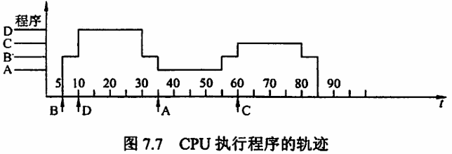

# 第 7 章 输入/输出系统

## Intro

**【考纲内容】**

1. I/O 接口（I/O 控制器）
   I/O 接口的功能和基本结构；I/O 端口及其编址
2. I/O 方式
   程序查询方式
   程序中断方式：中断的基本概念、中断响应过程、中断处理过程、多重中断和中断屏蔽的概念 
   DMA 方式：DMA 控制器的组成，DMA 传送过程

**【复习提示】**

I/O 方式是本章的重点和难点，每年不仅会以选择题的形式考查基本概念和原理，而且可能会以综合题的形式考查，特别是各种 I/O 方式效率的相关计算，中断方式的各种原理、特点、处理过程、中断屏蔽，DMA 方式的特点、传输过程、与中断方式的区别等。

在学习本章时，思考以下问题：

1. I/O 设备有哪些编址方式？各有何特点？
2. CPU 响应中断应具备哪些条件？

## 一、I/O 系统基本概念

### 0x00 输入/输出系统

输入/输出系统解决的主要问题是对各种形式的信息进行输入和输出的控制。I/O 系统中的几个基本概念如下：

1. **外部设备**：包括输入/输出设备及通过输入/输出接口才能访问的外存储设备。
2. **接口**：在各个外设与主机之间传输数据时进行各种协调工作的逻辑部件。协调包括传输过程中速度的匹配、电平和格式转换等。
3. **输入设备**：用于向计算机系统输入命令和文本、数据等信息的部件。键盘和鼠标是最基本的输入设备。
4. **输出设备**：用于将计算机系统中的信息输出到计算机外部进行显示、交换等的部件。显示器和打印机是最基本的输出设备。
5. **外存设备**：指除计算机内存及 CPU 缓存等外的存储器，如硬磁盘、光盘等。

一般来说，I/O 系统由 I/O 软件和 I/O 硬件两部分构成：

1. **I/O 软件**：包括驱动程序、用户程序、管理程序、升级补丁等。通常采用 I/O 指令和通道指令实现 CPU 与 I/O 设备的信息交换。
2. **I/O 硬件**：包括外部设备、设备控制器和接口、I/O 总线等。通过设备控制器来控制 I/O 设备的具体动作；通过 I/O 接口与主机（总线）相连。

### 0x01 I/O 控制方式

在输入/输出系统中，经常需要进行大量的数据传输，而传输过程中有各种不同的 I/O 控制方式，基本的控制方式主要有以下 4 种：

1. **程序查询方式**：由 CPU 通过程序不断查询 I/O 设备是否已做好准备，从而控制 I/O 设备与主机交换信息。
2. **程序中断方式**：只在 I/O 设备准备就绪并向 CPU 发出中断请求时才予以响应。
3. **DMA 方式**：主存和 I/O 设备之间有一条直接数据通路，当主存和 I/O 设备交换信息时，无须调用中断服务程序。
4. **通道方式**：通过专用的 I/O 通道进行数据传输，在传输过程中无须 CPU 干预。

其中，程序查询和程序中断方式主要用于数据传输率较低的外部设备，DMA 和通道方式主要用于数据传输率较高的设备。

### 0x02 外部设备

最基本的外部设备主要有键盘、鼠标、显示器、打印机、磁盘存储器和光盘存储器等。

#### 1. 输入设备

1. **键盘**：键盘是最常用的输入设备，通过它可发出命令或输入数据。
2. **鼠标**：鼠标是常用的定位输入设备，它把用户的操作与计算机屏幕上的位置信息相联系。

#### 2. 输出设备

1. **显示器**：按所用的显示器件分类，有阴极射线管（CRT）显示器、液晶显示器（LCD）、发光二极管（LED）显示器等。显示器属于用点阵方式运行的设备，有以下主要参数：
   - **屏幕大小**：以对角线长度表示，常用的有 12～29 英寸等。
   - **分辨率**：能表示的像素个数，屏幕上的每个光点就是一个像素，以宽和高的像素数的乘积表示，如 800×600、1024×768 和 1280×1024 等。
   - **灰度级**：指黑白显示器中所显示的像素点的亮暗差别，在彩色显示器中则表现为颜色的不同，灰度级越多，图像层次越清楚、逼真，典型的有 8 位（256 级）、16 位等。
   - **刷新**：光点只能保持极短的时间便会消失，为此必须在光点消失之前再重新扫描显示一遍，这个过程称为刷新。
   - **刷新频率**：指单位时间内扫描整个屏幕内容的次数。按照人的视觉生理，刷新频率大于 30Hz 时才不会感到闪烁，通常显示器的刷新频率为 60～120Hz。
   - **显示存储器（VRAM）**：也称刷新存储器，为了不断提高刷新图像的信号，必须把一帧图像信息存储在刷新存储器中。其存储容量由图像分辨率和灰度级决定，分辨率越高，灰度级越多，刷新存储器容量越大。VRAM 容量 = 分辨率 × 灰度级位数。VRAM 带宽 = 分辨率 × 灰度级位数 × 帧频。

2. **打印机**：用于将计算机的处理结果打印在相关介质上。按工作方式，打印机可分为点阵打印机、针式打印机、喷墨式打印机、激光打印机等。
   - **针式打印机**：擅长“多层复写打印”，实现各种票据或蜡纸等的打印。其工作原理简单，造价低廉，耗材（色带）便宜，但打印分辨率和打印速度不够高。
   - **喷墨式打印机**：彩色喷墨打印机基于三基色原理，即分别喷射 3 种颜色的墨滴，按一定的比例混合出所要求的颜色。喷墨式打印机可实现高质量彩色打印。
   - **激光打印机**：计算机输出的二进制信息，经过调制后的激光束扫描，在感光鼓上形成潜像，再经过显影、转印和定影，在纸上得到所需的字符或图像。激光打印机打印质量高、速度快、处理能力强，它是将激光技术和电子显像技术相结合的产物。

#### 3. 外部存储器 (辅存)

1. **磁表面存储器**：所谓“磁表面存储”，是指把某些磁性材料薄薄地涂在金属铝或塑料表面上作为载磁体来存储信息。磁盘存储器、磁带存储器和磁鼓存储器均属于磁表面存储器。
2. **固态硬盘（SSD）**：微小型高档笔记本电脑采用高性能 Flash 存储器作为硬盘来记录数据，这种“硬盘”称为固态硬盘（SSD）。固态硬盘除需要 Flash 存储器外，还需要其他硬件和软件的支持。
3. **光盘存储器**：光盘存储器是利用光学原理读/写信息的存储装置，它采用聚焦激光束对盘式介质以非接触方式记录信息。完整的光盘存储系统由光盘片、光盘驱动器、光盘控制器等组成。

## 二、I/O 接口

I/O 接口（I/O 控制器）是主机和外设之间的交接界面，通过接口可以实现主机和外设之间的信息交换。主机和外设具有各自的工作特点，它们在信息形式和工作速度上具有很大的差异，接口正是为了解决这些差异而设置的。

### 0x00 I/O 接口的功能

I/O 接口的主要功能如下：

1. **产生设备选择信息**：使主机能和指定外设交换信息。
2. **实现主机和外设的通信联络控制**：解决主机与外设时序配合问题，协调不同工作速度的外设和主机之间交换信息，以保证整个计算机系统能统一、协调地工作。
3. **实现数据缓冲**：CPU 与外设之间的速度往往不匹配，为消除速度差异，接口必须设置数据缓冲寄存器，用于数据的暂存，以避免因速度不一致而丢失数据。
4. **信号格式的转换**：外设与主机两者的电平、数据格式都可能存在差异，接口应提供计算机与外设的信号格式的转换功能，如电平转换、并/串或串/并转换、模/数或数/模转换等。
5. **传送控制命令和状态信息**：CPU 要启动某一外设时，通过接口中的命令寄存器向外设发出启动命令；外设准备就绪时，将“准备好”状态信息送回接口中的状态寄存器，并反馈给 CPU。外设向 CPU 提出中断请求时，CPU 也应有相应的响应信号反馈给外设。

### 0x01 I/O 接口的基本结构

如图 7.1 所示，I/O 接口在主机侧通过 I/O 总线与内存、CPU 相连。通过数据总线，在数据缓冲寄存器与内存或 CPU 的寄存器之间进行数据传送。同时接口和设备的状态信息被记录在状态寄存器中，通过数据线将状态信息送到 CPU。CPU 对外设的控制命令也通过数据线传送，一般将其送到 I/O 接口的控制寄存器。状态寄存器和控制寄存器在传送方向上是相反的。接口中的地址线用于给出要访问的 I/O 接口中的寄存器的地址，它和读/写控制信号一起被送到 I/O 接口的控制逻辑部件，通过控制线传送来的读/写信号确认是读寄存器还是写寄存器，此外控制线还会传送一些仲裁信号和握手信号。接口中的 I/O 控制逻辑还要能对控制寄存器中的命令字进行译码，并将译码得到的控制信号通过外设界面控制逻辑送到外设，同时将数据缓冲寄存器的数据发送到外设或从外设接收数据到数据缓冲寄存器。另外，它还要具有收集外设状态到状态寄存器的功能。

对数据缓冲寄存器、状态/控制寄存器的访问操作是通过相应的指令来完成的，通常称这类指令为 I/O 指令，I/O 指令只能在操作系统内核的底层 I/O 软件中使用，它们是一种特权指令。

注意：接口和端口是两个不同的概念。端口是指接口电路中可以进行读/写的寄存器，若干端口加上相应的控制逻辑才可以组成接口。

### 0x02 I/O 接口的类型

从不同的角度看，I/O 接口可以分为不同的类型：

1. **按数据传送方式**：可分为并行接口（一次传送一个字节或一个字的所有位）和串行接口（一次传送一位），接口要完成数据格式的转换。注意：这里所说的数据传送方式指的是外设和接口一侧的传送方式。
2. **按主机访问 I/O 设备的控制方式**：可分为程序查询接口、中断接口和 DMA 接口等。
3. **按功能选择的灵活性**：可分为可编程接口和不可编程接口。

### 0x03 I/O 端口及其编址

I/O 端口是指接口电路中可被 CPU 直接访问的寄存器，主要有数据端口、状态端口和控制端口，若干端口加上相应的控制逻辑电路组成接口。通常，CPU 能对数据端口执行读写操作，但对状态端口只能执行读操作，对控制端口只能执行写操作。I/O 端口要想能够被 CPU 访问，就必须要对各个端口进行编号，每个端口对应一个端口地址。而对 I/O 端口的编址方式有与存储器统一编址和独立编址两种。

1. **统一编址**：又称存储器映射方式，是指把 I/O 端口当作存储器的单元进行地址分配，这种方式 CPU 不需要设置专门的 I/O 指令，用统一的访存指令就可以访问 I/O 端口。
   - **优点**：不需要专门的输入/输出指令，可使 CPU 访问 I/O 的操作更灵活、更方便，还可使端口有较大的编址空间。
   - **缺点**：端口占用存储器地址，使内存容量变小，而且利用存储器编址的 I/O 设备进行数据输入/输出操作，执行速度较慢。

2. **独立编址**：又称 I/O 映射方式，I/O 端口的地址空间与主存地址空间是两个独立的地址空间，因而无法从地址码的形式上区分，需要设置专门的 I/O 指令来访问 I/O 端口。
   - **优点**：输入/输出指令与存储器指令有明显区别，程序编制清晰，便于理解。
   - **缺点**：输入/输出指令少，一般只能对端口进行传送操作，尤其需要 CPU 提供存储器读/写、I/O 设备读写两组控制信号，增加了控制的复杂性。

## 三、I/O 方式

输入/输出系统实现主机与 I/O 设备之间的数据传送，可以采用不同的控制方式，各种方式在代价、性能、解决问题的着重点等方面各不相同，常用的 I/O 方式有程序查询、程序中断、DMA 和通道等，其中前两种方式更依赖于 CPU 中程序指令的执行。

### 0x00 程序查询方式

信息交换的控制完全由 CPU 执行程序实现。程序查询方式接口中设置一个数据缓冲寄存器（数据端口）和一个设备状态寄存器（状态端口）。主机进行 I/O 操作时，先发出询问信号，读取设备的状态并根据设备状态决定下一步操作究竟是进行数据传送还是等待。

程序查询方式的工作流程如下（见图 7.2）：

1. CPU 执行初始化程序，并预置传送参数。
2. 向 I/O 接口发出命令字，启动 I/O 设备。
3. 从外设接口读取其状态信息。
4. CPU 不断查询 I/O 设备状态，直到外设准备就绪。
5. 传送一次数据
6. 修改地址和计数器参数。
7. 判断传送是否结束，若未结束，转第3步，直到计数器为0。

在这种控制方式下，CPU 一旦启动 I/O，就必须停止现行程序修改传送参数的运行，并在现行程序中插入一段程序。程序查询方式的主要特点是 CPU 有“踏步”等待现象，CPU 与 I/O 串行工作。这种方式的接口设计简单、设备量少，但 CPU 在信息传送过程中要花费很多时间来查询和等待，而且在一段时间内只能和一台外设交换信息，效率大大降低。

### 0x01 程序中断方式

#### 1. 程序中断的基本概念

程序中断是指在计算机执行现行程序的过程中，出现某些急需处理的异常情况或特殊请求，CPU 暂时中止现行程序，而转去对这些异常情况或特殊请求进行处理，处理完毕后再返回到现行程序的断点处，继续执行原程序。早期的中断技术是为了处理数据传送。随着计算机的发展，中断技术不断被赋予新的功能，主要功能有：

1. 实现 CPU 与 I/O 设备的并行工作。
2. 处理硬件故障和软件错误。
3. 实现人机交互，用户干预机器需要用到中断系统。
4. 实现多道程序、分时操作，多道程序的切换需借助于中断系统。
5. 实时处理需要借助中断系统来实现快速响应。
6. 实现应用程序和操作系统（管态程序）的切换，称为“软中断”。
7. 多处理器系统中各处理器之间的信息交流和任务切换。

程序中断方式的思想：CPU 在程序中安排好在某个时机启动某台外设，然后 CPU 继续执行当前的程序，不需要像查询方式那样一直等待外设准备就绪。一旦外设完成数据传送的准备工作，就主动向 CPU 发出中断请求，请求 CPU 为自己服务。在可以响应中断的条件下，CPU 暂时中止正在执行的程序，转去执行中断服务程序为外设服务，在中断服务程序中完成一次主机与外设之间的数据传送，传送完成后，CPU 返回原来的程序，如图 7.3 所示。

#### 2. 程序中断的工作流程

1. **中断请求**：中断源是请求 CPU 中断的设备或事件，一台计算机允许有多个中断源。每个中断源向 CPU 发出中断请求的时间是随机的。为记录中断事件并区分不同的中断源，中断系统需对每个中断源设置中断请求标记触发器，当其状态为“1”时，表示中断源有请求。这些触发器可组成中断请求标记寄存器，该寄存器可集中在 CPU 中，也可分散在各个中断源中。通过 INTR 线发出的是可屏蔽中断，通过 NMI 线发出的是不可屏蔽中断。可屏蔽中断的优先级最低，在关中断模式下不会被响应。不可屏蔽中断用于处理紧急和重要的事件，如时钟中断、电源掉电等，其优先级最高，其次是内部异常，即使在关中断模式下也会被响应。

2. **中断响应判优**：中断响应优先级是指 CPU 响应中断请求的先后顺序。由于许多中断源提出中断请求的时间都是随机的，因此当多个中断源同时提出请求时，需通过中断判优逻辑来确定响应哪个中断源的请求，中断响应的判优通常是通过硬件排队器实现的。一般来说：
   - 不可屏蔽中断 > 内部异常 > 可屏蔽中断
   - 内部异常中，硬件故障 > 软件中断
   - DMA 中断请求优先于 I/O 设备传送的中断请求
   - 在 I/O 传送类中断请求中，高速设备优先于低速设备，输入设备优先于输出设备，实时设备优先于普通设备

   注意：中断优先级包括响应优先级和处理优先级，响应优先级在硬件线路上是固定的，不便改动。处理优先级可利用中断屏蔽技术动态调整，以实现多重中断。

3. **CPU 响应中断的条件**：CPU 在满足一定的条件下响应中断源发出的中断请求，并经过一些特定的操作，转去执行中断服务程序。CPU 响应中断必须满足以下 3 个条件：
   1. 中断源有中断请求。
   2. CPU 允许中断及开中断（异常和不可屏蔽中断不受此限制）。
   3. 一条指令执行完毕（异常不受此限制），且没有更紧迫的任务。

   注意：I/O 设备的就绪时间是随机的，而 CPU 在统一的时刻即每条指令执行阶段结束前向接口发出中断查询信号，以获取 I/O 的中断请求。CPU 响应中断的时间是在每条指令执行阶段的结束时刻。

4. **中断响应过程**：CPU 响应中断后，经过某些操作，转去执行中断服务程序。这些操作是由硬件直接实现的，我们将它称为中断隐指令。中断隐指令并不是指令系统中的一条真正的指令，只是一种虚拟的说法，本质上是硬件的一系列自动操作。它所完成的操作如下：
   1. **关中断**：CPU 响应中断后，首先要保护程序的断点和现场信息，在保护断点和现场的过程中，CPU 不能响应更高级中断源的中断请求。否则，若断点或现场保存不完整，在中断服务程序结束后，就不能正确地恢复并继续执行现行程序。
   2. **保存断点**：为保证在中断服务程序执行完后能正确地返回到原来的程序，必须将原程序的断点（指令无法直接读取的 PC 和 PSW 的内容）保存在栈或特定寄存器中。注意异常和中断的差异：异常指令通常并没有执行成功，异常处理后要重新执行，所以其断点是当前指令的地址。中断的断点则是下一条指令的地址。
   3. **引出中断服务程序**：识别中断源，将对应的服务程序入口地址送入程序计数器 PC。有两种方法识别中断源：硬件向量法和软件查询法。本节主要讨论比较常用的向量中断。

5. **中断向量**：中断识别分为向量中断和非向量中断两种。非向量中断即软件查询法。每个中断都有一个唯一的类型号，每个中断类型号都对应一个中断服务程序，每个中断服务程序都有一个入口地址，CPU 必须找到入口地址，即中断向量。把系统中的全部中断向量集中存放到存储器的某个区域内，这个存放中断向量的存储区就称为中断向量表。CPU 响应中断后，通过识别中断源获得中断类型号，然后据此计算出对应中断向量的地址；再根据该地址从中断向量表中取出中断服务程序的入口地址，并送入程序计数器 PC，以转而执行中断服务程序，这种方法被称为中断向量法，采用中断向量法的中断被称为向量中断。

6. **中断处理过程**：中断处理流程如下：

   1. 关中断
   2. 保存断点
   3. 中断服务程序寻址
   4. 保存现场和屏蔽字
   5. 开中断
   6. 执行中断服务程序
   7. 关中断
   8. 恢复现场和屏蔽字
   9. 开中断、中断返回

   其中，步骤1到3由中断隐指令（硬件自动）完成；步骤4到9由中断服务程序完成。恢复现场是指在中断返回前，必须将寄存器的内容恢复到中断处理前的状态，这部分工作由中断服务程序完成。中断返回由中断服务程序的最后一条中断返回指令完成。

#### 3. 多重中断和中断屏蔽技术

若 CPU 在执行中断服务程序的过程中，又出现了新的更高优先级的中断请求，而 CPU 对新的中断请求不予响应，则这种中断称为单重中断，如图 7.5(a)所示。若 CPU 暂停现行的中断服务程序，转去处理新的中断请求，则这种中断称为多重中断，又称中断嵌套，如图 7.5(b)所示。

CPU 要具备多重中断的功能，必须满足下列条件：

1. 在中断服务程序中提前设置开中断指

令。
2. 优先级别高的中断源有权中断优先级别低的中断源。

中断处理优先级是指多重中断的实际优先级处理次序，可以利用中断屏蔽技术动态调整，从而可以灵活地调整中断服务程序的优先级，使中断处理更加灵活。如果不使用中断屏蔽技术，则处理优先级和响应优先级相同。现代计算机一般使用中断屏蔽技术，每个中断源都有一个屏蔽触发器，“1”表示屏蔽该中断源的请求，“0”表示可以正常申请，所有屏蔽触发器组合在一起便构成一个屏蔽字寄存器，屏蔽字寄存器的内容称为屏蔽字。

**例 7.1** 设某机有 4 个中断源 A、B、C、D，其硬件排队优先次序为 A>B>C>D，现要求将中断处理次序改为 D>A>C>B。

1. 写出每个中断源对应的屏蔽字。
2. 按图 7.6 所示的时间轴给出的 4 个中断源的请求时刻，画出 CPU 执行程序的轨迹。设每个中断源的中断服务程序时间均为 20 us。

解：

1. 在中断处理次序改为 D>A>C>B 后，D 具有最高优先级，可以屏蔽其他所有中断，且不能中断自身，因此 D 对应的屏蔽字为 1111；A 具有次高优先级，只能被 D 中断，因此 A 对应的屏蔽字为 1110，以此类推，得到 4 个中断源的屏蔽字，见表 7.1。

| 中断源 | 屏蔽字 |
| ------ | ------ |
| A      | 1110   |
| B      | 0110   |
| C      | 0110   |
| D      | 1111   |

2. 根据处理次序，在时刻 5，B 发中断请求，获得 CPU；在时刻 10，D 发中断请求，此时 B 虽还未执行完毕，但 D 的优先级高于 B，于是 D 中断 B 而获得 CPU；在时刻 30，D 执行完毕，B 继续获得 CPU；在时刻 35，A 发中断请求，此时 B 虽还未执行完毕，但 A 的优先级高于 B，于是 A 中断 B 而获得 CPU，如此继续下去，执行轨迹如图 7.7 所示。

### 0x02 DMA 方式

DMA（Direct Memory Access）方式是一种完全由硬件进行成组信息传送的控制方式，它具有程序中断方式的优点，即在数据准备阶段，CPU 与外设并行工作。DMA 方式在外设与内存之间开辟一条“直接数据通道”，信息传送不再经过 CPU，降低了 CPU 在传送数据时的开销，因此称为直接存储器存取方式。由于数据传送不经过 CPU，也就不需要保护、恢复 CPU 现场等烦琐操作。这种方式适用于磁盘、显卡、声卡、网卡等高速设备大批量数据的传送，它的硬件开销比较大。在 DMA 方式中，中断的作用仅限于故障和正常传送结束时的处理。

#### 1. DMA 方式的特点

1. **主存和 DMA 接口之间有一条直接数据通路**：由于 DMA 方式传送数据不需要经过 CPU，因此不必中断现行程序，I/O 与主机并行工作，程序和传送并行工作。
2. **脱钩主存与 CPU 的固定联系**：主存既可被 CPU 访问，又可被外设访问。
3. **硬件实现地址和计数的确定**：在数据块传送时，主存地址的确定、传送数据的计数等都由硬件电路直接实现。
4. **开辟专用缓冲区**：主存中要开辟专用缓冲区，及时供给和接收外设的数据。
5. **提高系统效率**：DMA 传送速度快，CPU 和外设并行工作，提高了系统效率。
6. **需要预处理和后处理**：DMA 在传送开始前要通过程序进行预处理，结束后要通过中断方式进行后处理。

#### 2. DMA 控制器的组成

在 DMA 方式中，对数据传送过程进行控制的硬件称为 DMA 控制器（DMA 接口）。当 I/O 设备需要进行数据传送时，通过 DMA 控制器向 CPU 提出 DMA 传送请求，CPU 响应之后将让出系统总线，由 DMA 控制器接管总线进行数据传送。其主要功能如下：

1. 接受外设发出的 DMA 请求，并向 CPU 发出总线请求。
2. CPU 响应并发出总线响应信号，DMA 接管总线控制权，进入 DMA 操作周期。
3. 确定传送数据的主存单元地址及长度，并自动修改主存地址计数和传送长度计数。
4. 规定数据在主存和外设间的传送方向，发出读写等控制信号，执行数据传送操作。
5. 向 CPU 报告 DMA 操作结束。

图 7.8 给出了一个简单的 DMA 控制器。

- **主存地址计数器**：存放要交换数据的主存地址
- **传送长度计数器**：记录传送数据的长度，计数溢出时，数据即传送完毕，自动发中断请求信号
- **数据缓冲寄存器**：暂存每次传送的数据
- **DMA 请求触发器**：每当 I/O 设备准备好数据好，给出一个控制信号，使 DMA 请求触发器置位
- **”控制/状态“逻辑**：由控制和时序电路及状态标志组成，用于指定传送方向，修改传送参数，并对 DMA 请求信号、CPU 响应信号进行协调和同步
- **中断机构**：当一个数据块传送完毕后触发中断机构，向 CPU 提出中断请求

在 DMA 传送过程中，DMA 控制器将接管 CPU 的地址总线、数据总线和控制总线，CPU 的主存控制信号被禁止使用。而当 DMA 传送结束后，将恢复 CPU 的一切权利并开始执行其操作。由此可见，DMA 控制器必须具有控制系统总线的能力

#### 3. DMA 的传送方式

主存和 I/O 设备之间交换信息时，不通过 CPU。但当 I/O 设备和 CPU 同时访问主存时，可能发生冲突。为了有效地使用主存，DMA 控制器与 CPU 通常采用以下 3 种方式使用主存：

1. **使 CPU 脱离总线**：停止访问主存，直到 DMA 传送一块数据结束。数据传送结束后，DMA 控制器通知 CPU 可以使用主存，并把总线控制权交还给 CPU。
2. **周期挪用（或周期窃取）**：当 I/O 设备有 DMA 请求时，会遇到 3 种情况：
   1. CPU 不在访存（如 CPU 正在执行乘法指令），I/O 的访存请求与 CPU 未发生冲突；
   2. CPU 正在访存，此时必须待存取周期结束后，CPU 再将总线占有权让出；
   3. I/O 和 CPU 同时请求访存，出现访存冲突，此时 CPU 要暂时放弃总线占有权。I/O 访存优先级高于 CPU 访存，因为 I/O 不立即访存就可能丢失数据，此时由 I/O 设备挪用一个或几个存取周期，传送完一个数据后立即释放总线，是一种单字传送方式。
3. **DMA 与 CPU 交替访存**：这种方式适用于 CPU 的工作周期比主存存取周期长的情况。例如，若 CPU 的工作周期是 $1.2 \mu s$，主存的存取周期小于 $0.6 \mu s$，则可将一个 CPU 周期分为 $C_1$ 和 $C_2$ 两个周期，其中 $C_1$ 专供 DMA 访存，$C_2$ 专供 CPU 访存。这种方式不需要总线使用权的申请、建立和归还过程，总线使用权是通过 $C_1$ 和 $C_2$ 分时控制的。

#### 4. DMA 的传送过程

DMA 的数据传送过程分为预处理、数据传送和后处理 3 个阶段：

1. **预处理**：由 CPU 完成一些必要的准备工作。首先，CPU 执行几条 I/O 指令，用以测试 I/O 设备状态，初始化 DMA 控制器中的有关寄存器、设置传送方向、启动该设备等。然后，CPU 继续执行原来的程序，直到 I/O 设备准备好发送的数据（输入情况）或接收的数据（输出情况）时，I/O 设备向 DMA 控制器发送 DMA 请求，再由 DMA 控制器向 CPU 发送总线请求（有时将这两个过程统称为 DMA 请求），用以传输数据。
2. **数据传送**：DMA 的数据传输可以以单字节（或字）为基本单位，也可以以数据块为基本单位。对于以数据块为单位的传送（如硬盘），DMA 占用总线后的数据输入和输出操作都是通过循环来实现的。需要指出的是，这一循环也是由 DMA 控制器（而非通过 CPU 执行程序）实现的，即数据传送阶段完全由 DMA（硬件）控制。
3. **后处理**：DMA 控制器向 CPU 发送中断请求，CPU 执行中断服务程序做 DMA 结束处理，包括校验送入主存的数据是否正确、测试传送过程中是否出错（错误则转诊断程序）及决定是否继续使用 DMA 传送其他数据等。DMA 的传送流程如图 7.9 所示。

#### 5. DMA 方式和中断方式的区别

DMA 方式和中断方式的重要区别如下：

1. **中断方式是程序的切换**，需要保护和恢复现场；而 DMA 方式不中断现行程序，无需保护现场，除了预处理和后处理，其他时候不占用任何 CPU 资源。
2. **CPU 响应中断的时间是固定的**，可以发生在任意一个机器周期结束时（取指、间址、执行周期后均可）。
3. **中断传送过程需要 CPU 的干预**；而 DMA 传送过程不需要 CPU 的干预，因此数据传输率非常高，适合于高速外设的成组数据传送。
4. **DMA 请求的优先级高于中断请求**。
5. **中断方式具有处理异常事件的能力**，而 DMA 方式仅局限于大批数据的传送。
6. 从数据传送来看，中断方式靠程序传送，DMA 方式靠硬件传送。
