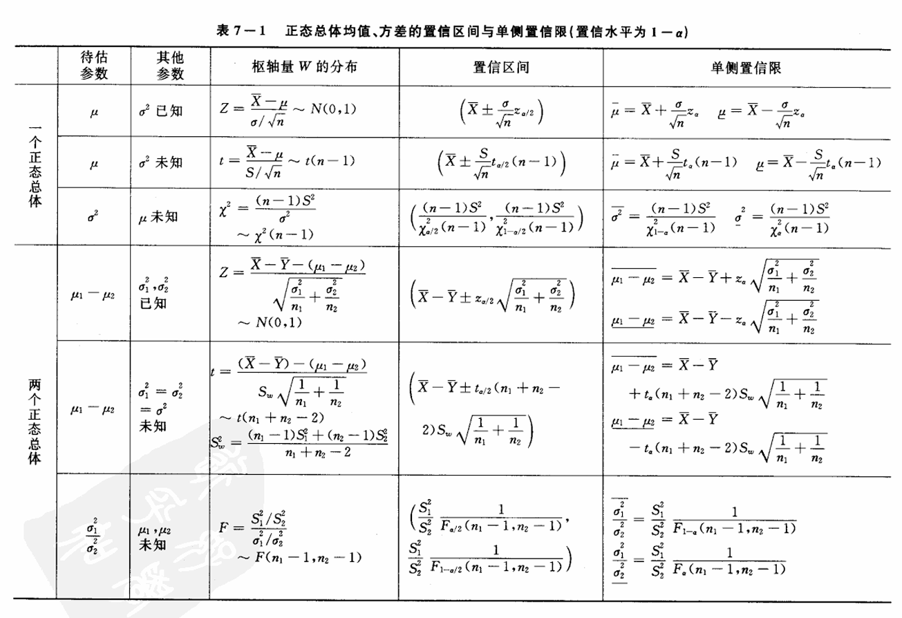

# 数理统计·2 参数估计

## 考纲内容

- 点估计的概念
- 估计量与估计值
- 矩估计法
- 最大似然估计法
- 估计量的评选标准
- 区间估计的概念
- 单个正态总体的均值和方差的区间估计
- 两个正态总体的均值差和方差比的区间估计

## 一、点估计

> 考纲摘要：理解参数的点估计、估计量与估计值的概念

点估计问题的一般提法如下：

设总体 $ X $ 的分布函数 $ F(x; \theta) $ 的形式为已知，$\theta$ 是待估参数
设 $ X_1, X_2, \ldots, X_n $ 是 $ X $ 的一个样本，$ x_1, x_2, \ldots, x_n $ 是相应的一个样本值
点估计问题就是要构造一个适当的统计量 $ \hat{\theta}(X_1, X_2, \ldots, X_n) $，用它的观察值 $ \hat{\theta}(x_1, x_2, \ldots, x_n) $ 作为未知参数 $\theta$ 的近似值。

我们称 $ \hat{\theta}(X_1, X_2, \ldots, X_n) $ 为 $\theta$ 的**估计量**，称 $ \hat{\theta}(x_1, x_2, \ldots, x_n) $ 为 $\theta$ 的**估计值**。在不致混淆的情况下统称估计量和估计值为**估计**，并都简记为 $\hat{\theta}$。由于估计量是样本的函数，因此对于不同的样本值，$\theta$ 的估计值一般是不相同的。

### 0x00 矩估计法

> 考纲摘要：掌握矩估计法（一阶矩、二阶矩）

设 $ X $ 为连续型随机变量，其概率密度为 $ f(x; \theta_1, \theta_2, \cdots, \theta_k) $，或 $ X $ 为离散型随机变量，其分布律为 $ P\{X = x\} = p(x; \theta_1, \theta_2, \cdots, \theta_k) $，其中 $\theta_1, \theta_2, \cdots, \theta_k$ 为待估参数，$ X_1, X_2, \cdots, X_n $ 是来自 $ X $ 的样本。假设总体 $ X $ 的前 $ k $ 阶矩
$$
\mu_l = E(X^l) = \int_{-\infty}^\infty x^lf(x;\theta_1,\theta_2,\cdots,\theta_k)\mathrm dx\quad(\text{X为连续型})\\
\mu_l = E(X^l) = \sum_{x \in R_X} x^l p(x; \theta_1, \theta_2, \cdots, \theta_k) \quad (\text{X 为离散型})\\
l=1,2,\cdots,k
$$
（其中 $R_X$ 是 $X$ 可能的取值范围）存在。一般来说，它们是 $\theta_1, \theta_2, \cdots, \theta_k$ 的函数。基于样本矩
$$
A_l = \frac{1}{n} \sum_{i=1}^n X_i^l, \quad l = 1, 2, \cdots, k
$$
依概率收敛于相应的总体矩 $\mu_l$（$ l = 1, 2, \cdots, k $），样本矩的连续函数依概率收敛于相应的总体矩的连续函数，
我们就用样本矩作为相应的总体矩的估计量，而以样本矩的连续函数作为相应的总体矩的连续函数的估计量。
这种估计方法称为**矩估计法**。矩估计法的具体做法如下：

设
$$
\begin{cases}
\mu_1 = \mu_1(\theta_1, \theta_2, \cdots, \theta_k), \\
\mu_2 = \mu_2(\theta_1, \theta_2, \cdots, \theta_k), \\
\vdots \\
\mu_k = \mu_k(\theta_1, \theta_2, \cdots, \theta_k).
\end{cases}
$$

通过求解这组方程，得到
$$
\begin{cases}
\theta_1 = \theta_1(\mu_1, \mu_2, \cdots, \mu_k), \\
\theta_2 = \theta_2(\mu_1, \mu_2, \cdots, \mu_k), \\
\vdots \\
\theta_k = \theta_k(\mu_1, \mu_2, \cdots, \mu_k).
\end{cases}
$$

以 $ A_i $ 分别代替上式中的 $\mu_i$，即
$$
\hat{\theta}_i = \theta_i(A_1, A_2, \cdots, A_k), \quad i = 1, 2, \cdots, k
$$
分别作为 $\theta_i, i = 1, 2, \cdots, k$ 的估计量，这种估计量称为**矩估计量**。矩估计量的观察值称为**矩估计值**

### 0x01 最大似然估计法

> 考纲摘要：最大似然估计法

若总体 $ X $ 属离散型，其分布律为 $ P\{X = x\} = p(x; \theta),\theta\in\Theta$，的形式已知，$\theta$ 为待估参数，$\Theta$ 是 $\theta$ 可能取值的范围
设 $ X_1, X_2, \cdots, X_n $ 是来自 $ X $ 的样本，则 $ X_1, X_2, \cdots, X_n $ 的联合分布律为
$$
\prod_{i=1}^n p(x_i; \theta).
$$
又设 $ x_1, x_2, \cdots, x_n $ 是相应于样本 $ X_1, X_2, \cdots, X_n $ 的一个样本值
易知样本 $ X_1, X_2, \cdots, X_n $ 取到观察值 $ x_1, x_2, \cdots, x_n $ 的概率，亦即事件 \{ $ X_1 = x_1, X_2 = x_2, \cdots, X_n = x_n $ \} 发生的概率为
$$
L(\theta) = L(x_1, x_2, \ldots, x_n; \theta) = \prod_{i=1}^n p(x_i; \theta), \quad \theta \in \Theta.
$$
这一概率随 $\theta$ 的取值而变化，它是 $\theta$ 的函数，$ L(\theta) $ 称为样本的**似然函数**（注意，这里 $ x_1, x_2, \cdots, x_n $ 是已知的样本值，它们都是常数）。

关于最大似然估计法，我们有以下的直观想法：
现在已经取到样本值 $ x_1, x_2, \cdots, x_n $ 了，这表明取到这一样本值的概率 $ L(\theta) $ 比较大。
我们当然不会考虑那些不能使样本 $ x_1, x_2, \cdots, x_n $ 出现的 $\theta\in\Theta$ 作为 $\theta$ 的估计。
再者，如果已知当 $\theta = \theta_0\in\Theta$ 时使 $ L(\theta) $ 取很大值，而 $\Theta$ 中的其他 $\theta$ 的值使 $ L(\theta) $ 取很小值，我们自然认为取 $\theta_0$ 作为未知参数 $\theta$ 的估计值较为合理。
由费希尔（R.A. Fisher）引进的最大似然估计法，就是固定样本观察值 $ x_1, x_2, \cdots, x_n $，在 $\theta$ 取值的可能范围 $\Theta$ 内挑选使似然函数 $ L(x_1, x_2, \cdots, x_n; \theta) $ 达到最大的参数值 $\hat \theta$ 作为参数 $\theta$ 的估计值。即取 $\hat\theta$ 使
$$
L(x_1, x_2, \ldots, x_n; \hat{\theta}) = \max_{\theta\in\Theta} L(x_1, x_2, \ldots, x_n; \theta).
$$
这样得到的 $\hat{\theta}$ 与样本值 $ x_1, x_2, \cdots, x_n $ 有关，常记为 $\hat{\theta}(x_1, x_2, \cdots, x_n)$，称为参数 $\theta$ 的**最大似然估计值**，而相应的统计量 $\hat{\theta}(X_1, X_2, \cdots, X_n)$ 称为参数 $\theta$ 的**最大似然估计量**。

若总体 $ X $ 属连续型，其概率密度为 $ f(x; \theta) $，$\theta \in \Theta$ 的形式已知，$\theta$ 为待估参数，是 $\theta$ 可能取值的范围。设 $ X_1, X_2, \cdots, X_n $ 是来自 $ X $ 的样本，则 $ X_1, X_2, \cdots, X_n $ 的联合密度为
$$
\prod_{i=1}^n f(x_i; \theta).
$$
设 $ x_1, x_2, \cdots, x_n $ 是相应于样本 $ X_1, X_2, \cdots, X_n $ 的一个样本值，则
随机点 $ (X_1, X_2, \cdots, X_n) $ 落在点 $ (x_1, x_2, \cdots, x_n) $ 的邻域（边长分别为 $ \mathrm dx_1, \mathrm dx_2, \cdots, \mathrm dx_n $ 的 $ n $ 维立方体）内的概率近似地为
$$
\prod_{i=1}^n f(x_i; \theta) \, \mathrm dx_i
$$
其值随 $\theta$ 的取值而变化。与离散型的情况一样，我们取 $\theta$ 的估计值 $\hat{\theta}$ 使概率最大，但因子 $ \mathrm dx_1, \mathrm dx_2, \cdots, \mathrm dx_n $ 不随 $\theta$ 而变，故只需考虑函数
$$
L(\theta) = L(x_1, x_2, \ldots, x_n; \theta) = \prod_{i=1}^n f(x_i; \theta)
$$
的最大值。这里 $ L(\theta) $ 称为样本的**似然函数**。若
$$
L(x_1, x_2, \ldots, x_n; \hat{\theta}) = \max_{\theta\in\Theta} L(x_1, x_2, \ldots, x_n; \theta),
$$
则称 $\hat{\theta}(x_1, x_2, \cdots, x_n)$ 为 $\theta$ 的**最大似然估计值**，称 $\hat{\theta}(X_1, X_2, \cdots, X_n)$ 为 $\theta$ 的**最大似然估计量**。

这样，确定最大似然估计量的问题就归结为微分学中的求最大值的问题了。在很多情形下，$ p(x; \theta) $ 和 $ f(x; \theta) $ 关于 $\theta$ 可微，这时 $\hat{\theta}$ 常可从方程
$$
\frac{\mathrm dL(\theta)}{\mathrm d\theta} = 0
$$
解得。又因 $ L(\theta) $ 与 $\ln L(\theta)$ 在同一 $\theta$ 处取到极值，因此，$\theta$ 的最大似然估计 $\hat{\theta}$ 也可以从方程
$$
\frac{\mathrm d\ln L(\theta)}{\mathrm d \theta} = 0
$$
求得，而从后一方程求解往往比较方便。该方程称为**对数似然方程**

## 二、估计量的评选标准

> 考纲摘要：了解估计量的无偏性、有效性（最小方差性）和一致性（相合性）的概念，并会验证估计量的无偏性

### 0x00 无偏性

设 $ X_1, X_2, \ldots, X_n $ 是总体 $ X $ 的一个样本，$\theta \in \Theta$ 是包含在总体 $ X $ 的分布中的待估参数，这里 $\Theta$ 是 $\theta$ 的取值范围

若估计量 $\hat{\theta} = \hat{\theta}(X_1, X_2, \ldots, X_n)$ 的数学期望 $ E(\hat{\theta}) $ 存在，且对于任意 $\theta \in \Theta$ 有
$$
E(\hat{\theta}) = \theta
$$
则称 $\hat{\theta}$ 是 $\theta$ 的无偏估计量

估计量的无偏性是指，对于某些样本值，由这一估计量得到的估计值相对于真值来说偏大，有些则偏小。
反复将这一估计量使用多次，就“平均”来说其偏差为 0。
在科学技术中，$ E(\hat{\theta}) - \theta $ 称为以 $\hat{\theta}$ 作为 $\theta$ 的估计的系统误差。无偏估计的实际意义就是无系统误差

### 0x01 有效性

设 $\hat{\theta}_1 = \hat{\theta}_1(X_1, X_2, \ldots, X_n)$ 与 $\hat{\theta}_2 = \hat{\theta}_2(X_1, X_2, \ldots, X_n)$ 都是 $\theta$ 的无偏估计量，若对于任意 $\theta \in \Theta$ 有
$$
D(\hat{\theta}_1) \leq D(\hat{\theta}_2)
$$
且至少对于某一个 $\theta \in \Theta$ 上式中的不等号严格成立，则称 $\hat{\theta}_1$ 较 $\hat{\theta}_2$ **有效**

### 0x02 相合性

设 $\hat{\theta}(X_1, X_2, \ldots, X_n)$ 为参数 $\theta$ 的估计量，若对于任意 $\theta \in \Theta$，当 $n \to \infty$ 时 $\hat{\theta}(X_1, X_2, \ldots, X_n)$ 依概率收敛于 $\theta$，则称 $\hat{\theta}$ 为 $\theta$ 的相合估计量。即：

$$
\forall\theta\in\Theta,\forall\varepsilon>0,\lim_{n \to \infty} P\{|\hat{\theta} - \theta| < \varepsilon\} = 1,
$$
则称 $\hat{\theta}$ 是 $\theta$ 的相合估计量。

## 三、区间估计

### 0x00 置信区间

设总体 $ X $ 的分布函数 $ F(x; \theta) $ 含有一个未知参数 $\theta$，$\theta \in \Theta$ 是 $\theta$ 可能取值的范围。对于给定值 $\alpha$（$0 < \alpha < 1$），若由来自 $ X $ 的样本 $ X_1, X_2, \ldots, X_n $ 确定的两个统计量 $\theta_L = \theta_L(X_1, X_2, \ldots, X_n)$ 和 $\theta_U = \theta_U(X_1, X_2, \ldots, X_n)$（$\theta_L < \theta_U$），对于任意 $\theta \in \Theta$ 满足
$$
P\{\theta_L(X_1, X_2, \ldots, X_n) < \theta < \theta_U(X_1, X_2, \ldots, X_n)\} \geq 1 - \alpha,
$$
则称 $1 - \alpha$ 为**置信水平**
随机区间 $(\theta_L, \theta_U)$ 是 $\theta$ 的置信水平为 $1 - \alpha$ 的**置信区间**
$\theta_L$ 和 $\theta_U$ 分别称为置信水平为 $1 - \alpha$ 的双侧置信区间的**置信下限**和**置信上限**

寻求未知参数 $\theta$ 的置信区间的具体做法如下：

1. **寻找枢轴量**：
   寻求一个样本 $ X_1, X_2, \ldots, X_n $ 和 $\theta$ 的函数 $ W = W(X_1, X_2, \ldots, X_n; \theta) $，使得 $ W $ 的分布不依赖于 $\theta$ 以及其他未知参数。称具有这种性质的函数 $ W $ 为枢轴量。

2. **定出常数并构造置信区间**：
   对于给定的置信水平 $1 - \alpha$，定出两个常数 $ a $ 和 $ b $ 使得
   $$
   P\{a < W(X_1, X_2, \ldots, X_n; \theta) < b\} = 1 - \alpha.
   $$
   若能从 $ a < W(X_1, X_2, \ldots, X_n; \theta) < b $ 得到与之等价的 $\theta$ 的不等式 $\theta_L < \theta < \theta_U$，其中 $\theta_L = \theta_L(X_1, X_2, \ldots, X_n)$ 和 $\theta_U = \theta_U(X_1, X_2, \ldots, X_n)$ 都是统计量，那么 $(\theta_L, \theta_U)$ 就是 $\theta$ 的一个置信水平为 $1 - \alpha$ 的置信区间。

### 0x01 正态总体均值与方差的区间估计

#### 1. 单个总体 $N(\mu,\sigma^2)$ 的情况

设已给定置信水平为 $1-\alpha$，并设 $X_1,X_2,\cdots,X_n$ 为总体 $N(\mu,\sigma^2)$ 的样本，$\overline X,S^2$ 分别为样本均值和样本方差

##### (1) 均值 $\mu$ 的置信区间

$\sigma^2$ 已知时，可使用 $\cfrac{\overline X-\mu}{\sigma/\sqrt n}$ 作为枢纽量， $\mu$ 的一个置信水平为 $1-\alpha$ 的置信区间为：
$$
(\overline X\pm\frac{\sigma}{\sqrt{n}}z_{\alpha/2})
$$
其中，$z_{\alpha/2}$ 是标准正态分布 $N(0,1)$ 的 $\alpha/2$ 分位点

$\sigma^2$ 未知时，可以使用 $\cfrac{\overline X-\mu}{S/\sqrt n}$ 作为枢纽量，其中一个置信水平为 $1-\alpha$ 置信区间为
$$
\left(\overline X\pm\frac S{\sqrt n}t_{\alpha/2}(n-1)\right)
$$

##### (2) 方差 $\sigma^2$ 的置信区间

$\mu$ 未知时，取以下 $\sigma^2$ 的置信水平为 $1-\alpha$ 的置信区间：
$$
\left(
\frac{\sqrt{n-1}S}{\sqrt{\chi^2_{\alpha/2}(n-1)}},\frac{\sqrt{n-1}S}{\sqrt{\chi^2_{1-\alpha/2}(n-1)}}
\right)
$$

#### 2. 两个总体 $N(\mu_1,\sigma_1^2),N(\mu2,\sigma_2^2)$ 的情况

设两个总体的样本分别为 $\{X_1,X_2,\cdots,X_{n_1}\},\{X_1,X_2,\cdots,X_{n_2}\}$

##### (1) $\mu_1-\mu_2$ 的置信区间

在 $\sigma_1^2,\sigma_2^2$ 已知的情况下，$\mu_1-\mu_2$ 的一个置信水平为 $1-\alpha$ 的置信区间
$$
\left(
\overline X-\overline Y\pm z_{\alpha/2}\sqrt{\frac{\sigma_1^2}{n_1}+\frac{\sigma_2^2}{n_2}}
\right)
$$
$\sigma_1^2=\sigma_2^2=\sigma^2$，但 $\sigma$ 未知的情况下，$\mu_1-\mu_2$ 的一个置信水平为 $1-\alpha$ 的置信区间
$$
\left(
\overline X-\overline Y\pm t_{\alpha/2}(n_1+n_2-2)S_w\sqrt{\frac1{n_1}+\frac1{n_2}}
\right)\\
S_w^2=\frac{(n_1-1)S_1^2+(n_2-1)S_2^2}{n_1+n_2-2},S_w=\sqrt{S_w^2}
$$

##### (2) $\sigma_1^2/\sigma_2^2$ 的置信区间

$\mu_1,\mu_2$ 未知时，$\sigma_1^2/\sigma_2^2$ 的一个置信水平为 $1-\alpha$ 的置信区间
$$
\frac{S_1^2}{S_2^2}\frac1{F_{\alpha/2}(n_1-1,n_2-1)},\frac{S_1^2}{S_2^2}\frac1{F_{1-\alpha/2}(n_1-1,n_2-1)}
$$

#### 3. 总结

